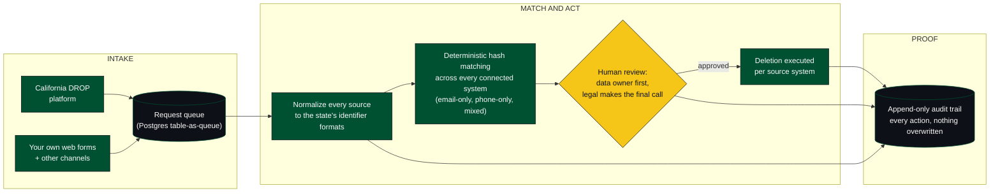

<p align="center">
  
</p>

# Habeas

**Open-source infrastructure for processing California Delete Act (SB 362) consumer deletion requests, with an audit trail your legal team can actually read.**

---

## The problem in 20 seconds

California's Delete Act requires data brokers to honor consumer deletion requests submitted through the state's DROP (Delete Request and Opt-out Platform). Honoring one request is not one lookup. It means:

- Reaching into **many disparate internal data systems** that were never designed to talk to each other
- **Matching a consumer identity** across all of them, where each system spells a person differently
- **Normalizing every source** into a common shape before you can match anything at all - and California prescribes the matching and formatting rules you have to follow while doing it
- **Letting the people who actually own the problem run it** - legal teams and non-technical data owners must be able to manage the process, update the rules, and monitor outcomes without filing engineering tickets
- Proving, later and to a regulator, **exactly what you did and when** - for every request, every match, every deletion

Miss any one of those and you have a compliance finding rather than a compliance program.

## California's matching and formatting rules

The Delete Act does not just require deletion - it prescribes how. The DROP platform hands brokers consumer identifiers in state-defined formats, and the state's rules define what counts as a match. Compliance means implementing those formatting and matching rules exactly, across every internal system that holds consumer data, and being able to show your work afterwards.

This project implements the rules as code: normalization into the state's identifier formats, matching per the prescribed criteria, and a written record of every decision the system made along the way.

The rules layer is **modular**. When California revises its requirements, or other jurisdictions pass their own deletion laws, you update the rules module - you do not rebuild the system.

## How it works



## What this does

- **Takes requests in from wherever they arrive** - California's DROP platform, your own web forms, and other intake channels - all landing in one pipeline
- **Ingests and normalizes** heterogeneous data sources into a common consumer-identity schema
- **Matches** an incoming deletion request against every connected system with deterministic hash matching, including partial identifiers (email-only, phone-only, mixed, malformed)
- **Records every action to an append-only audit trail** - every interaction is preserved, nothing is destructively updated
- **Lets data owners self-serve** - marketing and any other team that works with PII can connect their own systems and review matches before they go to legal for final review
- **Gives legal a way in without an engineer** - a web interface for day-to-day work, plus a command-line interface and live job streaming for deeper analysis

## The agent layer

You can point your own agent at the system. It authenticates with Google Cloud Application Default Credentials against the admin API and works through the command-line interface the way an engineer would: retrieving live state, inspecting requests, and proposing actions. Gated actions stay under human review - the agent prepares, a person approves. There is no in-product model to trust; you bring your own, and every move it makes lands in the same append-only audit record as everyone else's.

The web interface streams live updates over Server-Sent Events (browser clients authenticate with Google Identity Services tokens), so long-running jobs are watchable in real time by people and dashboards alike.

## Why the audit trail is the product

The deletion is easy. The *proof* is the hard part.

Every interaction is written to append-only Postgres tables. Nothing overwrites. A request's entire lifecycle - received, parsed, matched, disputed, deleted, confirmed - is reconstructable after the fact, which is what a regulator, an auditor, or opposing counsel will actually ask for.

## Built for the people who own the liability

The team accountable for Delete Act compliance is usually the **legal team, not the engineering team**. So the access layer is designed for them:

- **Web interface** for day-to-day request management
- **Command-line interface** for direct querying and analysis
- **Live streaming (Server-Sent Events)** so dashboards and agents can monitor long-running jobs as they happen

But the data itself belongs to the teams who collect it. Marketing - and any other team whose systems hold PII covered by privacy law - connects its own systems and reviews its own matches first. Legal sees the match only when the data owner's review is done, and makes the final call.

## Architecture

```
   Data sources                Core                      Access
   ----------                  ----                      ------
   System A  --\                                       +-- Web interface
   System B  --+-->  normalize -> match -> act         |   (live SSE updates)
   System C  --/                  |                    +-- Command-line interface
                                  v                    |   (agent-ready, Google ADC auth)
                     append-only audit trail ----------+
                       (PostgreSQL)
```

**Today:** Google Cloud SQL for PostgreSQL.
**Next:** additional cloud providers, and self-hosted PostgreSQL.

## Quickstart

Coming with the first tagged release. The repository today is the working system: `libs/habeas-privacy-core` holds the matching and audit library, `clients/cli/habeas-cli` is the authenticated CLI, and `clients/web` is the legal-team interface.

## Status

Early. The first iteration targets California's DROP on Google Cloud. The rules layer is modular, so additional jurisdictions plug in as their deletion laws come online; provider-agnostic and self-hosted PostgreSQL support come next.

## License

MIT.
