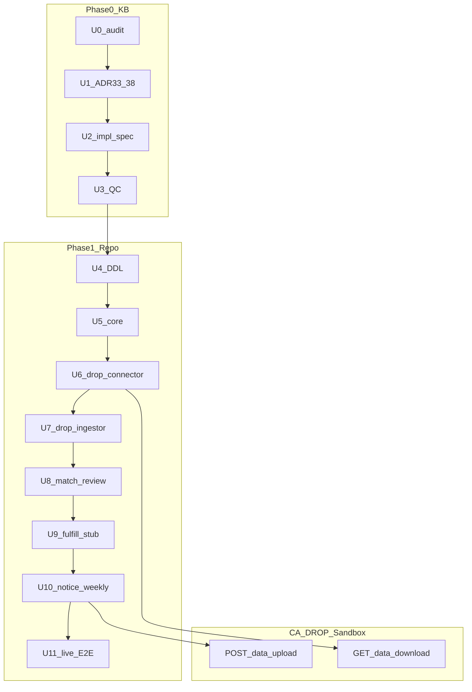

# feat: Intake Spine MVP — California DROP Sandbox E2E

**Target repo:** `data-privacy` (Bitbucket `dsts/data-privacy`)

**Product Contract preservation:** Extended — R12–R13 added (list types, live E2E); Q3 resolved (ADR status Proposed).

---

## Goal Capsule

**Objective:** Ship California DROP end-to-end against the **CA DROP Sandbox** on the thin dimensional `requests` spine: download (NDZ + Email + Phone lists) → land → promote → match → human review → stub fulfill → notice review → weekly sandbox upload. Sync KB via thin ADRs 33–38 **before** repo Phase 1.

**Authority hierarchy:** External KB (`~/Documents/SirvenOS/Habeas/Projects/Data Privacy/`) → ADR-33–38 → `05-DELIVERABLES/Intake-Pipeline-Implementation-Spec.md` → this plan → `AGENTS.md`.

**Stop conditions:** Phase 0 harness-evaluator **Accept** before U4. Each U4–U11 unit: paired reviewer + persona minimum + verification logged. U11 requires **live** sandbox HTTP proof (not mock-only).

**Execution profile:** Master plans; executor + paired reviewer per unit. CE loop: `ce-work` → `harness-verification` → `ce-code-review` / `ce-doc-review` → `harness-evaluator` → `ce-compound`.

---

## Product Contract

### Summary

Pure dimensional `requests`; per-source raw tables; connector/ingestor split; per-vertical fulfillment dispatchers; notice lane with weekly batched CPPA upload; mandatory manual intake DDL; DROP MVP on sandbox with NDZ + Email + Phone lists.

### Problem frame

Repo today has fused intake pollers (`app/intake_drop_poller/`), fat `requests` rows (`db/migrations/20260527000001_core_create_requests.sql`), inline `enqueue_matching` in `libs/habeas-privacy-core/src/habeas_privacy_core/db/requests.py`, and KB/docs drift from ADR-32 MVP refinements.

### Requirements

| ID | Requirement |
|----|-------------|
| R1 | `requests` dim: `id`, `received_at`, `intake_source`, `raw_record_id` only |
| R2 | Postgres trigger enforces raw FK by `intake_source` |
| R3 | Mandatory `manual_ingest_attempts` + `manual_raw_requests` (DDL in U4; wiring U12) |
| R4 | CSV via Eventarc + Legal upload UI + modular `csv-ingestor` (deferred U12) |
| R5 | Per-vertical fulfillment dispatchers; global `matching.review` |
| R6 | Notice lane: `notice.review`; DROP **weekly** batch upload; `communication_attempts` stub |
| R7 | CPPA `POST /data/upload` vs `POST /data/amend`; filename columns on raw + queue |
| R8 | Thin ADRs 33–38; ADR-32 pointer addendum only |
| R9 | Full KB audit with archive recommendations before repo work |
| R10 | California DROP steps 1–8 E2E in **Sandbox** |
| R11 | DROP connector I/O uses `https://api.drop.privacy.ca.gov/sandbox` only |
| R12 | Sandbox MVP processes **NDZ, Email, and Phone** deletion lists |
| R13 | U11 Accept requires **live** sandbox integration test (gated on `DROP_API_KEY`) |

### Scope boundaries

**In:** Phase 0 KB (U0–U3); Phase 1 DROP slice (U4–U11); harness artifacts in `tmp/`; GCP project `example-gcp-project` dev deploy for connector schedulers.

**Out:** DROP production API; real Tier-C suppression connectors (U9 stub only); DROP amend automation beyond manual ops; non-DROP verticals; webform production; CSV Eventarc UI (U12); CEPI hash-index rebuild.

**Deferred to follow-up work:** Manual promote (`admin-api`), CSV Eventarc, `intake_csv_dispatcher` / `intake_gravity_poller` refactor, production DROP cutover, ADR-18 Legal/Russ audit for full list portfolio beyond NDZ+Email+Phone.

### Outstanding questions

| ID | Question | Blocking? |
|----|----------|-----------|
| Q1 | Permission Slip exact CSV column mapping | Deferred (U12) |
| Q2 | `matching.review` auto-pass criteria | Deferred — **assume human approval for all matches in MVP** |
| Q3 | ADR-33–38 status at publish | **Resolved:** Proposed; Jose reviews before Accepted |

---

## Planning Contract

### Key technical decisions

| KTD | Decision |
|-----|----------|
| KTD-1 | Thin ADRs 33–38 instead of mega ADR-32 addendum |
| KTD-2 | Executor + paired reviewer per unit; persona panel before Accept |
| KTD-3 | `tmp/feature-list.json` — one `in_progress` unit |
| KTD-4 | Weekly DROP upload batch by `source_csv_filename` (Cloud Scheduler, Friday EOD PT) |
| KTD-5 | CPPA status codes 2–5 on `drop_raw_requests.response_status` |
| KTD-6 | (session-settled: user-directed) MVP targets CA DROP Sandbox only — production cutover separate milestone |
| KTD-7 | (session-settled: user-directed) Sandbox API key **available** — Secret Manager `drop-sandbox-api-key` + local `.env` (never committed) |
| KTD-8 | (session-settled: user-directed) MVP list types: **NDZ + Email + Phone** — align sandbox portal selection before first download |
| KTD-9 | (session-settled: user-directed) U9 fulfillment **stub** — set `response_status` only; no live suppression connector |
| KTD-10 | (session-settled: user-directed) U11 **live** sandbox HTTP required; unit tests may mock; Accept gate does not |
| KTD-11 | (session-settled: user-directed) ADR-33–38 published as **Proposed** pending Jose acceptance |
| KTD-12 | (session-settled: user-directed) **Retire** `app/intake_drop_poller/` after U7; no long-term coexistence |

### High-level technical design



### Repo baseline vs plan (gap summary)

| Area | Today | Plan target |
|------|-------|-------------|
| `requests` | Fat JSONB + inline fields | 4-column dim + `raw_record_id` |
| DROP intake | `app/intake_drop_poller/` fused | `app/drop_connector/` + `app/drop_ingestor/` |
| Matching enqueue | `insert_request` inline | `app/request_dispatcher/` |
| DROP tables | Absent | `drop_raw_requests`, `drop_ingest_attempts`, `drop_connector_attempts`, `drop_response_submissions` |
| Review gates | `approval_rules` partial | `matching.review` + `notice.review` |
| Fulfillment | Tier-C scaffolds only | `app/data_fulfillment_dispatcher/` stub |
| Notice | Absent | `app/drop_notice_dispatcher/` + weekly scheduler |
| Infra | `reaper-dev`, `matching-dev`, `intake-drop-poller-dev` | Add connector/notice schedulers + `DROP_API_BASE_URL` |
| E2E tests | Fragmented unit/integration | `app/drop_connector/tests/test_sandbox_live.py` + chain test |

### Risks and mitigations

| Risk | Mitigation |
|------|------------|
| Thin `requests` migration breaks existing callers | U4 migration + U5 update all `insert_request` callers before U7 go-live |
| Sandbox portal list selection ≠ NDZ+Email+Phone | U6 preflight: verify portal config; document in ADR-38 |
| Live E2E flaky on CPPA sandbox | Retry with backoff; isolate in marked test; skip only if `DROP_API_KEY` unset (fails U11) |
| Secret Manager IAM still blocked (`infra/README.md`) | Use `dpra-dev-temp` + env var until INF lands; never commit key |
| `intake_drop_poller` drift during U6–U7 | `DROP_POLL_ENABLED=false`; delete package after U7 Accept |

### Sequencing

Phase 0 (U0–U3) → Phase 1 (U4–U11 sequential) → U12 deferred.

---

## Verification Contract

**Target repo:** run all commands from repository root.

### Baseline (every repo session)

```bash
uv sync --all-packages
uv run --group dev pytest
```

Log to `tmp/verification.log`. Baseline must pass before new U-ID work.

### Per-unit verification

| U-ID | Additional verification |
|------|-------------------------|
| U0–U3 | `ce-doc-review mode:headless` on KB artifacts; no PII in examples |
| U4 | `dbmate -d db/migrations status`; up/down smoke on thin `requests` |
| U5 | `uv run --group dev pytest libs/habeas-privacy-core/` |
| U6 | `uv run --group dev pytest app/drop_connector/` |
| U7 | `uv run --group dev pytest app/drop_ingestor/`; confirm `intake_drop_poller` removed from workspace |
| U8–U10 | `uv run --group dev pytest app/<service>/` |
| U11 | `DROP_API_KEY=… uv run --group dev pytest app/drop_connector/tests/test_sandbox_live.py` + full chain test |

### Harness artifacts (`tmp/`)

`sprint-contract.md`, `feature-list.json`, `progress.md`, `verification.log`, `evaluator-rubric-phase0.md`, `evaluator-rubric-phase1.md`, `qa-<unit>.md`

---

## Implementation Units

### U0. KB orientation and audit

**Goal:** Orient on KB; audit report with archive recommendations.

**Requirements:** R9

**Files (external KB):** `05-DELIVERABLES/KB-Audit-Report-2026-07-16.md`, `00-KB-AUDIT.md`

**Test scenarios:**
- T0.1 Contradiction matrix resolves ADR-32 vs fused poller repo state
- T0.2 Every top-level KB folder has keep/update/archive
- T0.3 No `delete` without rationale

---

### U1. Thin ADRs 33–38

**Goal:** Six thin ADRs + ADR-32 pointer; status **Proposed**.

**Requirements:** R8, R11, KTD-11

**Files (external KB):** `01-ARCHITECTURE/Decisions/ADR-33` … `ADR-38`, `decisions.md`, `Decisions/README.md`

| ADR | Title |
|-----|-------|
| ADR-33 | Thin Requests Dimension |
| ADR-34 | Manual Intake Raw Tables |
| ADR-35 | Agent CSV Intake via Eventarc |
| ADR-36 | Per-Vertical Fulfillment Dispatch |
| ADR-37 | Requestor Notice Lane |
| ADR-38 | DROP Weekly Batch Upload and Amend (Sandbox MVP) |

**Test scenarios:**
- T1.1 Each ADR &lt; ~80 lines; one decision each
- T1.2 ADR-38 documents sandbox default URL, NDZ+Email+Phone scope, weekly batch
- T1.3 ADR-38 cites CPPA integration workflow upload/amend/filename rules
- T1.4 Status = Proposed on all six; README indexes them

---

### U2. MVP implementation spec

**Goal:** `Intake-Pipeline-Implementation-Spec.md` + V0 MVP section refresh.

**Requirements:** R1–R13 traceability

**Files (external KB):** `05-DELIVERABLES/Intake-Pipeline-Implementation-Spec.md`, `05-DELIVERABLES/V0-Technical-Spec.md`

**Test scenarios:**
- T2.1 Spec references ADR-33–38 by ID
- T2.2 Documents `DROP_API_BASE_URL`, `DROP_API_KEY`, `DROP_ENV` guard, list types
- T2.3 Retires fused poller / monolithic fulfillment language
- T2.4 `ce-doc-review mode:headless` — no blocking findings

---

### U3. Phase 0 quality gate

**Goal:** Persona panel + harness-evaluator **Accept**.

**Test scenarios:**
- T3.1 `tmp/evaluator-rubric-phase0.md` verdict = Accept
- T3.2 Privacy persona: no PII in KB examples
- T3.3 Documentation persona: Decisions README complete

---

### U4. DDL migrations

**Goal:** Thin `requests`; DROP/manual/connector tables; raw FK trigger.

**Requirements:** R1, R2, R3 (DDL only), R6–R7 (columns)

**Dependencies:** U3 Accept

**Files:** `db/migrations/*.sql` (new), `db/AGENTS.md` (trigger note if needed)

**Approach:** New migration alters `requests` to thin spine (migrate data or truncate dev); add `drop_raw_requests`, `drop_ingest_attempts`, `drop_connector_attempts`, `drop_response_submissions`, `manual_*`, `communication_attempts` stub; trigger validates `raw_record_id` per `intake_source`.

**Patterns to follow:** `db/migrations/20260528000001_core_queue_primitives.sql`, `db/migrations/20260714000005_matching_create_matching_attempts.sql`

**Test scenarios:**
- T4.1 `requests` has exactly 4 data columns + PK
- T4.2 Trigger rejects missing raw FK
- T4.3 `drop_raw_requests` has `source_csv_filename`, `drop_record_id`, `response_status`, `notice_review_status`, `list_type` (NDZ|Email|Phone)
- T4.4 `libs/habeas-privacy-core/tests/test_migrations.py` passes

**Verification:** `dbmate -d db/migrations up` on local/temp DB

---

### U5. Core library

**Goal:** `request_resolver`, promote helpers; remove inline matching enqueue.

**Requirements:** R1, R2, R5

**Dependencies:** U4

**Files:** `libs/habeas-privacy-core/src/habeas_privacy_core/db/requests.py`, new `request_resolver.py`, `libs/habeas-privacy-core/tests/test_request_resolver.py`, `libs/habeas-privacy-core/tests/test_intake_integration.py`

**Approach:** Resolver reads semantic fields from `drop_raw_requests` (and stubs for other sources). `insert_request` becomes thin-spine insert only. Callers updated to use promote transaction pattern.

**Test scenarios:**
- T5.1 Resolver returns payload for `intake_source=drop` from `drop_raw_requests`
- T5.2 `insert_request` does not call `enqueue_matching`
- T5.3 Promote helper writes raw row + thin `requests` atomically

---

### U6. drop-connector

**Goal:** Sandbox download + upload/amend; secrets; poll scheduler.

**Requirements:** R10, R11, R12, KTD-6, KTD-7, KTD-8

**Dependencies:** U5

**Files:** `app/drop_connector/` (new package), `infra/cloudbuild/drop-connector-dev.yaml`, `infra/README.md`, `.env.example` (DROP vars comments only)

**Approach:** Single `drop_connector` service per ADR-32 (not `drop_collector`/`drop_gateway` scaffolds). `DROP_API_BASE_URL` defaults to sandbox. Guard: fail if `DROP_ENV=sandbox` and URL lacks `/sandbox`. Store sandbox key in Secret Manager `drop-sandbox-api-key` when IAM allows; else env var on dev deploy. Download → GCS + `drop_ingest_attempts` `step=land`. Upload/amend → `drop_connector_attempts`.

**Patterns to follow:** `app/intake_drop_poller/` (retire after U7), queue claim in `libs/habeas-privacy-core`

**Test scenarios:**
- T6.1 Download against sandbox creates `drop_ingest_attempts` `step=land` for each list in batch
- T6.2 Upload builds multipart `files` with `Id,Status` CSV to `/data/upload`
- T6.3 Connector refuses production base URL when `DROP_ENV=sandbox`
- T6.4 Amend uses new `file_suffix` on `/data/amend`
- T6.5 Unit tests mock HTTP; no live call in default fast pytest (live in U11)

**Verification:** `uv run --group dev pytest app/drop_connector/`

---

### U7. drop-ingestor + retire fused poller

**Goal:** Land ZIP + promote; remove `intake_drop_poller`.

**Requirements:** R10, R12, KTD-12

**Dependencies:** U6

**Files:** `app/drop_ingestor/src/` (implement), `app/intake_drop_poller/` (delete), `pyproject.toml` workspace members, `infra/cloudbuild/intake-drop-poller-dev.yaml` (remove/replace), `app/drop_ingestor/tests/`

**Approach:** `POST /ingest/land` unzip → GCS per-list CSVs → `drop_raw_requests`. `POST /ingest/promote` → thin `requests`. Filter to NDZ, Email, Phone rows. Delete `intake_drop_poller` from workspace and Cloud Build after tests pass.

**Test scenarios:**
- T7.1 Land persists `source_csv_filename` from CPPA ZIP
- T7.2 Promote inserts valid raw FK for each list type
- T7.3 Promote does not inline matching enqueue
- T7.4 `intake_drop_poller` absent from `pyproject.toml` and `uv.lock` workspace
- T7.5 NDZ, Email, Phone rows distinguished in `drop_raw_requests.list_type`

---

### U8. Matching + matching.review

**Goal:** `request_dispatcher` + matcher via resolver + admin review gate.

**Requirements:** R5, Q2 assumption (human review all)

**Dependencies:** U7

**Files:** `app/request_dispatcher/` (new), `app/matching/src/matching/main.py`, `app/admin_api/`, `clients/web/`, `db/migrations/` (approval rule `matching.review`), `app/matching/tests/`, `app/request_dispatcher/tests/`

**Approach:** Dispatcher enqueues `matching_attempts` on new `requests`. Matcher loads payload via `request_resolver`. Admin UI + `approval_rules` gate blocks fulfillment until approved.

**Test scenarios:**
- T8.1 New `requests` row → `matching_attempts` via dispatcher (not insert_request)
- T8.2 Matcher reads `drop_raw_requests` through resolver
- T8.3 Fulfillment blocked until `matching.review` approved
- T8.4 Hash pipeline handles NDZ composite + Email + Phone single-field per ADR-21

---

### U9. Fulfillment stub

**Goal:** `data-fulfillment-dispatcher` sets `response_status` only.

**Requirements:** R5, KTD-9

**Dependencies:** U8

**Files:** `app/data_fulfillment_dispatcher/` (new), `app/reaper/src/reaper/config.py` (registry)

**Approach:** On match success after review: map match outcome → CPPA status 2–5 on `drop_raw_requests`; no Tier-C connector invocation. No-match → status `5`. Queue row for observability optional.

**Test scenarios:**
- T9.1 Runs only after `matching.review` approved
- T9.2 Match → status `3` (deleted) or per business rule mapping
- T9.3 No-match → status `5`
- T9.4 No external suppression HTTP calls

---

### U10. Notice lane + weekly batch

**Goal:** Per-request `notice.review`; weekly `drop-notice-dispatcher` sandbox upload.

**Requirements:** R6, R7, KTD-4

**Dependencies:** U9

**Files:** `app/drop_notice_dispatcher/` (new), `app/drop_connector/` upload path, `clients/web/`, `infra/` Cloud Scheduler job definition, `app/drop_notice_dispatcher/tests/`

**Test scenarios:**
- T10.1 `notice.review` required before upload enqueue
- T10.2 Weekly batch groups by `source_csv_filename`
- T10.3 `response_file_name` matches CPPA rules
- T10.4 `drop_response_submissions` ledger on success
- T10.5 Upload targets sandbox `/data/upload` only

---

### U11. Live sandbox E2E + final QC

**Goal:** Live CPPA HTTP proof + full chain pytest + harness Accept.

**Requirements:** R10, R11, R13, KTD-10

**Dependencies:** U10

**Files:** `app/drop_connector/tests/test_sandbox_live.py`, `tests/e2e/test_drop_spine_e2e.py` (or equivalent chain), `app/reaper/src/reaper/config.py`, `tmp/evaluator-rubric-phase1.md`

**Execution note:** Live test requires `DROP_API_KEY` in env; CI/dev must provide secret or U11 fails Accept by design.

**Test scenarios:**
- T11.1 **Live** sandbox: download → land → promote → match → review → fulfill stub → notice.review → weekly batch upload
- T11.2 Reaper registry includes all new queue tables
- T11.3 `tmp/evaluator-rubric-phase1.md` verdict = Accept
- T11.4 No production DROP host in any test or deploy config

---

### U12. Deferred lanes

Manual promote (`admin-api`), CSV Eventarc + `csv-ingestor`. DDL from U4; wiring after U11 Accept.

---

## Definition of Done

### Global

- [ ] Phase 0 U0–U3 Accept with `tmp/` evidence
- [ ] Phase 1 U4–U11 Accept with pytest log including **live** sandbox test
- [ ] ADR-33–38 published as **Proposed**; Jose review tracked
- [ ] `intake_drop_poller` retired; `drop_connector` + `drop_ingestor` deployed to dev
- [ ] NDZ + Email + Phone sandbox lists verified in portal
- [ ] No production DROP API calls
- [ ] `ce-compound` learning note for weekly batch + filename pattern

### Per unit

Sprint contract met, paired reviewer pass, persona minimum pass, verification logged, `tmp/feature-list.json` unit marked `passing`.

---

## Appendix

### CA DROP Sandbox (MVP environment)

| Setting | Value |
|---------|-------|
| `DROP_API_BASE_URL` | `https://api.drop.privacy.ca.gov/sandbox` |
| Portal | `https://databroker.drop.privacy.ca.gov/sandbox` |
| Credentials | `DROP_API_KEY` — available; Secret Manager when IAM allows |
| List types | NDZ, Email, Phone |

### CPPA status codes (response CSV)

`2` Exempted, `3` Deleted, `4` Opted out, `5` Not found

### Architecture reference

Thin `requests`; `request_resolver(intake_source, raw_record_id)`; weekly upload batch; `notice.review` per request; retired fused pollers.

### Canonical plan path

Repo: `docs/plans/2026-07-16-001-feat-intake-spine-mvp-plan.md`
