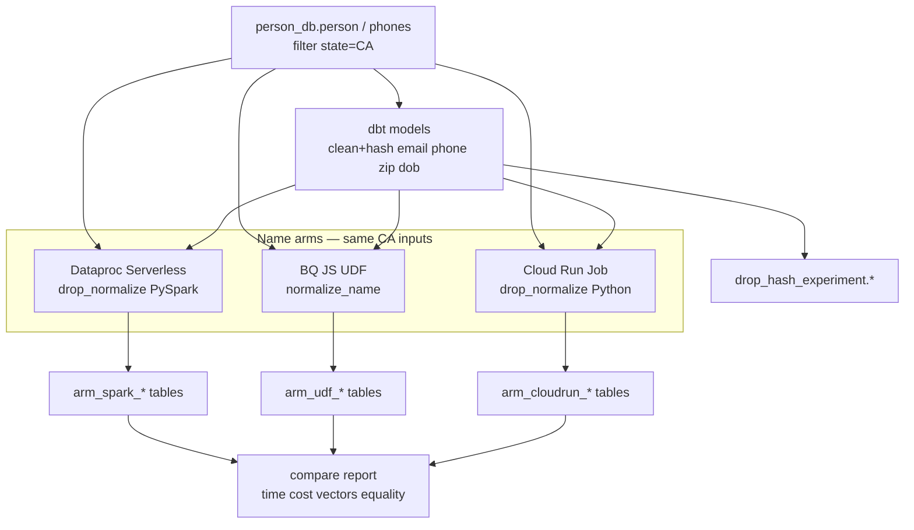

# feat: DROP hash CA cleaning experiment (SQL + Spark / UDF / Cloud Run)

**Target repo:** `data-privacy` · **GCP:** `example-gcp-project` · **Region:** `us-east4`

**Product Contract preservation:** Bootstrap from session — no upstream requirements-only plan.

---

## Goal Capsule

**Objective:** Run a California-only MDR cleaning experiment that materializes comparable BigQuery hash tables using DROP Technical Specs **v1.2.0** rules: shared **dbt-versioned SQL** for email, phone, ZIP, and date of birth; three **name-cleaning arms** (Dataproc Serverless Spark, BigQuery JS UDF, Cloud Run Job); measure **wall time, cost, and official vector fidelity**; keep scripts maintainable and **trigger-ready** for later schedule/Eventarc/HTTP without building production refresh yet.

**Authority hierarchy:** [privacy.ca.gov DROP technical specifications v1.2.0](https://privacy.ca.gov/drop-for-data-brokers/technical-specifications/) → ADR-21 / CPPA Matching KB → Matching-Design-Brief → this plan → `AGENTS.md`.

**Stop conditions:** All three arms write CA experiment tables; vector suite green; compare report records time/cost/hash-parity; no Beam/Dataflow; no Mailchimp; no full 50-state production rebuild.

**Execution profile:** Master plans; **subagent executors** with disjoint ownership; use `ce-work` with subagents. Enable `dataproc.googleapis.com` before U3.

---

## Product Contract

### Summary

Build a throwaway-but-comparable **experiment dataset** in `example-gcp-project` that cleans/hashes Habeas MDR for `state = 'CA'` three ways for names, while sharing one dbt SQL path for non-name identifiers. Engineers re-run via documented entrypoints; later a scheduler, Eventarc, or HTTP POST can invoke the same jobs.

### Problem frame

Intake spine can land CPPA hashes, but `app/matching` cannot look up Habeas consumers: `hash.py` is not DROP-accurate, and there is no MDR→BQ hash materialization. Before committing a production builder, we need a CA-scoped bake-off of name-cleaning runtimes and a durable home for versioned SQL cleaning.

### Requirements

- R1. Filter MDR to California (`person.state = 'CA'`, matching phone joins on `dwid` + `state`).
- R2. Clean + hash **email, phone, ZIP, DOB** with DROP v1.2.0 rules in **native BigQuery SQL**, versioned with **dbt**.
- R3. Clean + hash **first/last names** (and NDZ composite) in **three independent arms**, each writing its own experiment table(s):
  - R3a. **SQL + Dataproc Serverless Spark** (names in Spark; non-name from dbt SQL).
  - R3b. **SQL + BigQuery JS UDF** (names in UDF; non-name from dbt SQL).
  - R3c. **SQL + Cloud Run Job** (names in Python job; non-name from dbt SQL).
- R4. Compare arms on **wall time**, **cost** (BQ bytes / Dataproc DCU / Cloud Run), and **official CPPA vectors**; also **row-level hash equality** across arms on overlapping CA keys where all succeed.
- R5. No PII in logs; experiment tables may hold hashes + `dwid`/`state` only in query results returned to operators (prefer aggregate metrics in reports).
- R6. Scripts/jobs are **re-runnable** and documented for a future trigger (Cloud Scheduler → HTTP, Eventarc on MDR refresh, or POST) without implementing that trigger in this plan.
- R7. Sandbox/production DROP API hosts are out of scope for this experiment (hash build only).

### Actors

- A1. Privacy engineer (Jose) — runs experiment, reads compare report.
- A2. Future engineer — re-runs dbt + jobs from repo docs.
- A3. Future orchestrator (Scheduler / Eventarc / HTTP) — deferred consumer of the same entrypoints.

### Key flows

- F1. dbt builds CA non-name cleaned/hashed tables from `person_db`.
- F2. Each name arm reads CA person rows + non-name hashes, writes arm-specific NDZ/email/phone experiment tables.
- F3. Compare job aggregates metrics and vector checks into a report table or markdown under `tmp/` (gitignored) / `docs/` summary.

### Acceptance examples

- AE1. Official email/phone/ZIP/DOB/NDZ vectors hash identically in the shared SQL path and in each name arm’s NDZ composite when fed the vector inputs.
- AE2. Three experiment tables exist for CA with documented row counts; compare report lists time and cost per arm.
- AE3. Cross-arm hash equality on a CA sample (or full CA) is reported (% match / mismatch counts) without dumping PII.

### Scope boundaries

**In:** CA-only MDR read via `example-gcp-project.person_db`; new experiment dataset; dbt SQL; three name arms; vector tests; compare report; enable Dataproc API; stub/docs for future triggers.

**Out:** Beam/Dataflow; Mailchimp/other verticals; production `drop_hash_index` cutover; automatic MDR refresh; wiring `DropHashPipeline` to production lookups (follow-up after winner chosen); full 50-state rebuild.

### Deferred for later

- Production dataset `drop_hash_index` and `DropHashPipeline` BQ lookup.
- Event-driven rebuild when MDR Analytics Hub listing refreshes.
- Multi-vertical separate tables/workers.

### Outside this product's identity

- Plaintext webform matching (MDR vs M Tool).
- DROP amend / weekly upload (already on intake spine).

---

## Planning Contract

### Key Technical Decisions

- KTD1. **Three name arms, shared SQL non-name path.** `(session-settled: user-directed — chosen over single-path only: bake-off Spark vs UDF vs Cloud Run)`
- KTD2. **dbt versions SQL cleaning** in a new top-level `analytics/` project (no dbt in repo today). `(session-settled: user-directed — chosen over ad-hoc SQL files only: engineer maintainability)`
- KTD3. **Experiment dataset** (e.g. `example-gcp-project.drop_hash_experiment`) — not writable into linked `person_db`. `(session-settled: user-directed — chosen over durable production dataset: compare then decide)`
- KTD4. **Dataproc Serverless** for Spark arm; **Cloud Run Job** as third arm; **BQ JS UDF** for second. `(session-settled: user-directed)`
- KTD5. **Success metrics = time + cost + CPPA vectors (+ cross-arm hash equality).** `(session-settled: user-directed)`
- KTD6. **Hashing uses BigQuery builtins** (`TO_BASE64(SHA256(...))`) wherever the standardized string already exists; arms differ on **how names are standardized**, not on the hash primitive.
- KTD7. **Grain:** `(list_type, hash_value) → (dwid, state)` for MDR MVP. `(session-settled: user-directed — multi-vertical separate tables deferred)`
- KTD8. **Python `drop_normalize` is the golden name implementation** shared by Spark and Cloud Run; UDF is a JS port of the same tables for parity testing.
- KTD9. **Future triggers** attach to stable entrypoints: `dbt run --select …`, Dataproc batch submit, Cloud Run Job execute, optional `POST` wrapper — document contracts; do not implement Scheduler/Eventarc in this plan.

### Assumptions

- `birthdate` in MDR is parseable to `YYYYMMDD` for the majority of CA rows; unparseable DOBs are null-hashed / excluded with counts reported.
- Jose can enable `dataproc.googleapis.com` (already has `serviceusage.services.enable`).
- CA slice is small enough that Cloud Run Job and UDF arms can complete without mandatory state sharding (sharding still allowed if timeouts hit).
- “Spark and UDF” in the bake-off means **two separate result tables** (Spark arm vs UDF arm), not a single pipeline that combines Spark with UDF.

### High-Level Technical Design



**Directional sketch — shared non-name SQL (dbt):** standardize email/phone/zip/dob per v1.2.0 → `TO_BASE64(SHA256(...))` → CA tables keyed by `dwid, state`.

**Directional sketch — NDZ after names:**  
`hash = Base64(SHA256(h_fn || h_ln || h_dob || h_zip))` with no delimiters (Base64 strings concatenated).

### Alternatives considered

| Approach | Why not for this experiment |
|----------|------------------------------|
| Single production builder first | Need bake-off evidence before locking runtime |
| Beam / Dataflow | Explicitly rejected |
| Full-table JS UDF for all fields | Non-name fields are cheaper/faster in native SQL |
| Notebook-only cleaning | Fails maintainability / trigger-ready requirement |

### Risks and dependencies

| Risk | Mitigation |
|------|------------|
| JS UDF timeout / high slot time on CA | Chunk by `dwid` ranges or county; record failure as arm result |
| Dataproc API disabled | U3 first step: enable API; document |
| Name transliteration drift across Python vs JS | Shared test vectors; single source mapping tables in repo JSON consumed by both |
| Linked MDR read-only | Write only to `drop_hash_experiment` |
| PII in logs | Log counts, timings, hash digests of vectors only |

### Future trigger contract (document only)

| Entrypoint | Future invoker |
|------------|----------------|
| `dbt run --select tag:drop_clean_ca` | Cloud Build / Composer / Scheduler → Cloud Run that runs dbt |
| Dataproc batch YAML / `gcloud dataproc batches submit` | Scheduler or Eventarc on MDR refresh |
| Cloud Run Job | Scheduler, Eventarc, or authenticated `POST` to Job API |
| Optional thin `POST /rebuild` FastAPI | Admin/ops — **out of this plan** |

---

## Implementation Units

### U1. dbt project + CA SQL clean/hash for email, phone, ZIP, DOB

**Goal:** Versioned BigQuery SQL models that produce CA non-name standardized values and DROP hashes from MDR.

**Requirements:** R1, R2, R6, KTD2, KTD3, KTD6

**Dependencies:** None (create experiment dataset)

**Files:**
- `analytics/README.md`
- `analytics/dbt_project.yml`
- `analytics/profiles.yml.example` (no secrets)
- `analytics/models/drop_clean_ca/sources.yml`
- `analytics/models/drop_clean_ca/stg_ca_person.sql`
- `analytics/models/drop_clean_ca/stg_ca_phones.sql`
- `analytics/models/drop_clean_ca/int_ca_email_hash.sql`
- `analytics/models/drop_clean_ca/int_ca_phone_hash.sql`
- `analytics/models/drop_clean_ca/int_ca_zip_hash.sql`
- `analytics/models/drop_clean_ca/int_ca_dob_hash.sql`
- `analytics/tests/assert_cppa_email_vector.sql` (or singular tests YAML)
- `analytics/tests/assert_cppa_phone_vector.sql`
- `analytics/tests/assert_cppa_zip_vector.sql`
- `analytics/tests/assert_cppa_dob_vector.sql`

**Approach:**
- Create dataset `drop_hash_experiment` in `us-east4`.
- Source `person_db.person` / `phones`; filter `state = 'CA'`.
- Implement v1.2.0 rules: email remove all `\s` + lower; phone digits last-10; ZIP strip +4 then alnum/lower/leading zeros/first 5; DOB to `YYYYMMDD`.
- Persist both `*_std` and `*_hash` columns; grain `dwid, state`.
- dbt tests assert official vectors via literal SELECTs (not against MDR PII).

**Patterns to follow:** New top-level package like `infra/` docs; UV/Python stay for apps — dbt is analytics tooling beside them. Link DROP rules to KB / privacy.ca.gov rather than copying full transliteration tables into SQL comments.

**Test scenarios:**
- Happy path: vector email/phone/ZIP/DOB inputs → exact Base64 hashes from v1.2.0.
- Edge: email with interior spaces; phone `+1(415)…`; ZIP `91790-3771`, `00300-9999`, `M1B 1A1`.
- Edge: DOB unparseable → null std/hash and counted.
- Error: dbt fails loudly if destination dataset missing.

**Verification:** `dbt build --select drop_clean_ca` succeeds; vector tests pass; CA row counts logged.

---

### U2. Shared Python `drop_normalize` + golden vector suite

**Goal:** Canonical DROP v1.2.0 name (and helper) standardization used by Spark and Cloud Run; pytest vectors gate all arms.

**Requirements:** R3, R4, AE1, KTD8

**Dependencies:** None (can parallel U1)

**Files:**
- `analytics/drop_normalize/pyproject.toml` (or workspace member under `libs/` if preferred — default `analytics/drop_normalize` to keep experiment colocated)
- `analytics/drop_normalize/src/drop_normalize/__init__.py`
- `analytics/drop_normalize/src/drop_normalize/names.py`
- `analytics/drop_normalize/src/drop_normalize/email.py`
- `analytics/drop_normalize/src/drop_normalize/phone.py`
- `analytics/drop_normalize/src/drop_normalize/zipcode.py`
- `analytics/drop_normalize/src/drop_normalize/dob.py`
- `analytics/drop_normalize/src/drop_normalize/hashing.py`
- `analytics/drop_normalize/src/drop_normalize/ndz.py`
- `analytics/drop_normalize/src/drop_normalize/data/transliteration_el.json`
- `analytics/drop_normalize/src/drop_normalize/data/transliteration_cyr.json`
- `analytics/drop_normalize/src/drop_normalize/data/transliteration_special_latin.json`
- `analytics/drop_normalize/tests/test_cppa_vectors_v120.py`
- `analytics/drop_normalize/tests/test_name_edge_cases.py`

**Approach:**
- Port official transliteration tables from v1.2.0 Working-with-data docs into JSON; apply order: lower → special Latin → Greek → Cyrillic → strip non-letter/digit → compound names.
- Expose `normalize_*` + `hash_std` + `ndz_concatenated_hash`.
- Do **not** replace `app/matching/hash.py` in this unit (follow-up after winner); keep experiment lib separate to avoid breaking intake tests mid-bake-off.

**Execution note:** Implement vector tests first; they are the acceptance gate for U3–U5.

**Test scenarios:**
- Covers AE1: Danielle Johnson NDZ final hash `PQOfn1RffEKmqMmNAzDKKaoZCwxWbQZkQzPWmQo9REA=`.
- Happy: Juan Pablo → `juanpablo`; Martinez vector; July 4 1776 DOB; Anna.Smith email; +1 phone; ZIP+4 cases.
- Edge: Greek/Cyrillic sample chars from published tables; CJK passthrough; empty/None inputs.
- Edge: soft/hard signs removed; ß→ss, æ→ae.

**Verification:** `uv run pytest analytics/drop_normalize/tests -q` all green.

---

### U3. Arm A — Dataproc Serverless Spark names → experiment tables

**Goal:** CA name standardization + NDZ (and name hashes) via Dataproc Serverless, joining dbt non-name hashes; record timing/cost.

**Requirements:** R3a, R4, KTD4

**Dependencies:** U1, U2; Dataproc API enabled

**Files:**
- `analytics/jobs/dataproc/README.md`
- `analytics/jobs/dataproc/normalize_ca_names.py` (PySpark entry)
- `analytics/jobs/dataproc/submit.sh` or documented `gcloud` invoke
- `infra/cloudbuild/` optional stub only if needed for packaging — prefer documented manual submit for experiment
- `analytics/jobs/dataproc/tests/test_spark_local_smoke.py` (optional local spark-less unit of pure Python path)

**Approach:**
- Enable `dataproc.googleapis.com`.
- Job reads CA `firstname`/`lastname` (+ keys) from BQ; applies `drop_normalize`; writes `drop_hash_experiment.arm_spark_name_hash` and `arm_spark_ndz_hash` (join dob/zip hashes from dbt).
- Emit run metrics row: `arm`, `started_at`, `finished_at`, `dcu_seconds`, `rows_in`, `rows_out`, `vector_ok`.

**Test scenarios:**
- Happy: job completes; NDZ vector rows (synthetic insert or unit) match.
- Integration: CA output row count within expected band vs `stg_ca_person`.
- Error: missing dbt upstream tables → fail with clear message.

**Verification:** Batch SUCCESS; metrics row present; vector check true.

---

### U4. Arm B — BigQuery JS UDF names → experiment tables

**Goal:** Same outputs via persistent JS UDF + SQL, for cost/time comparison.

**Requirements:** R3b, R4, KTD4, KTD6

**Dependencies:** U1, U2 (mapping tables exported to JS or embedded)

**Files:**
- `analytics/udf/normalize_name.js` (source of truth checked into git)
- `analytics/udf/create_normalize_name_udf.sql`
- `analytics/models/drop_clean_ca/arm_udf_name_hash.sql` (dbt model calling UDF)
- `analytics/models/drop_clean_ca/arm_udf_ndz_hash.sql`
- `analytics/udf/tests/test_udf_vectors.sql`

**Approach:**
- Create persistent UDF in `drop_hash_experiment` (or `drop_hash_experiment_udfs`).
- Port transliteration maps into JS; keep hashing in SQL builtins after UDF returns `name_std`.
- Chunk by `dwid` ranges if the single query approaches timeout; document chunk recipe.
- Record bytes billed + elapsed from job metadata into metrics table.

**Test scenarios:**
- Happy: UDF(name vector inputs) match Python golden hashes.
- Edge: same Greek/Cyrillic/CJK cases as U2.
- Failure path: document timeout → chunked rerun procedure (test expectation: procedure exists in README).

**Verification:** dbt/UDF models built; vector SQL tests pass; metrics captured.

---

### U5. Arm C — Cloud Run Job names → experiment tables

**Goal:** Third arm using containerized Python `drop_normalize` without Spark.

**Requirements:** R3c, R4, KTD4, R6

**Dependencies:** U1, U2

**Files:**
- `analytics/jobs/cloudrun/Dockerfile`
- `analytics/jobs/cloudrun/main.py` (batch entry: read BQ → write BQ)
- `analytics/jobs/cloudrun/README.md`
- `infra/cloudbuild/drop-normalize-ca-job-dev.yaml` (optional deploy)
- `analytics/jobs/cloudrun/tests/test_main_unit.py`

**Approach:**
- Job uses ADC + BigQuery client; processes CA names; writes `arm_cloudrun_*` tables; writes metrics.
- Design `main` so Cloud Scheduler / Eventarc / `gcloud run jobs execute` can invoke later with env `ARM=cloudrun`, `STATE=CA`.
- Prefer reading only needed columns; no PII logging.

**Test scenarios:**
- Unit: mocked BQ read/write invokes normalize and writes expected hash for fixture rows.
- Smoke: job execute on CA completes (manual/dev).
- Edge: empty CA subset still writes metrics with zeros.

**Verification:** Job execution succeeded; tables + metrics present; vectors OK.

---

### U6. Compare report + trigger-ready docs

**Goal:** Side-by-side comparison and engineer runbook for re-run / future triggers.

**Requirements:** R4, R6, AE2, AE3, KTD5, KTD9

**Dependencies:** U3, U4, U5

**Files:**
- `analytics/compare/build_compare.py` (or SQL + markdown generator)
- `analytics/compare/README.md`
- `docs/solutions/architecture-patterns/drop-hash-ca-experiment.md` (short learning after run — optional if compare README sufficient)
- `analytics/RUNBOOK.md` — how to re-run all arms; how to hang Scheduler/Eventarc/HTTP later

**Approach:**
- Metrics table schema: arm, wall_seconds, bq_bytes, dataproc_dcu_hours, cloudrun_cpu_seconds, cost_usd_estimate, vector_pass, ca_rows, cross_arm_match_pct.
- Hash equality: join spark/udf/cloudrun NDZ (and email/phone from shared SQL) on `dwid,state`; report match %.
- RUNBOOK documents three future invokers without implementing them.

**Test scenarios:**
- Happy: compare script fails if any arm metrics missing.
- Happy: vector_pass false fails the compare exit code.
- Integration: match_pct computed on non-empty overlap.

**Verification:** Compare artifact produced; RUNBOOK reviewed; experiment datasets retained for inspection.

---

## Verification Contract

```bash
# Python golden vectors
uv sync --all-packages   # if workspace-wired; else uv sync in analytics/drop_normalize
uv run pytest analytics/drop_normalize/tests -q

# dbt non-name + UDF models (requires ADC + experiment dataset)
cd analytics && dbt build --select drop_clean_ca

# Arms (documented exact commands in job READMEs)
# - gcloud dataproc batches submit ...
# - gcloud run jobs execute ...

# Compare
uv run python analytics/compare/build_compare.py
```

**Quality gates:** All CPPA v1.2.0 vectors green in Python and SQL/UDF tests; three arm tables exist for CA; compare report includes time, cost estimate, vectors, cross-arm equality.

---

## Definition of Done

### Global

- [ ] `drop_hash_experiment` dataset populated for CA non-name + three name arms
- [ ] dbt models are the source of truth for email/phone/ZIP/DOB cleaning
- [ ] Python `drop_normalize` matches official vectors
- [ ] Compare report recorded (time, cost, vectors, equality)
- [ ] RUNBOOK explains re-run + future Scheduler/Eventarc/HTTP hooks
- [ ] No Beam/Dataflow; no secrets in git; no PII in logs
- [ ] Subagent-friendly unit ownership respected during `ce-work`

### Per unit

U1–U6 verification outcomes met; pytest/dbt evidence captured in `tmp/verification-drop-hash-ca.log` (gitignored) or CI when added.

---

## Appendix

### Official vectors (v1.2.0) — must pass

| Case | Input → std | Hash |
|------|-------------|------|
| Email | `Anna.Smith@Domain.com` → `anna.smith@domain.com` | `KA18MT/ph6IHYjzT9zwETySDQyvSh87YuoSBpOQtkhE=` |
| Phone | `+1(415)555-9317` → `4155559317` | `vGM7y5n+hBXRSEAklhHDPCbysyNgYTmXdMcagGUOY8E=` |
| ZIP | `91790-3771` → `91790` | `2FPZucR4x7U8KlM+SFAX4LPGhwNz/PIZUCSUdDh0o/s=` |
| NDZ | Danielle / Johnson / 19850704 / 91790 | `PQOfn1RffEKmqMmNAzDKKaoZCwxWbQZkQzPWmQo9REA=` |

### Cost/time priors (planning estimates, not gates)

- Shared SQL scan of needed CA columns: order **cents–low dollars**, minutes.
- Dataproc Serverless CA names: likely **low dollars**, tens of minutes.
- JS UDF CA names: low scan $, **higher wall time / timeout risk**.
- Cloud Run Job: between SQL and Spark depending on shard/CPU.

### Sources

- https://privacy.ca.gov/drop-for-data-brokers/technical-specifications/
- https://privacy.ca.gov/drop-for-data-brokers/technical-specifications/working-with-data/
- SirvenOS ADR-21, Matching-Design-Brief, CPPA-Matching docs
- Session bake-off decisions 2026-07-17
- `docs/solutions/architecture-patterns/drop-weekly-batch-filename-gcs-staging.md`
