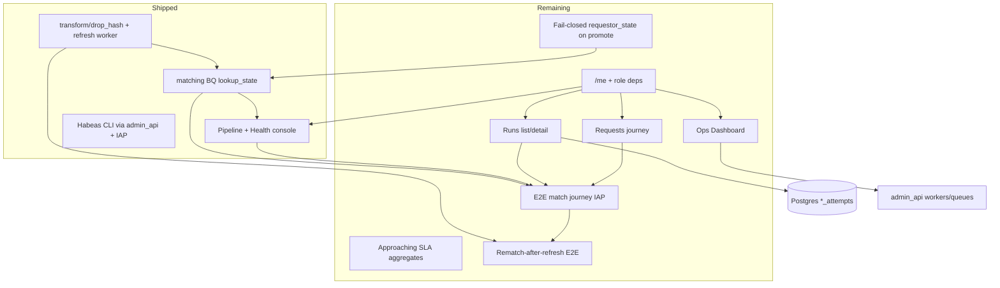

# feat: DROP hash + ops — consolidated residual plan

**Target repo:** `data-privacy` (Bitbucket `dsts/data-privacy`)
**Canonical plan path:** `docs/plans/2026-07-17-001-feat-drop-hash-ops-consolidated-plan.md`
**Sibling plans:** `docs/plans/2026-07-16-001-feat-intake-spine-mvp-plan.md` (intake/spine MVP — keep separate). Superseded Cursor/worktree DROP-hash plans deleted 2026-07-17.
**Product Contract preservation:** Consolidation resume — Product outcomes for shipped U0–U25 preserved as “What’s shipped”; residual product scope = hash polish + role-aware ops IA (former drop-ops-ia plan folded here) + formal E2E matching journey (IAP SA path).

---

## Goal Capsule

**Objective:** Close residual DROP hash/ops gaps after the productionize + Pipeline/Health wave, ship role-aware ops information architecture (Requests / Runs / Dashboard), and prove a full end-to-end matching journey through that IA over the IAP-required admin-api path — without re-opening finished U0–U25 work.

**Authority hierarchy:** Session-settled decisions (this plan) → `AGENTS.md` + `.agent/modules/` (privacy-invariants, frontend-stack, design-taste, python-uv, prod-write-gate, orchestration) → SirvenOS Data Privacy project folder → this plan.

**Stop conditions:** Do not re-implement U0–U25 as greenfield. No production writes without Jose approval. No PII/hashes/dwids in logs, audit JSONB, or operator payloads beyond ids/counts. Mutations only through `app/admin_api`. Browser never calls workers. Never return out-of-state DWIDs from hash lookup. Intake-spine delivery stays on the sibling intake plan. Do not claim E2E matching DoD via `DATABASE_URL` / in-process worker bypass (KTD14).

**Execution profile:** Master plans → parallel executors on disjoint files → separate review/test waves. UV for Python; Bun for web.

**Tail ownership:** Implementer owns Verification Contract + Definition of Done; PR only on explicit user ask.

---

## What’s shipped (git-derived)

Branch tip used for this consolidation: `feat/drop-hash-index-prod` @ `4273a4b` (local). Treat commits + `tmp/reviews/drop-hash-implementation-status.md` as truth over any obsolete plan checkboxes.

### Foundation (former U0–U10)

| Area | Outcome |
|------|---------|
| `transform/drop_hash` | Sole production dbt path; serving marts `email_hash` / `phone_hash` / `ndz_hash` (`hash_value`, cluster `(state, hash_value)`) |
| Hash refresh queue + worker | Per-state attempts; immutable (no DELETE-for-cleanup) |
| BQ matching + fulfill | Parameterized lookup; `match_count` persisted; fulfill maps 0→5, 1→3, N→4 |
| Rematch after refresh | Shipped; later expanded to all states |
| CLI Phase 1 | Hash-index enqueue/process/status |
| Wave A hardening | Mutation authz, privacy redaction, review gates, reapeable refresh, attempt history UI |

### Wave B + session unlocks (former U11–U25 + held)

| Area | Outcome | Tip evidence |
|------|---------|--------------|
| Matching `audit_payload` JSONB + ≥3 retries | Done | `1bcd570`; `max_attempts` default 5 |
| Pipeline + Health shell / tabs | Done | `d8ca538`, `e2b441c` |
| Promote/decline + assign/escalate | Done | `b0f6485`; Matching search/filters `ae05cb7` |
| State normalize + enqueue-all + rematch any state | Done | `7774b5c`, `8de99c4` |
| Requester `@lookup_state` | Done (fail-closed without `requestor_state`) | `6290df4` |
| Workers/queues APIs + retry config | Done; no browser→worker | `7e47e6f`, `8fb4a1f`, `50191a7` |
| Open-row Opted-out coherence | Done | `49674ea` |
| CLI Phase 2 spine proxies | **Unlocked / shipped** | `d4117e5` |
| Fulfilled status-4 rematch reopen | **Unlocked / shipped** | `cf514db` — candidates include `response_status = 4`; reopen → NULL |
| All-state live wave | **51/51 success** | `tmp/reviews/drop-hash-all-states-prod.md` |
| Parallel refresh FL phone race | Fixed + verified | `8731c18`; FL phone rows restored |
| IAP on admin-api + SA ID token CLI | Done | `b969b42`, `4273a4b` — SA impersonation `--include-email`; worker invoker lock |
| Docs sweep | Done (minor drift OK) | `d357df0` + IAP/RUNBOOK notes |

**Residual code units U1–U10:** landed on this branch (soft-CA; approaching-SLA; roles/`/me`; Requests/Runs/Dashboard IA; IAP E2E + rematch — see scoreboard + `tmp/reviews/drop-hash-e2e-*-iap.md`). **Settled (2026-07-20):** Q1/Q6 = USPS 50+DC; Q2 = keep `person.emailaddress`, accept sparse MDR fill (see RUNBOOK email investigation). **Still open:** merge/PR on ask. Prior CA live match (`tmp/reviews/drop-hash-ca-matching-test.md`) remains non-DoD (DB bypass).

---

## Product Contract

### Summary

Operators already have a tabbed DROP Pipeline + Health console backed by all-state hash refresh and requester-state matching. Remaining product work is (1) close correctness/ops polish on multi-state intake and SLA visibility, (2) introduce role-aware Requests / Runs / Dashboard so product operators can answer “where is my DROP?” without living in the power console, and (3) run a formal end-to-end matching journey through that IA on the IAP SA ID-token path — not a Postgres/`DATABASE_URL` mutation bypass.

### Problem Frame

Hash-index and Pipeline/Health Wave B landed, but soft-CA defaults can mis-scope multi-state matching, approaching-SLA stats were never wired, the next UX leap (role-separated Requests/Runs/Dashboard) was planned separately and is still pending, and **no full E2E matching process has been proven** from DROP request through match → review → fulfill with `response_status` 3/4/5 over the production mutation path (IAP-required admin-api). A scoped CA live match proved BQ lookup + `matching_results` + pending `matching.review`, but stopped short of fulfill and used `DATABASE_URL` when IAP blocked agents.

### Requirements

**Shipped — do not re-plan as todo (trace only)**

- R1. All-state hash tables + per-state refresh + enqueue-all (50+DC allowlist). `(session-settled: full hash tables for all states — 2026-07-17)`
- R2. BQ lookup `@lookup_state` = requester source state; never out-of-state DWIDs. `(session-settled: requester-state lookup — 2026-07-17)`
- R3. Rematch-on-refresh for **every** successful state; after unlock, rematch candidates include open rows **and** fulfilled Opted-out (`response_status = 4`) which reopen to NULL then rematch. `(session-settled: rematch-on-refresh all states — 2026-07-17; session-unlocked: status-4 reopen — 2026-07-17)`
- R4. Matching attempt audit JSONB + ≥3 retries; per-request attempts. `(session-settled)`
- R5. Pipeline + Health UX; worker/queue visibility via admin-api only; promote/decline; assign/escalate. `(session-settled)`
- R6. Mutations only via `admin_api`; CLI Phase 1+2 via admin-api; IAP required on deployed admin-api; CLI uses SA-impersonated ID token; no user→worker `run.invoker`. `(session-settled: IAP + SA token + no worker bypass — 2026-07-17)`

**Remaining**

- R7. DROP promote must not silently invent requester state for multi-state ops: fail-closed or require explicit state when payload/filename omit it (remove or strictly sandbox-gate `DEFAULT_DROP_REQUESTOR_STATE = "CA"`).
- R8. Pipeline stage stats expose **approaching SLA** using batch/request age + DROP deadline policy constants (or schema if added); full `sla_monitor` product remains deferred.
- R9. Role-aware ops IA: vocabulary Request / Job / Run; `super_admin` / `admin` / `data_owner` from IAP email allowlists; `GET /me`; API 403 (not UI-hide alone).
- R10. Requests area answers “where is my DROP?” (journey/lineage + needs attention) for admin + data_owner.
- R11. Runs list/detail for super_admin over Postgres attempt families via admin-api (not workers).
- R12. Prefect-style ops Dashboard (super_admin) + needs-me home (all roles); Insights thin; Incidents/Configuration/SLAs as shells in v1.
- R13. Keep `/ops/drop-pipeline` as gated power console (super_admin mutations); matching approve remains available to admin + data_owner.
- R14. No PII in journey/Runs/lineage UI (`consumer_id`, contacts, filenames, `gcs_uri` excluded).
- R15. **E2E matching journey (first-class):** CA (or multi-state once R7 lands) DROP request → enqueue match → matching worker (live BQ, requester-state `@lookup_state`) → `matching_results` + pending `matching.review` → ops UI promote/decline + assign/escalate as applicable → fulfill → `response_status` ∈ {3, 4, 5}. Exercised through **role-aware** Requests journey, Runs, Dashboard, `GET /me`, and console gate — not only Pipeline console or DB bypass.
- R16. **E2E rematch-after-refresh (second scenario):** After a successful hash-index refresh for the requester state, rematch candidates (including status-4 reopen per KTD10) re-enter match → review → fulfill; observable on Requests journey and Runs.

### Actors

- A1. DROP ops / super admin — power console, Runs, ops Dashboard, hash refresh.
- A2. Admin — Requests journey, needs attention, matching approve; thin Insights.
- A3. Data owner — Dashboard + Requests (+ approvals); no Runs/console/Jobs/Config.
- A4. Auditor — matching attempt audit JSONB (ids/counts/redacted errors).
- A5. Agent/CLI operator — Phase 1+2 via admin-api + IAP SA token.

### Key Flows

- F1. (Shipped) Enqueue-all / per-state refresh → rematch for matching source state → BQ `@lookup_state` = requester state → review → fulfill 3/4/5; status-4 reopen eligible for rematch after refresh.
- F2. (Shipped on branch) Intake/promote without state → hard fail (no silent CA) — U1.
- F3. (Shipped on branch) Data owner Requests → journey → needs attention → approve without Runs/console — U3/U4/U7 (+ role gates; live E2E used super_admin).
- F4. (Shipped on branch) Super admin Runs → filters → detail → optional console deep-link — U5/U6.
- F5. (Shipped on branch) Super admin ops Dashboard window + worker pool cards — U8.
- F6. (Shipped — evidence) **Primary E2E** via IAP SA → admin-api → fulfill `response_status` 5 — U9 (`tmp/reviews/drop-hash-e2e-matching-iap.md`). Live data_owner path optional residual.
- F7. (Shipped — evidence) **Rematch E2E** after CA hash refresh → rematch → review → fulfill — U10 (`tmp/reviews/drop-hash-e2e-rematch-iap.md`). Status-4 reopen optional when safe candidate exists.

### Acceptance Examples

- AE1. Promote of a DROP zip that omits state fails closed (or requires explicit state) and does not write `requestor_state=CA` by default outside a documented sandbox override.
- AE2. Pipeline stage stats show an approaching-SLA count derived from policy constants / timestamps for at least one stage family.
- AE3. `data_owner` deep-link to `/ops/drop-pipeline` or `/ops/runs` gets API 403 and no usable nav entry.
- AE4. Super admin Lists Runs backed by connector/ingest/matching/hash-index attempt families with ids/counts only.
- AE5. DROP request journey shows ordered stages with current stage highlighted without opening the power console.
- AE6. Ops Dashboard 24h shows failed count escalation and at least one worker-pool card from admin-api aggregates.
- AE7. **Primary E2E (IAP):** Using SA-impersonated ID token against deployed (or IAP-required local) admin-api — not `DATABASE_URL` worker injection — a DROP request completes match → review action → fulfill with terminal `response_status` ∈ {3, 4, 5}; audit shows `@lookup_state` = requester state; Requests journey and (for super_admin) matching Run reflect the same `request_id` / attempt ids. Evidence under `tmp/reviews/` (ids/counts only).
- AE8. **Rematch E2E (IAP):** After a successful hash-index refresh for that state, a rematch candidate (open or status-4 reopen) produces a new matching attempt that again reaches review/fulfill via admin-api + role-aware UI; prior pending `matching.review` superseded when required by KTD10.

### Success Criteria

- Soft-CA default cannot silently mis-route multi-state matching.
- Approaching-SLA visibility exists at MVP depth (not full sla_monitor).
- Role matrix enforced at API + nav; power console remains super_admin-only for spine mutations.
- Shipped hash/matching invariants (requester-state, rematch-on-refresh including status-4 reopen, IAP/SA path) remain green under Verification Contract.
- **Full E2E matching journey proven on IAP SA path through role-aware ops IA** (AE7); rematch-after-refresh proven when material (AE8). `DATABASE_URL` / in-process worker bypass is diagnostic-only and never satisfies DoD.

### Scope Boundaries

**In scope**

- Soft-CA promote harden (R7)
- Approaching-SLA stage aggregates (R8)
- Role-aware ops IA U3–U8 below (former drop-ops-ia U1–U6)
- E2E matching journey + rematch scenario U9–U10 (R15–R16, F6–F7, AE7–AE8) over IAP-required admin-api
- Post-implementation Test + QC persona gates for U9–U10
- Verification evidence refresh after IAP + FL fix tips

**Deferred / out**

- Full `sla_monitor` productization beyond R8
- Eventarc auto-refresh; Tier-C suppression connector HTTP; name-hash Spark/Cloud Run arms
- Hash-index attempt DELETE-for-cleanup (held forever)
- Firebase Auth custom claims (IAP email → role map for v1)
- Editable concurrency Configuration API; Incidents ack product; tags on runs
- Alternate MDR email warehouse beyond `person_db.person.emailaddress` (Q2 settled: none in dataset; sparse fill accepted)
- Intake-spine worker delivery (sibling plan)
- Claiming DoD via `DATABASE_URL` / in-process matching bypass (allowed for local debug only)
- Prod writes / merge/PR without explicit Jose ask

### Outstanding Questions

| ID | Question | Status |
|----|----------|--------|
| Q1 | Canonical US state list for enqueue-all (50+DC vs BQ distinct `person.state` vs MDR config) | **Settled (Jose 2026-07-20)** — USPS 50+DC; not a separate MDR jurisdiction config |
| Q2 | Alternate MDR email source vs accept sparse `email_hash` | **Settled (2026-07-20)** — sole column `person.emailaddress`; no email/contact table; accept sparse (~9.9M / 9 states); dbt unchanged |
| Q3 | Raise dbt error redact `max_len` / structured exit summary | Deferred ops DX |
| Q6 | Served-state source of truth for hash refresh | **Settled (Jose 2026-07-20)** — same as Q1: USPS 50+DC (`USPS_STATES_PLUS_DC`) |

### Sources

- Prior: Cursor `drop_hash_productionize_2e1e0332` (deleted after consolidation); `docs/plans/2026-07-17-001-feat-drop-ops-ia-plan.md` (folded + removed).
- Status: `tmp/reviews/drop-hash-implementation-status.md`, `tmp/reviews/drop-hash-plans-inventory.md`.
- Evidence: `tmp/reviews/drop-hash-{Q-wave-b,held-Q,held-R,held-T,all-states-prod,fl-phone-zero,ca-matching-test}.md` (CA matching-test = partial proof only; U9 supersedes for E2E DoD).

---

## Planning Contract

### Session-settled Key Technical Decisions

Carry forward unless Jose explicitly reopens:

| ID | Decision | Annotation |
|----|----------|------------|
| KTD1 | Matching via parameterized BQ in `app/matching`; results in Postgres including `match_count=0`; hash refresh via `transform/drop_hash` | `(session-settled: user-directed — chosen over redesigning matching away from BQ/Postgres)` |
| KTD2 | Matching attempts per `request_id`; audit JSONB on `matching_attempts`; ≥3 retries (`max_attempts` prefer 5) | `(session-settled: user-directed — chosen over per-bulk-intake attempts)` |
| KTD3 | Full hash tables all MDR/DROP states; shared marts; per-state queue grain; enqueue-all for full wave | `(session-settled: user-directed — chosen over CA-only hash build)` |
| KTD4 | Rematch after **every** successful state refresh for candidates whose normalized source state matches; skip single-match (`match_count=1`) | `(session-settled: user-directed — CA-only rematch gate superseded)` |
| KTD5 | BQ `@lookup_state` = normalized requester `requestor_state`; fail-closed if missing; never hardcode CA in prod | `(session-settled: user-directed — chosen over env-only DROP_HASH_LOOKUP_STATE)` |
| KTD6 | Pipeline + Health nav; worker/queue visibility only via admin-api aggregation — **no browser→worker** | `(session-settled: user-directed — chosen over browser→worker: IAP/CORS/auth)` |
| KTD7 | Deployed admin-api requires IAP identity; CLI mints audience ID token via SA impersonation (`--include-email`); never grant user→worker `run.invoker` | `(session-settled: user-directed — chosen over unprotected admin-api / direct worker invoke)` |
| KTD8 | Hash-index refresh attempts immutable (no DELETE-for-cleanup) | `(session-settled: user-directed)` |
| KTD9 | **Unlocked:** CLI Phase 2 spine proxies via admin-api (dry-run + `--execute`) | `(session-settled: user-directed unlock — supersedes prior “CLI Phase 2 held”)` |
| KTD10 | **Unlocked:** Fulfilled `response_status = 4` is rematch-eligible; reopen to NULL; supersede pending `matching.review` | `(session-settled: user-directed unlock — supersedes prior “no reopen fulfilled-4”)` |
| KTD11 | Open-row rematch + fulfill from **latest** `match_count` prevents stale Opted-out | `(session-settled: user-directed — open-row coherence)` |
| KTD12 | Ops IA: live Runs from Postgres attempts via admin-api; keep `/ops/drop-pipeline` as mutation power console; three roles with API enforcement | `(session-settled: user-directed — chosen over shells-only Runs / UI-hide-only RBAC)` |
| KTD13 | Parallel per-state dbt must use state-suffixed build tables (FL phone race lesson) | `(session-settled: user-approved — chosen after live incident: shared unsuffixed build tables)` |
| KTD14 | E2E matching DoD requires **IAP-required admin-api** with SA-impersonated audience ID token (`--include-email`); role-aware UI/API exercises the journey. `DATABASE_URL` / in-process worker claim is diagnostic-only and never the success criterion | `(session-settled: user-directed — 2026-07-17 — chosen over accepting prior CA match evidence that used DB bypass)` |

### Assumptions

- A1. Approaching SLA MVP uses timestamps + DROP deadline policy constants if no deadline column exists yet; document the derivation.
- A2. Soft-CA removal may keep an explicit `DROP_ALLOW_DEFAULT_REQUESTOR_STATE=CA` (or similar) for local sandbox only — never default-on in deployed envs.
- A3. Assignee identity remains IAP email until a user directory exists.
- A4. Ops IA v1 Jobs/Incidents/Configuration/SLAs are shells where noted; failed work reachable via Runs filters.
- A5. USPS 50+DC allowlist stands until Jose answers Q1.
- A6. Primary E2E may use an existing open sandbox DROP request with known `requestor_state` (prefer CA first); multi-state variant after U1. Scoped claim/process only — never drain unrelated pending matching queues.
- A7. SA credentials + `IAP_OAUTH_CLIENT_ID` + impersonation path are available for the E2E evidence run (or Jose provides them); without them U9 is blocked, not satisfied by DB bypass.

### High-Level Technical Design



### Sequencing

1. **U1 Soft-CA** (correctness; unblocks safe multi-state intake) — can parallel **U2 SLA** (disjoint files if API aggregates vs promote path split).
2. **U3 Roles `/me`** before all IA UI.
3. **U4 Nav shell** after U3.
4. **U5 Runs API/UI** ‖ **U7 Requests journey** after U3/U4 (disjoint routes/modules).
5. **U6 Run detail** after U5.
6. **U8 Dashboard/shells/console gate** after U3–U5.
7. **U9 Primary E2E matching journey** after U3–U8 (needs role-aware surfaces) and preferably after U1 for multi-state variant; CA-only primary can proceed once U3–U8 + IAP SA creds are ready.
8. **U10 Rematch-after-refresh E2E** after U9 (+ hash refresh path already shipped).
9. **Test + QC persona gates** on U9–U10 evidence, then **Verification refresh** (Wave T / E2E evidence under `tmp/reviews/`).

### Alternative Approaches Considered

| Alternative | Why not |
|-------------|---------|
| Keep soft-CA default “for convenience” | Silent wrong `@lookup_state` / rematch scope in multi-state ops |
| Re-implement Pipeline/Health under ops IA | Already shipped; IA absorbs reads, gates console |
| Browser→worker health | Rejects IAP/CORS (KTD6/KTD7) |
| Treat status-4 reopen as still held | Superseded by unlock + `cf514db` |
| Merge intake-spine into this plan | Separate delivery track; keep sibling plan |
| Accept prior CA live match as E2E DoD | Stopped before fulfill; used `DATABASE_URL` bypass when IAP blocked (KTD14) |
| E2E only via Pipeline console / CLI | Misses role-aware Requests/Runs/Dashboard/`/me` matrix (R15) |

### Risks

| Risk | Mitigation |
|------|------------|
| Soft-CA harden breaks CA sandbox demos | Explicit sandbox env override; document in RUNBOOK |
| SLA without deadline column is misleading | Label derivation; defer breach clocks |
| Role map misconfig locks operators | Env docs + local override; fail closed only when IAP required |
| Deep links bypass SPA nav | API checks on every gated route |
| PII in journey/Runs | DTO allowlists + privacy tests |
| IAP SA creds unavailable in agent session | Block U9; Jose provides impersonation SA + `IAP_OAUTH_CLIENT_ID`; never “pass” via DB bypass |
| Mass matching queue drain during E2E | Scoped claim/process by `attempt_id` / `request_id` only; document in evidence |
| `match_count=0` (status 5) looks like failure | Treat as valid fulfill outcome when lookup_state + live BQ proven; note domain mismatch vs code failure |

---

## Implementation Units

Do **not** reopen U0–U25. Units below are residual-only.

### Unit index

| U-ID | Title | Depends on |
|------|-------|------------|
| U1 | Soft-CA promote / requestor_state harden | — |
| U2 | Approaching-SLA stage aggregates | — |
| U3 | Role model, `/me`, API enforcement | — |
| U4 | Role-aware AppShell + route IA shell | U3 |
| U5 | Unified Runs API + list UI | U3, U4 |
| U6 | Run detail — timeline + gated logs | U5 |
| U7 | Requests journey, lineage, needs attention | U3, U4 |
| U8 | Ops Dashboard, Insights, Jobs, shells, console gate | U3–U5 |
| U9 | Primary E2E matching journey (IAP + role-aware IA) | U3–U8 (U1 for multi-state variant) |
| U10 | Rematch-after-refresh E2E + Test/QC persona Accept | U9 |

---

### U1. Soft-CA promote / requestor_state harden

**Goal:** Stop silently defaulting omitted DROP requester state to California outside an explicit sandbox override.

**Requirements:** R7, AE1

**Dependencies:** none

**Files:**
- `app/admin_api/src/admin_api/drop_pipeline.py` (or promote resolver helpers)
- `app/admin_api/tests/test_drop_pipeline.py`
- `clients/cli/habeas-cli/` promote path tests if CLI surfaces the default
- `infra/README.md` or DROP RUNBOOK note for sandbox override

**Approach:** Find `resolve_drop_requestor_state` / `DEFAULT_DROP_REQUESTOR_STATE`. Fail closed when state missing in deployed/IAP mode; allow opt-in sandbox default only behind explicit env. Ensure matching fail-closed without `requestor_state` remains coherent.

**Patterns to follow:** Existing `requestor_state` restore migration; U21 fail-closed lookup.

**Test scenarios:**
- Happy: promote payload with `TX` → `requestor_state=TX`.
- Error: omit state with sandbox override off → 4xx; no CA write.
- Edge: sandbox override on → CA allowed and logged/audited as override.
- Integration: matching attempt without `requestor_state` still fails closed (no CA fallback).

**Verification:** Admin-api promote tests green; docs mention override.

---

### U2. Approaching-SLA stage aggregates

**Goal:** Expose approaching-SLA counts on Pipeline stage stats using timestamps + policy constants (MVP).

**Requirements:** R8, AE2

**Dependencies:** none (may share status DTO with Pipeline)

**Files:**
- `app/admin_api/src/admin_api/drop_pipeline.py` (aggregates)
- `app/admin_api/tests/` (new or extend pipeline status tests)
- `clients/web/src/routes/ops/drop-pipeline.tsx` (surface counts; no fake breach clocks)
- `clients/web/AGENTS.md` (update “SLA skipped” notes)

**Approach:** Define policy constants (or reuse existing) for “approaching” age thresholds per stage family. Aggregate open work older than threshold. Label UI as derived age policy, not `sla_monitor`. Do not invent deadline columns unless a migration is already justified.

**Patterns to follow:** Existing Pipeline stage open/failed counts; design-taste CountTable/Micro (no metric-card grid).

**Test scenarios:**
- Happy: seeded old pending matching attempt increments approaching count for Matching.
- Edge: empty queues → zeros, no crash.
- Integration: response has counts only (no PII).

**Verification:** API test for aggregate math; UI shows count on at least one tab.

---

### U3. Role model, `/me`, and API enforcement

**Goal:** Introduce `super_admin` / `admin` / `data_owner` on admin-api with `GET /me` and reusable FastAPI dependencies.

**Requirements:** R9, R13, AE3

**Dependencies:** none

**Files:**
- `libs/habeas-privacy-core/src/habeas_privacy_core/auth/` (extend)
- `app/admin_api/src/admin_api/main.py`
- `app/admin_api/src/admin_api/drop_pipeline.py` (gate mutations)
- `app/admin_api/tests/test_roles.py` (new)
- `app/admin_api/tests/test_drop_pipeline.py` (extend)
- Auth/role env docs under `libs/.../auth/README.md` or `infra/README.md`

**Approach:** Map IAP email → role via config/env allowlists. Split DROP authz: spine proxies + `GET /ops/drop/pipeline` → super_admin; matching-results GET/bulk-approve and approvals → super_admin|admin|data_owner. Fail closed when identity required and role missing.

**Patterns to follow:** `require_drop_mutation_actor`; existing IAP email header parsing (`b969b42` / `4273a4b`).

**Test scenarios:**
- Happy: super_admin → spine mutation allowed when IAP required.
- Happy: data_owner → spine mutation 403; matching bulk-approve allowed.
- Error: missing IAP when required → 401/403 consistent with DROP gate.
- Edge: unknown email → deny when identity required.

**Verification:** Role + DROP mutation tests pass.

---

### U4. Role-aware AppShell and route IA shell

**Goal:** Wire nav and route stubs per role matrix; deep links respect `/me`.

**Requirements:** R9–R13, AE3

**Dependencies:** U3

**Files:**
- `clients/web/src/components/AppShell.tsx`, `NavMenu.tsx`
- `clients/web/src/router.tsx`
- `clients/web/src/lib/api.ts` (`getMe`)
- `clients/web/src/lib/auth.tsx` or small session hook (new only if needed)
- `clients/web/src/routes/ops/` (new route modules)
- `clients/web/AGENTS.md`
- Optional: `.agent/modules/design-taste-ops-ia.md` when implementing IA chrome

**Approach:** Fetch `/me` once; filter nav. Keep `/` as needs-me. Add `/ops/dashboard`, Runs, Jobs, Insights, Incidents shell, Configuration shell. Link `/ops/drop-pipeline` only for super_admin. Relocate Matching review entry toward Needs attention (compat redirect OK). Preserve Pipeline/Health for super_admin power path (rename labels later if Insights replaces “Health” copy — product: Insights replaces Health *labeling* for non-console fleet view; do not rip out shipped Health routes until Insights absorbs them).

**Patterns to follow:** TanStack Router + `taste-*`; design-taste rules.

**Test scenarios:**
- Happy: mock `/me` data_owner → Runs/Console absent.
- Happy: mock `/me` super_admin → Ops DROP links present.
- Integration: gated route shows forbidden empty state on API 403.

**Verification:** Manual role switch / mocked `/me`; lint + typecheck clean.

---

### U5. Unified Runs API and list UI

**Goal:** List job attempts across DROP attempt families with filters.

**Requirements:** R11, AE4

**Dependencies:** U3, U4

**Files:**
- `app/admin_api/src/admin_api/runs.py` (new) or extend existing ops module
- `app/admin_api/src/admin_api/main.py`
- `app/admin_api/tests/test_runs.py` (new)
- `clients/web/src/routes/ops/runs.tsx` (new)
- `clients/web/src/lib/api.ts`

**Approach:** Aggregator over `drop_connector_attempts`, `drop_ingest_attempts`, `matching_attempts`, `hash_index_refresh_attempts`. Normalize DTO; `request_id` null for batch/hash-index. Super_admin only. Exclude `gcs_uri`, filenames, contacts, `consumer_id`.

**Patterns to follow:** Pipeline count SQL style; matching-results pagination; PII-safe projections.

**Test scenarios:**
- Happy: seeded attempts → normalized rows with job labels.
- Edge: `status=failed` + `job=matching` filter.
- Error: admin role → 403.
- Integration: no PII fields in JSON.

**Verification:** API tests green; Runs page renders against local/dev API.

---

### U6. Run detail — timeline, gated logs

**Goal:** Run detail with timeline/events; privileged redacted errors for super_admin.

**Requirements:** R11, R14, AE4

**Dependencies:** U5

**Files:**
- `app/admin_api/src/admin_api/runs.py` (detail)
- `app/admin_api/tests/test_runs.py`
- `clients/web/src/routes/ops/run-detail.tsx` (new)

**Approach:** Detail by job+attempt id. Timeline from attempt timestamps + available audit rows — do not invent multi-step history. Privileged panel = redacted `error_message`; stdout/stderr deferred. Deep-link to DROP console with query context (no auto-mutate).

**Patterns to follow:** `redact_error_text`; privacy invariants.

**Test scenarios:**
- Happy: detail returns timeline fields for known attempt.
- Error: data_owner → 403.
- Edge: missing `error_message` → empty panel, no crash.
- Integration: excludes `gcs_uri` / filenames.

**Verification:** Detail route loads for seeded attempt.

---

### U7. Requests journey, lineage, needs attention

**Goal:** Product/ops request detail with stage journey and needs-attention queue.

**Requirements:** R10, R14, AE5, F3

**Dependencies:** U3, U4

**Files:**
- `app/admin_api/` journey endpoints (new module or `main.py`)
- `app/admin_api/tests/test_request_journey.py` (new)
- `clients/web/src/routes/requests/` (list + `$requestId`)
- `clients/web/src/routes/approvals/matching-review.tsx` (entry/redirect)
- `clients/web/src/lib/api.ts`

**Approach:** Ordered stages: received → download/land/promote → match → review → fulfill. Needs attention = pending `matching.review` (+ other human gates). SLAs submenu = shell with stale/waiting filters only. No PII in payloads.

**Patterns to follow:** Existing requests list; matching-results detail stripping.

**Test scenarios:**
- Happy: pending matching → journey highlights Match/Review.
- Happy: needs-attention includes that request id.
- Integration: journey payload has no PII.
- Edge: no attempts yet → received stage.

**Verification:** AE5 manual path; API tests for journey shape. U9 exercises this surface on the live IAP path (do not treat unit tests alone as E2E DoD).

---

### U8. Ops Dashboard, Insights, Jobs, shells, console gate

**Goal:** Prefect-style ops Dashboard; Jobs catalog; Insights/Incidents/Configuration shells; finalize console gating.

**Requirements:** R12, R13, AE6, F5

**Dependencies:** U3–U5

**Files:**
- `clients/web/src/routes/index.tsx` and/or `clients/web/src/routes/ops/dashboard.tsx`
- `clients/web/src/routes/ops/jobs.tsx`, `insights.tsx`, `incidents.tsx`, `configuration.tsx` (shells)
- `clients/web/src/routes/ops/drop-pipeline.tsx` (gate + power-console copy; link to Runs)
- Reuse `GET /ops/drop/pipeline` + Runs aggregates + worker/queue APIs
- `clients/web/AGENTS.md` / `.agent/modules/frontend-stack.md` IA note

**Approach:** `/ops/dashboard` (super_admin): volume, failed escalation, worker pool cards from existing admin-api probes, window 8h/24h/1w. `/` needs-me for all roles. Jobs = static catalog. Incidents shell → Runs?status=failed. Configuration shell states infra-owned until API exists. Insights: thin fail-rate/probe tile; prefer not inventing a second Health product — absorb or deep-link shipped `/ops/health` for super_admin.

**Patterns to follow:** Existing worker health cards; design-taste density; shipped Health APIs (U23/U24).

**Test scenarios:**
- Happy: dashboard failed count > 0 when failed attempts exist in window.
- Happy: Jobs catalog lists DROP jobs and links to filtered Runs.
- Edge: all workers down → pool cards not-ok without crash.
- Shells: route render smoke only.

**Verification:** AE6 path; console hidden/403 for non–super_admin. U9 checks Dashboard/Runs visibility for super_admin during the live journey.

---

### U9. Primary E2E matching journey (IAP + role-aware IA)

**Goal:** Prove a full matching process — enqueue → live BQ match (requester-state filter) → `matching_results` + `matching.review` → ops UI (promote/decline, assign/escalate as applicable) → fulfill → `response_status` 3/4/5 — through **role-aware** Requests / Runs / Dashboard / `/me` / console gate, using **IAP-required admin-api + SA ID token** only.

**Requirements:** R15, R6, R9–R14, F6, AE7, KTD14

**Dependencies:** U3–U8 (role-aware surfaces must exist to exercise); U1 required only for multi-state promote variant. Shipped matching/fulfill/IAP foundation assumed.

**Files (evidence + harness; prefer extend over invent):**
- Evidence: `tmp/reviews/drop-hash-e2e-matching-iap.md` (new evidence file — create only when running U9)
- Optional thin smoke: `app/admin_api/tests/` or CLI docs already covering IAP token mint — extend only if a durable automated gate is missing
- Do **not** treat `tmp/reviews/drop-hash-ca-matching-test.md` as U9 pass (DB bypass + no fulfill)

**Approach:**
1. Preconditions: SA impersonation + `IAP_OAUTH_CLIENT_ID`; role allowlists for at least `super_admin` and `data_owner` (or `admin`); live BQ serving marts for target state.
2. Select existing open DROP request with `requestor_state` set (CA first; multi-state after U1) — no new PII; scoped attempt claim only.
3. Mutate exclusively via admin-api (CLI Phase 2 proxies or web with IAP identity): enqueue/process match → confirm `matching_results` + pending `matching.review` + audit `lookup_state`.
4. Through **role-aware UI**: `data_owner`/`admin` — Requests needs-attention → journey stage highlight → approve/decline (and assign/escalate if in scope for the row); `super_admin` — confirm Runs list/detail shows matching attempt; console gate still blocks non–super_admin.
5. Fulfill via admin-api → assert `response_status` ∈ {3, 4, 5} per `match_count` (0→5, 1→3, N→4).
6. Record evidence (ids/counts/redacted hashes only). Explicitly log that path was IAP SA — not `DATABASE_URL`.

**Patterns to follow:** `tmp/reviews/drop-hash-ca-matching-test.md` scope discipline (no queue drain); CLI IAP SA path from `4273a4b`; privacy invariants; KTD5/KTD7/KTD14.

**Test scenarios:**
- Happy: CA open request → IAP match → review approve → fulfill → status 3 or 5 (or 4 if multi); journey + Runs coherent.
- Happy (role): `data_owner` completes review path without Runs/console access; API 403 on gated routes.
- Error: missing IAP token → mutation fails; must not fall back to DB bypass for “pass.”
- Edge: `match_count=0` → fulfill status 5 still counts as E2E pass when lookup_state + live BQ proven.
- Integration: audit JSONB has no PII; browser never called workers.

**Verification:** AE7 evidence file; `/me` role matrix spot-check during run; paired **Test** persona gate (below) before U10.

---

### U10. Rematch-after-refresh E2E + Test/QC persona Accept

**Goal:** Second material scenario — rematch after successful hash-index refresh (including status-4 reopen when applicable) — then run Test + QC persona Accept on U9–U10 evidence.

**Requirements:** R16, R3, F7, AE8, KTD4, KTD10, KTD14

**Dependencies:** U9

**Files:**
- Evidence: `tmp/reviews/drop-hash-e2e-rematch-iap.md` (create when running U10)
- Persona notes: `tmp/reviews/drop-hash-e2e-persona-qc.md` (or section in the rematch evidence file)

**Approach:**
1. Trigger or await successful hash-index refresh for the requester state (admin-api / CLI IAP — not direct worker invoke).
2. Confirm rematch candidate enqueue (open and/or status-4 reopen → NULL then rematch per KTD10).
3. Repeat match → review → fulfill via IAP admin-api; observe Requests journey + Runs lineage for new attempt.
4. **Test persona:** scenario coverage vs AE7–AE8; scoped claim; role matrix exercised; no queue drain.
5. **QC persona** (`.agent/modules/review-personas.md`): privacy (no PII in evidence/UI payloads) + security (IAP path, no browser→worker, no DB-bypass DoD) + data quality (lookup_state / response_status mapping) minimum before Accept.

**Patterns to follow:** Shipped rematch-on-refresh + status-4 reopen (`cf514db`); U9 evidence discipline.

**Test scenarios:**
- Happy: refresh success → rematch attempt → review → fulfill; journey shows updated stage.
- Happy: fulfilled status-4 candidate reopens then rematches (when such a row is available without inventing PII).
- Edge: single-match (`match_count=1`) skipped for rematch per KTD4 — document skip, do not force.
- Error: IAP failure mid-rematch → evidence records block; no DB-bypass Accept.

**Verification:** AE8 evidence; Test + QC Accept recorded; residual pytest/lint gates still green.

---

## Verification Contract

**Residual / IA gates**

- `uv run --group dev pytest app/admin_api/tests/test_drop_pipeline.py app/admin_api/tests/test_roles.py app/admin_api/tests/test_runs.py app/admin_api/tests/test_request_journey.py`
- Matching/fulfill regression (shipped invariants): `uv run --group dev pytest app/matching app/data_fulfillment_dispatcher libs/habeas-privacy-core -q` (narrow to packages touched)
- `cd clients/web && bun run lint && bun run build`
- Manual: three role identities (or mocks) against nav matrix + AE1–AE6
- Privacy spot-check: journey/Runs JSON contain no `consumer_id` / contact / `gcs_uri` fields
- Evidence hygiene: refresh `tmp/verification-drop-hash-prod.log` (or successor) after IAP + FL tips if claiming Wave T closeout

**E2E matching gates (U9–U10)**

- AE7 primary journey evidence at `tmp/reviews/drop-hash-e2e-matching-iap.md` — path must be IAP SA ID token → admin-api (KTD14); explicit “not DATABASE_URL” attestation
- AE8 rematch evidence at `tmp/reviews/drop-hash-e2e-rematch-iap.md` when material
- Role-aware exercise checklist during AE7: `GET /me` + Requests journey/needs-attention + (super_admin) Runs + console 403 for non–super_admin
- Terminal `response_status` ∈ {3, 4, 5} observed after fulfill on primary path
- Prior `tmp/reviews/drop-hash-ca-matching-test.md` is **not** sufficient for U9 Accept

**Post-implementation persona gates (after U9–U10)**

- Separate reviewer(s) — not the implementer — run **Test** + **QC** lenses per `.agent/modules/review-personas.md` (privacy + security minimum on any production path; data quality on matching/fulfill outcomes; UX on role-aware surfaces)
- Record Accept / findings in `tmp/reviews/drop-hash-e2e-persona-qc.md` (or equivalent section)
- Unresolved privacy or security findings block DoD

**Shipped invariants smoke (do not regress)**

- Requester-state BQ filter / fail-closed without `requestor_state`
- Rematch enqueue includes status-4 reopen path
- Admin-api workers/queues endpoints do not return worker base URLs to the browser
- CLI IAP SA impersonation path documented and covered by unit tests where present

---

## Definition of Done

**Global**

- R7–R16 satisfied at v1 depth (shells explicitly marked; E2E evidence cited)
- U1–U10 landed with cited tests/smoke/evidence
- Session-settled KTDs KTD1–KTD14 still hold (including unlocks KTD9–KTD10; E2E IAP criterion KTD14)
- No PII in new surfaces; mutations via admin-api + IAP; no browser→worker
- E2E Accept is **not** claimed via `DATABASE_URL` / in-process matching bypass
- Test + QC persona Accept recorded for U9–U10
- Intake spine remains on sibling plan; no accidental scope merge
- PR/push only on Jose ask

**Per-unit**

- Each unit’s Test scenarios pass or have documented manual AE evidence under `tmp/reviews/`
- Docs/AGENTS updated where behavior or “SLA skipped” notes change

---

## Appendix

### Superseded artifacts (deleted this consolidation)

- Cursor: `drop_hash_productionize_2e1e0332.plan.md`, `drop_hash_productionize_85d2151d.plan.md`, `intake_spine_mvp_f82e4807.plan.md`, `intake_spine_mvp_c2d03404.plan.md`, `matching_orchestration_plan_a035f0f0.plan.md`, `connector_ingest_spine_32ed0f07.plan.md`
- Worktree: `docs/plans/2026-07-17-001-feat-drop-hash-ca-cleaning-experiment-plan.md` under drop-hash-ca-cleaning-experiment
- Repo: former `docs/plans/2026-07-17-001-feat-drop-ops-ia-plan.md` (folded into this file)

### Kept siblings / optional historical Cursor plans

- Keep: `docs/plans/2026-07-16-001-feat-intake-spine-mvp-plan.md`
- Optional keep (not DROP-hash): `~/.cursor/plans/thin_agents.md_setup_612b60a5.plan.md`, `~/.cursor/plans/gcp_access_imf_request_abc9d201.plan.md`

### Cheat-sheet

```
DONE:     U0–U25 · CLI P1+P2 · status-4 reopen · all-state 51/51 · IAP SA path ·
          Pipeline+Health · requester lookup_state · FL phone fix ·
          U1–U10 residual (soft-CA · approaching SLA · ops IA · E2E IAP · rematch)
HELD:     attempt DELETE · Eventarc · Tier-C HTTP · full sla_monitor · name-hash
SETTLED:  Q1/Q6 USPS 50+DC · Q2 person.emailaddress only / sparse OK (2026-07-20)
OPEN:     PR on ask
NOTE:     prior CA live match ≠ E2E DoD (DB bypass, no fulfill) — superseded by U9/U10
```
