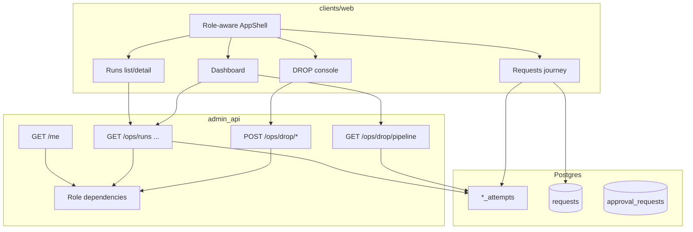

# feat: DROP ops IA — Requests, Runs, Dashboard, roles

**Target repo:** `data-privacy` (Bitbucket `dsts/data-privacy`)

## Goal Capsule

Ship a role-aware ops information architecture for DROP so product operators can answer “where is my DROP?” on **Requests**, while super admins debug **Runs** (job attempts) and mutate via the existing DROP console — without mixing those jobs in one nav.

**Authority:** Session-settled IA decisions (this conversation) + persona review (product ops, super admin, security/privacy/UX) + repo evidence that attempt tables already hold live run history. Intake-spine MVP plan remains separate for worker/spine delivery.

**Stop when:** Role-gated nav works end-to-end against admin-api; Runs list/detail reads live attempt rows; Requests journey answers stage location; Dashboard shows volume/failures/worker pools with time window; DROP console and Runs are invisible and API-forbidden for non–super_admin; no PII in lineage/timeline UI.

---

## Product Contract

### Summary

Redesign the admin web ops surface around Request / Job / Run, Prefect-simple dashboard chrome, and Dagster-style request lineage — with real API role gating. Live run data comes from Postgres `*_attempts` (and related) via admin-api, not from workers. Workers only supply readiness probes for Dashboard/Insights.

### Actors

- A1. Super admin — full Ops DROP tree, Runs, DROP console mutations, stdout/stderr on run detail.
- A2. Admin — Requests product/ops (list, journey, needs attention, matching under request), Dashboard “needs me” view, limited Insights.
- A3. Data owner — collapsed nav: Dashboard + Requests (+ approvals inbox); no Runs, Jobs, Configuration, or DROP console.

### Requirements

- R1. Vocabulary: **Request** = privacy request spine; **Job** = registered step/worker type (catalog); **Run** = one job attempt (attempt table row).
- R2. Runs page lists and details job attempts for super_admin only (ops/debug).
- R3. Requests area is the product/ops “where is my DROP?” surface for admin and data_owner, with journey/lineage and needs-attention.
- R4. Dashboard uses Prefect-style overview: run volume chart, failed/crashed escalation, active worker pools, 8h / 24h / 1w filters (super_admin ops dashboard; admin/data_owner get a simpler “needs me” dashboard).
- R5. Insights replaces any “Health” labeling; worker probes are secondary tiles, not the primary story.
- R6. Incidents and Configuration appear in IA for super_admin but are **shells in v1** (failed Runs filter + docs/links); full SLA engine and editable concurrency APIs are deferred.
- R7. SLAs sit under Requests as a **shell submenu** in v1 (filters like “stale / waiting on review” only — no breach clocks until later).
- R8. Real role gating: admin-api enforces roles; web reads `/me` and filters nav. UI hide alone is insufficient.
- R9. Keep `/ops/drop-pipeline` as the mutation power console; absorb read-only counts into Dashboard / Runs / Insights; gate console to super_admin.
- R10. No tags in v1. Lineage/timeline show ids, statuses, timestamps, counts — never email/phone/name/`consumer_id`.
- R11. Privileged error panel on run detail is super_admin only and redacted (`error_message` / structured fields). True stdout/stderr deferred until persisted.

### Key flows

- F1. Data owner opens Requests → request journey → sees current stage and blocker; approves matching from needs-attention without seeing Runs or console.
- F2. Super admin opens Runs → filters failed → open run detail (timeline / events) → optional deep-link to DROP console with context.
- F3. Super admin opens Dashboard → picks 24h → sees failed escalation and worker pool cards → drills into filtered Runs.

### Acceptance examples

- AE1. A data_owner deep-link to `/ops/drop-pipeline` or `/ops/runs` gets API 403 and no usable nav entry.
- AE2. A super_admin lists Runs and sees rows backed by connector/ingest/matching/hash-index attempt families with timestamp, color-coded state, job, duration, and request id when applicable (null for batch/hash-index runs).
- AE3. Opening a DROP request shows ordered stages (Job labels) with current stage highlighted without opening the power console.
- AE4. Dashboard 24h window shows failed count escalation and at least one active worker-pool card from probes + attempt activity.

### Scope boundaries

**In scope**

- Role model + `/me` + API dependencies for DROP/ops routes
- Role-aware AppShell nav and new routes under a clear Ops/DROP (or equivalent) tree
- Unified Runs list/detail APIs over attempt tables + web UI
- Requests journey / lineage + needs-attention reshaping of matching entry
- Prefect-style Dashboard (ops) + thin Insights
- Jobs catalog page (static/config catalog)
- Shells for Incidents, Configuration, Requests → SLAs
- Gate existing DROP console + strip duplicate “status theater” later if needed

**Out of scope / deferred**

- Full SLA computation product (`app/sla_monitor` wiring, breach clocks)
- Editable scheduling/concurrency Configuration API
- Production-grade Incidents ack/ownership product
- Completing SSE LISTEN/NOTIFY bridge (keep invalidation polling or existing stub)
- Firebase Auth custom claims (use IAP email → role map on admin-api for v1)
- Tags on runs
- Rewriting intake-spine worker delivery (separate plan)

### Deferred to Follow-Up Work

- JWT audience verification for IAP (documented follow-up in auth README)
- OpenAPI-generated TS types for new endpoints
- Web unit/e2e test harness beyond lint/typecheck
- Manual-intake attempt families in Runs beyond DROP-centric first slice

---

## Planning Contract

### Key Technical Decisions

- KTD1. Live Runs source = Postgres attempt tables via admin-api, not worker RPCs. `(session-settled: user-directed — chosen over “shells only”: wire live attempt/run data in this plan; workers remain readiness probes only.)` Worker `/readyz` stays on Dashboard/Insights as pool cards.
- KTD2. Keep `/ops/drop-pipeline` as mutation power console; absorb read models into Dashboard/Runs/Insights. `(session-settled: user-approved — agent default after call-out; chosen over absorbing mutations into Dashboard.)`
- KTD3. Three roles: `super_admin`, `admin`, `data_owner`, mapped from IAP email allowlists/config on admin-api; web consumes `GET /me`. `(session-settled: user-directed — real role gating now; chosen over nav stubs only.)`
- KTD4. Request / Job / Run vocabulary as in Product Contract. `(session-settled: user-directed — chosen over flow=request inverse.)`
- KTD5. Incidents + Configuration + SLA submenu ship as **nav shells** in v1; failed work is reachable via Runs filters; SLA clocks deferred. Persona review overrode building fake-functional products. User intent for escalation preserved as IA placeholders + Dashboard failed escalation.
- KTD6. Privileged run errors: super_admin only + `redact_error_text` (or equivalent). v1 panel = redacted `error_message`; stdout/stderr deferred until stored.
- KTD7. Matching review entry moves toward Requests → Needs attention / request-scoped inbox; keep route compatibility redirects as needed. Matching approve stays available to admin and data_owner — do not blanket-gate the whole `drop_pipeline` router to super_admin.
- KTD8. Visual language: Prefect dashboard density for ops overview; Dagster lineage pattern for request journey graph; existing `taste-*` classes — no new design system.
- KTD9. Dual dashboards: `/` = needs-me for all roles; `/ops/dashboard` = Prefect ops overview for super_admin only.

### High-Level Technical Design



**Role × surface matrix**

| Surface | super_admin | admin | data_owner |
|---------|-------------|-------|------------|
| `/` needs-me Dashboard | yes | yes | yes |
| `/ops/dashboard` ops Dashboard | yes | no | no |
| Requests + journey + needs attention | yes | yes | yes |
| Requests → SLAs (shell) | yes | yes | yes |
| Runs + privileged error panel | yes | no | no |
| Jobs catalog | yes | no | no |
| Insights (thin) | yes | yes | no |
| Incidents shell | yes | no | no |
| Configuration shell | yes | no | no |
| DROP console + `GET /ops/drop/pipeline` | yes | no | no |
| Matching approve / matching-results read | yes | yes | yes |

**IA sketch (nav)**

```
# all roles
/  Dashboard (needs-me: pending matching.review, stale/waiting, link to Needs attention)
Requests
  All requests
  Needs attention
  :id → Overview | Journey (lineage) | Matching
  SLAs (shell)
Matching review → redirect into Needs attention / request

# super_admin adds
Ops / DROP
  Dashboard (ops) → /ops/dashboard
  Runs
  Jobs
  Insights
  Incidents (shell → Runs?status=failed)
  Configuration (shell)
  Console → /ops/drop-pipeline
```

**v1 admin vs data_owner delta:** admin also sees thin Insights; data_owner never sees Insights/Jobs/Runs/console.

### Assumptions

- IAP email is available in deployed environments when `REQUIRE_IAP_IDENTITY` is true; local role override via env allowlist for development.
- Attempt tables already populated by spine workers are sufficient for a DROP-centric Runs v1.
- Persona review findings are adopted where they conflict with building fake Incidents/Config products in v1.

### Alternatives considered

- **Absorb DROP console into Dashboard** — rejected; mutations and observe must stay separate (super-admin persona).
- **UI-only role hiding** — rejected; security persona requires API 403.
- **Incidents as first-class v1 product** — deferred; use Runs `status=failed` + Dashboard escalation until ownership/ack exists.

### Risks

- Role map misconfiguration locks out operators — mitigate with explicit env docs + local override.
- Deep links bypass SPA nav — mitigate with API checks on every new ops route and existing DROP mutations.
- Attempt union query complexity across tables — mitigate with a thin admin-api aggregator and pagination; start DROP-centric.
- PII in error strings — mitigate with redaction and super_admin-only log panels.

---

## Implementation Units

### U1. Role model, `/me`, and API enforcement

**Goal:** Introduce `super_admin` / `admin` / `data_owner` on admin-api with `GET /me` and reusable FastAPI dependencies.

**Requirements:** R8, R9, R11, AE1

**Dependencies:** none

**Files:**
- `libs/habeas-privacy-core/src/habeas_privacy_core/auth/` (extend)
- `app/admin_api/src/admin_api/main.py`
- `app/admin_api/src/admin_api/drop_pipeline.py` (gate mutations to super_admin)
- `app/admin_api/tests/test_roles.py` (new)
- `app/admin_api/tests/test_drop_pipeline.py` (extend IAP/role cases)
- `infra/README.md` or `libs/habeas-privacy-core/src/habeas_privacy_core/auth/README.md` (role env docs)

**Approach:** Map IAP email → role via config/env allowlists (v1). Expose `{ email, role }`. Split DROP authz: spine proxies (`download|land|promote|dispatch|match|fulfill|hash-index-refresh/*`) and `GET /ops/drop/pipeline` → super_admin only; matching-results GET/bulk-approve and approvals approve/reject → super_admin|admin|data_owner. Fail closed when identity required and role missing.

**Patterns to follow:** `require_drop_mutation_actor`, `habeas_privacy_core.auth` email header parsing.

**Test scenarios:**
- Happy: known super_admin email → `/me` returns `super_admin`; spine DROP mutation allowed when IAP required.
- Happy: data_owner email → `/me` returns `data_owner`; spine DROP mutation 403; `GET /ops/drop/pipeline` 403; matching bulk-approve still allowed.
- Happy: super_admin → `GET /ops/drop/pipeline` 200.
- Error: missing IAP header when required → 401/403 consistent with existing DROP gate.
- Edge: unknown email with default deny when identity required.

**Verification:** Role tests pass; DROP mutation tests updated for role matrix.

---

### U2. Role-aware AppShell and route IA shell

**Goal:** Wire nav and route stubs/pages per role matrix; deep links respect `/me`.

**Requirements:** R2–R7, R9, AE1

**Dependencies:** U1

**Files:**
- `clients/web/src/components/AppShell.tsx`
- `clients/web/src/router.tsx`
- `clients/web/src/lib/api.ts` (`getMe`)
- `clients/web/src/lib/auth.tsx` or equivalent session hook (new, small)
- `clients/web/src/routes/ops/` (new route modules as needed)
- `clients/web/AGENTS.md` (ops IA note)

**Approach:** Fetch `/me` once; filter nav per closed role matrix. Keep `/` as needs-me for all roles. Add `/ops/dashboard` (super_admin), Runs, Jobs, Insights, Incidents shell, Configuration shell. Keep `/ops/drop-pipeline` linked only for super_admin. Relocate Matching review entry toward Needs attention (compat redirect OK).

**Patterns to follow:** Existing TanStack Router + AppShell link styling; `taste-*` classes.

**Test scenarios:**
- Happy: mock `/me` as data_owner → Runs/Console links absent.
- Happy: mock `/me` as super_admin → Ops DROP links present.
- Integration: visiting gated route shows forbidden empty state when API 403s.

**Verification:** Manual role switch via mocked `/me` or env; lint/typecheck clean.

**Execution note:** Prefer install/runtime smoke of nav with mocked `/me` over heavy web test infra (none today).

---

### U3. Unified Runs API and list UI

**Goal:** List job attempts across DROP attempt families with filters (job, status, time window, request_id).

**Requirements:** R1, R2, AE2

**Dependencies:** U1, U2

**Files:**
- `app/admin_api/src/admin_api/runs.py` (new) or extend `drop_pipeline.py`
- `app/admin_api/src/admin_api/main.py` (mount)
- `app/admin_api/tests/test_runs.py` (new)
- `clients/web/src/routes/ops/runs.tsx` (new)
- `clients/web/src/lib/api.ts`

**Approach:** Union/aggregator over `drop_connector_attempts`, `drop_ingest_attempts`, `matching_attempts`, `hash_index_refresh_attempts` (+ runs metadata as needed). Normalize to `{ run_id, job, status, request_id, started_at, duration, … }` where `request_id` is null for batch/hash-index families (only matching joins cleanly today). Super_admin only. Web table: timestamp, state color, job, request (or —), duration — no tags. DTO allowlist excludes `gcs_uri`, filenames, and contact fields.

**Patterns to follow:** `collect_pipeline_counts` SQL style; matching-results list pagination patterns; PII-safe projections.

**Test scenarios:**
- Happy: seed attempts → list returns normalized rows with job labels.
- Edge: filter by `status=failed` and `job=matching` returns only matches; connector rows have null `request_id`.
- Error: admin role → 403.
- Integration: response never includes `consumer_id`, raw contact fields, `gcs_uri`, or source/response filenames.

**Verification:** API tests green; Runs page renders against local/dev API.

---

### U4. Run detail — timeline, events, gated logs

**Goal:** Run detail with Dagster/Prefect-inspired timeline and event/log tabs; privileged logs for super_admin.

**Requirements:** R2, R11, AE2

**Dependencies:** U3

**Files:**
- `app/admin_api/src/admin_api/runs.py` (detail endpoint)
- `app/admin_api/tests/test_runs.py`
- `clients/web/src/routes/ops/run-detail.tsx` (new)
- Shared timeline presentational component under `clients/web/src/components/` if reused by U5

**Approach:** Detail by job+attempt id. Construct timeline from attempt timestamps (`attempted_at` / `completed_at`) plus available audit rows — do not invent multi-step history. Events from `admin_audit_log` and/or structured fields where present. Privileged panel = redacted `error_message` for super_admin; no stdout/stderr until persisted. Deep-link affordance to DROP console with query context (no auto-mutate).

**Patterns to follow:** DROP page status coloring; privacy invariants; `redact_error_text` if present.

**Test scenarios:**
- Happy: detail returns status timeline fields for a known attempt.
- Error: data_owner → 403 on detail.
- Edge: missing `error_message` → UI shows empty privileged panel, not crash.
- Integration: detail JSON excludes `gcs_uri` / filename fields.

**Verification:** Detail route loads for seeded attempt; log panel hidden/forbidden for non–super_admin.

---

### U5. Requests journey, lineage, needs attention

**Goal:** Product/ops request detail with stage journey (Dagster lineage feel) and needs-attention queue.

**Requirements:** R3, R7, R10, AE3, F1

**Dependencies:** U1, U2; uses attempt joins similar to U3

**Files:**
- `app/admin_api/src/admin_api/main.py` and/or new `requests_ops.py`
- `app/admin_api/tests/test_request_journey.py` (new)
- `clients/web/src/routes/requests/index.tsx`
- `clients/web/src/routes/requests/$requestId.tsx` (new)
- `clients/web/src/routes/approvals/matching-review.tsx` (entry/redirect)
- `clients/web/src/lib/api.ts`

**Approach:** Derive stage with an explicit ordered table in code/docs: `received` (spine exists) → `download` / `land` / `promote` (latest ingest/connector signals when joinable) → `match` (latest `matching_attempts`) → `review` (pending `matching.review`) → `fulfill`. When multiple attempts exist, use latest non-abandoned per job; default `received` when none. Journey UI: ordered Job labels + status; lineage can start as linear stage rail (Dagster mental model). Needs attention = pending matching.review (+ other human gates). SLAs submenu = shell with stale/waiting filters only.

**Patterns to follow:** Existing requests list; matching-results detail (PII-stripped); taste panels.

**Test scenarios:**
- Happy: request with matching pending → journey shows Match/Review stage waiting.
- Happy: needs-attention includes that request id.
- Integration: journey payload has no PII fields.
- Edge: request with no attempts yet → shows intake/received stage.

**Verification:** AE3 manual path works; API tests for journey shape.

---

### U6. Ops Dashboard, Insights thin tile, Jobs catalog, shells, console gate

**Goal:** Prefect-style ops Dashboard; Jobs catalog; Insights/Incidents/Configuration shells; finalize console gating and absorb read-only messaging.

**Requirements:** R4, R5, R6, R9, AE4, F3

**Dependencies:** U1–U3

**Files:**
- `clients/web/src/routes/index.tsx` and/or `clients/web/src/routes/ops/dashboard.tsx`
- `clients/web/src/routes/ops/jobs.tsx`, `insights.tsx`, `incidents.tsx`, `configuration.tsx` (shells)
- `clients/web/src/routes/ops/drop-pipeline.tsx` (gate + copy: power console; link to Runs)
- Reuse `GET /ops/drop/pipeline` + Runs aggregates
- `app/admin_api/tests/` as needed for any new aggregate fields
- `.agent/modules/frontend-stack.md` or `clients/web/AGENTS.md` (document IA)

**Approach:** `/ops/dashboard` (super_admin): volume from Runs/pipeline counts, failed escalation, worker pool cards from `worker_health`, window toggle 8h/24h/1w (prefer server filter). `/` needs-me (all roles): pending matching.review count, stale/waiting entry, link to Needs attention — no worker pools or run-volume charts. Jobs = static catalog mapping job key → attempt table/worker. Incidents shell points to Runs?status=failed. Configuration shell states infra-owned until API exists. Insights (super_admin + admin): no “Health” label; one real fail-rate or probe tile OK.

**Patterns to follow:** Prefect `cloud-dashboard` density; existing DROP worker health cards; design-taste constraints.

**Test scenarios:**
- Happy: dashboard renders failed count > 0 when failed attempts exist in window.
- Happy: Jobs catalog lists expected DROP jobs and links to filtered Runs.
- Edge: all workers down → pool cards show not-ok without crashing page.
- Test expectation for pure shell pages: none beyond route render smoke — document as shell.

**Verification:** AE4 path; console hidden/403 for non–super_admin; docs updated.

---

## Verification Contract

- `uv run --group dev pytest app/admin_api/tests/test_roles.py app/admin_api/tests/test_runs.py app/admin_api/tests/test_request_journey.py app/admin_api/tests/test_drop_pipeline.py`
- `cd clients/web && bun run lint && bun run build`
- Manual: three role identities (or mocks) against nav matrix + AE1–AE4
- Privacy spot-check: journey and Runs JSON contain no `consumer_id` / contact fields

## Definition of Done

- Product Contract R1–R11 satisfied at v1 depth (shells explicitly marked where deferred)
- U1–U6 landed with cited tests/smoke
- Persona constraints preserved: data_owner never sees Runs/console; lineage PII-safe; logs super_admin-only
- DROP power console remains the only DROP mutation UI
- Plan vocabulary used in UI copy (Request / Job / Run)

## Appendix

### Persona review (2026-07-17)

- Product ops: Requests → journey spine; hide Runs/Config/console; SLA clocks premature — adopted as shell + stale filters.
- Super admin: Dashboard + Runs live; Jobs/Insights shell; Incidents/Config defer as products; console sibling — adopted.
- Security/privacy/UX: conditional approve; API 403 required; collapsed data_owner nav; stdout/stderr privileged — adopted as KTD3/KTD6.

### Why not “from workers”

Workers expose `/readyz` and accept mutation proxies. Durable attempt history already lives in Postgres (`drop_*_attempts`, `matching_attempts`, `hash_index_refresh_attempts`). The UI should read that history through admin-api so Runs survive worker restarts and stay mutation-safe.

### Inspiration refs (local temp, not in repo)

Screenshots previously collected under host temp `pipeline-ui-inspiration/` (Prefect dashboards, Dagster Runs/lineage). Not committed.
