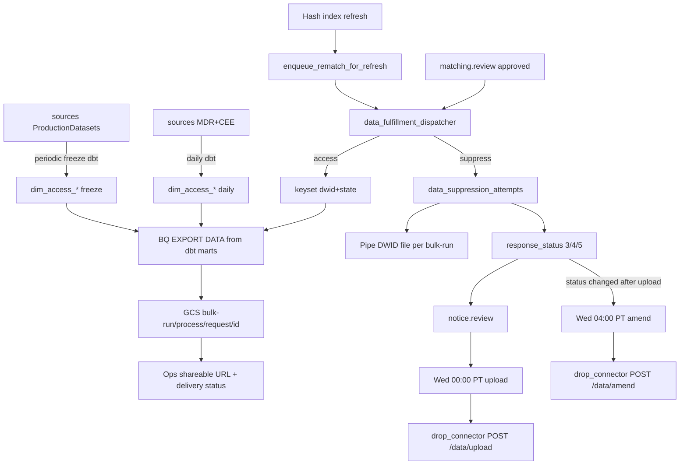

## Goal Capsule

Ship data-vertical **fulfillment** that, after `matching.review`, produces **access** reproduction artifacts (BigQuery → GCS under `bulk-run/{process_id}/request/{request_id}/`) and **suppression** artifacts (pipe-delimited DWID list per bulk run + DROP `response_status`), with an internal suppression attempts queue. Post-fulfillment: (1) access — ops UI **shareable URL** for paste into an email drafted outside the platform, plus UI to update **delivery status**; (2) DROP — `POST /data/upload` (Wed 00:00 PT) and `POST /data/amend` (Wed 04:00 PT) per live DROP Specs v1.2.0, where amendments are driven by **hash-index refresh rematch** changing previously uploaded statuses.

**Authority:** this plan > ADR-38 Friday EOD cadence (user override to Wednesday) > ADR-27 Vertica export (user override to BQ) > intake-spine U9 stub. DROP HTTP contract: KB [[131-CPPA-DROP-Technical-Specs-OpenAPI-v1.2.0]].

**Stop when:** Definition of Done below is met; do not expand into live Tier-C suppression connectors, platform-sent access email, or Vertica live queries.

---

## Product Contract

### Summary

Operators fulfill approved matches into GCS artifacts (access pack or bulk DWID suppression file), copy a shareable access URL from ops UI into their own email, record access delivery status in UI, and run scheduled DROP upload/amend — with amendments fed by hash-refresh rematch of open requests.

### Problem Frame

Today `data_fulfillment_dispatcher` only maps `match_count` → `drop_raw_requests.response_status`. Legal/ops still need: (1) access reproduction from BQ (Vertica already copied), (2) suppression DWID list + queue, (3) shareable handoff URL + delivery status in UI (no platform mailer), (4) DROP upload/amend on Wednesday cadence, with late matches after hash refresh becoming amends.

### Requirements

- R1. After approved `matching.review`, fulfillment routes by request type: **access** → reproduction; **delete/opt_out** → suppression; combined types run both.
- R2. Access reproduction queries BigQuery in `example-gcp-project` using privacy-install table/column names (data vertical only), for matched DWID(s) + state. **BQ is not a full copy of the install script today** — export the present allowlist; missing tables are deferred (see Sources BQ coverage).
- R3. Access artifacts land under `gs://{bucket}/bulk-run/{process_id}/request/{request_id}/`; ops UI exposes a **shareable URL** (role-gated) for copy/paste into an email the operator drafts **outside** the platform.
- R4. Suppression writes a **bulk** pipe-delimited DWID file under the bulk-run prefix **and** sets DROP `response_status` (0→5, 1→3, N>1→4).
- R5. Suppression uses an internal **attempts queue table** with reaper registration.
- R6. Access delivery: **no outbound email from the platform**. UI lets the operator copy the shareable URL and **update delivery status** (ledger: pending / delivered / failed / recalled — ADR-28 MVP shape).
- R7. DROP upload Wed 00:00 America/Los_Angeles → `POST /data/upload` per DROP Specs **v1.2.0**: multipart `files`, `Id,Status`, filename pattern with optional ≤10-char suffix; success **HTTP 202**.
- R8. DROP amend Wed 04:00 America/Los_Angeles → `POST /data/amend` for Ids whose status changed **after** a prior accepted upload. Primary driver: **hash-index refresh rematch** on open (and reopened status-4) requests that later match and fulfill to a new `response_status`.
- R9. No PII/DWIDs/hashes in logs, audit JSONB, or generic journey list payloads.
- R10. Mutations through `admin_api` (IAP) only.

### Key Flows

- F1. DROP delete: match → `matching.review` → fulfill (status + DWID file) → `notice.review` → Wed upload.
- F2. Access: match → `matching.review` → BQ export → GCS → UI shareable URL → operator emails externally → UI updates delivery status.
- F3. Hash refresh → rematch open requests → fulfill may change status → if Id already uploaded → Wed amend with new filename suffix.

### Acceptance Examples

- AE1. Single-match DROP: `response_status=3`, suppression attempt success, pipe file has DWID.
- AE2. Multi-match DROP: `response_status=4`, pipe file has all fulfill-time DWIDs.
- AE3. Access: GCS pack written; UI shows copyable shareable URL; operator sets delivery status to `delivered` without any platform SMTP send.
- AE4. Wed upload posts Id,Status CSV; ledger in `drop_response_submissions`; HTTP 202.
- AE5. After hash refresh, previously uploaded Not-found (5) rematches to Deleted (3) → Wed amend includes that Id with new suffix.

### Scope Boundaries

**In**

- BQ access export for tables/columns present in `example-gcp-project` (privacy-install mapped)
- Suppression DWID file + `response_status` + attempts queue
- Real GCS client; shareable URL + delivery-status UI (no mailer)
- Restore/extend `drop_notice_dispatcher`; Wed upload + amend schedulers
- Rematch→amend eligibility after hash-index refresh

**Out**

- Platform-sent access email / contact-attempt sender worker
- Live Vertica queries (use BQ copy only)
- Full privacy-install table parity until missing BQ tables are loaded
- Live Tier-C suppression connectors
- Production DROP cutover beyond sandbox guards

### Deferred to Follow-Up Work

- Load missing BQ sources then dbt-model into `access_export` for full privacy-install parity (CEE_*, analytics_cyclic/frozen/retired or hub models, ProductionDatasets freezes)
- New dbt project `transform/access_export/` (daily vs freeze selectors + Scheduler)
- Per-vertical Tier-C fulfillment dispatchers
- ADR-28 automated consumer delivery
- Auto-pass thresholds for review gates

---

## Planning Contract

### Assumptions

- A1. Scheduler timezone is **America/Los_Angeles**.
- A2. (session-settled: user-directed — chosen over platform email send) Access handoff is **shareable URL + delivery-status UI only**; operator drafts email outside the platform.
- A3. `notice.review` remains required before DROP upload (ADR-37); restore notice dispatcher from commit `1892ac4`.
- A4. (session-settled: user-directed) Access extraction is **BigQuery only** (Vertica→BQ copy). Privacy-install script is the table/column checklist; **full parity is not available in BQ today** — MVP uses present tables (see Sources).
- A5b. (session-settled: user-directed) Hash-index refresh rematch of open requests is the primary feed for **amend** eligibility when status changes after a prior upload.
- A5. Multi-DWID lists are obtained by **re-querying BigQuery at fulfill time** (same hash + state as match) — not by storing DWIDs in `matching_results` or audit JSON.
- A6. Suppression pipe file grain is **one file per bulk-run process_id** (download attempt id); access remains nested per request under that process.
- A7. Fulfillment is “done” only when the suppression/access attempt reaches terminal `success` **and** required side effects (`response_status` / GCS URI) are written — not on status alone.

### Key Technical Decisions

| ID | Decision |
|----|----------|
| KTD-1 | (session-settled: user-directed — chosen over live Vertica) Access reproduction uses **BigQuery** (`example-gcp-project`) mapped from the privacy install script. Full script parity is **not** in BQ yet — MVP allowlist only. |
| KTD-2 | (session-settled: user-directed) Access GCS layout: `bulk-run/{process_id}/request/{request_id}/…`; suppression: **bulk** pipe-delimited DWID list under `bulk-run/{process_id}/suppression/`. |
| KTD-3 | (session-settled: user-directed — chosen over file-only) Keep DROP `response_status` mapping **and** write suppression DWID file; add fulfillment attempts queue + reaper. |
| KTD-4 | (session-settled: user-directed — chosen over ADR-38 Friday EOD) DROP upload Wed 00:00 PT; amend Wed 04:00 PT per DROP Specs **v1.2.0** (KB archive). |
| KTD-11 | (session-settled: user-directed — chosen over platform SMTP) Access delivery = shareable URL in UI + delivery-status updates in UI; no outbound email worker. |
| KTD-12 | (session-settled: user-directed) After hash-index refresh, rematch open requests; when fulfill changes a previously uploaded DROP status, enqueue for **`/data/amend`** (Wednesday amend job). |
| KTD-5 | Restore `request_type` on thin `requests` spine (or equivalent resolver-visible column on raw tables) so access vs delete routing and `approval_rules` `request_type_eq` work again. |
| KTD-6 | Extend `data_fulfillment_dispatcher` for access + suppression orchestration; DROP upload/amend stay on `drop_connector` invoked by restored `drop_notice_dispatcher` (+ amend path). |
| KTD-7 | Real GCS via `habeas_privacy_core.adapters.gcs` (replace stub for production path); dedicated fulfillment bucket, separate from DROP intake. |
| KTD-8 | Ops copy-paste uses allowlisted `fulfillment_artifact_uri` on a **role-gated fulfillment detail** endpoint — never put intake `gcs_uri` into journey list DTOs (`_FORBIDDEN_RESPONSE_KEYS`). |
| KTD-9 | Upload eligibility is **per-request / per drop_record_id submission**, not “filename already uploaded once” (fixes `1892ac4` lockout for stragglers); deltas after first upload go to amend. |
| KTD-10 | Auto-open pending `notice.review` after successful DROP suppression fulfill; admin approve syncs `approval_requests` and `drop_raw_requests.notice_review_status`. |
| KTD-13 | (session-settled: user-directed) Maintain access-export source tables via **dbt dimensional models** in `example-gcp-project` (separate from `transform/drop_hash`). **Daily** refresh for MDR + CEE dims; **periodic freeze** refresh for ProductionDatasets snaps. Fulfillment `EXPORT DATA` reads **dbt marts** (clustered `(state, dwid)`), not raw Vertica mirrors or hub views directly. |

### High-Level Technical Design

**Access dbt layer (KTD-13) — proposed layout**

New project: `transform/access_export/` (sibling of `drop_hash`; do not fold into hash-index dbt).

| Layer | Dataset (suggested) | Cadence | Contents |
|-------|---------------------|---------|----------|
| `sources` | external / hub / `person_db` / `production_datasets` | n/a | `sources.yml` pointing at granted tables |
| `staging` | `access_export_stg` | inherits | Thin rename/type casts; no business logic |
| `intermediate` | `access_export_int` | inherits | Optional column selects matching privacy-install allowlists |
| `marts` (dims) | `access_export` | **split by tag** | One dim (or narrow fact) per install table grain |

**Cadence tags / selectors**

- `tag:daily` — MDR + CEE: `person`, `vote_history`, `district`, `phones`, `ballots`, `analytics_*` / models, all `cee_*` / `CEE_*`. Schedule: Cloud Scheduler → `dbt build --select tag:daily` after upstream MDR/CEE land.
- `tag:freeze` — ProductionDatasets snaps: `occupation`, `AVEV_ROLLUP_2024_11_05` (versioned), `applicant_typecodes_2022`. Schedule: on-demand / when Legal publishes a new freeze; models are **incremental append or table swap** with `freeze_version` / `as_of_date` column so historical access packs stay reproducible.

**Mart invariants (compute)**

- Grain: `(dwid, state)` where the Vertica source is person-keyed; ballots/AVEV may be multi-row per dwid (keep as-is).
- Cluster BigQuery tables on `(state, dwid)` so per-request `EXPORT DATA` prunes.
- Persist `dbt_updated_at` (and for freezes `freeze_id`) on every mart for manifest provenance.
- Fulfillment never scans raw sources once marts exist — only `access_export.*` (+ allowlist).

**BQ access table map (privacy install → `example-gcp-project`, probed 2026-07-21; updated 2026-07-22):**

Verdict: **not full script parity in raw datasets yet**. Core MDR tables for person/vote/district/phones/ballots are present; CEE_* and analytics_cyclic family are expected via hub / future grants then **dbt-modeled** into `access_export`. ProductionDatasets freezes load periodically into marts.

| Privacy install source | Raw BQ today | dbt mart target | Notes |
|------------------------|--------------|-----------------|-------|
| `person_db.person` | `person_db.person` | `access_export.dim_person` | daily |
| `person_db.vote_history` | present | `access_export.dim_vote_history` | daily |
| `person_db.district` | present | `access_export.dim_district` | daily |
| `person_db.phones` | present | `access_export.dim_phones` | daily |
| `person_db.ballots` | present | `access_export.fct_ballots` | daily; multi-row |
| `person_db.analytics_*` / models | continuous + hub `models` view | `access_export.dim_models` | daily; prefer hub columns once IAM works |
| `person_db.cee_*` / `CEE_*` | not listed in dpra | `access_export.dim_cee_*` | daily after source grant |
| `ProductionDatasets.occupation` | loading / partial | `access_export.dim_occupation` | freeze |
| `ProductionDatasets.AVEV_ROLLUP_2024_11_05` | pending | `access_export.fct_avev` | freeze; pin rollup version in name/meta |
| `ProductionDatasets.applicant_typecodes_2022` | `production_datasets.applicant_typecodes_2022` | `access_export.dim_applicant_typecodes` | freeze |

Dataset note: BigQuery uses snake_case `production_datasets` (not `ProductionDatasets`).

### Alternative Approaches Considered

| Approach | Why not |
|----------|---------|
| Persist all DWIDs on `matching_results` | Conflicts with privacy invariants / audit redaction; rematch drift harder |
| Vertica export worker (ADR-27) as-is | User directed BQ data vertical for this slice |
| Single weekly Friday upload only (ADR-38) | User directed Wed upload + separate Wed amend |
| Scan terminal requests for upload (ADR-10 rejected) | Breaks queue-as-table; use attempt rows + ledger |

### Risks & Dependencies

| Risk | Mitigation |
|------|------------|
| Incomplete BQ table parity vs privacy install | Explicit MVP table allowlist; manifest lists included/excluded |
| Multi-DWID re-query cost / drift | Tie attempt to matching_results id; same state filter as match |
| PII in ops UI | Role-gated URI field; never journey list |
| `1892ac4` filename upload lockout | KTD-9 per-record submission check |
| GCS stub today | U2 must land before access/suppress artifact units |
| Branch drift: notice dispatcher missing on `feat/drop-ops-followup` | Cherry-pick/restore from `1892ac4` or `agent/drop-notice-weekly` |
| Operator forgets to update delivery status | UI shows pending delivery until status set; no silent “sent” assumption |
| Rematch after hash refresh / CPPA upload | `enqueue_rematch_for_refresh` → fulfill → status delta → amend eligibility; Wed 04:00 amend |
| `drop_connector` still coded against older OpenAPI (200 vs **202**, missing 409) | U6/U7 must align connector client/tests to live v1.2.0 before schedulers go live |
| Implementing from May 2026 ADR/OpenAPI 1.0.0 copies | Prefer `tmp/drop-docs-live/databroker_api.yaml` + privacy.ca.gov pages; re-pull if docs bump past 1.2.0 |

### System-Wide Impact

| Surface | Impact |
|---------|--------|
| Postgres | New fulfillment attempt table(s); restore `request_type`; reaper registry |
| BigQuery | Read-only queries from fulfillment worker SA (MDR + production_datasets) |
| GCS | New fulfillment bucket/prefix IAM; real Storage client in core |
| Cloud Scheduler | Two new jobs (Wed 00:00 / 04:00 America/Los_Angeles) calling notice dispatcher |
| `drop_connector` | Unchanged HTTP contract; more frequent scheduled callers |
| Ops UI / journey | Shareable access URL + delivery-status control; notice stage blockers |
| Privacy / audit | URI allowlisted only on gated endpoint; DWIDs never in audit JSON |
| Sibling branch | Notice dispatcher restore may conflict with current `drop_pipeline` schedule helpers — rebase carefully |

### Open Questions

| ID | Question | Status |
|----|----------|--------|
| OQ-1 | Exact pipe-file format for multi-field future (MVP locked: single-line `dwid1\|dwid2\|…`) | Deferred — revisit if downstream tools need TSV |
| OQ-2 | Fulfillment bucket name / CMEK ownership with infra | Deferred to implementer + Chris; not product-blocking |
| OQ-3 | ~~Email provider~~ | Closed — no platform email; shareable URL + delivery-status UI (KTD-11) |
| OQ-5 | Shareable URL shape: long-lived `gs://` console deep-link vs time-limited signed HTTPS URL | Deferred to implementer + Legal (default: role-gated API returns copyable HTTPS signed URL with documented TTL + `gs://` for internal ops) |
| OQ-4 | Whether combined `request_type` values need a dedicated enum vs dual dispatch flags | Deferred — default ADR-32 vocabulary (`delete` / `access` / `opt_out`) |

---

## Implementation Units

### U1. Spine + queue schema for fulfillment routing

**Goal:** Restore request-type routing and add suppression/access artifact attempt tables with reaper registration.

**Requirements:** R1, R5, R9, KTD-3, KTD-5

**Dependencies:** None

**Files:**
- `db/migrations/` (new `core_` / `matching_` / `fulfillment_` scoped migration)
- `libs/habeas-privacy-core/src/habeas_privacy_core/queue/constants.py`
- `app/reaper/src/reaper/config.py`
- `libs/habeas-privacy-core/src/habeas_privacy_core/db/request_resolver.py` (expose `request_type`)
- `libs/habeas-privacy-core/tests/test_migrations.py`
- `app/admin_api/src/admin_api/main.py` (persist `request_type` on manual create)

**Approach:**
- Re-add `request_type` to `requests` (values aligned with ADR-32: `delete`, `access`, `opt_out`, and any combined convention already used in approval conditions).
- Add `data_suppression_attempts` (queue-as-table: claim/lease/status/step=`suppression`, FK `request_id`, optional `matching_result_id`, `bulk_process_id`, `gcs_uri`, counts only in audit).
- Add `data_access_export_attempts` (or unified `data_fulfillment_attempts` with `step IN ('suppression','reproduction')` — prefer **one table with step** if that matches DROP connector pattern; otherwise two tables. Default: **one `data_fulfillment_attempts` table with `step`**).
- Register in reaper; extend `_WORKER_QUEUE_TABLES` for `data_fulfillment`.

**Patterns to follow:** `db/migrations/20260714000005_matching_create_matching_attempts.sql`, `20260528000001_core_queue_primitives.sql`

**Test scenarios:**
- Happy: insert pending fulfillment attempt for delete request; claim succeeds; terminal update immutable.
- Edge: access request_type routes without requiring `drop_raw_requests.response_status`.
- Error: terminal row mutation rejected by trigger.
- Integration: reaper config lists new table; migration test asserts columns/indexes.

**Verification:** Migration tests green; reaper registry includes new table; manual create persists `request_type`.

---

### U2. Real GCS adapter and fulfillment path convention

**Goal:** Production-capable GCS read/write for fulfillment artifacts with documented path layout.

**Requirements:** R3, R4, KTD-2, KTD-7

**Dependencies:** None (can parallel U1)

**Files:**
- `libs/habeas-privacy-core/src/habeas_privacy_core/adapters/gcs.py`
- `libs/habeas-privacy-core/pyproject.toml` (add `google-cloud-storage` if required)
- `libs/habeas-privacy-core/tests/` (GCS transport tests — stub transport remains for unit tests)
- Worker settings / Cloud Build env for fulfillment bucket name

**Approach:**
- Implement Storage client behind existing `GcsTransport` protocol; keep in-memory transport for tests.
- Path helpers: `bulk-run/{process_id}/request/{request_id}/{filename}` and `bulk-run/{process_id}/suppression/dwids_{date}.txt` (pipe-delimited).
- Bucket separate from DROP intake; CMEK/lifecycle deferred to infra follow-up note if not already provisioned.

**Execution note:** Prefer runtime smoke with fake transport unit tests first; live GCS smoke only when credentials available.

**Test scenarios:**
- Happy: write_object returns `gs://bucket/path`; read_object round-trips bytes.
- Edge: missing object raises FileNotFoundError.
- Error: transport failure surfaces without logging object body/PII.

**Verification:** Unit tests pass with fake transport; path helper unit coverage for both layouts.

---

### U3. Access reproduction from BigQuery

**Goal:** Export requester data from available MDR/BQ tables into the per-request GCS prefix.

**Requirements:** R2, R3, AE3, KTD-1, A4

**Dependencies:** U1, U2

**Files:**
- `app/data_fulfillment_dispatcher/src/data_fulfillment_dispatcher/` (new `access_export.py` or similar)
- `app/matching/src/matching/bq_lookup.py` (pattern reference; do not couple)
- `app/data_fulfillment_dispatcher/tests/`
- Privacy install script as external mapping reference (not committed unless user asks)

**Approach:**
- Maintain install-mapped dims/facts in dbt project `transform/access_export/` (KTD-13): daily MDR+CEE vs periodic ProductionDatasets freezes.
- Resolve matched DWID(s) via fulfill-time BQ re-query (hash+state) or single `consumer_id` when match_count=1.
- One BQ `EXPORT DATA` job: join allowlisted **`access_export` marts** to the request keyset; write one object per slice under the request GCS prefix + `manifest.json` (`dbt_updated_at` / `freeze_id`, row counts, generated_at — no raw PII in logs).
- Claim/complete `data_fulfillment_attempts` step=`reproduction`.
- `process_id` = journey bulk process id (DROP download attempt id) when intake is DROP; for manual access without bulk process, use `manual/{request_id}` prefix convention documented in settings.

**Patterns to follow:** `app/matching/src/matching/bq_lookup.py` (parameterized SQL, redacted errors); `transform/drop_hash/` (dbt project layout, profiles, no PII in tests)

**Test scenarios:**
- Happy: mocked BQ returns person+phones rows → objects written under request prefix; attempt success.
- Edge: no match / zero DWIDs → attempt outcome_error or abandoned with reason; no partial silent success.
- Edge: missing optional table skipped and listed in manifest `excluded`.
- Error: BQ failure retries per attempt policy; no PII in exception logs.
- Integration: matching.review gate still required before export runs.

**Verification:** Dispatcher tests cover allowlist + manifest; no DWIDs in logged extras.

---

### U4. Suppression fulfill — response_status + DWID pipe file + queue

**Goal:** Replace stub-only fulfill with queued suppression that writes bulk DWID file and CPPA status.

**Requirements:** R4, R5, AE1, AE2, KTD-3, A5, A6, A7

**Dependencies:** U1, U2

**Files:**
- `app/data_fulfillment_dispatcher/src/data_fulfillment_dispatcher/fulfill.py`
- `app/data_fulfillment_dispatcher/AGENTS.md` / `README.md`
- `app/data_fulfillment_dispatcher/tests/test_fulfill.py`
- `libs/habeas-privacy-core/src/habeas_privacy_core/db/` (enqueue helpers)
- `app/admin_api/src/admin_api/drop_pipeline.py` (fulfill proxy / ready counts)

**Approach:**
- Keep existing status mapping and stale-approval gate.
- On ready DROP delete/opt_out: enqueue fulfillment attempt; worker claims → re-query DWIDs → write/replace pipe file for `bulk_process_id` → set `response_status` → mark attempt success.
- **Pipe file format (MVP):** single object `bulk-run/{process_id}/suppression/dwids.txt` whose entire body is `dwid1|dwid2|dwid3` (no header, no trailing newline required). Rewrite the whole file on each successful suppression for that bulk run (idempotent replace, not append-without-dedupe).
- After success: ensure pending `notice.review` (restore behavior from `1892ac4`).
- Rematch: supersede prior suppression GCS object pointer; reopen status-4 per existing rematch rules.

**Execution note:** Extend existing T9 tests before changing fulfill behavior (characterization), then add queue + GCS cases.

**Test scenarios:**
- Happy: match_count 1 → status 3 + file contains that DWID + attempt success + notice.review pending.
- Happy: match_count 3 → status 4 + file contains three DWIDs from re-query.
- Happy: match_count 0 → status 5 + empty/absent DWID file policy documented (no file or empty file — **default: no DWID file, attempt success with reason not_found**).
- Edge: rematch after fulfill invalidates stale approval; new fulfill rewrites status from latest count.
- Error: GCS write fails → attempt not success; `response_status` remains unset (A7).
- Integration: AST/import guard still blocks Tier-C HTTP from this package.

**Verification:** `uv run --group dev pytest app/data_fulfillment_dispatcher -q` green; AGENTS.md updated (queue exists).

---

### U5. Ops UI — shareable access URL + delivery status

**Goal:** Operators copy a shareable access URL into an email they draft outside the platform, and update access delivery status in the UI. Suppression artifact URI remains copyable for internal ops.

**Requirements:** R3, R6, R10, KTD-8, KTD-11, AE3

**Dependencies:** U3, U4

**Files:**
- `app/admin_api/src/admin_api/drop_pipeline.py` (or request detail fulfillment panel)
- `app/admin_api/src/admin_api/request_journey.py` (delivery/notice stage blockers without forbidden keys)
- `app/admin_api/tests/test_drop_pipeline.py`
- `app/admin_api/tests/test_request_journey.py`
- `clients/web/src/lib/api.ts`
- `clients/web/src/routes/ops/drop-pipeline.tsx` (fulfillment tab) and/or request triage surface
- `clients/web/src/routes/ops/run-detail.tsx` (clipboard pattern reference)
- Migration/API for delivery status if not covered by U1/`communication_attempts`

**Approach:**
- Role-gated fields: `fulfillment_artifact_uri` / shareable URL (+ kind access|suppression); for access also `access_delivery_status`.
- UI: Copy shareable URL control (clipboard); delivery-status control (`pending` → `delivered` / `failed` / `recalled`) via admin_api mutation — **no send-email action**.
- Journey list/detail: delivery/notice **blocker labels** only; URLs only on gated fulfillment panel.
- Persist status updates in ledger (`communication_attempts` purpose `access_delivery` with method `manual` / notes, or thin delivery_status column — prefer existing table).

**Patterns to follow:** `clients/web/src/routes/ops/run-detail.tsx` clipboard; `request_journey.py` forbidden keys

**Test scenarios:**
- Happy: access fulfill → shareable URL returned → UI copy works; PATCH delivery status to `delivered`.
- Edge: unauthorized role → 403 / field omitted.
- Edge: suppression kind shows internal artifact URI; no delivery-status control required.
- Error: journey payload fails closed if `gcs_uri` / signed URL leaked into forbidden keys.
- Integration: fulfillment tab shows ready/attempt counts including queue.

**Verification:** Admin API tests + manual UI check on fulfillment tab.

---

### U6. Notice lane restore + Wednesday upload scheduler

**Goal:** Restore `drop_notice_dispatcher`, fix straggler eligibility, schedule Wed 00:00 PT upload.

**Requirements:** R7, AE4, KTD-4, KTD-9, KTD-10, A3

**Dependencies:** U4

**Files:**
- Restore `app/drop_notice_dispatcher/**` from `1892ac4` / `agent/drop-notice-weekly`
- `app/drop_notice_dispatcher/src/drop_notice_dispatcher/batch.py` (eligibility fix)
- `app/admin_api/` notice.review approve sync for `notice_review_status`
- `infra/` Cloud Scheduler job (America/Los_Angeles `0 0 * * 3`)
- `app/drop_connector/` (already has upload — reuse)
- Tests under `app/drop_notice_dispatcher/tests/`

**Approach:**
- Cherry-pick/restore package onto current branch; rebase against current fulfill/match_count gates.
- Authority for HTTP contract: live OpenAPI **1.2.0** (`tmp/drop-docs-live/databroker_api.yaml`) + privacy.ca.gov technical-specifications pages (scraped 2026-07-21).
- Change “already uploaded filename” skip to per-`drop_record_id` submission check; group CSV still by `source_csv_filename`.
- Filename: use downloaded base name; if that name was already accepted for the current download run, append `_` + ≤10 alphanumeric suffix (docs: duplicate → “Use a unique suffix”). Partial uploads allowed until outstanding Ids for the download are covered.
- Accept **HTTP 202** as success for upload (v1.2.0); handle **409** (“no active download waiting”) as non-retriable until a new download cycle.
- Write `drop_response_submissions` on accepted files; record rejected fileName/message without PII beyond Id/status codes.
- Ops schedule label/next-run fields analogous to download schedule.

**Test scenarios:**
- Happy: notice-approved rows → Id,Status CSV → connector upload returns 202 → ledger written.
- Edge: same source filename already used → retry with unique suffix ≤10 chars.
- Edge: same source filename, subset previously uploaded → only new Ids included (or amend path — see U7).
- Error: connector 400 / all files rejected → no ledger success; retry policy documented.
- Error: 409 no active download → attempt outcome_error with reason; do not hammer retry.
- Integration: sandbox URL guard still enforced by connector; assert against fixtures derived from live OpenAPI examples.

**Verification:** Notice dispatcher tests + connector upload tests green; scheduler job defined.

---

### U7. Wednesday amend/corrections path (hash-refresh rematch)

**Goal:** Scheduled corrections via `POST /data/amend` with new file suffix, fed primarily by hash-index refresh rematch of open requests that later match and change uploaded status.

**Requirements:** R8, AE5, KTD-4, KTD-12

**Dependencies:** U6; existing `enqueue_rematch_for_refresh` (`libs/.../db/rematch.py`)

**Files:**
- `app/drop_notice_dispatcher/` (amend batch endpoint) or thin amend enqueuer + connector `/amend`
- `app/drop_connector/src/drop_connector/upload.py` (`apply_file_suffix`, `run_amend`)
- `libs/habeas-privacy-core/src/habeas_privacy_core/db/rematch.py` (already enqueues open + status-4 reopen — wire fulfill → amend eligibility after status change)
- `infra/` Cloud Scheduler `0 4 * * 3` America/Los_Angeles
- Tests for rematch→status-delta→amend eligibility + suffix

**Approach:**
- When hash files refresh: rematch open (and reopened status-4) DROP requests via existing rematch path → re-fulfill may update `response_status`.
- Eligible amend rows: previously uploaded `drop_record_id` whose current `response_status` differs from last ledger status (or explicit `amend_required`).
- Call `POST /data/amend` (v1.2.0: same multipart as upload). New allowed filename suffix when base name already used.
- Treat **HTTP 202** as accept-queued; separate scheduler (04:00 PT).

**Patterns to follow:** `app/drop_connector/tests/test_client_upload.py`; `libs/.../tests/test_hash_index_refresh.py`; live examples in `tmp/drop-docs-live/api-operations.md`

**Test scenarios:**
- Happy: after hash refresh rematch, uploaded Not-found (5) → Deleted (3) → amend batch includes Id; unique suffix; 202.
- Edge: rematch finds no status change → not amend-eligible.
- Edge: no corrections → amend run no-ops cleanly.
- Error: rejectedCount > 0 / 400 → attempt outcome_error; row remains amend-eligible.
- Integration: upload and amend schedules do not share claim rows incorrectly.

**Verification:** Amend unit tests + rematch eligibility tests + scheduler config present.

---

### U8. Access delivery status ledger (no mailer)

**Goal:** After successful access export, initialize delivery as pending; ops update status in UI after they paste the shareable URL into an external email.

**Requirements:** R6, AE3, A2, KTD-11

**Dependencies:** U3, U5

**Files:**
- Prefer extend `communication_attempts` (or U1 fulfillment delivery fields) — no new SMTP adapter
- `app/admin_api/` PATCH for delivery status
- Tests for status transitions; assert no email send path

**Approach:**
- On reproduction success: ledger row `purpose=access_delivery`, status `pending` (method `manual` / external).
- Operator copies shareable URL (U5), drafts email outside platform, then sets status to `delivered` / `failed` / `recalled` via UI.
- **Do not** add SendGrid/SMTP workers in this plan.

**Test scenarios:**
- Happy: export success → pending ledger; PATCH → `delivered`.
- Edge: status update without prior export → 404/409.
- Error: invalid transition rejected; export attempt remains success.

**Verification:** Admin API tests; no outbound email client in fulfillment/admin packages for this path.

---

## Verification Contract

| Gate | Command / check |
|------|-----------------|
| Fulfillment | `uv run --group dev pytest app/data_fulfillment_dispatcher -q` |
| DROP connector upload/amend | `uv run --group dev pytest app/drop_connector -q` |
| Notice/amend dispatcher | `uv run --group dev pytest app/drop_notice_dispatcher -q` |
| Admin ops + journey | `uv run --group dev pytest app/admin_api/tests/test_drop_pipeline.py app/admin_api/tests/test_request_journey.py -q` |
| Core queue/migrations | `uv run --group dev pytest libs/habeas-privacy-core/tests/test_migrations.py libs/habeas-privacy-core/tests/test_queue_integration.py -q` |
| Privacy | Journey/list fixtures assert no `gcs_uri` / DWIDs / hashes in forbidden payloads |
| E2E (when sandbox creds) | DROP: match → review → fulfill → notice.review → upload; rematch after refresh → amend. Access: fulfill → shareable URL → delivery status update |

---

## Definition of Done

- [ ] Access export writes allowlisted BQ tables to nested GCS prefix; ops can copy shareable URL
- [ ] Access delivery status updatable in UI (`pending` / `delivered` / `failed` / `recalled`); no platform email send
- [ ] Suppression writes bulk pipe-delimited DWID file + `response_status` + queue/reaper wired
- [ ] `request_type` routing works for access vs delete
- [ ] `drop_notice_dispatcher` restored; Wed 00:00 PT upload and Wed 04:00 PT amend scheduled (America/Los_Angeles)
- [ ] Upload filenames match CPPA/`source_csv_filename` rules; amend uses new suffix
- [ ] Hash-refresh rematch → status change after upload enqueues amend eligibility
- [ ] Manifest documents BQ included vs deferred vs privacy install
- [ ] Verification Contract gates green; AGENTS.md for fulfillment/notice updated
- [ ] No Tier-C live suppression; no Vertica path; no access mailer

---

## Sources & Research

### Repo

- `app/data_fulfillment_dispatcher/` (stub baseline)
- `app/drop_connector/src/drop_connector/upload.py` (upload/amend + `apply_file_suffix`)
- `app/matching/src/matching/bq_lookup.py`, `adapters/drop_hash.py`
- `app/admin_api/src/admin_api/drop_pipeline.py`, `request_journey.py`
- `libs/habeas-privacy-core/src/habeas_privacy_core/adapters/gcs.py` (stub)
- Commit `1892ac4` / branch `agent/drop-notice-weekly` (notice dispatcher to restore)
- `docs/plans/2026-07-16-001-feat-intake-spine-mvp-plan.md` (U9/U10)

### Knowledge base (architecture — secondary to live DROP docs)

- ADR-32, ADR-36 (fulfillment dispatch)
- ADR-10, ADR-19, ADR-38 (historical; **Friday cadence and older OpenAPI 1.0.0 paraphrases superseded** by live v1.2.0 + KTD-4 Wednesday schedules)
- ADR-27, ADR-28 (access export/delivery — BQ pivot; this plan uses shareable URL + manual delivery status, not ADR-28 automated email)
- ADR-37 (notice.review lane)
- KB ingest (2026-07-21): [[131-CPPA-DROP-Technical-Specs-OpenAPI-v1.2.0]], archive `06-RESEARCH/CA-DROP-Technical-Specs-v1.2.0/`, [[114]] archived, README + `00-KB-AUDIT` updated

### Live CA DROP docs (authoritative — pulled 2026-07-21)

Working copies: `tmp/drop-docs-live/` (repo) and KB archive `~/Documents/SirvenOS/Habeas/Projects/Data Privacy/06-RESEARCH/CA-DROP-Technical-Specs-v1.2.0/`:

| Artifact | Source URL |
|----------|------------|
| Technical specifications hub (Last updated: July 2026, Version **1.2.0**) | https://privacy.ca.gov/drop-for-data-brokers/technical-specifications/ |
| Getting started | …/technical-specifications/getting-started/ |
| Integration workflow | …/technical-specifications/integration-workflow/ |
| Working with the data | …/technical-specifications/working-with-data/ |
| API operations | …/technical-specifications/api-operations/ |
| Reference (status codes, filename pattern, notifications) | …/technical-specifications/reference/ |
| OpenAPI YAML **1.2.0** (clean) | https://dropresources.blob.core.windows.net/apidocs/databroker_api.yaml → `tmp/drop-docs-live/databroker_api.yaml` |

**Contract facts used by this plan (from v1.2.0, not ADR paraphrase):**

- Endpoints: `GET /data/download`, `POST /data/upload`, `POST /data/amend`
- Upload/amend: `multipart/form-data` field `files`; CSV header `Id,Status`; statuses `2|3|4|5`
- Filename: `<YYYYMMDD>_<DataBrokerId>_<DataType>[_<OptionalSuffix>].csv`; optional suffix ≤10 alphanumeric; duplicate base name for current download requires a new suffix
- Upload/amend success response: **HTTP 202** (accepted + queued for validation); **409** when no active download is waiting for responses
- Partial uploads allowed; batch not complete until outstanding download Ids are covered
- Amend = correct/update previously submitted statuses (same request shape as upload)
- Download may return ZIP, “no data”, or preparing (poll again); ZIP may include `*_Removed.csv`
- Portal notifications/webhooks exist for upload/amend received + processed (optional for this plan)

**Stale local copies (do not prefer):** `_raw-sources/CA DROP Technical Docs.md` and Downloads `openapi*.yaml` from 2026-05-28 (OpenAPI **1.0.0**); older 1–3 AM PT maintenance window text is **absent** from live OpenAPI 1.2.0 description.

### BigQuery (`example-gcp-project`) — 2026-07-21 probe

Checklist source: `~/Downloads/privacy_install_11122025 (1).sh` (Vertica join list). Extraction target: BigQuery only (Vertica already copied).

- Datasets: `person_db`, `production_datasets`, `drop_hash_index`, `drop_hash_experiment`; planned `access_export` (+ stg/int) via dbt
- **Present / raw MVP:** `person` (228 cols), `vote_history`, `district`, `phones`, `ballots`, `analytics_continuous` (thin ~7 cols), `models` (view → hub); optional extras `household`, `accession`, `beststate`, `election_summary`, `legacy_race_2_0`
- **Loaded 2026-07-22:** `production_datasets.applicant_typecodes_2022`; `occupation` in progress
- **Missing as raw tables / pending IAM:** `analytics_cyclic` / `_frozen` / `_retired`; all `cee_*` / `CEE_*`; AVEV rollup pin; hub `habeasmodels` list/query
- **KTD-13:** fulfillment reads dbt marts in `access_export`, not raw mirrors long-term
- `production_datasets` also has `emails_digital_only_24q2` (hash-index source; not privacy FULL join core)

### External research

Live DROP site docs + OpenAPI 1.2.0 pulled 2026-07-21 (above). Load-bearing for KTD-4 / U6 / U7.

### Product Contract preservation

Product Contract created in this bootstrap run (no upstream requirements-only unified plan). Session-settled KTDs 1–4, 11–12 preserve user redirects (BQ, Wed cadence, shareable URL delivery, rematch→amend).
