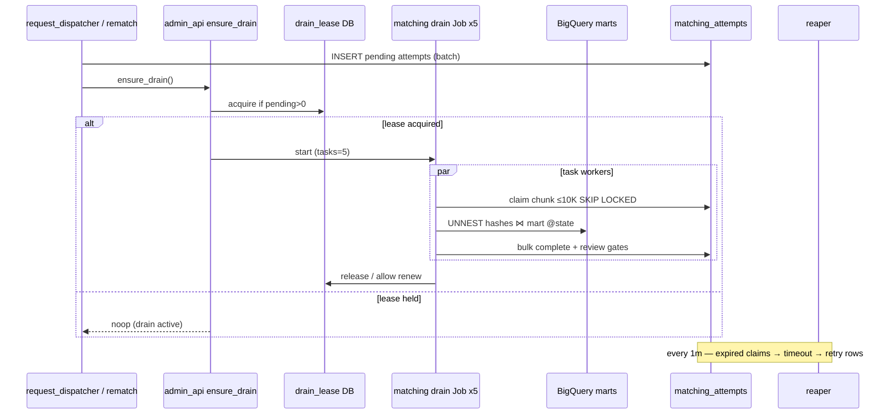

## Goal Capsule

Replace one-claim-per-tick matching with **Method E**: wave-level `ensure_drain` → single-flight Cloud Run **Job** with **5 parallel tasks**, each draining **~10K-attempt chunks** via **one set-based BigQuery join** per chunk, bulk-completing Postgres attempts (and opening `matching.review` gates). Keep per-row `POST /process` for ops/tiny paths. Reaper continues to own hung claims/retries. Compat-first cutover drains today’s pending/mid-flight backlog without abandoning in-flight rows. Target: **~500K matches in under ~1 hour** on measured BQ latency.

**Authority:** this plan > ADR-11 (queue-as-table; short workers) > ADR-05 (cadence in Terraform) > ADR-21 (hash marts) > V0 “no Tasks/Pub/Sub as work queue.” Session overrides: Job shell for drain (repo today is services-only); set-based BQ over per-row lookups for waves.

**Product Contract preservation:** Product Contract authored in this bootstrap (no upstream brainstorm file).

**Stop when:** Definition of Done is met. Do not replace queue-as-table with Cloud Tasks/Pub/Sub; do not remove per-request `matching_attempts` rows; do not build batched BQ submit/collect for plaintext/MDR pipelines in this plan.

---

## Product Contract

### Summary

Operators and automation enqueue matching attempts as today (row per request). Waves start a drain Job that matches thousands of hashes per BigQuery query across five workers. The five-minute schedule only ensures a drain is running. Ops can still match a single request via `/process`. Existing pending and mid-flight rows survive deploy and complete under the new drain (or reaper retry).

### Problem Frame

Cloud Scheduler invokes matching once every five minutes; each call claims **one** row and runs one BQ point lookup. Throughput (~12/hour) cannot clear multi-thousand backlogs or approach Aug 1 volumes (~hundreds of thousands). Event kick alone does not fix per-row BQ cost/latency; set-based chunk matching plus parallel chunk workers is required for a sub-hour 500K wave.

### Requirements

- R1. Queue remains **one `matching_attempts` row per request per attempt_number** (not one row per bulk Job).
- R2. After any batch that inserts pending matching attempts, call **`ensure_drain` once** (wave kick) — not once per request.
- R3. Drain runs as a **Cloud Run Job** with **task count = 5**; each task processes chunks of up to **10_000** homogeneous attempts (same `list_type` + `requestor_state` when practicable).
- R4. Hot path matching is **set-based BigQuery**: `UNNEST` (or equivalent) of chunk hashes ⋈ serving mart (`email_hash` / `phone_hash` / `ndz_hash`) with `@lookup_state` = `requestor_state`; never return out-of-state DWIDs.
- R5. Chunk completion bulk-writes `matching_results`, completes attempts, and opens `matching.review` gates with the same privacy rules as today’s per-row success path (ids/counts only in logs/audit).
- R6. **Single-flight drain orchestration** (DB lease with TTL): concurrent kicks/cron no-op while a drain is active; expired lease allows restart.
- R7. Keep **`POST /process`** (one claim) for ops/CLI/tiny rematch; do not delete the small path.
- R8. **Catch-all cadence:** existing ~5-minute matching scheduler becomes **`ensure_drain`** (start Job if pending and no lease), not one-row drip as the peer throughput path.
- R9. **Compat-first cutover:** deploy chunk drain + kicks while old `/process` cron may still tick; after health check, flip cron to ensure-drain-only; never leave mid-flight rows without reaper coverage.
- R10. Reaper continues to reap `matching_attempts` (lease expiry → timeout → append retry). Drain-lease cleanup is TTL-based (reaper change optional/minimal).
- R11. Success bar: design and verify toward **~500K matches in under ~1 hour** (measure p50/p95 chunk BQ + write); document actual rate in evidence.
- R12. No PII, raw hashes, or DWIDs in logs, audit JSONB, or operator list payloads beyond ids/counts.
- R13. Worker invoke path stays **admin-api SA / Scheduler IAM** — no user `run.invoker` on matching or the Job.
- R14. Implementation uses **10 parallel executor agents** with disjoint file ownership, then a **reviewer per executor**, then **persona QC/QA** (privacy, security, data quality, migration) and **`/loop`** until DoD — see Execution Playbook.

### Actors

- A1. Platform / Scheduler — catch-all ensure_drain.
- A2. request_dispatcher / hash-index rematch — enqueue + wave kick.
- A3. Ops (super_admin / admin via IAP) — pipeline proxies, optional single `/process`.
- A4. Reaper — hung claim recovery.
- A5. Implementing agents — executors, reviewers, QC (R14).

### Key Flows

- F1. Promote → dispatch enqueues N pending attempts → `ensure_drain` → Job (5 tasks) drains 10K chunks via set-based BQ → review gates open.
- F2. Hash refresh rematch enqueues many attempts → same ensure_drain / Job path.
- F3. Ops single match: `POST /ops/drop/match` → `/process` one row (no Job required).
- F4. Catch-all: every ~5 min `ensure_drain`; if pending and lease free → start Job; else idle.
- F5. Cutover: deploy → dual path briefly → flip scheduler → drain pre-existing backlog with chunks; reaper heals mid-flight deaths.

### Acceptance Examples

- AE1. After dispatch of ≥1 pending attempt, a drain Job starts without waiting for the 5-minute tick (wave kick).
- AE2. One Job task claims ≤10K same-state/list_type pendings, runs **one** BQ set query, completes those attempts with correct `match_count` and review gates.
- AE3. Five tasks run concurrently without claiming the same attempt (`SKIP LOCKED` / chunk lease).
- AE4. Second kick while drain lease held is a no-op; after lease TTL or Job end with remaining pending, catch-all restarts drain.
- AE5. Killing a task mid-chunk: leased attempts expire → reaper timeouts → new pending retries; no silent drop.
- AE6. Pre-existing pending rows (pre-deploy) are drained by the new Job after cutover; in-flight at deploy either complete or reaper-retry into chunk path.
- AE7. `/process` still matches a single seeded attempt end-to-end.
- AE8. Evidence note: measured throughput (attempts/hour) and BQ bytes for one 10K chunk; projection vs 500K / 1h.

### Scope Boundaries

**In**

- Set-based BQ chunk matcher + 10K chunk claim/complete
- Cloud Run Job (5 tasks) + drain lease + ensure_drain API
- Kicks from request_dispatcher, rematch-after-refresh, and any other enqueue batch path; admin ensure_drain proxy
- Scheduler flip to ensure_drain; compat-first cutover runbook
- Ops visibility: pending depth, drain lease/active Job signal (ids/counts)
- Tests + Execution Playbook (10 executors / reviewers / QC / loop)

**Out**

- Cloud Tasks / Pub/Sub as the matching work queue
- Per-request HTTP kicks
- Always-on idle second matching service
- Plaintext/MDR matching redesign
- Changing `matching.review` product rules or Inbox UX beyond backlog metrics
- Mega-query “entire 500K in one SQL” optimization (deferred follow-up; 10K×5 is v1)

### Deferred to Follow-Up Work

- Fewer mega-queries per `process_id`×state when BQ dollars/latency warrant
- Priority lanes (SLA-hot states)
- Adaptive chunk size from observed BQ duration
- Port other workers to Jobs if useful

---

## Planning Contract

### Key Technical Decisions

- KTD1. **Method E** — chunked set-based BQ + 5 parallel Job tasks + retain `/process`. `(session-settled: user-directed — chosen over serial-only Method A and over per-row fan-out: sub-hour 500K needs set-based; E adds parallelism and small-path UX)`
- KTD2. **Chunk size 10_000**, **task count 5**. `(session-settled: user-directed — chosen over 25K chunks / sequential-only: balances Job timeout, retry granularity, and ~1h target)`
- KTD3. **Wave-level `ensure_drain`** on every path that inserts pending `matching_attempts` (today: request_dispatcher batch + rematch batch; future enqueue sites must call the same helper). `(session-settled: user-approved — chosen over per-request kicks and over dispatcher-only kicks)`
- KTD4. **Cloud Run Job** is the drain shell (repo today only has Services — greenfield infra). Fallback if Jobs blocked in env: same chunk code exposed as `POST /drain-chunk` on matching service with Scheduler/Tasks fan-out of 5 — same semantics. `(session-settled: user-approved — chosen over always-on idle worker and forever HTTP hold)`
- KTD5. **Queue row-per-request** unchanged; drain lease is a separate single-flight record (table or keyed row), not a bulk “job queue” row for 500K work. `(session-settled: user-approved)`
- KTD6. **Compat-first cutover** — ship drain+kick; briefly allow old `/process` cron; then flip scheduler to ensure_drain-only. `(session-settled: user-approved — chosen over hard-cut on deploy)`
- KTD7. **Hang/retry** stay on attempt leases + reaper + append-on-failure (`max_attempts` default 5). Drain lease uses TTL; do not invent Job-local retry replacing reaper. `(session-settled: user-approved)`
- KTD8. **Homogeneous chunks** — prefer claim filter by `list_type` + `requestor_state` so one BQ SQL shape matches the chunk; mixed leftovers may form smaller chunks or fall back to `/process`-equivalent per row inside the task only when homogeneity fails.
- KTD9. **Invoker topology** — Scheduler and admin-api runtime SA may start the Job / call ensure_drain; browser never calls workers. Align with `infra/README.md`.
- KTD10. **Execution harness** — 10 parallel executors, disjoint files; reviewer batch; persona QC; `/loop` until DoD. `(session-settled: user-directed)`
- KTD11. **Pricing posture** — on-demand BQ for 50×10K chunks ≈ tens of GiB scanned if each chunk re-reads ~2 GiB state slice (~$0.50–$1/wave order-of-magnitude); Cloud Run task-seconds ~$0.20. Per-row 500K queries rejected on cost and latency. Validate with dry-run `totalBytesProcessed` in U3.
- KTD12. **Chunk rows stay `claimed` with `extend_lease` / heartbeat for the whole BQ+write window** — do not move chunk members to `in_flight` without `submitted_at`. Today’s per-row `/process` sets `in_flight` without `submitted_at`, which the reaper’s stuck-in-flight path does not see; U6 fixes `/process` to set `submitted_at` (or keep claimed+heartbeat) so AE5 holds for both paths.
- KTD13. **Wave-kick invoker (default):** prefer **admin-api post-proxy chain** — after `POST /ops/drop/dispatch` and after `hash_index_refresh` process responses that report rematch enqueues, admin-api calls `ensure_drain`. Scheduler catch-all also hits admin-api `ensure_drain`. If a worker must kick without an admin-api caller, grant that worker SA explicit Job/ensure-drain invoke (document in `infra/README.md`) — do not give browser users `run.invoker`.
- KTD14. **Homogeneous claim** joins `matching_attempts` → `requests` (`requestor_state`) and DROP raw (`list_type` via `raw_record_id`) — attempts table alone has neither column.
- KTD15. **Bulk complete** commits in sub-batches (order **100–500** attempts) with per-row idempotency; one gate failure must not leave the chunk half-applied without a defined retry (failed ids error/retry; successes stay terminal).

### Assumptions

- Serving marts remain clustered on `(state, hash_value)` in `example-gcp-project.drop_hash_index`.
- Average set-based 10K chunk (BQ + bulk write) can finish on the order of **1–3 minutes** under load; five-wide ⇒ order **~100–300K attempts/hour** — enough to approach the 1h/500K bar if closer to 1 min/chunk. If slower, follow-up is mega-query or more tasks (out of v1 scope unless DoD fails).
- Sub-hour 500K is a **design target**; DoD requires AE8 measurement and an explicit go/no-go or follow-up filing if wall clock exceeds ~1h at measured rates.

### High-Level Technical Design



**Chunk lifecycle (directional):**

```
pending → (chunk claim) claimed/in_flight + chunk_id
       → BQ set lookup
       → success|error terminal + matching_results + matching.review
on worker death: lease expire → reaper timeout → new pending (attempt_number+1)
```

**Throughput sketch (planning, not guarantee):**

| Chunk wall | 5-wide rate | Time for 500K |
|------------|-------------|----------------|
| 3 min / 10K | ~100K/h | ~5 h |
| 1 min / 10K | ~300K/h | ~1.7 h |
| 40 s / 10K | ~450K/h | ~1.1 h |
| 30 s / 10K | ~600K/h | ~50 min |

U3 must measure and record; if below bar, escalate chunk SQL / task count as follow-up before declaring Aug 1 ready.

### Alternative Approaches Considered

| Approach | Why not v1 |
|----------|------------|
| Per-row × N Cloud Run requests | BQ min 10 MiB/query × 500K; cannot hit 1h without absurd concurrency |
| Method A serial chunks only | Same BQ $; wall clock ~5× worse |
| Pub/Sub / Cloud Tasks work queue | Conflicts with accepted queue-as-table MVP |
| Match entirely inside promote | Larger ADR shift; rematch/partial failure harder |
| One SQL for entire 500K | Best $/scan; defer until 10K×5 measured |

### Risks & Dependencies

| Risk | Mitigation |
|------|------------|
| Chunk BQ slower than 1h target | Measure early (U3); tune SQL/clustering; follow-up mega-query / more tasks |
| 5 writers stress Cloud SQL | Bulk UPDATEs in batches; pool sizing; serialize commits per chunk |
| Inbox review flood | Ops metric + optional drain budget pause (ids/counts); out of product scope to auto-throttle fulfill |
| No prior Jobs in repo | U5 owns first Job module; fallback `/drain-chunk` documented in KTD4 |
| Dual cron during cutover double-work | Harmless with SKIP LOCKED; flip quickly after smoke |
| IAM for Job invoker | Mirror matching-dev invoker grants for admin-api SA + Scheduler SA |
| Privacy leak in bulk audit | Reuse redaction helpers; never log hash lists |

### Dependencies / Prerequisites

- Deploy rights for matching image + new Job + Scheduler update (dev first).
- BigQuery job user on matching SA (already used for point lookup).
- Jose approval before production Scheduler flip / prod drain.

---

## Implementation Units

### U1. Chunk claim + drain lease primitives (core)

**Goal:** Add queue helpers to claim up to 10K homogeneous pending matching attempts and a TTL single-flight drain lease.

**Requirements:** R1, R3, R6, R10, KTD2, KTD5, KTD7

**Dependencies:** None

**Files:**
- `libs/habeas-privacy-core/src/habeas_privacy_core/queue/claim.py` (extend or sibling)
- `libs/habeas-privacy-core/src/habeas_privacy_core/db/` (drain lease helper)
- `db/migrations/` — `matching_` or `core_` scoped migration for drain lease table/columns as needed
- `libs/habeas-privacy-core/tests/` — new/extended queue tests

**Approach:** `claim_matching_chunk(limit=10000, list_type?, state?)` using `FOR UPDATE SKIP LOCKED`, joining `requests` (+ DROP raw for `list_type`) per KTD14. Rows remain **`claimed`** with `claim_expires_at`; callers must `extend_lease` during long BQ (KTD12). Drain lease: insert/upsert with `expires_at`; acquire is compare-and-set. No PII in lease rows. Add/verify indexes supporting the join+pending claim if EXPLAIN shows seq scans at 10K.

**Patterns to follow:** `claim_next`, `extend_lease`, hash_index_refresh single-flight per state, `ReapedTableConfig`.

**Test scenarios:**
- Happy: claim returns ≤10K distinct ids; second claimer gets disjoint set; all claimed share state/list_type when filters set.
- Edge: empty queue → empty chunk; limit 1; homogeneity filter returns partial.
- Error: lease held → acquire false; expired lease → acquire true.

**Verification:** Unit tests green; migration applies cleanly in test DB.

---

### U2. Set-based BigQuery chunk lookup

**Goal:** Replace N point lookups with one parameterized set query per chunk.

**Requirements:** R4, R12, KTD1, KTD8, KTD11

**Dependencies:** None (can parallel U1)

**Files:**
- `app/matching/src/matching/bq_lookup.py`
- `app/matching/src/matching/adapters/drop_hash.py`
- `app/matching/tests/test_bq_lookup.py` (+ new chunk tests)

**Approach:** Accept list of `(attempt_id, hash_value)` + `state` + `list_type`; run one SQL joining unnested hashes to serving table with state filter; return map hash → dwids (counts only in logs). Fail closed without state. Preserve retry classification (`BigQueryLookupError`).

**Patterns to follow:** existing `lookup_dwids_by_hash` parameter style; redaction on errors.

**Test scenarios:**
- Happy: two hashes, one hit / one miss / multi-dwid → correct maps.
- Edge: empty input; duplicate hashes in chunk.
- Error: BQ timeout → retryable error; missing state → hard fail before query.
- Covers AE2 (lookup portion).

**Verification:** Tests mock BQ client; optional dry-run bytes note in test doc comment or tmp evidence template.

---

### U3. Chunk process + bulk complete (matching app)

**Goal:** Process one claimed chunk: BQ set lookup → bulk `matching_results` + attempt completion + review gates.

**Requirements:** R5, R11, R12, KTD1, KTD8

**Dependencies:** U1, U2

**Files:**
- `app/matching/src/matching/main.py` (or `chunk_drain.py`)
- `app/matching/src/matching/results.py`
- `app/matching/tests/test_pipeline.py` / new `test_chunk_drain.py`

**Approach:** Share success semantics with per-row path (`complete_attempt_success` / gate ensure). Bulk-complete in sub-batches of 100–500 (KTD15) with idempotent retries. Heartbeat/`extend_lease` for the whole BQ+write window (KTD12). Emit metrics: chunk_size, match_histogram counts, duration — no hashes/DWIDs.

**Execution note:** Measure one live or staging 10K chunk duration and bytes before declaring throughput; record under `tmp/reviews/` (ids/counts only).

**Test scenarios:**
- Happy: chunk of 3 synthetic attempts → 3 terminal successes + gates.
- Edge: partial BQ map (some hashes missing) → match_count 0 rows still complete.
- Error: BQ failure → attempts error/retry_after consistent with today; lease not stuck forever.
- Integration: review gate created once per successful request_id.

**Verification:** Pytest green; AE2 satisfied in unit/integration.

---

### U4. `ensure_drain` + wave kicks

**Goal:** Central `ensure_drain` and call it after every enqueue batch.

**Requirements:** R2, R3, R6, R8, R13, KTD3, KTD9

**Dependencies:** U1 (lease); Job start stub ok until U5

**Files:**
- `app/matching` or `libs/habeas-privacy-core` ensure_drain helper
- `app/request_dispatcher/src/request_dispatcher/dispatch.py`
- `app/hash_index_refresh/src/hash_index_refresh/main.py` — after rematch enqueue (signal rematch_count to caller)
- `app/admin_api/src/admin_api/drop_pipeline.py` — `POST /ops/drop/ensure-drain`; **post-proxy** ensure_drain after `/dispatch` and after hash_index_refresh `/process` when rematches enqueued (KTD13)
- Tests under `app/request_dispatcher/tests/`, `app/admin_api/tests/`, `app/hash_index_refresh/tests/`, rematch tests

**Approach:** Primary kick is **admin-api chain** (KTD13) so invoker topology stays admin-api → Job. Workers may still call a thin local hook that records “drain needed”; Scheduler catch-all covers missed chains within 5 minutes. Idempotent. Do **not** kick per row inside the enqueue loop.

**Patterns to follow:** admin-api worker proxy + ID token invoker pattern in `drop_pipeline.py`.

**Test scenarios:**
- Happy: dispatch with 2 new attempts → ensure_drain called once.
- Edge: dispatch 0 new → no kick; lease held → start not called.
- Covers AE1, AE4.

**Verification:** Unit tests with mocks for Job start; AE1.

---

### U5. Cloud Run Job + Scheduler catch-all (infra)

**Goal:** Deploy matching drain Job (tasks=5) and point matching Scheduler at ensure_drain; document compat flip.

**Requirements:** R3, R8, R9, R13, KTD4, KTD6, KTD9

**Dependencies:** U3, U4

**Files:**
- `infra/cloudbuild/` — Job build/deploy YAML (new) and/or extend `matching-dev.yaml`
- `infra/README.md` — invoker + Scheduler notes
- Scheduler config (Terraform or documented gcloud) — matching job → ensure_drain
- `app/matching/AGENTS.md`, `app/matching/README.md`

**Approach:** Job entrypoint runs chunk loop until budget (time/chunks) or idle. Task index irrelevant; all tasks compete on SKIP LOCKED. Scheduler every 5 min calls **admin-api** `ensure_drain` (KTD13). Document IAM explicitly: admin-api SA `run.jobs.run` (or equivalent) on the Job; Job runtime SA = matching SA with Cloud SQL + BQ (same as service). Compat runbook in README: dual path → flip.

**Execution note:** Smoke on dev; no prod Scheduler flip without Jose approval.

**Test scenarios:**
- Test expectation: none for pure YAML — smoke checklist in Verification Contract.
- Document AE4/AE6 cutover steps + IAM table in README.

**Verification:** Dev Job runs one chunk on seeded pendings; Scheduler dry invocation returns 200.

---

### U6. Reaper / in_flight hygiene (minimal)

**Goal:** Confirm matching attempt reaping works for chunk claims; fix gaps (e.g. `submitted_at`) if chunk in_flight would not be reaped.

**Requirements:** R10, KTD7, AE5

**Dependencies:** U1, U3

**Files:**
- `app/reaper/src/reaper/config.py`
- `libs/habeas-privacy-core/src/habeas_privacy_core/queue/reap.py`
- `app/reaper/tests/`, `app/matching` completion paths
- `app/reaper/AGENTS.md` if behavior changes

**Approach:** Prefer no registry change. **Required:** chunk path uses claimed+heartbeat (KTD12); fix per-row `/process` to set `submitted_at` when entering `in_flight` (or equivalent) so `release_stuck_in_flight` works. If drain lease table needs stale cleanup, TTL-only or one reaper config row. Timeout → retry rows re-enter chunk drain via catch-all.

**Test scenarios:**
- Happy: expired claimed chunk rows → timeout + new pending within lease TTL.
- Happy: `/process` killed after in_flight → reaper recovers (submitted_at fix).
- Edge: drain lease expired while Job still listed — acquire allowed (restart safe with SKIP LOCKED).
- Covers AE5.

**Verification:** Reaper tests green; AE5.

---

### U7. Retain `/process` + ops path clarity

**Goal:** Per-row `/process` remains correct; ops docs/UI copy distinguish Job drain vs single process.

**Requirements:** R7, AE7

**Dependencies:** U3

**Files:**
- `app/matching/src/matching/main.py`
- `app/admin_api/src/admin_api/drop_pipeline.py` (`/match` proxy)
- `clients/web/src/routes/ops/drop-pipeline.tsx` — backlog copy if needed (matching tab)
- Tests existing `test_bq_lookup` / pipeline

**Approach:** No behavior regress on single claim. Optional: `/match` may also call ensure_drain when pending>1 after a manual nudge — only if it does not surprise ops; default keep `/match` = one `/process`.

**Test scenarios:**
- Happy: `/process` idle and one-success paths unchanged.
- Covers AE7.

**Verification:** Existing matching tests pass.

---

### U8. Cutover runbook + backlog evidence

**Goal:** Compat-first procedure for mid-flight and queued rows; evidence for throughput.

**Requirements:** R9, R11, AE6, AE8

**Dependencies:** U5, U6

**Files:**
- `app/matching/README.md` or `transform/drop_hash/RUNBOOK.md` cross-link — prefer matching README cutover section
- `tmp/reviews/` evidence template (created at execution time, not necessarily in git)

**Approach:** (1) Deploy code+Job. (2) Seed/observe pending count. (3) ensure_drain. (4) Confirm pending declines by ≫12/hour. (5) Flip Scheduler. (6) Spot-check mid-flight: either complete or reaper-retry. Never mass-CANCEL attempts.

**Test scenarios:**
- Test expectation: none — operational checklist; AE6/AE8 evidence files.

**Verification:** Written cutover steps + AE8 numbers.

---

### U9. Ops observability (ids/counts)

**Goal:** Surface drain lease active + pending matching depth (and optional last chunk stats) on pipeline/health.

**Requirements:** R12, AE4

**Dependencies:** U1, U4

**Files:**
- `app/admin_api/src/admin_api/drop_pipeline.py`
- `app/admin_api/tests/test_drop_pipeline.py`
- `clients/web/src/routes/ops/drop-pipeline.tsx` (matching tab warning already ≥500 — extend carefully)

**Approach:** Counts only; no attempt payload dumps. Show whether drain lease held / pending remaining.

**Test scenarios:**
- Happy: pipeline JSON includes pending + drain_active boolean.
- Edge: lease null → drain_active false.

**Verification:** API tests + UI smoke.

---

### U10. Execution Playbook — 10 executors, reviewers, QC, loop

**Goal:** Bind how this plan is implemented in-agent per R14 / KTD10.

**Requirements:** R14, KTD10

**Dependencies:** None (governs U1–U9 execution)

**Files:**
- This plan section (authoritative)
- `.agent/modules/orchestration.md`, `.agent/modules/review-personas.md` (follow, do not rewrite unless gap)

**Approach:** See **Execution Playbook** below. Not a code unit — process gate before merge.

**Test scenarios:**
- Test expectation: none — process compliance checked in Definition of Done.

**Verification:** Handoff notes list executor IDs, reviewer paths under `tmp/reviews/`, QC personas run, loop until DoD.

---

## Execution Playbook

Mandatory for `ce-work` / implementing session on this plan.

### Phase A — Executor batch (10 parallel, disjoint files)

| Executor | Primary ownership (disjoint) | Units |
|----------|------------------------------|-------|
| E1 | `db/migrations/` drain lease + AGENTS notes | U1 (migration slice) |
| E2 | `libs/.../queue/` claim chunk + tests | U1 |
| E3 | `libs/.../db/` drain lease helpers | U1 |
| E4 | `app/matching/.../bq_lookup.py` + BQ tests | U2 |
| E5 | `app/matching` chunk process + results bulk + `/process` submitted_at fix | U3, U6 (matching side), U7 |
| E6 | `app/request_dispatcher` + `app/hash_index_refresh/.../main.py` rematch signal | U4 (worker side) |
| E7 | `app/admin_api` ensure_drain proxy, post-proxy kicks, pipeline stats | U4, U9 |
| E8 | `app/reaper` + reap hygiene | U6 |
| E9 | `infra/cloudbuild` Job + README Scheduler | U5 |
| E10 | `clients/web` matching backlog affordance + matching README cutover | U7, U8, U9 UI |

No two executors write the same file. Shared contracts (lease table shape, ensure_drain signature) are fixed in KTD/U1 before fan-out; conflicts escalate to orchestrator.

### Phase B — Reviewer batch (1:1 with executors)

Spawn **separate** reviewer agents (not the author). Minimum lenses from `.agent/modules/review-personas.md`:

| Area | Required personas |
|------|-------------------|
| U1/U6 migrations + queue | migration + data correctness; privacy |
| U2/U3 matching outcomes | data quality; privacy |
| U4/U5/U7 invoker/IAM | security |
| U9 UI | user experience; privacy |
| All production paths | security + privacy minimum |

Reviewers write `tmp/reviews/matching-drain-E<n>-review.md` (ids/counts only).

### Phase C — QC / QA personas

After reviewer round, orchestrator runs QC agents:

1. **Privacy QC** — no hashes/DWIDs/PII in logs/audit/UI payloads.  
2. **Security QC** — invoker topology; no user→worker.  
3. **Data quality QC** — state filter, match_count, gate open semantics vs per-row path.  
4. **Cutover QC** — mid-flight/pending procedure AE6 credible.

### Phase D — `/loop` until done

Arm a recurring check (e.g. every 15–30m or on CI/PR signals) that:

1. Re-reads DoD and open reviewer findings.  
2. Re-dispatches fix executors only for failing units (still disjoint files).  
3. Re-runs affected reviewers + QC.  
4. Stops when Verification Contract gates pass and no P0/P1 privacy/security findings remain.

Do not declare complete on executor “done” alone.

---

## Verification Contract

- Unit/integration: `uv run --group dev pytest app/matching app/request_dispatcher app/reaper libs/habeas-privacy-core -q` (narrow further per unit while iterating).
- Admin API tests for ensure_drain / pipeline fields: `uv run --group dev pytest app/admin_api/tests/test_drop_pipeline.py -q`.
- Dev smoke: enqueue ≥N pendings → ensure_drain → Job tasks process ≥1 chunk → pending decreases; `/process` still works for one id.
- Privacy spot-check: sample logs/audit JSONB for chunk run — ids/counts only.
- Evidence: `tmp/reviews/matching-chunk-drain-throughput.md` with chunk duration, attempts completed, BQ bytes (AE8).
- Cutover checklist executed on dev (AE6).
- Orchestration: 10 executor ownership respected; reviewer + QC artifacts present.

**Do not:** drain unrelated prod queues during E2E; use `DATABASE_URL` bypass as DoD for IAP paths.

---

## Definition of Done

- [ ] U1–U9 implemented per requirements; U10 playbook followed for the shipping session
- [ ] Method E live on dev: 10K chunks, 5 Job tasks, set-based BQ, ensure_drain kicks, catch-all Scheduler
- [ ] `/process` regression green
- [ ] Reaper recovers killed chunk workers (AE5)
- [ ] Compat cutover documented and practiced on dev; prod flip gated on Jose
- [ ] AE8 throughput evidence recorded; gap to 500K/1h explicitly accepted or follow-up filed
- [ ] Reviewer + privacy/security QC findings resolved or waived in writing
- [ ] No PII/hashes/DWIDs in new log/audit surfaces

---

## Appendix

### Sources & Research

- Session architecture discussion (event kick, Job drain, Method A vs E pricing)
- ADR-11 Worker Architecture; ADR-05 Processing Cadence; ADR-20 Reaper; ADR-21 DROP Hash Matching
- V0-Technical-Spec §4.1 queue-as-table (no Tasks/Pub/Sub MVP)
- Repo patterns dossier: enqueue only via dispatcher + rematch; per-row BQ in `bq_lookup.py`; no Jobs in-repo yet; invoker = admin-api SA
- Pricing sketch: set-based ~$0.50–$1 BQ/wave vs per-row floor ~$30+; Cloud Run ~$0.20 — validate with dry-run

### Open Questions (deferred, non-blocking)

- Exact Job vs `/drain-chunk` fallback if org blocks Cloud Run Jobs in `example-gcp-project` (KTD4).
- Whether `/ops/drop/match` should also call ensure_drain when pending>1 (default no).
- Final Scheduler Terraform home vs gcloud-documented job (infra ownership).
