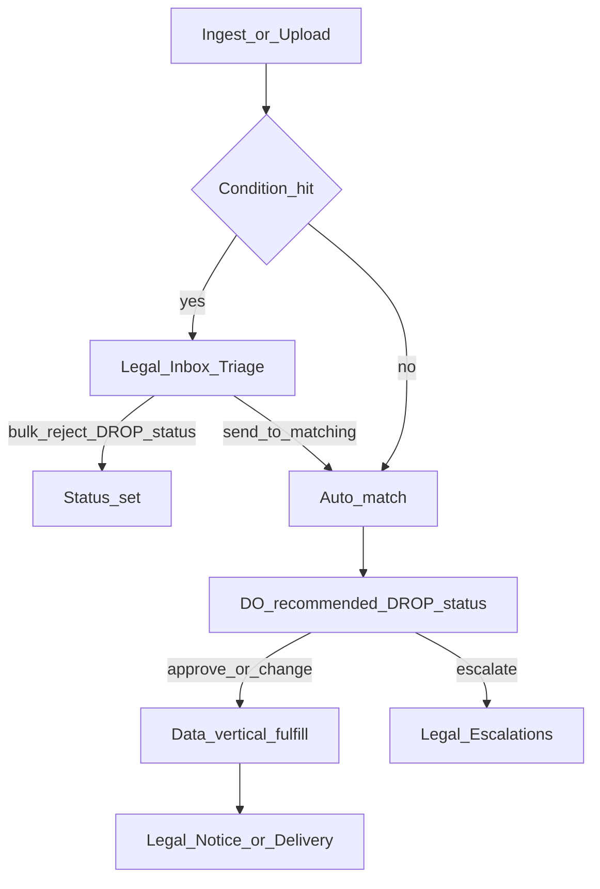
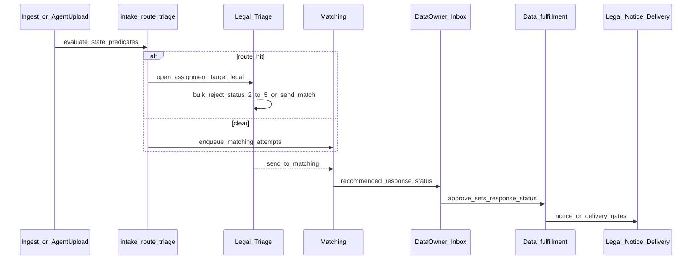

## Goal Capsule

Ship a **persona-shaped Command Center** so Legal and the **data vertical** data owner can run daily privacy work without Jira masters/subtasks: Legal Home + Inbox (Triage · Notice · Delivery · Escalations), workflow **conditions** that route (not silent-reject) out-of-jurisdiction requests, agent **upload** (platform cleans), and data-owner **My work** to approve **recommended CA DROP `response_status`** (bulk / filter / one-by-one) with comments, escalate, and assign-to-employee. Hide ops Dashboard and Workers from Legal and data owners. MVP fulfillment automation stays **data vertical only**.

**Authority:** this Product Contract > ADR-06 (Jira transition) > ADR-16 (`approval_rules`) > ADR-37 (notice) > existing ops IA / fulfillment plans for data-vertical fulfill paths. Visual inspo: Mobbin case-queue patterns + existing shadcn / Habeas tokens (not a second design system).

**Product Contract preservation:** Product Contract unchanged — Planning Contract resolves Q1–Q5 as KTDs/assumptions.

**Stop when:** Definition of Done is met. Do not ship silent auto-reject, non-data vertical fulfillment, or platform SMTP.

---

## Product Contract

### Summary

Replace Legal’s Jira/Sheet attention loop and the data owner’s Step 2 matching subtask loop with role-default Homes and Inboxes. Status everywhere is CA DROP `response_status` (`2` Exempted · `3` Deleted · `4` Opted out · `5` Not found). Conditions send OOJ-like hits to Legal Triage for bulk reject, review, or send-to-matching. Auto-match feeds the data owner a recommended DROP status to approve before data-vertical fulfillment and Legal notice/delivery.

### Problem Frame

Privacy Managers still create day/batch Jira masters, fan out Step 2 Matching subtasks, and chase reassignment hops; agent CSVs are cleaned on Sheets; OOJ “denied” is tribal. Data owners (and DSEs they reassign) match in tools and comment dwids back in Jira. The admin web app already has Requests/Inbox/journey for ops-style gates, but Home is a pipeline Dashboard for super_admin, Workers are ops-only, there is no Legal Triage/conditions/upload persona, and escalate-to-legal is API-only. That cannot replace DP project practice for Julianne Kwon’s Legal team or Russ’s data vertical.

### Key Decisions

- KD1. (session-settled: user-directed — chosen over Legal-only-first or DO-only-first) **MVP ships both tracks:** Legal Command surfaces **and** data-owner My work + employee assign.
- KD2. (session-settled: user-directed — chosen over silent auto-reject) Workflow **conditions route** matching requests (e.g. OOJ / certain states) to **Legal Inbox · Triage**. Legal then **bulk rejects**, **reviews**, or **sends to matching**. Never terminal auto-reject without Inbox action.
- KD3. (session-settled: user-directed) **Always use CA DROP `response_status`** (`2`–`5`) for recommended status, DO approve/change, Legal bulk reject, and fulfill. No parallel “denied” product status. OOJ bulk reject defaults to **`2` Exempted**.
- KD4. (session-settled: user-directed) **Authorized-agent batches:** Legal gets **upload only**; **platform cleans** the file.
- KD5. (session-settled: user-directed) **Auto-match on ingest** (when not held in Triage); results go to the **data owner** first for recommended-status approval—not to Legal matching review as the primary path.
- KD6. (session-settled: user-directed) **Fulfillment MVP = data vertical only**; other verticals differ later.
- KD7. (session-settled: user-directed) Ops **Dashboard** and **Workers** (and related fleet pages) are **hidden from Legal and data owners**; remaining pages restyle by persona.
- KD8. (session-settled: user-directed) **Julianne Kwon** is head of Legal; ignore Fon. Operators include Sarah Durant, Zachary Miller, Sophia Azam, Alana Kim, and other DP reporters.
- KD9. (session-settled: user-approved) Visual direction: Mobbin dual-pane / My work / assign patterns composed with **shadcn + Habeas** tokens; case-queue calm for Legal/DO, not Prefect pipeline chrome.

### Actors

- A1. Legal / Privacy Manager — Triage, notice, delivery, escalations, conditions, upload, manual intake.
- A2. Data owner (MVP: data vertical) — recommended DROP status queue; comment; approve/change; escalate; assign employee.
- A3. Employee / delegate — My work on assigned review tasks only.
- A4. Platform — ingest, clean agent CSV, evaluate conditions, auto-match, data-vertical fulfill after status set.
- A5. Super admin / platform ops — retains Dashboard, Workers, pipeline (unchanged power surface).

### Requirements

**Persona shell**

- R1. Legal and data-owner sessions do not see ops Dashboard, Workers, Runs, Jobs, Incidents, or Health in nav.
- R2. Role-default `/` is Legal Home (action queue) or data-owner / employee My work—not the DROP pipeline console.
- R3. Requests, Inbox, and request detail restyle by persona (case-queue hierarchy for Legal/DO; ops density remains for super_admin).

**Status vocabulary**

- R4. All operator-facing status approve/reject/recommend UI uses CA DROP `response_status` labels: `2` Exempted, `3` Deleted, `4` Opted out, `5` Not found.
- R5. Match-derived recommendations use the existing mapping into `3`/`4`/`5`; Legal Triage bulk reject defaults to `2` for OOJ unless Legal selects another DROP code.

**Workflow conditions and Triage**

- R6. Legal can create/edit versioned, audited **conditions** (MVP predicates: requestor state / OOJ-style `state_in` / `state_not_in`) that **route** hits to Inbox · Triage.
- R7. From Triage, Legal can **bulk reject** (set DROP `response_status`), **review** one request (same outcomes), or **send to matching** (release to auto-match → data-owner queue).
- R8. Conditions never silently terminal-reject without a Legal Triage (or equivalent explicit) action.

**Intake**

- R9. Legal has an agent-batch **Upload** surface; the platform performs cleaning before condition evaluation and matching.
- R10. Manual legal intake remains available for ad-hoc requests.

**Data-owner matching review**

- R11. After auto-match, the data vertical owner sees each request with match summary and a **recommended DROP `response_status`**.
- R12. The owner can approve recommended, change to another DROP code then approve, or bulk-approve a filtered selection.
- R13. The owner can add a **comment** on the request before approving or changing status.
- R14. The owner can **escalate to Legal** with a comment; item appears in Legal Inbox · Escalations.
- R15. The owner can **assign** a request/task to an employee; the employee sees it only on My work and can complete the same review assist path.

**Legal post-fulfill**

- R16. After data-vertical fulfill, Legal clears **Notice** (`notice.review` where required) and **Delivery** (access shareable URL + delivery status; send stays outside the platform).

**Fulfillment scope**

- R17. MVP automated fulfillment runs for the **data vertical** only after DROP status is set by the approved path (DO approve or Legal Triage reject that sets status).

**Privacy and control plane**

- R18. No PII, raw hashes, or DWIDs in logs, audit JSONB, or list payloads beyond existing id/count rules; mutations only through admin-api.

### Key Flows

- F1. Ingest (webform/DROP) → conditions → (Triage or auto-match) → data-owner recommended DROP status → approve → data-vertical fulfill → Legal Notice/Delivery.
- F2. Agent upload → platform clean → same as F1 (Triage for condition hits).
- F3. Legal Triage: bulk reject (`2` default for OOJ) or send to matching.
- F4. Data owner: filter → comment → bulk or single approve/change DROP status; or escalate; or assign employee.
- F5. Employee: My work → complete assigned review → returns to owner queue semantics.
- F6. Access (data vertical): DO sets status → access pack → Legal Delivery (external email + delivery status).



### Acceptance Examples

- AE1. Request in a condition-matched OOJ state appears in Legal Triage—not auto-closed.
- AE2. Legal bulk-selects Triage rows and sets `response_status = 2` (Exempted); rows leave Triage and do not enter DO matching queue.
- AE3. Legal chooses Send to matching on a Triage row; auto-match runs; DO sees recommended `3`/`4`/`5`.
- AE4. DO filters to a batch, selects all, approves recommended statuses; data-vertical fulfill becomes eligible.
- AE5. DO comments then changes recommended `5` to `3` and approves; persisted status is `3`.
- AE6. DO escalates with comment; Legal sees the item under Escalations.
- AE7. DO assigns employee; employee My work shows the item; Legal never sees Workers/Dashboard.
- AE8. Agent file upload succeeds without Legal cleaning steps in UI; platform cleaning runs before conditions.

### Success Criteria

- S1. Legal can clear daily Triage / Notice / Delivery / Escalations and upload agent files without opening Jira for attention.
- S2. Data vertical owner can clear recommended DROP statuses (bulk or one-by-one) with comment/escalate/assign without Jira Step 2 hops.
- S3. No silent auto-reject path for condition hits; every reject that sets status is an explicit Legal (or DO) action using DROP codes.
- S4. Ops pipeline Dashboard remains available only to super_admin (or equivalent ops role).

### Scope Boundaries

**In (MVP)**

- Persona nav + Homes; Legal Triage/Notice/Delivery/Escalations; Conditions (state/OOJ routing); Upload; DO recommended-status queue; comments; escalate; assign employee; DROP `2`–`5` everywhere; data-vertical fulfill after status set.

**Out / deferred**

- Silent auto-reject of OOJ.
- Non-data vertical fulfillment automation.
- Full Jira master/batch grain replacement as a first-class product object (batch filters may exist; masters are not recreated).
- Platform SMTP to requestors.
- Rich condition DSL beyond state/OOJ routing.
- Fon as a named actor.

### Dependencies / Assumptions

- A1. CA DROP `response_status` codes `2`–`5` remain the shared vocabulary (intake-spine / fulfillment plans).
- A2. Auto-match and data-vertical fulfillment paths exist or land via adjacent plans; this contract owns the **human surfaces and routing**, not matcher algorithms.
- A3. ADR-16-style versioned rules can host or inspire condition routing (exact table/API is planning).
- A4. Escalate-to-`legal` API exists and will be wired to UI; a `legal` auth role (or admin-as-legal) is required for R1–R2.

### Outstanding Questions

Resolved in Planning Contract (KTD-1–KTD-5). Deferred non-blocking items remain under Planning Contract → Open Questions.

### Sources / Research

- KB: Legal/Data department workflows; Sarah Legal meeting; ADR-06, ADR-16, ADR-24, ADR-37.
- Jira Cloud project **DP** via ACLI.
- Repo: `clients/web` Requests/Inbox; `canAccessOpsSurfaces`; workflow escalate; fulfillment plan (data vertical).
- Mobbin: Plain/Intercom inbox; Asana/ClickUp My work; Motion/ClickUp assign.

---

## Planning Contract

### Assumptions

- PA1. (from Q1) **Add auth role `legal`** with `ADMIN_API_LEGALS` allowlist — not “admin without ops.” Escalate target `legal` and login role `legal` align.
- PA2. (from Q2) Triage and Escalations are **kinds on the existing needs-attention feed** (`reason` / filter), not a separate service — Inbox dual-pane stays one surface.
- PA3. (from Q3) MVP routing uses one active `approval_rules` row `action_type = 'intake.route_triage'` with `condition_jsonb` state predicates (fits unique active-`action_type` index). Legal Conditions UI versions that row (effective_to / insert) like other rules.
- PA4. (from Q4) Employee assign uses existing `workflow.assignment` assign → `reviewer` + `assignee_identity` (email). Any identity the data owner can pick that admin-api accepts; no new delegate allowlist table in MVP.
- PA5. (from Q5) MVP DO queues are **data-vertical / DROP matching.review path only** — other verticals do not get fulfill-disabled queues in this plan.
- PA6. Match-count → recommended DROP status reuses `response_status_for_match_count` (0→5, 1→3, N>1→4). Legal Triage may set `2`–`5`; DO approve may set `3`–`5` (and `2` only if product later needs it — MVP DO UI focuses `3`/`4`/`5` with recommendation default).
- PA7. Condition hit **holds matching enqueue** until Legal sends to matching (or sets terminal DROP status). No silent skip of Legal Inbox.
- PA8. Agent CSV cleaner is an MVP deterministic normalizer (trim, state codes, split emails within limits) — not full historical Sheet QC parity.

### Key Technical Decisions

| ID | Decision |
|----|----------|
| KTD-1 | (session-settled: user-directed — inherits KD1) Dual-track MVP: Legal surfaces + DO My work/assign in one delivery program. |
| KTD-2 | (from Q1) Add **`legal` to `Role`** Literal / `ALL_ROLES`, env `ADMIN_API_LEGALS`, `/me`, simulate list, and `require_roles` for Legal-only mutations (Triage, Conditions, Upload). Allowlist precedence: **super_admin → admin → legal → data_owner** (first match wins). |
| KTD-3 | (from Q2) Extend `GET /ops/requests/needs-attention` with **kind** filters: `matching` · `triage` · `escalations` · `notice` · `delivery` · `all` (map existing notice/delivery reasons; add triage + escalate-to-legal). |
| KTD-4 | (from Q3) Routing via **`approval_rules.action_type = 'intake.route_triage'`** + existing DSL (`state_in` / `requestor_state_not_in`). On hit: open pending triage work item (reuse `approval_requests` or `workflow.assignment` with `target_role=legal`, kind triage — prefer assignment so escalate/assign patterns stay unified). |
| KTD-5 | Extend `_DROP_RESPONSE_STATUS_CODES` / promote bodies to include **`2` Exempted** for Legal Triage bulk reject; DO matching promote keeps recommending `3`/`4`/`5`. |
| KTD-6 | Recommended status is **computed at read time** from match_count (and returned on needs-attention / matching-results payloads); persisted only when Legal/DO **approves** (sets `drop_raw_requests.response_status`). |
| KTD-7 | Agent upload: new admin-api multipart endpoint → store → clean → insert spine/raw rows (`intake_source` agent/manual family per ADR-34) → evaluate route_triage → enqueue match only if clear. |
| KTD-8 | Nav: `canAccessOpsSurfaces` remains super_admin-only; Legal/DO never see Workers; `/` routes Legal → Legal Home, DO/employee → My work, super_admin → pipeline Dashboard (unchanged). |
| KTD-9 | Wire existing escalate/assign/comments clients into Inbox panes; no parallel comment system. |

### High-Level Technical Design



**Persona nav (directional):**

```text
super_admin: Dashboard(Pipeline) · Requests · Inbox · Workers
legal:       Home · Requests · Inbox · SLAs · Upload · Conditions · New
data_owner:  My work · Inbox · Requests
employee:    My work · (Requests read of assigned only)
```

### Alternative Approaches Considered

- **Reuse `admin` for Legal (no new role):** fewer allowlist env vars, but conflates Legal with ops-capable admins and fights R1/R2. Rejected for KTD-2.
- **Silent auto-reject via `requires_approval=false` deny:** contradicts KD2. Rejected.
- **Separate Triage microservice/table:** heavier than extending needs-attention + assignment. Rejected for MVP.

### Risks and Mitigations

| Risk | Mitigation |
|------|------------|
| Holding match enqueue races with DROP promote dispatcher | Single gate in request_dispatcher / promote path: skip match if open triage assignment |
| `response_status=2` breaks DROP upload assumptions | Confirm upload/amend allowlists include Exempted; tests for ledger |
| Agent cleaner too weak → bad matches | Log clean metrics (counts only); Legal can still Triage/escalate; iterate cleaner post-MVP |
| Role proliferation / allowlist ops burden | Document `ADMIN_API_LEGALS`; simulate-role for super_admin QA |

### System-Wide Impact

- Auth surface widens (`legal` role) — infra secrets/env for allowlists.
- Needs-attention contract gains kinds — web Inbox tabs must stay backward-compatible (`all` default).
- Fulfillment dispatcher already waits on matching.review — Triage hold is an earlier gate.
- Adjacent: fulfillment access/suppression plan for data-vertical fulfill after status set.

### Open Questions (non-blocking)

- OQ1. Exact `intake_source` string for agent batches (`agent` vs `manual` + metadata) — implementer picks consistent with ADR-34 raw tables.
- OQ2. Whether Notice/Delivery Legal tabs need new API filters beyond today’s needs-attention reasons — prefer reuse.

### Deferred to Follow-Up Work

- Non-data vertical fulfill automation and DO queues.
- Rich multi-rule condition editor beyond one active route_triage rule.
- Full batch grain replacing Jira masters.
- ADR-24 SLA clocks UI.
- Platform SMTP.

---

## Implementation Units

### U1. Auth role `legal` and API/web role plumbing

**Goal:** Login identity for Legal with allowlist + simulate; gate Legal-only APIs.
**Requirements:** R1, R2, R18; KTD-2, KTD-8
**Dependencies:** none
**Files:**
- `libs/habeas-privacy-core/src/habeas_privacy_core/auth/roles.py`
- `libs/habeas-privacy-core/src/habeas_privacy_core/auth/__init__.py`
- `libs/habeas-privacy-core/src/habeas_privacy_core/auth/README.md`
- `app/admin_api/src/admin_api/roles.py`
- `app/admin_api/tests/test_roles.py`
- `app/admin_api/tests/test_auth_me.py`
- `clients/web/src/lib/api.ts`
- `clients/web/src/lib/auth.tsx`
**Approach:** Add `ROLE_LEGAL`; resolve via `ADMIN_API_LEGALS` (precedence: super_admin → admin → legal → data_owner — confirm order so Legal emails are not swallowed by broader lists). Export in `/me`. Extend simulate allowlist. Keep `canAccessOpsSurfaces` super_admin-only; add `isLegal` / `canAccessLegalSurfaces` helpers.
**Patterns to follow:** `test_roles.py` allowlist + simulate cases.
**Test scenarios:**
- Happy: email on LEGALS → `/me.role == legal`.
- Edge: email on both ADMINS and LEGALS → documented precedence wins.
- Error: `legal` calling Runs/pipeline SuperAdminPrincipal → 403.
- Integration: super_admin simulates `legal` via header; real_role remains super_admin.
**Verification:** Role tests green; web types compile with `legal` in `UserRole`.

### U2. Route-to-triage rule + hold matching enqueue

**Goal:** Evaluate `intake.route_triage` after ingest; open Legal triage assignment; do not enqueue matching until released.
**Requirements:** R6, R8, F1; KTD-4, PA3, PA7
**Dependencies:** U1 (for later Legal-only clear APIs; core eval can land without)
**Files:**
- `db/migrations/YYYYMMDDHHMMSS_core_seed_intake_route_triage_rule.sql` (or update seed)
- `libs/habeas-privacy-core/src/habeas_privacy_core/workflow/approval.py`
- Matching enqueue call sites (request_dispatcher / promote-to-raw path — locate during implementation)
- `libs/habeas-privacy-core/tests/test_workflow.py`
- Dispatcher/integration tests as present for enqueue
**Approach:** Seed active rule with MVP state predicate (empty/disabled until Legal configures, or starter OOJ list from Legal). Helper `should_route_to_legal_triage(request_context)`. On hit: `create_workflow_assignment` escalate/triage to `legal`; **skip** matching_attempts insert. On miss: existing auto-match enqueue.
**Execution note:** Characterization test around current enqueue path before inserting the hold gate.
**Test scenarios:**
- Happy: state matches predicate → triage assignment pending; zero matching_attempts.
- Happy: state clear → matching_attempts enqueued; no triage assignment.
- Edge: rule `effective_to` set → no routing.
- Covers AE1.
**Verification:** Workflow unit tests + one enqueue integration path proves hold.

### U3. Triage / Escalations needs-attention kinds + Legal Triage mutations

**Goal:** Inbox can list Triage and Escalations; Legal bulk-reject (DROP `2`–`5`) or send-to-matching.
**Requirements:** R4, R5, R7, F3, AE1–AE3; KTD-3, KTD-5, KTD-9
**Dependencies:** U1, U2
**Files:**
- `app/admin_api/src/admin_api/request_journey.py`
- `app/admin_api/src/admin_api/approvals.py` (`_DROP_RESPONSE_STATUS_CODES`)
- `app/admin_api/src/admin_api/drop_pipeline.py` (new triage routes near workflow escalate)
- `app/admin_api/tests/test_request_journey.py`
- `app/admin_api/tests/test_drop_pipeline.py`
- `clients/web/src/lib/api.ts`
**Approach:** Extend needs-attention payload with `kind` / filter query param. Escalations = open `workflow.assignment` with `target_role=legal` and escalate kind. Triage = route-triage assignments without `response_status`. Mutations (LegalPrincipal): bulk set `response_status` (default 2); send-to-matching closes triage assignment and enqueues match. Extend promote status allowlist to include 2 for triage path.
**Test scenarios:**
- Covers AE2: bulk reject sets `response_status=2`; leaves Triage; no match enqueue.
- Covers AE3: send-to-matching enqueues match; DO sees item under matching kind.
- Filter `kind=escalations` returns only escalate assignments.
- Error: data_owner calling triage bulk-reject → 403.
- Edge: cannot set status twice / already set.
**Verification:** Journey + drop_pipeline tests cover AE1–AE3 paths.

### U4. Data-owner recommended DROP status on matching review

**Goal:** Matching inbox shows recommended `3`/`4`/`5`; approve persists chosen code; comments/escalate/assign usable in pane.
**Requirements:** R11–R15, F4, AE4–AE7; KTD-6, KTD-9
**Dependencies:** U3 (kinds); comments API already exists
**Files:**
- `app/admin_api/src/admin_api/drop_pipeline.py` / matching-results serializers
- `app/admin_api/src/admin_api/approvals.py`
- `clients/web/src/components/requests/RequestTriageDialog.tsx`
- `clients/web/src/routes/requests/needs-attention.tsx`
- `app/admin_api/tests/test_drop_pipeline.py`
- `app/admin_api/tests/test_matching_review.py`
**Approach:** Add `recommended_response_status` to matching-results / needs-attention items via `response_status_for_match_count`. UI defaults picker to recommendation; Fulfill/bulk-approve posts chosen status. Wire escalate + assign controls already backed by API; ensure comment composer before approve is obvious in pane. Scope list to data vertical / DROP matching.review (PA5).
**Test scenarios:**
- Happy: match_count 0 → recommended 5; approve without change → persisted 5.
- Covers AE5: change 5→3 then approve → persisted 3.
- Covers AE4: bulk-approve N filtered rows.
- Integration: comment then promote both succeed; escalate appears in escalations kind.
**Verification:** Promote-with-status tests; UI shows default recommendation.

### U5. Agent batch upload + platform clean + route

**Goal:** Legal uploads CSV; platform cleans; rows enter triage or matching per U2.
**Requirements:** R9, F2, AE8; KTD-7, PA8
**Dependencies:** U2
**Files:**
- `app/admin_api/src/admin_api/` (new upload module or `main.py` routes)
- `libs/habeas-privacy-core/` cleaner helper (prefer core over admin-only)
- `db/migrations/` if `manual_raw_requests` / agent raw table columns needed
- `app/admin_api/tests/test_agent_upload.py` (new)
- `clients/web/src/lib/api.ts`
**Approach:** `POST` multipart (LegalPrincipal). Persist upload artifact reference (GCS or DB bytea — prefer GCS pattern if DROP intake already uses GCS; else temp + DB metadata). Cleaner: normalize state to USPS-2, trim, split multi-emails within configured max. Insert request spines + raw rows; run route_triage; enqueue match if clear. No Legal cleaning UI.
**Execution note:** Start with failing API test for upload→row count→triage/match split.
**Test scenarios:**
- Covers AE8: upload returns batch id; cleaner runs without client-side steps.
- Happy: mixed in/out-of-jurisdiction rows → triage count + match count split.
- Error: empty file / invalid content-type → 400.
- Privacy: logs contain counts/ids only.
**Verification:** Upload tests green; sample fixture CSV exercises cleaner.

### U6. Persona nav, Homes, Inbox tabs, Conditions + Upload UI

**Goal:** Legal/DO/employee chrome matches Product Contract; Conditions editor + Upload page.
**Requirements:** R1–R3, R6, R10, R16, S1–S4; KTD-8, KD9
**Dependencies:** U1, U3, U4, U5
**Files:**
- `clients/web/src/components/NavMenu.tsx`
- `clients/web/src/routes/index.tsx`
- `clients/web/src/router.tsx`
- `clients/web/src/routes/requests/needs-attention.tsx`
- `clients/web/src/routes/legal/` or `routes/conditions.tsx` + `routes/upload.tsx` (prefer extending existing trees over new top-level if AGENTS prefers — implementer may use `routes/requests/upload.tsx` + `routes/settings/conditions.tsx`)
- `clients/web/src/routes/requests/new.tsx` (manual intake link)
- `.agent/modules/design-taste-ops-ia.md` (Legal/DO recipes)
**Approach:** Nav by role. `/` → Legal Home (action counts: Triage, Escalations, Notice, Delivery) or DO My work (matching awaiting approve + assigned). Inbox tabs: All · Matching · Triage · Escalations · Notice · Delivery · Tasks. Conditions page: edit active `intake.route_triage` condition_jsonb states + rationale (versioned via API). Upload page: file picker + result summary. Restyle copy for case-queue calm; keep shadcn primitives. Super_admin Dashboard unchanged (`DropPipelinePage`).
**Patterns to follow:** `needs-attention.tsx` dual-pane; `design-taste-ops-ia.md`; Mobbin Plain/Intercom density without purple SaaS.
**Test scenarios:**
- Test expectation: primary proof is browser smoke + API contract tests from U3–U5; add lightweight component/router tests only if the repo already patterns them for role gates.
- Covers AE7: legal role nav has no Workers; DO My work shows assignment.
**Verification:** Simulate `legal` / `data_owner` — correct nav and home; Triage bulk reject and DO approve work in UI against local admin-api.

### U7. Assign-to-employee My work filter

**Goal:** Employee sees only assigned reviewer tasks; DO can assign from Inbox.
**Requirements:** R15, F5, AE7; PA4, KTD-9
**Dependencies:** U4, U6
**Files:**
- `app/admin_api/src/admin_api/request_journey.py` (optional `assignee=me` filter)
- `clients/web/src/routes/requests/needs-attention.tsx` / My work home
- `app/admin_api/tests/test_drop_pipeline.py` (assign already exists — extend list filter tests)
**Approach:** Reuse `POST /ops/drop/workflow/assign`. My work / Inbox Assigned tab filters `assignee_identity == me`. Completing review uses same promote path as DO.
**Test scenarios:**
- Happy: assign → assignee lists item; other DO does not see it in Assigned tab.
- Edge: reassign overwrites current assignment per existing semantics.
**Verification:** Assign + filter tests; UI Assigned tab shows only mine.

---

## Verification Contract

**Commands (repo norms):**

```bash
uv sync --all-packages
uv run --package admin-api pytest app/admin_api/tests/test_roles.py app/admin_api/tests/test_request_journey.py app/admin_api/tests/test_drop_pipeline.py app/admin_api/tests/test_matching_review.py -q
uv run --package habeas-privacy-core pytest libs/habeas-privacy-core/tests/test_workflow.py -q
cd clients/web && bun test  # if present; else bun run build
```

**Manual / browser:** simulate `legal` and `data_owner`; exercise AE1–AE8 on Inbox + Upload + Conditions.

**Privacy gate:** spot-check logs/audit payloads for absence of PII/hashes/DWIDs (R18).

---

## Definition of Done

- [ ] All Implementation Units U1–U7 merged with their test scenarios addressed
- [ ] Product Acceptance Examples AE1–AE8 demonstrable against admin-api (+ web for UI ones)
- [ ] `legal` role allowlisted in non-prod; simulate works for QA
- [ ] Super_admin pipeline Dashboard and Workers unchanged and still gated
- [ ] No silent auto-reject path for `intake.route_triage` hits
- [ ] Agent upload does not require Legal-side cleaning UI
- [ ] Data-vertical fulfill still only after DROP `response_status` set via approved path
- [ ] design-taste-ops-ia notes Legal/DO persona recipes

---

## Appendix

### Research breadcrumbs

- Auth: `libs/habeas-privacy-core/src/habeas_privacy_core/auth/roles.py`; web `canAccessOpsSurfaces` super_admin-only
- Workflow assign/escalate: `drop_pipeline.py` workflow routes; `approval.py` ASSIGNMENT_TARGETS
- Needs-attention: `request_journey.py`; today primarily `matching.review`
- Status set: `approvals.py` `_DROP_RESPONSE_STATUS_CODES = {3,4,5}` — extend for `2`
- Manual intake exists: `POST /requests`; agent CSV upload does not
- Comments: `GET/POST /ops/requests/{id}/comments` (untested)
- Adjacent plan: `docs/plans/2026-07-21-001-feat-fulfillment-access-suppression-plan.md`
