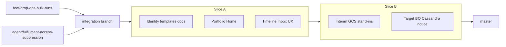
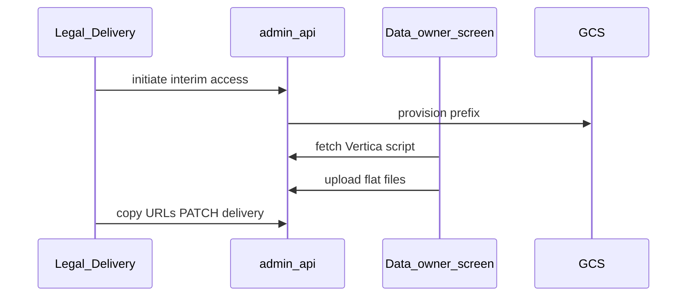

## Goal Capsule

Finish the **Legal and data-owner fulfillment journeys** in **two demonstrable ship slices**: **Slice A** — Legal correspondence and request record (identity, templates, documents, communication ledger, timeline-first detail, **Legal Home global portfolio view**, agent upload with vendor quality check, gate-oriented Legal Inbox); **Slice B** — fulfillment integration immediately after, starting with **Slice B interim stand-ins** (suppression data warehouse identifier batch to Google Cloud Storage with in-app ping and/or copyable URL; access Vertica script copy-paste + provisioned upload location) while Cassandra connector and full automated access reproduction mature; then **target automation** (BigQuery access pack + signed URL, Cassandra `restricted_person_id` suppression via secure sockets layer application programming interface, DROP notice). Persona Homes and Inboxes are largely built on `feat/drop-ops-bulk-runs`; fulfillment automation is largely built on `agent/fulfillment-access-suppression`. Merge both tracks to `master` with acceptance examples per slice.

**Authority:** this Product Contract > ADR-06 (Jira transition) > ADR-16 (approval rules) > ADR-32/36/37/38 (fulfillment and notice) > prior ops IA recipes.

**Product Contract preservation:** Product Contract unchanged — Planning Contract resolves branch merge order, interim-vs-target sequencing, and deferred implementation-time refinements.

**Stop when:** Definition of Done below is met for both slices. Do not ship platform SMTP to requestors, silent auto-reject for out-of-jurisdiction routing, or non-data-vertical automated fulfillment in this program.

**Absorbed from:**

- `docs/plans/2026-07-23-001-feat-legal-command-center-plan.md` (deleted after this plan landed)
- `docs/plans/2026-07-21-001-feat-fulfillment-access-suppression-plan.md` (deleted after this plan landed)

---

## Product Contract

### Summary

Legal and the data vertical data owner already have persona-shaped Homes, Inboxes (Triage · Notice · Delivery · Escalations), workflow conditions, agent upload, and recommended California DROP `response_status` review on a feature branch. Fulfillment automation (BigQuery access export, suppression artifacts, Wednesday DROP upload/amend) exists on a separate branch. **Slice A** delivers the Legal trust-and-record loop: identity verification, editable templates, document attachments, extended communication ledger, timeline-first request detail, **Legal Home as a global portfolio view** (action counts, pipeline visualization, data-owner queue portfolio, attention warnings, out-of-app outreach context for data owners, and read-only upcoming bulk intake), gate-oriented Legal Inbox, and agent vendor quality check — even if fulfillment artifacts land in the same release or immediately after. **Slice B** merges fulfillment trees, wires **request type** to access vs suppression paths, and ships **interim stand-ins first** — suppression data warehouse identifier batch in Google Cloud Storage with in-app ping and/or copyable object URL; access templated Vertica script with pre-filled data warehouse identifiers plus provisioned upload location on the fulfillment screen — then **target automation** (BigQuery access pack + signed URL, Cassandra `restricted_person_id` suppression via secure sockets layer application programming interface with payload recorded on the fulfillment attempt queue row, DROP notice in Legal Delivery).

### Problem Frame

Operators still cannot complete access handoff in Legal Delivery (no real pack or signed URL on the Legal-facing branch). Suppression still stubs `response_status` without data warehouse identifier artifacts on that branch. While waiting for the Cassandra connector and fuller automated access reproduction, operators need **processable stand-ins**: a batch data warehouse identifier list they can hand to a colleague, and a copy-paste Vertica script with uploads into a provisioned Google Cloud Storage location — not blocked on BigQuery marts or live Cassandra integration. Fulfillment branch lacks Legal Conditions, Notice, and Delivery lanes. Neither branch is on `master`. Legal still sees ops-style matching chrome in Inbox instead of a gate-oriented case queue. Request detail feels data-engineer-oriented rather than history-first. Legal Home is action-count cards only — not a portfolio view of pipeline volume, data-owner queues, or items needing attention. Residual product gaps (identity verification, templates, attachments, agent vendor quality checks, out-of-app outreach context on Home) block replacing Jira/Sheet practice for Julianne Kwon's Legal team and Russ's data vertical.

### Key Decisions (carried forward)

- KD1. **Copy-paste handoff, not platform send:** access delivery is shareable HTTPS URL + delivery status in UI; operator drafts email outside the platform (no SMTP worker in this program).
- KD2. **Fulfillment minimum viable product = data vertical only** after approved DROP `response_status` (or Legal Triage reject that sets status).
- KD3. **Delivery ledger via `communication_attempts`:** purpose `access_delivery` with statuses pending / delivered / failed / recalled; extend for broader mail attempt tracking.
- KD4. **Workflow conditions route** out-of-jurisdiction-style hits to Legal Inbox · Triage — never silent terminal reject without explicit Legal action.
- KD5. **California DROP `response_status` vocabulary** (`2` Exempted · `3` Deleted · `4` Opted out · `5` Not found) everywhere operators approve or reject.
- KD6. **Access reproduction — target automation uses BigQuery** in `example-gcp-project` (privacy-install mapped allowlist); full table parity deferred to dbt `access_export` marts. **Interim stand-in (Slice B interim)** uses templated Vertica script with pre-filled data warehouse identifiers — copy-paste into Vertica by the **data vertical data owner** after Legal initiates interim access fulfillment (KD14); not automated BigQuery export `(session-settled: user-directed — interim Vertica script overrides "BigQuery first" for near-term access fulfillment)`.
- KD7. **Wednesday DROP cadence:** upload 00:00 America/Los_Angeles; amend 04:00 America/Los_Angeles per DROP Specs v1.2.0.
- KD8. **Suppression delivery — target automation via Cassandra application programming interface** `(session-settled: user-directed — option 1)`. **Target automation cutover:** write suppressions to `restricted_person_id` through the secure sockets layer application programming interface infrastructure the data vertical is providing — not the fulfillment-branch pipe-delimited data warehouse identifier file artifact path alone, and not the virtual private network tunnel scaffold. **Queue audit:** the request payload sent to Cassandra is **recorded on the fulfillment or suppression attempt row** in the queue table (prefer existing `data_fulfillment_attempts` or equivalent suppression-attempts queue); column shape may be refined in implementation — Product Contract requires payload persisted on the queue row for audit and retry, with no personally identifying information in logs. **Interim stand-in (Slice B interim):** batch data warehouse identifier list in Google Cloud Storage (KD11); notify fulfiller via in-app ping and/or copyable object URL for external email draft to staff colleague — ships first while Cassandra connector matures.
- KD9. **Ship sequencing — Slice A then Slice B** `(session-settled: user-directed — chosen over access-first or suppression-first: Legal trust/record loop first, then fulfillment)`. **Slice A** = Legal correspondence and request record (identity verification, admin-editable email templates, document attachments, extended communication ledger, timeline-first request detail, Legal Home global portfolio view, gate-oriented Legal Inbox, agent vendor dropdown and expected-shape quality check). **Slice B** = fulfillment integration immediately after — **Slice B interim stand-ins first** (suppression data warehouse identifier batch + access Vertica script + provisioned upload), then **target automation** (request type drives routing, BigQuery access pack + signed URL, Cassandra suppression delivery, DROP notice upload/amend). Slice A may ship alone as the first demonstrable release; Slice B interim may follow without a long gap.
- KD10. **Legal Home global portfolio view** `(session-settled: user-directed — chosen over action-count cards only)`. Legal Home is Legal's command-center landing — not only Triage/Notice/Delivery/Escalations action counts. It includes: **read-only upcoming scheduled connectors / next bulk intake**; **pipeline volume visualization** (graph/motion — e.g. pie or similar) for requests in the current processing pipeline; **global view of data owners and their pending queues**; **attention warnings** for requests needing Legal or data-owner action (explicit where Escalations and overdue cues do not already cover); and **out-of-app outreach support for data owners** when something is pending for them — Home surfaces contact identity, pending queue context, and enough summary for Legal to reach data owners via Slack or another external channel; **not** an in-app notification or badge and **not** platform email to data owners as the Slice A nudge action. Scope stays Slice A persona Home — **not** a full ops Pipeline console for Legal.
- KD11. **Suppression interim stand-in** `(session-settled: user-directed)`. Produce a **batch data warehouse identifier list** stored in Google Cloud Storage; deliver to fulfiller via **in-app ping** and/or **copyable HTTPS URL to the object** for paste into a draft email to a staff member or colleague. Artifact remains in the provisioned bucket — same copy-paste handoff pattern as KD1, not platform send.
- KD12. **Access interim stand-in** `(session-settled: user-directed)`. Platform renders a **templated Vertica script** with the requester's data warehouse identifier(s) pre-filled in all required places. **Data vertical data owner** copies the script, runs it in Vertica, obtains flat-file output, and uploads from the **data-owner fulfillment screen** after Legal initiates interim access work (KD14). Platform **provisions a per-request Google Cloud Storage bucket or prefix**; fulfillment screen supports **multiple uploads** into that location (operators expect **two flat files** for access fulfillment). Flow: Legal initiates → data owner copies script → runs in Vertica → uploads flat file(s) → Legal sees handoff URLs and copies shareable URL for external email draft when ready.
- KD13. **Signed URL and access handoff URL time-to-live ~30 days** `(session-settled: user-directed — user confirmed "30 days is fine"; not assumed)`. Shareable HTTPS URLs for access fulfillment expire after **approximately 30 days** — applies to **interim upload object URLs** (R35) and **target automation signed access packs** (R7). Legal copies URL into draft outbound per KD1; platform does not send email.
- KD14. **Interim access fulfillment UI audience — Legal initiates; data vertical data owner executes** `(session-settled: user-directed — Q5 option 4)`. **Legal** triggers or assigns interim access fulfillment from Legal Delivery (or equivalent) and sees handoff readiness — upload complete, copyable URLs, draft-outbound template support. **Data vertical data owner** runs the Vertica script copy-paste loop and uploads flat file(s) on the data-owner fulfillment screen. Legal does not execute Vertica or upload access artifacts; data owner does not own requestor correspondence or delivery status PATCH — that remains Legal per KD1.

### Requirements (remaining backlog)

**Integration and release**

- R1. Merge Legal persona surfaces from `feat/drop-ops-bulk-runs` and fulfillment automation from `agent/fulfillment-access-suppression` into one integration branch and land on `master` without regressing super-admin pipeline Dashboard and Workers gating. Slice A may land Legal-branch surfaces first; Slice B completes fulfillment merge.
- R2. Non-production **`ADMIN_API_LEGALS`** allowlist is operational for real Legal logins (not only super-admin simulate-role for quality assurance). **(Slice A)**
- R3. Product acceptance examples from the Legal Command Center plan (out-of-jurisdiction appears in Triage; bulk reject; send to matching; data-owner approve/change/escalate/assign; agent upload without client-side cleaning) are demonstrable with a formal browser checklist — today thin (Escalations empty until data owner escalates). **(Slice A baseline; Slice B adds Delivery/Notice examples)**

**Slice A — Legal correspondence and request record**

- R4. **Request type** is visible to Legal on list and detail surfaces (delete, access, opt_out, combined). **(Slice A — visibility; Slice B — drives fulfillment routing)**
- R16. **Identity verification** on requests: status, method, actor, notes, timestamp (admin-api mutations; Legal-visible step in correspondence flow).
- R17. **Admin-editable email templates** with placeholders (name, address, shareable URL when available); copy-paste into external mail now; platform send later.
- R18. Extend **mail / communication attempt ledger** beyond `access_delivery` for general outbound/inbound attempt tracking (table exists; product surfaces incomplete).
- R19. **Request document upload** — attachments stored as records linked to requests (Legal and ops can attach evidence, agent correspondence, exported mail formats, etc.).
- R20. **Request detail / drawer:** timeline and history-first layout — traceback of events and updates; reduce data-engineer journey chrome for Legal and data-owner personas.
- R21. **Legal Home global portfolio view:** high-level counts of open requests **by request type** (delete, access, opt_out, combined) wired to real data (not zero stubs); plus pipeline visualization, data-owner queue portfolio, attention warnings, and out-of-app outreach context for data owners (R26–R30). Action-count cards for Triage · Escalations · Notice · Delivery remain entry points into Inbox — Home is more than those cards alone.
- R26. **Legal Home — upcoming bulk intake:** read-only display of **next scheduled connector runs / next bulk intake** on Legal Home `(session-settled: user-directed — yes)`. Connectors detail stays ops-capable elsewhere; Legal sees schedule summary only — not ops Pipeline console controls.
- R27. **Legal Home — pipeline visualization:** animated chart (e.g. pie or similar with graph/motion) showing **volume in the current processing pipeline** so Legal can see distribution at a glance (by request type, status stage, or equivalent aggregate — exact breakdown TBD in visual design).
- R28. **Legal Home — data-owner queue portfolio:** **global view of data owners and their pending queues** — what each data owner has pending (counts and/or list summary per owner, drill-through to My work or request list filtered by owner).
- R29. **Legal Home — attention warnings:** explicit **warnings when requests are pending that need attention** — surfaced on Home where Escalations inbox and overdue cues alone are insufficient (e.g. stale assignments, SLA risk, unassigned backlog); warning criteria TBD with Legal operators.
- R30. **Legal Home — out-of-app outreach to data owners:** When something is pending for a data owner, Legal Home **surfaces enough portfolio context** — contact identity, pending queue summary, and optionally copyable outreach text or Slack-oriented hints — so Legal can reach that data owner via **Slack message or another external channel**. **No in-app nudge delivery mechanism** (no notification, badge, or assignment ping from the platform) and **no platform email to data owners** as the Slice A nudge action. Do not invent Slack application programming interface integration unless required; prefer out-of-app outreach using Home portfolio context.
- R22. **Agent batch upload:** improve findability for Legal (registered-agent bulk upload surface in Legal nav); **authorized-agent vendor dropdown** on upload; **expected-shape quality check** per vendor beyond deterministic normalizer (trim, state codes, email split limits) so backend cleaning scripts can be vendor-specific.
- R23. **Legal Inbox gate-oriented UX:** default to Triage · Escalations · Notice · Delivery case queues — not ops matching/comms feed. Legal sees condition-routed triage (bulk reject, review, send to matching), escalations with data-owner comments, notice review, and delivery handoff prep — not primary matching-results approve path (that remains data-owner My work).
- R24. **Persona navigation:** ops **Dashboard** and **Workers** pages hidden from Legal; Legal-facing pages use persona restyle (not shared ops chrome). Data-owner and employee My work surfaces remain distinct.

**Slice B — Fulfillment integration**

**Slice B interim — stand-ins (ship first, after Slice A)**

- R31. **Suppression interim stand-in:** after approved matching review for delete / opt_out / combined suppression path, produce a **batch pipe-delimited data warehouse identifier list** in Google Cloud Storage under the bulk run artifact layout; notify assigned fulfiller via **in-app ping** and/or surface a **copyable HTTPS URL to the object** for paste into a draft email to a staff member or colleague `(interim stand-in — KD11)`.
- R32. **Access interim stand-in — Vertica script:** on access (or combined access leg), after **Legal initiates** interim access fulfillment (KD14), render a **templated Vertica script** with the requester's data warehouse identifier(s) **pre-filled in all required places** on the **data-owner fulfillment screen**; data vertical data owner copies script, runs in Vertica outside the platform, obtains flat-file output `(interim stand-in — KD12, KD14; intentional copy-paste, not automated query execution)`.
- R33. **Access interim stand-in — provisioned upload location:** when Legal initiates interim access fulfillment, platform provisions a **per-request Google Cloud Storage bucket or prefix** for access fulfillment artifacts before data-owner upload `(interim stand-in — KD12, KD14)`.
- R34. **Access interim stand-in — fulfillment screen uploads:** **data-owner fulfillment page/screen** supports **multiple file uploads** into the provisioned location; data vertical data owner uploads after running Vertica; operators expect **two flat files** for a typical access fulfillment `(interim stand-in — KD12, KD14)`.
- R35. **Access interim stand-in — handoff:** after data-owner upload(s), **Legal Delivery** surfaces **copyable URL(s)** to uploaded object(s) (~30-day time-to-live per KD13) and draft-outbound template support per KD1; Legal PATCHes delivery status via `communication_attempts` purpose `access_delivery` when artifacts are ready `(interim stand-in — KD14; Legal handoff after data-owner execute/upload loop)`.

**Slice B — target automation (parallel or after interim)**

- R5. Fulfillment dispatcher routes by `request_type` after approved matching review — access → reproduction; delete / opt_out → suppression; combined types run both paths — not stub `response_status` only on the Legal-facing branch.
- R6. **Target automation — access export:** writes allowlisted BigQuery tables to `gs://{bucket}/bulk-run/{process_id}/request/{request_id}/` with manifest (included vs deferred tables, row counts, no personally identifiable information in logs) `(target automation — KD6)`.
- R7. **Target automation — role-gated API** returns **shareable HTTPS signed URL** (~30-day time-to-live per KD13) plus internal `gs://` artifact URI; today `shareable_url` is always `None` on fulfillment branch `(target automation; interim access uses R32–R35 instead)`.
- R8. Legal Delivery lane: copy URL, **Draft outbound** template with URL in body, and PATCH delivery status (pending / delivered / failed / recalled) — wired to real artifacts (interim uploads or target access pack), not ledger-only.
- R9. On successful access artifact readiness (interim upload complete or target export complete), auto-create pending `communication_attempts` row with purpose `access_delivery` (fulfillment branch creates on export; Legal branch has PATCH without export trigger).
- R10. **Target automation — suppression fulfillment** enqueues suppression work on `data_fulfillment_attempts` (or equivalent suppression-attempts queue) with reaper registration; **records the Cassandra request payload on the attempt row** for audit and retry (no personally identifying information in logs); sets DROP `response_status` on success `(target automation — KD8; interim suppression uses R31 first)`.
- R11. **Target automation — suppression delivery to Cassandra:** call the secure sockets layer application programming interface infrastructure to write suppressions to `restricted_person_id` — settled cutover path per KD8; replace fulfillment-branch pipe-delimited data warehouse identifier file artifact as the primary downstream delivery mechanism when connector is ready `(target automation; interim suppression uses R31 first)`.
- R12. Restore `drop_notice_dispatcher`; schedule Wednesday 00:00 PT upload and 04:00 PT amend; align `drop_connector` to OpenAPI v1.2.0 (HTTP 202 success, 409 handling, filename suffix rules).
- R13. Hash-index refresh rematch of open requests → fulfill may change status → amend eligibility when status differs from last ledger submission.

**Infrastructure and data layer (Slice B unless noted)**

- R14. Real Google Cloud Storage transport for fulfillment artifacts (replace stub-default `GCS_TRANSPORT`).
- R15. dbt project `transform/access_export/` for daily vs freeze BigQuery marts — fulfillment reads marts, not raw mirrors (deferred parity work from fulfillment plan; required for full privacy-install coverage).

**Privacy and control plane (both slices)**

- R25. No personally identifiable information, raw hashes, or data warehouse identifiers in logs, audit JSONB, or generic journey list payloads; fulfillment artifact uniform resource identifiers only on role-gated endpoints (existing forbidden-key rules). **Suppression target automation:** Cassandra request payload is recorded on the fulfillment or suppression attempt queue row — not in logs.

### Key Flows

- F1. **Legal Home global portfolio → Inbox → request timeline** **Covers R21, R26–R30, R23, R24.** Legal opens Home: action counts by request type; read-only upcoming scheduled connectors / next bulk intake; pipeline volume chart; data-owner queue portfolio; attention warnings; portfolio context for out-of-app outreach when owner work is pending (contact identity, pending summary, optional copyable text). From Home, Legal enters Inbox (Triage · Escalations · Notice · Delivery) or drills into a request in timeline-first detail — not ops pipeline journey chrome.
- F2. **Agent upload with vendor + quality check** **Covers R22.** Legal navigates Upload, selects authorized-agent vendor, submits bulk file; platform runs expected-shape quality check for that vendor, then applies vendor-specific cleaning on ingest; failures surface actionable QC errors before requests enter matching.
- F3. **Identity verify → draft template → confirm sent** **Covers R16, R17, R18.** Legal marks identity verified (method, notes, timestamp), selects admin-editable template with placeholders, copies body including shareable URL when available (Slice B), sends via external mail, records communication attempt and confirms sent — delivery status PATCH in Slice B when access pack exists.
- F4. **Document attach on request** **Covers R19, R20.** Legal or ops uploads documents (evidence, agent correspondence, exported mail) linked to the request; attachments appear on request timeline as records.
- F5. **Request type → fulfillment routing** **Covers R4, R5, R31–R35 (interim), R6–R13 (target). (Slice B).** After data-owner approves recommended California DROP `response_status`, fulfillment dispatcher routes by request type. **Interim:** suppression → batch data warehouse identifier list in Google Cloud Storage with in-app ping and/or copyable URL (R31); access → Legal initiates → data-owner Vertica script + provisioned upload + Legal handoff (R32–R35, KD14); combined runs both interim legs. **Target automation:** access BigQuery export + signed URL to Legal Delivery; delete/opt_out suppression → Cassandra `restricted_person_id` via secure sockets layer application programming interface with payload on `data_fulfillment_attempts` attempt row + notice path; combined runs both target paths when ready.
- F6. **Legal out-of-app outreach from Home** **Covers R28, R30, Q4.** Legal sees a data owner with pending queue items on Home portfolio; uses surfaced contact identity, pending summary, and optional copyable outreach text to reach that data owner via Slack or another external channel — not via in-app notification, badge, or platform email to the data owner. Data owner continues to see pending work on My work as today. No platform SMTP to requestors.
- F7. **Suppression interim — batch list handoff** **Covers R31, KD11.** After suppression path triggers, platform writes batch pipe-delimited data warehouse identifier list to Google Cloud Storage; fulfiller receives **in-app ping** and/or copies **object URL** into draft email to staff colleague; delivery status tracked outside platform send (KD1).
- F8. **Access interim — Legal initiates → data owner executes → Legal handoff** **Covers R32–R35, KD12, KD14.** Legal triggers or assigns interim access fulfillment from Legal Delivery. Data vertical data owner opens **data-owner fulfillment screen**, copies **templated Vertica script** with pre-filled data warehouse identifiers, runs in Vertica, uploads **one or more flat files** (typically two) into **provisioned per-request Google Cloud Storage location**. Legal sees upload-complete handoff in Legal Delivery, copies shareable URL(s) into draft outbound template, and PATCHes delivery status when sent.

### Acceptance Examples

**Slice A — Legal correspondence and request record**

- AE1. Legal marks a request identity verified with method and notes; status and actor appear on request timeline.
- AE2. Legal selects an admin-editable template; placeholders expand (name, address, shareable URL when present); body copies to clipboard for external mail.
- AE3. Legal attaches a document on a request; attachment appears on timeline without raw personally identifying information in list payloads.
- AE4. Legal Home shows open counts **by request type**, pipeline visualization, data-owner queue portfolio, attention warning, and read-only next bulk intake schedule — not zero stubs.
- AE5. Legal sees a data owner with pending queue items on Home; contact identity and pending summary support a Slack draft composed outside the platform (no in-app nudge, no platform email to the data owner).
- AE6. Agent upload: Legal selects authorized-agent vendor; expected-shape quality check fails before ingest on malformed file; success path enters triage or matching without client-side cleaning.
- AE7. Legal Inbox defaults to gate-oriented Triage · Escalations · Notice · Delivery — not ops matching feed as primary path.

**Slice B interim — stand-ins**

- AE8. After suppression path triggers, fulfiller receives in-app ping and/or copies Google Cloud Storage object HTTPS URL into draft email to staff colleague (no platform send).
- AE9. Legal initiates interim access; data owner copies pre-filled Vertica script, uploads two flat files; Legal Delivery shows copyable URLs (~30-day time-to-live) and draft outbound template; Legal PATCHes `access_delivery` status when sent externally.

**Slice B — target automation**

- AE10. Access request: BigQuery export completes; Legal copies signed shareable HTTPS URL (~30 days); pending `communication_attempts` row exists; delivery status PATCH succeeds.
- AE11. Suppression request: Cassandra secure sockets layer application programming interface payload recorded on `data_fulfillment_attempts` row; DROP `response_status` set; no personally identifying information in logs.
- AE12. Wednesday DROP upload returns HTTP 202; hash-index rematch status change enqueues amend eligibility.

### Scope Boundaries

**In (this program)**

- Slice A then Slice B as defined in KD9 — **Slice B interim stand-ins may ship immediately after Slice A** (KD11, KD12, R31–R35).
- Legal persona surfaces already built on feature branch (Triage, Notice, Delivery, Escalations, Conditions, Upload, data-owner My work) — finish gate-oriented Inbox, timeline UX, and **Legal Home global portfolio** (KD10, R26–R30).
- Copy-paste access handoff and manual delivery status (KD1) — applies to **interim upload URLs** and **target signed URLs** (~30-day time-to-live per KD13).
- **Slice B interim:** suppression data warehouse identifier batch in Google Cloud Storage with in-app ping and/or copyable URL; access **Legal initiates → data vertical data owner executes** (KD14): templated Vertica script copy-paste + provisioned Google Cloud Storage upload on **data-owner fulfillment screen** (multiple files) → Legal handoff in Delivery.
- Legal Home pipeline visualization in Slice A — **not** expansion into full ops Pipeline console for Legal.

**Out / deferred**

- Platform SMTP or automated consumer email (ADR-28 automated delivery).
- Non-data-vertical fulfillment automation.
- Live Tier-C suppression HTTP connectors.
- **Automated Vertica query execution from the platform** — interim stand-in uses copy-paste script only; live Vertica integration remains out.
- Production California DROP cutover beyond sandbox guards.
- Rich multi-rule condition editor beyond one active `intake.route_triage` rule.
- Full Jira master/batch grain as first-class product object.
- Legal control of connector execution from Home (read-only schedule only per R26).
- **Target automation** (not interim): full BigQuery allowlist export access pack (R6–R7), Cassandra `restricted_person_id` suppression via secure sockets layer application programming interface with queue-row payload (R10–R11), dbt `access_export` marts parity (R15) — parallel or after interim stand-ins; label clearly in implementation.

### Outstanding Questions

| ID | Question | Status |
|----|----------|--------|
| Q1 | Signed URL / access handoff URL time-to-live | **Settled** — KD13 (~30 days) |
| Q2 | Target suppression delivery mechanism | **Settled** — KD8: Cassandra secure sockets layer application programming interface; interim Google Cloud Storage batch first |
| Q3 | Legal Home upcoming bulk intake visibility | **Settled** — KD10, R26 |
| Q4 | Legal → data owner nudge mechanism | **Settled** — KD10, R30, F6: out-of-app only |
| Q5 | Interim fulfillment UI audience | **Settled** — KD14: Legal initiates; data vertical data owner executes |

**Deferred (non-blocking — implementer resolves during execution):**

| ID | Topic | Default if unresolved |
|----|-------|---------------------|
| DQ1 | `data_fulfillment_attempts` Cassandra payload column shape | `cassandra_request_payload JSONB` on attempt row; redact forbidden keys before persist |
| DQ2 | Secure sockets layer application programming interface contract from data vertical | Stub transport in `app/cassandra/` until contract lands; U16 gates on interface availability |
| DQ3 | Legal Home attention-warning criteria (R29) | Stale open assignment >7 days or unassigned data-owner queue >3 items — tune with Legal operators post-ship |
| DQ4 | Pipeline chart breakdown (R27) | By request type × coarse stage (triage / matching / notice / delivery) |
| DQ5 | dbt `access_export` marts timing vs interim access | Interim Vertica script ships first; target BigQuery export may trail without blocking interim |

### Branch archaeology (historical, brief)

| Tree | Legal persona surfaces | Fulfillment automation |
|------|------------------------|-------------------------|
| `feat/drop-ops-bulk-runs` (~`1ea1990`, current) | Largely shipped; not on `master` | Stub dispatcher + Legal Delivery ledger/UI only |
| `master` | Partial (`legal` role; no Conditions / Notice / Delivery lanes from feature branch) | Stub dispatcher only |
| `agent/fulfillment-access-suppression` (~`8d5363d`, not merged) | Pre–Legal Command Center | Most fulfillment units U1–U8 present; signed URL not implemented |

Stale note: the superseded Legal Command Center plan appendix claimed agent CSV upload does not exist; current branch ships `POST /requests/agent-batch`.

### Sources

- KB: `01-ARCHITECTURE/Request-Process-Requirements.md` (Implementation status)
- Repo: `clients/web` Legal/ops Inbox; `app/data_fulfillment_dispatcher/`; `app/drop_notice_dispatcher/`; `.agent/modules/design-taste-ops-ia.md`
- Prior plans: `docs/plans/2026-07-23-001-feat-legal-command-center-plan.md`, `docs/plans/2026-07-21-001-feat-fulfillment-access-suppression-plan.md`
- Session transcript: Legal surface gaps, Slice A/B sequencing, Legal Home portfolio, Slice B interim stand-ins, KD13 ~30-day URL time-to-live, Q5 Legal-initiate / data-owner-execute split, Q2 Cassandra suppression cutover + queue-row payload (2026-07-23 – 2026-07-24)
- Scratch audit: `/tmp/compound-engineering/ce-brainstorm/fulfill-2026-07-23/completed-vs-gaps.md`

---

## Planning Contract

### Assumptions

- PA1. **Slice A lands from `feat/drop-ops-bulk-runs`** (or integration branch cut from it) before Slice B fulfillment merge — Legal trust loop is demonstrable without waiting for Cassandra connector.
- PA2. **`ADMIN_API_LEGALS`** is populated in non-production before Slice A acceptance; super-admin simulate-role remains QA fallback (R2).
- PA3. Legal Command Center units from `docs/plans/2026-07-23-001-feat-legal-command-center-plan.md` (U1–U7) are **largely implemented** on the Legal branch — Slice A units here extend gaps (identity, templates, documents, portfolio Home, vendor quality check, timeline UX).
- PA4. Fulfillment units from `docs/plans/2026-07-21-001-feat-fulfillment-access-suppression-plan.md` (U1–U8) live on `agent/fulfillment-access-suppression` — cherry-pick into integration branch for U10–U17; adapt suppression target path per KD8 (Cassandra, not file-only).
- PA5. **Interim stand-ins ship before target automation** where both apply (KD9, KD11, KD12).
- PA6. Copy-paste handoff applies to interim upload URLs and target signed URLs (~30-day time-to-live per KD13).
- PA7. Vertica script is **rendered for copy-paste only** — no live Vertica execution from the platform.
- PA8. Portfolio aggregates are **server-computed** on admin-api — Legal Home does not scrape ops Pipeline console APIs.

### Key Technical Decisions

| ID | Decision |
|----|----------|
| KTD-1 | (session-settled: user-directed — inherits KD9) **Slice A then Slice B** on one integration branch → `master`; Slice A may merge first. |
| KTD-2 | **Branch merge order:** cut `agent/legal-fulfillment-integration` from `feat/drop-ops-bulk-runs`; merge `agent/fulfillment-access-suppression`; resolve request-type routing + Legal Delivery overlap in U10 before interim stand-ins. |
| KTD-3 | **Identity verification:** `request_identity_verifications` append-only table + latest on request detail; Legal/admin mutations only. |
| KTD-4 | **Email templates:** `email_templates` table with slug, subject, body, placeholder schema; admin-api CRUD; Legal render with request context. |
| KTD-5 | **Request documents:** `request_documents` metadata + GCS under `requests/{request_id}/documents/`. |
| KTD-6 | **Communication ledger extension:** extend `communication_attempts` purposes (`outbound_manual`, `inbound_manual`, `notice_attempt`). |
| KTD-7 | **Legal Home portfolio API:** `GET /legal/home/portfolio` (LegalPrincipal) — type counts, pipeline stages, data-owner queues, warnings, read-only schedule excerpt. |
| KTD-8 | **Gate-oriented Inbox:** Legal default tab `triage`; History-first request detail for Legal/data_owner. |
| KTD-9 | **Agent vendor QC:** extend `authorized_agents` with `expected_shape_profile`; vendor validators after deterministic normalizer. |
| KTD-10 | (session-settled: user-directed — inherits KD11) **Suppression interim:** pipe-delimited batch at `bulk-run/{process_id}/suppression/dwids_interim.txt`; live-events ping + signed URL. |
| KTD-11 | (session-settled: user-directed — inherits KD12, KD14) **Access interim:** Jinja Vertica template; prefix `bulk-run/{process_id}/request/{request_id}/interim/`; Legal initiate provisions prefix; data-owner upload route. |
| KTD-12 | (session-settled: user-directed — inherits KD13) **Shareable URL ~30 days** via GCS V4 signed URL for interim and target packs. |
| KTD-13 | (session-settled: user-directed — inherits KD8) **Target suppression:** Cassandra secure sockets layer client; payload JSONB on `data_fulfillment_attempts`. |
| KTD-14 | **Fulfillment queue:** one `data_fulfillment_attempts` with `step IN ('suppression','reproduction','interim_upload')`. |
| KTD-15 | **Target access export:** BigQuery from dbt `transform/access_export/` marts; interim path independent. |
| KTD-16 | **Fulfillment artifact API:** implement `GET /ops/fulfillment/requests/{request_id}/artifact` (web already calls; server missing). |

### High-Level Technical Design





### Risks and Mitigations

| Risk | Mitigation |
|------|------------|
| Branch merge conflicts | Integration branch early; U10 shared types before Delivery UI |
| Missing artifact API (404 today) | U13/U15 implement route before enabling copy URL |
| Cassandra contract delay | Interim R31 first; U16 behind feature flag |
| Portfolio aggregate performance | SQL counts only; paginate drill-through |

### System-Wide Impact

- Auth: portfolio and artifact endpoints extend Legal/data_owner gates.
- Privacy: forbidden keys on journey lists; Cassandra payload on queue row only (R25).
- Infra: fulfillment bucket, signed URL service account, notice schedulers.

### Deferred to Follow-Up Work

- Platform SMTP; non-data-vertical fulfillment; Tier-C connectors; production DROP cutover; full BQ parity before dbt complete.

---

## Implementation Units

| U-ID | Title | Depends on |
|------|-------|------------|
| U1 | Identity verification | — |
| U2 | Admin-editable email templates | — |
| U3 | Communication ledger extension | — |
| U4 | Request document attachments | U10 or stub GCS |
| U5 | Timeline-first detail + request_type visibility | — |
| U6 | Legal Home global portfolio view | U5 |
| U7 | Agent vendor dropdown + shape QC | — |
| U8 | Gate-oriented Legal Inbox + persona nav | U5 |
| U9 | Integration branch + Legal allowlist ops | U1–U8 |
| U10 | Fulfillment schema + GCS + request_type routing | U9 |
| U11 | Suppression interim DWID batch | U10 |
| U12 | Access interim Vertica script + DO upload | U10 |
| U13 | Access interim Legal Delivery handoff | U12, U2 |
| U14 | Target BigQuery access export + dbt | U10 |
| U15 | Target signed URL + Delivery wiring | U14, U13 |
| U16 | Target Cassandra suppression + payload | U10 |
| U17 | Target notice dispatcher + amend | U16 |
| U18 | Privacy gates + acceptance checklist | U13, U15 |

### U1. Identity verification

**Goal:** Legal records identity verification status, method, actor, notes, timestamp.

**Requirements:** R16, F3, AE1; KTD-3

**Dependencies:** none

**Files:**
- `db/migrations/YYYYMMDDHHMMSS_intake_create_request_identity_verifications.sql`
- `app/admin_api/src/admin_api/request_correspondence.py` (new)
- `app/admin_api/tests/test_request_correspondence.py` (new)
- `clients/web/src/components/requests/RequestTriageDialog.tsx`

**Approach:** Append-only rows; latest on detail; timeline event `identity.verified`.

**Test scenarios:**
- Happy: Legal POST → detail shows status, method, actor, timestamp.
- Error: data_owner POST → 403.
- Covers AE1.

**Verification:** Correspondence tests green.

### U2. Admin-editable email templates

**Goal:** Super-admin edits templates; Legal renders placeholders and copies for external mail.

**Requirements:** R17, F3, AE2; KTD-4

**Dependencies:** none

**Files:**
- `db/migrations/YYYYMMDDHHMMSS_intake_create_email_templates.sql`
- `app/admin_api/src/admin_api/request_correspondence.py`
- `clients/web/src/routes/settings/email-templates.tsx` (new)
- `clients/web/src/components/requests/RequestTriageDialog.tsx`

**Approach:** Slugs `access_delivery`, `general_correspondence`, `data_owner_outreach_hint`; placeholders `{{requestor_name}}`, `{{shareable_url}}`; replace hardcoded `buildAccessDeliveryDraft`.

**Test scenarios:**
- Covers AE2: template render expands placeholders.
- Error: invalid slug → 404.

**Verification:** Template CRUD + render tests.

### U3. Communication ledger extension

**Goal:** General outbound/inbound attempt tracking beyond `access_delivery`.

**Requirements:** R18, F3; KTD-6

**Dependencies:** none

**Files:**
- `db/migrations/YYYYMMDDHHMMSS_intake_extend_communication_purposes.sql` (if needed)
- `app/admin_api/src/admin_api/request_correspondence.py`
- `app/admin_api/src/admin_api/request_journey.py`
- `clients/web/src/components/requests/RequestTriageDialog.tsx`

**Test scenarios:**
- Happy: append `outbound_manual` → listed on History tab.
- Integration: existing `access_delivery` PATCH unchanged.

**Verification:** Correspondence list tests.

### U4. Request document attachments

**Goal:** Upload documents linked to requests; timeline visibility.

**Requirements:** R19, F4, AE3; KTD-5

**Dependencies:** U10 or stub GCS locally

**Files:**
- `db/migrations/YYYYMMDDHHMMSS_intake_create_request_documents.sql`
- `app/admin_api/src/admin_api/request_correspondence.py`
- `libs/habeas-privacy-core/src/habeas_privacy_core/adapters/gcs.py`

**Test scenarios:**
- Covers AE3: upload → timeline entry; list payloads omit PII.
- Error: forbidden role → 403.

**Verification:** Upload round-trip with fake transport.

### U5. Timeline-first detail and request_type visibility

**Goal:** History-first layout; request type on list and detail.

**Requirements:** R4, R20, F1; KTD-8

**Dependencies:** none

**Files:**
- `clients/web/src/routes/requests/$requestId.tsx`
- `clients/web/src/routes/requests/needs-attention.tsx`
- `app/admin_api/src/admin_api/request_journey.py`
- `app/admin_api/tests/test_request_journey.py`

**Test scenarios:**
- Happy: Legal default History tab; type chip visible.
- Edge: super_admin keeps ops journey default.

**Verification:** Journey tests include `request_type`.

### U6. Legal Home global portfolio view

**Goal:** Portfolio beyond action cards — counts by type, chart, DO queues, warnings, schedule, outreach context.

**Requirements:** R21, R26–R30, F1, F6, AE4–AE5; KTD-7

**Dependencies:** U5

**Files:**
- `app/admin_api/src/admin_api/legal_portfolio.py` (new)
- `app/admin_api/tests/test_legal_portfolio.py` (new)
- `clients/web/src/routes/index.tsx`
- `app/admin_api/src/admin_api/worker_schedules.py` (schedule excerpt)

**Test scenarios:**
- Covers AE4: real aggregates when pipeline has requests.
- Covers AE5: outreach hint without in-app nudge or email.
- Error: data_owner → 403.

**Verification:** Portfolio API + Legal Home smoke.

### U7. Agent vendor dropdown and shape QC

**Goal:** Vendor selection + expected-shape quality check before ingest.

**Requirements:** R22, F2, AE6; KTD-9

**Dependencies:** none

**Files:**
- `libs/habeas-privacy-core/src/habeas_privacy_core/models/intake.py`
- `libs/habeas-privacy-core/tests/test_intake_vendor_qc.py` (new)
- `app/admin_api/src/admin_api/main.py`
- `app/admin_api/tests/test_requests.py`
- `clients/web/src/routes/requests/new.tsx`

**Test scenarios:**
- Covers AE6: bad shape → 400; good file → batch id.

**Verification:** Vendor QC + agent-batch tests.

### U8. Gate-oriented Legal Inbox and persona nav

**Goal:** Default Triage; hide ops chrome; Upload findable.

**Requirements:** R23, R24, AE7; KTD-8

**Dependencies:** U5

**Files:**
- `clients/web/src/routes/requests/needs-attention.tsx`
- `clients/web/src/components/NavMenu.tsx`

**Test scenarios:**
- Covers AE7: no Workers; Inbox opens Triage.
- Test expectation: none — browser smoke suffices.

**Verification:** Simulate `legal` nav smoke.

### U9. Integration branch and Legal allowlist ops

**Goal:** Land Slice A; operational `ADMIN_API_LEGALS`; AE1–AE7 checklist.

**Requirements:** R1 (Slice A), R2, R3 baseline; KTD-1, KTD-2

**Dependencies:** U1–U8

**Files:**
- `libs/habeas-privacy-core/src/habeas_privacy_core/auth/README.md`
- `infra/` env docs for `ADMIN_API_LEGALS`

**Test scenarios:**
- Happy: real Legal email → `/me.role == legal`.
- Integration: super_admin Dashboard unchanged.

**Verification:** Manual AE1–AE7 in non-prod.

### U10. Fulfillment schema, GCS transport, request_type routing

**Goal:** Merge fulfillment foundation; route by `request_type`.

**Requirements:** R1, R5, R14; KTD-2, KTD-14, KTD-16

**Dependencies:** U9

**Files:**
- `db/migrations/YYYYMMDDHHMMSS_fulfillment_create_data_fulfillment_attempts.sql`
- `libs/habeas-privacy-core/src/habeas_privacy_core/adapters/gcs.py`
- `app/data_fulfillment_dispatcher/src/data_fulfillment_dispatcher/fulfill.py`
- `app/data_fulfillment_dispatcher/tests/test_fulfill.py`
- `app/reaper/src/reaper/config.py`

**Execution note:** Characterization tests on stub fulfill before routing changes.

**Test scenarios:**
- Happy: delete → `step=suppression`; access → `step=reproduction`.
- Edge: combined → both steps.
- Integration: reaper registers queue table.

**Verification:** Dispatcher + migration tests green.

### U11. Suppression interim — data warehouse identifier batch

**Goal:** Pipe-delimited batch in GCS; in-app ping + copyable URL.

**Requirements:** R31, F7, AE8; KTD-10

**Dependencies:** U10

**Files:**
- `app/data_fulfillment_dispatcher/src/data_fulfillment_dispatcher/suppression_interim.py` (new)
- `app/admin_api/src/admin_api/fulfillment_ops.py` (new)
- `app/admin_api/tests/test_fulfillment_ops.py` (new)

**Test scenarios:**
- Covers AE8: file + URL + ping event (mock).
- Privacy: logs counts only.

**Verification:** Fulfillment + artifact GET tests.

### U12. Access interim — Vertica script and data-owner upload

**Goal:** Legal initiates; data owner copies script and uploads files.

**Requirements:** R32–R34, F8; KTD-11, KD14

**Dependencies:** U10

**Files:**
- `app/data_fulfillment_dispatcher/src/data_fulfillment_dispatcher/access_interim.py` (new)
- `app/admin_api/src/admin_api/fulfillment_ops.py`
- `clients/web/src/routes/fulfillment/access-interim.tsx` (new)

**Test scenarios:**
- Happy: initiate → script with identifiers → multi-file upload.
- Error: Legal cannot upload artifacts.

**Verification:** Initiate/script/upload API tests.

### U13. Access interim — Legal Delivery handoff

**Goal:** Copyable ~30-day URLs; draft template; delivery status PATCH.

**Requirements:** R35, R8–R9 interim, AE9; KTD-12, KTD-16

**Dependencies:** U12, U2

**Files:**
- `app/admin_api/src/admin_api/fulfillment_ops.py`
- `app/admin_api/src/admin_api/approvals.py`
- `clients/web/src/components/requests/RequestTriageDialog.tsx`

**Test scenarios:**
- Covers AE9: upload complete → URLs → PATCH delivered.
- Error: journey list omits `shareable_url`.

**Verification:** Fixes artifact GET 404; AE9 demonstrable.

### U14. Target — BigQuery access export and dbt marts

**Goal:** Export from `transform/access_export/` marts to GCS with manifest.

**Requirements:** R6, R15; KTD-15

**Dependencies:** U10

**Files:**
- `transform/access_export/` (new)
- `app/data_fulfillment_dispatcher/src/data_fulfillment_dispatcher/access_export.py`
- `app/data_fulfillment_dispatcher/tests/test_access_export.py` (new)

**Test scenarios:**
- Happy: mocked export → manifest without PII in logs.

**Verification:** Export tests; dbt project parses.

### U15. Target — signed URL and Legal Delivery

**Goal:** ~30-day signed HTTPS URL for target access packs.

**Requirements:** R7–R9, AE10; KTD-12, KTD-16

**Dependencies:** U14, U13

**Files:**
- `app/admin_api/src/admin_api/fulfillment_ops.py`
- `clients/web/src/components/requests/RequestTriageDialog.tsx`

**Test scenarios:**
- Covers AE10: signed URL + pending ledger + PATCH.

**Verification:** AE10 path in tests.

### U16. Target — Cassandra suppression and queue payload

**Goal:** Write `restricted_person_id`; persist payload on attempt row.

**Requirements:** R10–R11, AE11; KTD-13

**Dependencies:** U10

**Files:**
- `app/cassandra/src/cassandra/`
- `app/data_fulfillment_dispatcher/src/data_fulfillment_dispatcher/suppression.py`

**Test scenarios:**
- Covers AE11: payload on row; no PII in logs.
- Feature flag when connector unavailable.

**Verification:** Mock Cassandra transport tests.

### U17. Target — notice dispatcher and amend schedulers

**Goal:** Wednesday upload/amend; hash rematch eligibility.

**Requirements:** R12–R13, AE12

**Dependencies:** U16

**Files:**
- `app/drop_notice_dispatcher/`
- `app/drop_connector/`
- `infra/` schedulers

**Test scenarios:**
- Covers AE12: upload HTTP 202 + ledger.

**Verification:** Notice + connector tests green.

### U18. Privacy gates and extended checklist

**Goal:** R25 enforcement; AE8–AE12 manual checklist.

**Requirements:** R25, R3 extended, F5

**Dependencies:** U13, U15

**Files:**
- `app/admin_api/tests/test_request_journey.py`
- `app/admin_api/tests/test_fulfillment_ops.py`

**Test scenarios:**
- Error: artifact URL in needs-attention list → test fails.

**Verification:** Privacy regression tests; extended checklist.

---

## Verification Contract

```bash
uv sync --all-packages
uv run --group dev pytest app/admin_api/tests/test_request_correspondence.py app/admin_api/tests/test_legal_portfolio.py app/admin_api/tests/test_fulfillment_ops.py app/admin_api/tests/test_request_journey.py app/admin_api/tests/test_drop_pipeline.py app/admin_api/tests/test_requests.py app/admin_api/tests/test_roles.py -q
uv run --group dev pytest app/data_fulfillment_dispatcher -q
uv run --group dev pytest app/drop_connector -q
uv run --group dev pytest app/drop_notice_dispatcher -q
uv run --group dev pytest libs/habeas-privacy-core/tests/test_intake_vendor_qc.py -q
cd clients/web && bun run build
```

**Manual (non-prod `ADMIN_API_LEGALS`):** AE1–AE7 (Slice A); AE8–AE9 (interim); AE10–AE12 (target when ready).

**Privacy gate:** journey/list payloads and logs omit PII, hashes, data warehouse identifiers (R25).

---

## Definition of Done

**Global**

- [ ] U1–U18 complete with test scenarios addressed
- [ ] Integration branch on `master`; super-admin Dashboard/Workers unchanged
- [ ] No platform SMTP to requestors or data-owner nudge email

**Slice A**

- [ ] U1–U9: R2, R4, R16–R24, R26–R30; F1–F4, F6; AE1–AE7
- [ ] `ADMIN_API_LEGALS` operational in non-production

**Slice B interim**

- [ ] U10–U13: R31–R35; F7–F8; AE8–AE9

**Slice B target**

- [ ] U10, U14–U17: R5–R13, R15; F5; AE10–AE12
- [ ] U18: R25
- [ ] pytest gates green on `master` for admin-api, fulfillment dispatcher, drop connector, notice dispatcher
