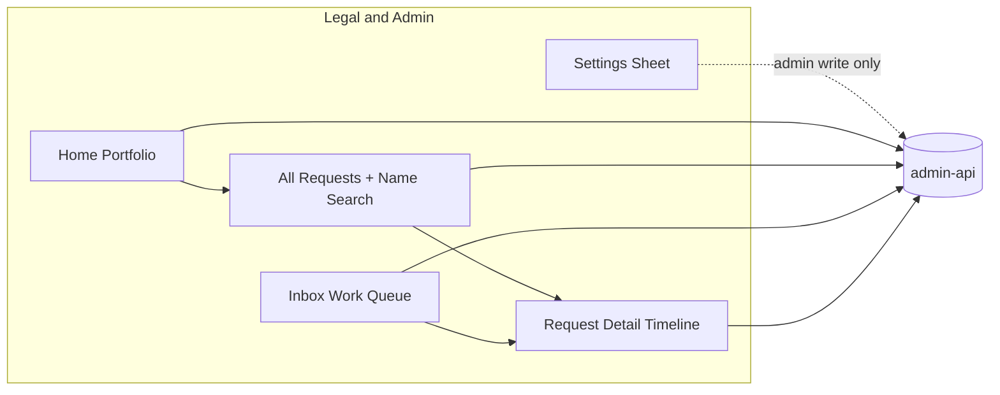

## Goal Capsule

Reshape the **legal and admin** experience around Sarah's workflow: a **portfolio landing** (pending by source, access vs delete, coarse pipeline stages), **All requests** list with **name search** for non-California-DROP sources, **inbox** as legal/admin work queue, **timeline-first request detail** with comments and escalation history, and **simplified navigation** (settings sheet, upload affordance). **Admin** (Sarah) and **legal user** (intern) share the same surfaces; only **settings mutations** differ.

**Authority:** KB `Request-Process-Requirements.md` § Legal admin feedback (Sarah, 2026-07-24) > this Product Contract > ADR-06 (Jira transition) > shipped Legal Command Center plan (`2026-07-23-001`).

**Stop when:** Definition of Done below is met. Do **not** re-implement fulfillment Slice A/B (identity, templates, interim GCS/Vertica, Cassandra target) unless a unit here explicitly adjusts UI on top of shipped delivery surfaces.

> **Journey order note (2026-07-28):** Canonical role and stage order is **superseded** by plan `2026-07-27-001` KD29–KD30 and knowledge base `Request-Process-Requirements.md` § Canonical request journey order (2026-07-28). This plan's coarse-stage table (matching before data owner review; legal gates fulfillment) remains valid for portfolio aggregation; older "data owner before matching" lifecycle text does not.

---

## Product Contract

### Summary

Fulfillment journeys are largely shipped; Sarah's 1:1 feedback targets **how legal and admin operators orient** — portfolio at login, finding email-consumer requests by name, seeing escalation history on detail, and a calmer IA (search + detail + inbox; settings tucked away). Today `admin` role still lands on the ops-style operator dashboard; portfolio API types exist in the web client but backend aggregation must align with Sarah's source × type × coarse-stage model; request list search is request-identifier-only; settings and upload occupy primary nav.

### Problem Frame

Privacy managers (Sarah, Julianne) still look up ad-hoc email requests **by name in Jira** when Julianne asks for status. California DROP rows correctly lack names pre-match, but non-DROP intake should be name-searchable. Landing cards use ops vocabulary ("spine requests") and do not split **California DROP vs other sources** or **access vs delete** the way Sarah described. Inbox purpose (legal work to do) is conflated with the global request table. Request detail is journey-engineer-oriented; comments and escalations are not unified into a single history timeline. Interns need the same views as admins without write access to conditions, deadlines, or templates.

### Key Decisions

- KD1. (session-settled: user-directed) **Admin and legal user share views** — Home portfolio, All requests, Inbox, request detail; differ only on settings write permissions.
- KD2. (session-settled: user-directed) **Admin-only writable:** workflow conditions, deadlines / service level agreements, email templates. Legal user: read-only or hidden Settings for those areas.
- KD3. **Sarah ≈ `admin` role; intern ≈ `legal` role** — reuse existing allowlists (`ADMIN_API_ADMINS`, `ADMIN_API_LEGALS`); no new role enum.
- KD4. **Rename spine list label to "All requests"** everywhere legal/admin sees the global request table.
- KD5. **Landing portfolio dimensions:** pending counts by **source bucket** (California DROP vs other), **request type** (access vs delete/opt-out/combined), and **coarse stage** with queue posture (in queue / in progress / complete).
- KD6. **Inbox = legal/admin work queue** (triage, escalations, notice, delivery) — not the all-requests inventory.
- KD7. **Name search** on non-DROP sources only; DROP remains request-identifier search until post-match identity fields are available. No personally identifying information in logs; search queries are not logged.
- KD8. **Request detail** surfaces full **timeline + comments + escalation events** in one history-first column.
- KD9. **IA simplification:** primary nav → Home, All requests, Inbox; **Settings** (conditions, SLAs, templates) in a sheet/dialog; **Upload** as `+` affordance on Home and All requests.
- KD10. **Delivery copy-paste template + ~30-day shareable URL** — already shipped; only adjust placement if IA unit moves Delivery entry points (no fulfillment re-build).
- KD11. **Deadline override** — nice-to-have; admin can change per-request deadline; escalation-specific deadline lower priority.

### Actors

- A1. **Admin** (privacy manager — Sarah) — portfolio, search, inbox, detail, settings write.
- A2. **Legal user** (intern) — same surfaces; settings read-only or absent.
- A3. **Data owner** — unchanged My work path (out of scope except portfolio queue counts).
- A4. **Super admin** — ops surfaces unchanged; may simulate admin/legal.

### Requirements

**Roles and routing**

- R1. `admin` and `legal` roles route to **Legal Home** (portfolio), not `OperatorDashboardHome`.
- R2. `admin` may mutate conditions, SLA/deadline config, and email templates; `legal` receives 403 on those mutations (read GET allowed if sheet is read-only).
- R3. Super admin ops Dashboard / Workers remain unchanged.

**Landing portfolio**

- R4. Home shows pending counts: **California DROP vs other sources** (webform, authorized agent, manual).
- R5. Home shows **access vs delete** (and opt-out where distinct) type breakdown.
- R6. Home shows **coarse pipeline stages** (receive → matching → data owner review → legal review/identity → fulfillment → delivery/DROP notice) with **in queue / in progress / complete** posture per stage (aggregated, not micro-journey steps).
- R7. Rename user-facing **"Spine requests"** (or equivalent) to **"All requests"**.

**All requests list and search**

- R8. Global request list remains request-grain; legal/admin default filters match portfolio drill-down links.
- R9. **Name search** (`q` parameter) matches first/last name on **non-DROP** requests only; DROP rows match request identifier only.
- R10. Post-match DROP may expose matched display label in list/detail per existing privacy rules — never raw California hash.

**Inbox**

- R11. Inbox subtitle/copy clarifies **work to do** (escalations, notice, delivery, triage) — distinct from All requests.
- R12. Legal inbox kinds remain triage · escalations · notice · delivery (no ops matching feed for legal/admin).

**Request detail**

- R13. Request detail opens **timeline-first**: audit events, status changes, assignments, comments, escalations in chronological order.
- R14. Comment composer and escalation thread visible on detail without opening inbox pane only.

**IA**

- R15. Nav for legal/admin: **Home · All requests · Inbox**; remove top-level SLAs / Conditions / Upload links.
- R16. **Settings** sheet groups Conditions, SLAs, Templates with write gates per R2.
- R17. **Upload** `+` button on Home and All requests opens manual intake / agent batch upload chooser.

**Deadlines (nice-to-have)**

- R18. Admin may override `due_at` (or equivalent SLA field) on a single request with audit trail.
- R19. Optional escalation-specific deadline on workflow assignment — defer if schema work is heavy.

**Privacy**

- R20. No PII in logs, audit JSONB, or search debug output; name search uses parameterized queries; list payloads follow existing id/count rules.

### Key Flows

- F1. Admin lands on Home → sees source/type/stage portfolio → drills into All requests with filters applied → opens request detail timeline.
- F2. Julianne asks status on email request → admin searches **by name** on All requests → reads timeline → replies externally.
- F3. Data owner escalates → item in Inbox · Escalations → admin opens detail → full comment + escalation history visible.
- F4. Intern (`legal`) opens Settings sheet → conditions/templates are view-only; admin edits same sheet with save enabled.

### Acceptance Examples

- AE1. Admin login → `/` shows portfolio with DROP vs other and access vs delete sections (non-zero seed data in dev).
- AE2. Search `Smith` on All requests returns webform/manual rows; DROP rows only match when query equals request UUID fragment.
- AE3. Legal user POST to conditions API → 403; admin POST → 200.
- AE4. Request detail shows merged timeline entry for comment + escalation + journey stage transition.
- AE5. Nav shows Home / All requests / Inbox only; Settings opens sheet; Upload via `+` on Home.

---

## Planning Contract

### Key Technical Decisions

- KTD1. **Reuse `admin` + `legal` roles** — extend `canAccessLegalSurfaces` routing so `admin` uses `LegalHome`, `isLegalNav` true for both `admin` and `legal` in nav/inbox queries.
- KTD2. **Portfolio API** — implement `GET /legal/home/portfolio` in admin-api (web client already typed). Response adds `source_buckets`, `type_counts`, `stage_matrix` (stage × posture counts). Map journey stages to coarse buckets in SQL/view layer — prefer single aggregation query over N+1.
- KTD3. **Name search** — extend `GET /requests` with `q` handling: if source is DROP or `intake_source=drop`, search `id`/`external_id` only; else join normalized intake fields (hashed or column — follow existing PII storage; never log `q`). Cap result limit; require min query length 2.
- KTD4. **Timeline feed** — new `GET /ops/requests/{id}/timeline` composing `audit_events`, `request_comments`, `workflow_assignments` (escalations), and journey milestones — PII-safe DTOs only.
- KTD5. **Settings sheet** — client-only route consolidation wrapping existing `conditions.tsx`, `slas.tsx`, templates page; wrap mutations with `role === 'admin'` gate.
- KTD6. **Deadline override** — if `requests` or SLA table has `due_at`, add `PATCH` admin-only; else document deferral to ADR-24 follow-up.

### Scope Boundaries

**In scope:** U1–U6 (core Sarah feedback). **Nice-to-have:** U7 deadline override.

**Out of scope**

- Fulfillment Slice A/B re-implementation (Cassandra, BigQuery pack, interim GCS/Vertica) unless Delivery copy placement changes.
- Platform SMTP to requestors.
- Data-owner My work redesign.
- Full ADR-24 SLA clock UI for every micro-step.
- Pie charts or new chart library — use existing taste chips/bars.

### Deferred to Follow-Up Work

- Escalation-specific per-assignee deadline (R19) if U7 schema scope grows.
- Server-side full-text index if name search latency exceeds 500ms on production volume.
- Merging data-owner inbox into legal portfolio (separate persona).

### Assumptions

- Normalized first/last name fields exist on non-DROP raw/intake tables post-promote (verify during U4; if absent, search falls back to manual/external reference only and Open Question OQ1 fires).
- Shipped Delivery template + 30-day URL need no functional change — only nav placement.
- `admin` emails are not also on `ADMIN_API_LEGALS` for production users (precedence: admin wins — both get admin settings write).
- **This plan and `docs/plans/2026-07-24-001-feat-legal-fulfillment-journeys-plan.md` are both implementation-ready against the same integration branch, and both have already landed work.** Fulfillment Slice A and Slice B remain plan 001's; information architecture, landing portfolio, name search, and the request-list surface remain this plan's. The Cross-plan file ownership section below is the boundary, and it is authoritative over any unit file list in either plan.
- **This plan owns the Legal Home surface and portfolio aggregation.** Plan 001's U6 is absorbed into this plan for exactly that reason. Plan 001 keeps the product requirements; this plan makes the edits.

### Cross-plan file ownership (boundary with plan 001)

Plan 001 landed the fulfillment journeys, correspondence tables, and the first Legal Home surface in `9c6c65c`. This plan's commits — `a31d906`, `43ad1d9`, `984425c` — came afterward and reshaped Home, portfolio aggregation, the request list and its search, the timeline route, navigation, and the settings and upload shells. On every surface both plans touch, this plan's shape is the current one.

Three access levels are used. **Owner** may edit freely. **Read-only** means read it and request changes from the owning plan rather than editing. **Append-only** means both plans may add their own declarations but neither rewrites the other's.

| File or tree (repo-relative) | Owner | This plan's access | Boundary note |
|---|---|---|---|
| `app/admin_api/src/admin_api/requests_list.py` | 002 | owner | Request list, name search, list role gating. Mirrors plan 001's PA12. |
| `app/admin_api/src/admin_api/legal_portfolio.py` | 002 | owner | **The portfolio endpoint lives here.** U2's reference to a new `legal_home.py` is superseded — do not create a second module; extend this one. |
| `clients/web/src/routes/index.tsx` | 002 | owner | Legal Home, including the two residuals inherited from plan 001's U6 below. |
| `clients/web/src/routes/requests/index.tsx` | 002 | owner | All-requests list, search input, drill-down parameters. |
| `clients/web/src/components/NavMenu.tsx`, `clients/web/src/lib/auth.tsx` | 002 | owner | Persona navigation, persona helpers, settings write gate. |
| `clients/web/src/routes/requests/conditions.tsx`, `.../slas.tsx` | 002 | owner | Settings surfaces reached through the sheet. |
| `app/admin_api/src/admin_api/roles.py`, `.../approvals.py` | 002 | owner | Role resolution and settings-mutation gating. |
| `app/admin_api/tests/test_legal_portfolio.py` | 002 | owner | Follows portfolio ownership. |
| `clients/web/src/components/LegalSettingsSheet.tsx` | 002 shell / 001 templates section | split | This plan owns the sheet, its tabs, and role gating; plan 001's U2 adds the administrator template edit form inside the existing Templates section. |
| `clients/web/src/components/UploadMenu.tsx` | 002 shell / 001 vendor control | split | This plan owns the `+` menu and routing; plan 001's U7 adds the authorized-agent vendor dropdown on the agent-batch path. |
| `clients/web/src/routes/requests/$requestId.tsx` | 002 structure / 001 panels | split | This plan owns tab structure, history-first ordering, and the U7 deadline field; plan 001 mounts additive identity, correspondence, and document panels into existing tabs. |
| `app/admin_api/src/admin_api/request_journey.py` | 002 timeline endpoint / 001 events and privacy gate | split | This plan owns the timeline route and entry shape; plan 001 appends event kinds and extends the forbidden-key assertion. Neither changes the other's response contract. |
| `clients/web/src/lib/api.ts`, `clients/web/src/router.tsx`, `app/admin_api/src/admin_api/main.py` | shared | append-only | Typed wrappers, route registration, router registration. No shared line edited by both plans. |
| `app/admin_api/tests/test_request_journey.py`, `.../test_requests.py` | shared | append-only | Separate test functions — this plan covers search and timeline, plan 001 covers correspondence, vendor, and privacy shapes. |
| `clients/web/src/components/requests/RequestTriageDialog.tsx` | 001 | read-only | Draft outbound and delivery handoff. **U5's conditional mention of this file is withdrawn** — the timeline lives on the detail route, not in this dialog. |
| `app/admin_api/src/admin_api/request_correspondence.py`, `.../fulfillment_ops.py` | 001 | read-only | Identity, templates, ledger, documents, interim fulfillment, delivery status. |
| `clients/web/src/routes/fulfillment/`, `clients/web/src/routes/requests/needs-attention.tsx` | 001 | read-only | Data-owner interim execute screen and the Legal Inbox lanes. |
| `app/data_fulfillment_dispatcher/`, `app/cassandra/`, `app/drop_notice_dispatcher/`, `app/drop_connector/`, `transform/`, `libs/habeas-privacy-core/` | 001 | read-only | Fulfillment worker, target automation, shared library. |
| `infra/` | 001 | read-only | Allowlist and storage configuration and documentation. |
| `db/migrations/` | additive by convention | append-only | New timestamped files only; an applied migration is never edited. U7's deadline migration does not collide with plan 001's schema assertions. |

**Inherited from plan 001's absorbed U6 — execute here, but this is not new product scope.** Both residuals sit inside Home files this plan owns, and both trace to plan 001's Product Contract requirements, which stay there:

1. **Pipeline visualization (plan 001 R27, KTD-17).** `portfolio.pipeline_stages` is typed in `clients/web/src/lib/api.ts` and drawn nowhere. Build it in-house — an inline scalable-vector or bar-strip component consistent with this plan's existing chips and bars. No charting dependency, which also matches this plan's own "no new chart library" scope boundary.
2. **Schedule-excerpt degradation (plan 001 R26).** The upcoming-intake excerpt fetch swallows failures into an empty value, so "could not load" is indistinguishable from "no upcoming intake". Degrade visibly instead.

Plan 001's Home requirements R28 through R30 — data-owner queue portfolio, attention warnings, and out-of-app outreach context — already render on this plan's Home. Outreach stays out of the platform on either plan: Home surfaces contact identity and a pending summary, and nothing sends a notification or mail to a data owner.

**No fulfillment widget on Home is claimed by any plan 001 unit today.** If Slice B later needs one, plan 001 requests it here under the conflict protocol rather than editing Home directly.

**Conflict protocol.** If a unit here cannot be completed without editing a file this table assigns to plan 001, stop and record the needed change as a request against that plan rather than editing across the boundary. Two executors making "small compatible" edits to the same Legal web surface is the failure this table exists to prevent.

### Open Questions

| ID | Question | Default if unresolved |
|----|----------|-------------------------|
| OQ1 | Which table/columns hold searchable names for webform/manual/agent rows? | `manual_raw_requests` / normalized payload JSON keys `first_name`, `last_name` |
| OQ2 | Exact coarse-stage mapping from `JOURNEY_STAGES` | Planner maps receive→matching→review→legal→fulfillment→delivery in U2 |
| OQ3 | Read-only Settings for legal — show disabled fields vs hide sections | Show read-only with lock icon (better intern training) |

---

## High-Level Technical Design



**Coarse stage model (portfolio):**

| Coarse stage | Journey signals (indicative) |
|--------------|------------------------------|
| Receive | intake complete, not yet matching |
| Matching | matching_attempts in flight |
| Data owner review | matching.review / DO queue |
| Legal review / identity | triage, escalations, identity verification pending |
| Fulfillment | fulfill attempts / suppression or access in progress |
| Delivery / DROP notice | access delivery, notice.review, DROP upload pending |

Posture: **in queue** (waiting), **in progress** (active attempt), **complete** (stage cleared for that request).

---

## Implementation Units

**Landed baseline.** Substantial parts of U1 through U6 already shipped in `a31d906`, `43ad1d9`, and `984425c` — the portfolio endpoint and its filters, name search in `requests_list.py`, the timeline route, the settings sheet with role gating, the upload menu, and the simplified navigation. Read each unit's files before treating it as greenfield; an executor that recreates a landed module produces conflicts rather than progress. Plan 001 landed earlier in `9c6c65c`, so where both plans touch a file, this plan's shape is the current one and the Cross-plan file ownership table says who may change it next.

### U1. Admin and legal user routing parity + settings write gates

**Goal:** `admin` and `legal` share Legal Home and legal inbox; only `admin` (and super_admin) may mutate conditions, SLAs, templates.
**Requirements:** R1, R2, R3, KD1–KD3
**Dependencies:** none
**Files:**
- `clients/web/src/routes/index.tsx`
- `clients/web/src/lib/auth.tsx`
- `clients/web/src/components/NavMenu.tsx`
- `app/admin_api/src/admin_api/roles.py`
- `app/admin_api/src/admin_api/approvals.py` (conditions routes if separate)
- `app/admin_api/tests/test_roles.py`
- `clients/web/src/routes/requests/conditions.tsx`
- `clients/web/src/routes/requests/slas.tsx`
**Approach:** Add `isLegalAdminPersona(role)` helper (`admin` | `legal`). `DashboardPage` routes both to `LegalHome`. Nav `isLegalNav` true for both. API: `require_roles(ROLE_ADMIN, ROLE_SUPER_ADMIN)` on POST/PATCH for conditions, SLA config, template mutations; `require_roles(..., ROLE_LEGAL)` on GET. Web: disable save buttons when `role === 'legal'`.
**Test scenarios:**
- Happy: `admin` → Legal Home; `legal` → Legal Home.
- Error: `legal` POST condition → 403; `admin` → 200.
- Edge: super_admin simulate `legal` → read-only settings.
**Verification:** Role tests + manual simulate both personas.

### U2. Portfolio aggregation API (source × type × coarse stage)

**Goal:** `GET /legal/home/portfolio` returns Sarah's portfolio dimensions on real data.
**Requirements:** R4, R5, R6, R20; KTD2
**Dependencies:** U1
**Files:**
- `app/admin_api/src/admin_api/legal_portfolio.py` — **the endpoint lives here; the earlier `legal_home.py` (new) reference is superseded.** Plan 001 created this module and this plan now owns it; creating a second module would give one endpoint two homes
- `app/admin_api/src/admin_api/main.py` (shared, append-only — router registration)
- `app/admin_api/tests/test_legal_portfolio.py` — extend rather than adding `test_legal_home.py`
- `clients/web/src/lib/api.ts` (shared, append-only — extend `LegalPortfolio` type)
**Approach:** Single SQL aggregation over `requests` + journey/assignment joins. `source_buckets`: `{ drop, other }`. `type_counts`: by `request_type`. `stage_matrix`: array of `{ stage, in_queue, in_progress, complete }`. Reuse warnings/data_owner_queues from prior portfolio sketch if present. LegalPrincipal + AdminPrincipal + Legal role read.
**Test scenarios:**
- Happy: seeded requests return non-zero buckets.
- Privacy: response JSON has no email/name fields.
- Edge: empty DB returns zeroed structure (not 404).
**Verification:** `test_legal_portfolio.py` green.

### U3. Legal/admin landing UI reshape

**Goal:** Home portfolio matches R4–R7; cards link to filtered All requests.
**Requirements:** R4, R5, R6, R7, F1; KD4–KD6
**Dependencies:** U2
**Files:**
- `clients/web/src/routes/index.tsx`
- `clients/web/src/routes/requests/index.tsx` (accept portfolio drill-down search params)
**Approach:** Replace legacy count-only layout with source bucket row, type chips, stage matrix table (compact). Rename copy to "All requests". Drill-down: `/requests?source=drop`, `?request_type=access`, `?stage=matching&posture=in_queue`. Keep inbox shortcut cards (triage/escalations/notice/delivery).

**Inherited from plan 001's absorbed U6 — this unit carries both residuals** (see Cross-plan file ownership; requirement ownership stays with plan 001): draw the pipeline stage series that is typed but never rendered (plan 001 R27 — in-house bar strip or inline scalable vector, no charting dependency, consistent with this plan's own no-new-chart-library boundary), and make the upcoming-intake schedule excerpt degrade visibly instead of swallowing a fetch failure into an empty value that reads as "no upcoming intake" (plan 001 R26). Data-owner queues, attention warnings, and outreach context already render here.
**Test scenarios:**
- Covers AE1: portfolio sections render with seed data.
- Edge: portfolio API error shows retry, not blank crash.
**Verification:** `bun run build`; browser smoke Home as admin.

### U4. All requests rename, filters, and name search (non-DROP)

**Goal:** Legal/admin can find email-consumer requests by name; DROP by request id.
**Requirements:** R8, R9, R10, R20, F2; KTD3
**Dependencies:** U1
**Files:**
- `app/admin_api/src/admin_api/main.py` (or `requests.py` list handler)
- `app/admin_api/tests/test_requests.py`
- `clients/web/src/routes/requests/index.tsx`
- `clients/web/src/lib/api.ts`
- `clients/web/src/router.tsx` (extend `RequestsSearch` if needed)
**Approach:** Extend list endpoint: `q` searches `id` ILIKE for all; additionally ILIKE first/last on normalized intake for `intake_source != 'drop'`. Client: search input placeholder "Name or request ID"; show matched display name column for non-DROP when available. Enforce min length 2; limit 100.
**Test scenarios:**
- Covers AE2: name finds webform; DROP name query does not leak hash rows.
- Error: `q` of 1 char → 400 or ignored per API contract.
- Privacy: test asserts logs do not contain query string (mock logger).
**Verification:** `test_requests.py` name search cases.

### U5. Request detail timeline-first (history, comments, escalations)

**Goal:** Unified chronological timeline on request detail.
**Requirements:** R13, R14, F3; KTD4
**Dependencies:** U1
**Files:**
- `app/admin_api/src/admin_api/request_journey.py`
- `app/admin_api/tests/test_request_journey.py`
- `clients/web/src/routes/requests/$requestId.tsx` — tab structure and history-first ordering are this plan's; plan 001 mounts additive panels into existing tabs
**Approach:** `GET /ops/requests/{id}/timeline` returns sorted `TimelineEntry { at, kind, actor, summary, meta }`. Merge comments, audit, assignments, journey transitions. UI: left column timeline (default expanded); de-emphasize raw journey rail for legal/admin persona.

**Ownership note.** `RequestTriageDialog.tsx` is **removed from this unit's file set** — it belongs to plan 001 (draft outbound and delivery handoff). The timeline lives on the detail route. `request_journey.py` is split: this plan owns the timeline route and its entry shape, plan 001 appends event kinds and extends the forbidden-key assertion without changing the response contract.
**Test scenarios:**
- Covers AE4: comment + escalation + stage change appear in order.
- Edge: request with no comments returns empty timeline array.
**Verification:** Journey tests + detail smoke.

### U6. IA simplification — settings sheet and upload affordance

**Goal:** Nav trimmed to Home / All requests / Inbox; Settings sheet; Upload `+`.
**Requirements:** R15, R16, R17, R11, KD9, F4; KTD5
**Dependencies:** U1, U3
**Files:**
- `clients/web/src/components/NavMenu.tsx`
- `clients/web/src/components/LegalSettingsSheet.tsx` — **already exists** (landed in `a31d906`); this plan owns the sheet shell, tabs, and role gating, and plan 001's U2 adds the administrator template edit form inside the Templates section
- `clients/web/src/components/UploadMenu.tsx` — **already exists** (landed in `43ad1d9`); this plan owns the menu and its routing, and plan 001's U7 adds the authorized-agent vendor dropdown on the agent-batch path
- `clients/web/src/routes/index.tsx`
- `clients/web/src/routes/requests/index.tsx`
**Approach:** Remove SLAs/Conditions/Upload from nav. Gear opens sheet with tabs. `+` DropdownMenu → Manual request / Agent batch (existing routes). Inbox header subtitle: "Work to do — escalations, notice, delivery, triage". Delivery template link stays in Inbox · Delivery (KD10 — no fulfillment rebuild).
**Test scenarios:**
- Covers AE5: nav item count; settings sheet opens; upload menu routes correctly.
- Edge: legal user sees templates read-only in sheet.
**Verification:** Build + browser nav smoke.

### U7. Admin deadline override (nice-to-have)

**Goal:** Admin can adjust a request deadline with audit entry.
**Requirements:** R18, R19, KD11; KTD6
**Dependencies:** U1, U5
**Files:**
- `db/migrations/YYYYMMDDHHMMSS_intake_request_due_at.sql` (if column missing)
- `app/admin_api/src/admin_api/request_journey.py`
- `app/admin_api/tests/test_request_journey.py`
- `clients/web/src/routes/requests/$requestId.tsx`
**Approach:** Add `due_at timestamptz` on requests if absent. `PATCH /ops/requests/{id}/deadline` admin-only; writes audit event. Detail shows editable deadline for admin. Skip escalation-specific deadline if assignment schema lacks field — document in OQ deferral.
**Test scenarios:**
- Happy: admin sets due_at; audit event created.
- Error: legal PATCH → 403.
**Verification:** API tests. **May ship after U1–U6 if schema unknown.**

---

## Verification Contract

```bash
uv sync --all-packages
uv run --package admin-api pytest \
  app/admin_api/tests/test_roles.py \
  app/admin_api/tests/test_legal_portfolio.py \
  app/admin_api/tests/test_requests.py \
  app/admin_api/tests/test_request_journey.py -q
cd clients/web && bun run build
```

**Manual / browser:** simulate `admin` and `legal`; AE1–AE5 on Home, All requests, Inbox, detail, settings sheet.

**Privacy gate:** spot-check logs for absence of search terms and PII (R20).

---

## Definition of Done

- [ ] U1–U6 complete; U7 optional
- [ ] AE1–AE5 demonstrable
- [ ] `admin` and `legal` share Legal Home; settings write gated
- [ ] Portfolio shows source, type, coarse stage per Sarah feedback
- [ ] Name search works for non-DROP; DROP id-only
- [ ] Request detail timeline includes comments and escalations
- [ ] Nav simplified; settings sheet + upload `+`
- [ ] No regression to super_admin ops surfaces
- [ ] Pipeline stage series is drawn and the schedule excerpt degrades visibly (inherited plan 001 R27, R26)
- [ ] No file owned by plan 001 modified by this work, and every split file changed only within this plan's half (Cross-plan file ownership)
- [ ] KB section § Legal admin feedback remains accurate

---

## Sources & Research

- KB: `~/Documents/SirvenOS/Habeas/Projects/Data Privacy/01-ARCHITECTURE/Request-Process-Requirements.md` § Legal admin feedback (Sarah, 2026-07-24)
- Sarah 1:1 transcript (2026-07-24) — agent transcript `24f85406-cfc8-4d95-a84f-bb97b7be9998`
- Shipped baseline: `docs/plans/2026-07-23-001-feat-legal-command-center-plan.md`
- Web portfolio types: `clients/web/src/lib/api.ts` (`LegalPortfolio`)
- Roles: `libs/habeas-privacy-core/src/habeas_privacy_core/auth/roles.py`
