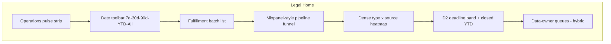
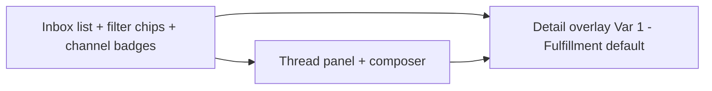
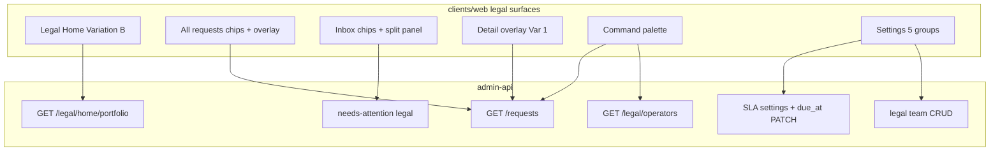

## Goal Capsule

Capture the **visual experimentation session** decisions for the legal and admin operator experience: **Legal Home** (Variation B), **Inbox** (split workspace), and **request detail** (Variation 1), plus cross-surface chrome (operations pulse, date toolbar, filter chips, command palette). This plan refines the **layout, module composition, and interaction patterns** that plan `2026-07-24-002` established at the information-architecture and API level. Backend contracts from plan 002 (portfolio aggregation, name search, timeline feed, role gates) remain in force unless a requirement here explicitly changes product behavior.

**Authority:** knowledge base `Request-Process-Requirements.md` § Canonical request journey order (session-settled, 2026-07-28) > § Legal admin feedback (Sarah, 2026-07-24) > this Product Contract > plan `2026-07-24-002` (implementation baseline and cross-plan file ownership) > plan `2026-07-24-001` (fulfillment journeys — delivery copy and notice entry points only where referenced; journey **role order** superseded by KD29–KD33 here and KB § 2026-07-28).

**Open blockers:** none. **OQ8–OQ14 settled** (session-settled, 2026-07-28). **Settings sheet (OQ13):** Conditions · Deadlines & SLAs · Email templates · DROP schedule · **Legal team**. **Inbox filter chips (OQ14):** Unassigned · Assignment to legal · Fulfillment · Notice · Delivery · Pre-matching holds · Assigned to me.

---

## Product Contract

### Summary

Legal and admin operators need a **cohesive command center**: Home orients on portfolio health and pipeline flow; Inbox is where work gets done with mandatory status transitions; request detail is where identity, matching, and stage-aware actions live. The visual session locked **Variation B** for Home (fulfillment batches scoping a Mixpanel-style funnel, dense type-by-source heatmap, compact deadline band), **split workspace** for Inbox (**one list with filter chips** — not named lanes or a Matching tab), and **Variation 1** for request detail (**same chrome for admin and legal** — **Fulfillment** default tab for pre-fulfillment review, requester personal information panel, prominent action bar, activity timeline secondary; matching **confirm/reject actions are data-owner-only** on data-owner My work unless a data owner uses **assignment to legal**). Cross-surface patterns — operations pulse header, global date range, filter chips, command palette with keyboard shortcut — apply everywhere legal and admin work.

### Problem Frame

Plan `2026-07-24-002` shipped the structural information architecture: three primary nav items, settings sheet, upload affordance, portfolio API, name search, and timeline-first detail. Sarah's feedback and the July visual session exposed a gap between **functional completeness** and **operator-ready composition**. Operators also lacked a single documented role order across matching, legal gates, and fulfillment paths — a **journey-order gap** that prior plans and lifecycle diagrams left ambiguous. Home still reads as disconnected count cards rather than a scannable portfolio with date-scoped modules. Inbox conflates reading with acting — operators need status updates that drive automation, not comment-only composers. Request detail still foregrounds journey-engineer chrome over the decisions operators make daily: who is the requester, what did matching find (read-only for legal/admin until data-owner help assignment), what pre-fulfillment status move is valid now. The session produced ship candidates in canvas form; this plan turns those into durable requirements for planning and build.

### Key Decisions

- KD1. (session-settled: user-directed — chosen over separate legal-only surfaces: Sarah and intern share the same work surfaces; settings write differs only) **Admin and legal user share the same views:** Home, All requests, Inbox, and request detail chrome (including **Fulfillment** default tab — KD31). Difference is **settings permissions only** — admin and super_admin may mutate all settings-sheet groups; legal is **read-only or blocked** per group (OQ13 closed). **Settings sheet groups:** **Conditions · Deadlines & SLAs · Email templates · DROP schedule · Legal team** — Deadlines & SLAs holds global stage/lifecycle SLA durations (KD35); DROP schedule holds weekly California DROP batch cadence (KD39); **Legal team** holds the single configurable **Legal** group membership used for assignment-to-legal fan-out (KD32, OQ14 closed).
- KD2. (session-settled: user-directed — chosen over top-level Conditions, service level agreement, and Upload links) **Primary navigation stays Home · All requests · Inbox.** Settings open in a sheet; upload uses a plus (+) affordance on Home and All requests.
- KD3. (session-settled: user-directed) **Rename the spine request list to All requests** everywhere legal and admin see the global table.
- KD4. (session-settled: user-directed — chosen over inbox as full request inventory) **Inbox is the legal and admin work queue** (pre-matching holds, assignment to legal, notice, delivery, fulfillment) — not the all-requests inventory. **One list with filter chips** (KD33); no Matching tab on legal/admin Inbox.
- KD5. (session-settled: user-directed; **Finding 15 closed 2026-07-28**) **Name search on non–California Delete Act requests; California Delete Act requests match by request identifier only** until post-match identity is available. **List and header display:** California DROP / Delete Act rows show **request id + channel/source only** in lists and headers — **not** name or email. Non-DROP rows may show `display_label` as today.
- KD6. (session-settled: user-approved — chosen over Variation A and Variation C full-page compositions) **Legal Home ships Variation B:** operations pulse and date toolbar at top; **date-filtered, capped** fulfillment batch list (top five by received datetime descending — KD7) above a Mixpanel-style pipeline funnel; dense type-by-source heatmap and compact cycle-time or deadline band below; data-owner queue module uses **hybrid** pattern (dense top-five plus person-row workload elements).
- KD7. (session-settled: user-directed — chosen over independent funnel unrelated to batch selection; **Finding 7 closed 2026-07-28**) **Fulfillment / intake batches** (intake source plus received datetime per row) sit **above** the funnel. **The batch list respects the global date toolbar** — only batches whose **received datetime** falls in the selected window appear. **Home shows a capped subset:** default **top five** by received datetime descending (configurable later). A **See all** control navigates to **All requests**. Selecting a batch scopes funnel counts to that batch; clearing selection aggregates all batches **in the active date window**.
- KD8. (session-settled: user-directed — chosen over per-module date pickers; **Finding 9 closed 2026-07-28**) **Global date toolbar on Home:** 7 days, 30 days, 90 days, year-to-date, and All; default 30 days; filters **analytics modules only** — fulfillment batch list, funnel, heatmap, and D2 cycle-time/deadline band — on received date. **Work queue modules** (operations pulse, data-owner queues) and **Inbox** show **all open work** regardless of the date window.
- KD9. (session-settled: user-directed) **Operations pulse strip** on Legal Home header: open assigned to you, open team-wide, service level agreement at risk, overdue, median age — expandable chips with breakdown on click.
- KD10. (session-settled: user-directed — chosen over map-first Variation B and split-encoding Variation C) **Open requests module ships Variation A dense:** type-by-intake-source heatmap with optional percent toggle; cells drill to filtered All requests. Module tabs include **type-by-source** (default), state map, source-only, and type-only views.
- KD11. (session-settled: user-directed — chosen over tall stat-card stack; **Finding 12 closed 2026-07-28**) **Cycle time and deadline module (D2):** thin risk bar (overdue, due within 7 days, on track) plus closed year-to-date pill; no separate average-process pill in the primary row. Risk segments bucket open requests by **real per-request `due_at`** — calculated from global stage/lifecycle SLAs (KD35) or admin override — **not** count-only placeholders.
- KD12. (session-settled: user-approved — chosen over Variation 2 and Variation 3 chrome layouts) **Request detail ships Variation 1:** header with stage rail, stage-aware action button row, **Fulfillment** tab as **default for admin and legal** (pre-fulfillment review — KD31; supersedes prior Matching-default settlement), matching results on a secondary tab, requester personal information in the meta rail, activity timeline as secondary tab.
- KD13. (session-settled: user-directed — chosen over omitting matching panel, matching behind secondary tab, comment-composer-only actions) **Matching results are required on request detail** (secondary tab) with run metadata and per-candidate match context. **Matching review screens** (data owner on My work / Matching lane; legal **only** on assignment-to-legal rows) **may display personally identifying information** needed to make match determinations — authorized reviewer display is permitted and does **not** populate audit payloads (R29, R34; Finding 6 closed). **Data owners are the canonical approvers** of matching results for their verticals: confirm / not a match / multi-person (KD29 step 3) on **data-owner My work / Matching lane** — not on legal/admin Inbox. When a data owner needs legal help they **assign/send the request to legal** (KD32) — with or without a comment — not via an **unsure** disposition (OQ8 closed). **Legal and admin** see the same panel **read-only** for matching disposition; they act on **pre-fulfillment** work (identity verification, fulfillment kickoff, assignment-to-legal queue items) on the **Fulfillment** default tab. Legal reviews matching **only when** a data owner completes **assignment to legal** (KD32).
- KD14. (session-settled: user-directed — chosen over assignee picker, follower row, or workload chips on detail) **No workload assignment user interface on request detail.** Assignment and take-it claim stay on Inbox and list surfaces only.
- KD15. (session-settled: user-directed — Walkthrough Finding 3) **Stage-aware status labels** for legal and admin use **KD29 user-facing journey names** (receive → matching → data owner review → legal / pre-fulfillment → fulfillment → delivery / DROP notice), not generic operations vocabulary.
- KD16. (session-settled: user-directed; **Finding 17 closed 2026-07-28**) **Activity timeline:** system events muted single lines; human notes and **assignment-to-legal** comments distinct authored blocks **sourced from correspondence / queue-as-table stores** — not audit payloads; composer inline under history on the activity tab. **Bodies** in correspondence stores; audit metadata only (KD37).
- KD17. (session-settled: user-directed; **Finding 10 closed 2026-07-28**) **Filter chips as primary list pattern** on All requests and Inbox — **source, type, and flag chips** write URL search parameters shared with Home drill-downs. **Name/search query text is ephemeral** (UI/session state only) — **never** written to shareable URL query parameters or browser history; API may still accept `q` on fetch, but the web client does not mirror search text into the address bar.
- KD18. (session-settled: user-directed — **Finding 14 closed 2026-07-28; option 2**) **Global command palette** (command-menu pattern) with Command+K or Control+K shortcut. **v1 groups: Requests, People, and Actions** — not requests-only. **Requests** search respects name-search rules (KD5). **People** is **legal/admin only**: surfaces **authorized operators** — assignees, queue owners, legal-group members, and related staff — for jump-to-work and assignment context. **Must not** expose a requester directory, data-owner people directory of request subjects, or any personally identifying information from requesters in People results. **Actions** covers navigation shortcuts (open Inbox filter, assign filters, settings, upload).
- KD19. (session-settled: user-approved — chosen over triage desk as ship direction) **Inbox ships split workspace:** inbox list plus thread panel side by side; **one list with filter chips** (KD33) — not separate named lanes or a Matching tab.
- KD20. (session-settled: user-directed — chosen over navigate away to full page from list row; **Finding 8 closed 2026-07-28**) **Inbox and All requests rows open a nearly full-screen detail overlay** (not a separate full-page route as primary) at Variation 1 fidelity (requester personal information, matching, action bar; **Fulfillment** default — KD31). Uncovered margins use a **semi-transparent scrim with background blur**. Deep-link URL to a dedicated request route may still exist as a **secondary** entry (bookmark, command palette, shared link); list-row primary open stays overlay.
- KD21. (session-settled: user-directed — chosen over comment-only inbox actions) **Status update required on inbox triage actions** — composer pairs reply with a named status transition that triggers the next automated step. **On automation failure** (status advance or fulfillment kickoff): clear error, no implied success, prior status or retry-needed, **Retry** affordance, optional assign-to-legal — never silent success (R24, R27; Finding 11 closed).
- KD22. (session-settled: user-directed — chosen over internal note separate from status update; **Finding 17 closed 2026-07-28**) **No internal note field** on the inbox composer. Reply/comment **bodies** persist in **correspondence / queue-as-table stores** (role-gated access — plan 001 communication ledger and related queue rows) — **not** in audit payloads. Audit records **metadata only** (actor, timestamp, action type, request id).
- KD23. (session-settled: user-directed — chosen over jurisdiction tag on row) **Inbox rows show channel-origin badge** on the requester avatar corner (email, portal, postal mail); no jurisdiction pill.
- KD24. (session-settled: user-directed — rejected priority column in service level agreement display) **Service level agreement countdown uses tabular numerals** on inbox and list rows.
- KD25. (session-settled: user-directed — chosen over follower avatars) **Assignment pattern:** owner or take-it claim only; no followers.
- KD26. (session-settled: user-directed — rejected truncated identity verification summary) **Identity verification decisions show full inline context** in inbox row, All requests row, and detail overlay.
- KD27. (session-settled: user-directed — **Finding 13 closed 2026-07-28; OQ5 settled; OQ14 closed 2026-07-28**) **Unassigned / needs-claim work** is the **Unassigned** Inbox filter chip — **not** a separate Home zero-to-triage strip. Overdue surfaced via **sort and badge**. Home may **deep-link** to the Unassigned Inbox filter (R13, R14).
- KD28. (session-settled: user-directed — chosen over shipping ribbon toggle alongside funnel) **Pipeline on Home:** Mixpanel-style reached-stage funnel is **primary** per Variation B; flush volume ribbon (M2-style stage matrix) is **exploration-only** — do not ship ribbon toggle with funnel on Home v1.
- KD29. (session-settled: user-directed — chosen over data-owner-before-matching lifecycle, matching.review → fulfillment without legal, and legal as primary matching confirmer) **Canonical request journey order** governs role authority and coarse pipeline stages for Home funnel, Inbox filters, and request detail action bars. **User-facing stage labels (Finding 3):** receive → matching → data owner review → legal / pre-fulfillment → fulfillment → delivery / DROP notice — used on Home Mixpanel funnel, portfolio stage labels, and coarse stage rail (KD29 step 1 **Intake** displays as **receive**).
  1. **Intake** (user-facing: **receive**) — scheduled cadence, manual entry, or registered-agent comma-separated-value batch → automatic ingest.
  2. **Matching** — automatic through completion; **no human gate until after matching** (except Legal Triage holds that block enqueue — plan 001 KD4 route-to-triage).
  3. **Data owner review** — each vertical **data owner resolves** matching disposition for their vertical: **confirm**, **not a match**, or **multi-person** — **not legal** unless the data owner **assigns/sends the request to legal** (KD32). **Multi-person** confirmed matches → California Delete Act / DROP **`response_status` = 4 (Opted out)** for **all matched persons** (opt-out path); alternative disposition is no-match (`5` Not found). **No unsure disposition** — when legal help is needed, the data owner **assigns/sends the request to legal** (KD32; OQ8 closed).
  4. **Legal (pre-fulfillment)** — identity verification, fulfillment kickoff, **assignment-to-legal queue items**, and deferred data-owner work — **not** matching disposition (step 3). Legal reviews matching results **only** when a data owner completes **assignment to legal** (KD32); until then legal and admin see matching read-only on shared detail chrome.
  5. **Suppression / delete** — write to Cassandra `restricted_person_id` → return to legal (communicate, update, close) → if California Delete Act request, after legal closes: included in next **weekly** California Delete Act / DROP batch status flat file upload per configured cadence (KD39; amendments as applicable).
  6. **Access** — after match → **legal first for identity verification** → status → fulfillment auto-cuts file plus draft email with approximately 30-day Google Cloud Storage link → legal copy-paste send → confirm delivered → close.
  7. **Combined access + delete (OQ10 closed)** — steps 1–4 shared; **single legal / pre-fulfillment gate** (e.g. identity verification once — KD38) → **parallel fulfillment legs** (access per step 6, suppression per step 5). Parent request **tracks both legs** on the same request detail view with **separate fulfillment attempt rows/runs** per leg. **Close is unrestricted** (KD40) — legal may close the parent even if one or both legs are incomplete; optional soft warning only.
- KD30. (session-settled: user-directed — clarifies interim technical path vs product authority) **Access interim stand-in** (legal initiates; data vertical data owner executes Vertica script and upload — plan 001 KD14) is an **implementation handoff**, not a reversal of KD29 step 6 authority: legal owns identity verification, correspondence, and delivery status; data owner executes the interim export/upload loop only.
- KD31. (session-settled: user-directed — supersedes OQ7 Matching-default settlement; Finding 4 closed 2026-07-28) **Default work tab for legal and admin request detail = Fulfillment** (pre-fulfillment review). **Identity verification is an action on the Fulfillment tab** — not a separate Inbox lane or filter chip. **No Matching tab on legal/admin Inbox.** Matching disposition remains **data-owner-only** on data-owner My work / Matching lane.
- KD32. (session-settled: user-directed — replaces "Escalations" vocabulary; **OQ8 closed 2026-07-28; OQ14 closed 2026-07-28**) **Assignment to legal:** a data owner assigns the request to the single configurable **Legal** team group when they need legal help — **with or without a comment**. **Legal team membership** is configured in Settings **Legal team** (OQ13/OQ14); members are the **fan-out recipients** — every member receives notification and the request appears in **every member's Inbox queue** (assignment-to-legal filter). Do not use "Escalations" as product vocabulary. **No unsure disposition** — assignment to legal is the path when matching review needs legal input.
- KD33. (session-settled: user-directed — chosen over many named Inbox lanes or a separate Triage product surface; **Finding 13 closed 2026-07-28; OQ14 closed 2026-07-28**) **Inbox information architecture — one list with filters:** legal/admin **Inbox** is the single work surface. **No product separation between Inbox and Triage.** Pre-matching holds (route-to-triage / triage work) are a **saved filter / alternate view of the same request list** filling the same purpose as other Inbox work — not a separate surface, lane product, or competing queue. **Canonical filter chip set and order (OQ14):** **Unassigned · Assignment to legal · Fulfillment · Notice · Delivery · Pre-matching holds · Assigned to me** — not named lanes; **no separate identity-verification chip** (identity verification is a Fulfillment-tab action per KD31). Unassigned covers unassigned / needs-claim work (KD27 — replaces Home zero-to-triage strip).
- KD34. (session-settled: user-directed — **Finding 7 closed 2026-07-28**) **All requests toolbar toggle** switches between flat request list and **batch-grouped view** — requests grouped into intake batches (source label plus received datetime).
- KD35. (session-settled: user-directed — **Finding 12 closed 2026-07-28; OQ4 settled**) **Deadline and service level agreement model:** Admin configures **global** SLA durations in Settings for **data owner review**, **legal / pre-fulfillment review**, **fulfillment**, and **overall request lifecycle** (separate from per-stage clocks). Platform **calculates per-request `due_at`** from received datetime and stage-entry timestamps against those globals. Admin may **override** request-level `due_at` when necessary (audit trail). D2 risk bar (KD11), operations pulse SLA-at-risk/overdue chips (KD9), and list/detail deadline displays use these **calculated or overridden** due dates — reject "count-only first" unless due calculation is not yet wired in implementation.
- KD36. (session-settled: user-directed — **Finding 16 closed 2026-07-28**) **Accessibility baseline for legal/admin surfaces:** nearly full-screen detail overlay uses a **focus trap** while open; **Escape** closes overlay and restores focus to the triggering control; **filter chips** and **date-toolbar** controls are **keyboard-activatable**; **urgency** (e.g. assignment-to-legal rows) is conveyed with **text, icon, or badge in addition to color** — not color-only; **Command+K palette** is **fully keyboard operable** (open, navigate, select, dismiss without mouse).
- KD37. (session-settled: user-directed — **Finding 17 closed 2026-07-28**) **Correspondence and comment bodies use queue-as-table storage:** reply, comment, and assignment-to-legal **bodies** live in **correspondence / queue tables** (plan 001 communication ledger; work-queue attempt rows where applicable) with **role-gated access** — **not** in audit payloads. **Audit** stores **metadata only:** actor, timestamp, action type, request id — **no** full body text and **no** personally identifying information from operator free text. Activity timeline, inbox thread panel, and assignment-to-legal context **read bodies** from correspondence stores; audit events may reference opaque correspondence row ids only.
- KD38. (session-settled: user-directed — **OQ10 closed 2026-07-28**) **Combined access + delete requests:** shared journey through data owner review and **one legal / pre-fulfillment gate** (e.g. identity verification once), then **parallel fulfillment legs** — access (KD29 step 6) and suppression/delete (KD29 step 5) run concurrently. **Request detail** shows **both legs** with independent status, runs, and attempt history. Each leg maintains **separate fulfillment attempt rows/runs** — not a single merged fulfillment run. Completing or closing one leg does **not** auto-close the parent request. **Parent Close is unrestricted** (KD40) — legal may close the parent even if legs are incomplete.
- KD39. (session-settled: user-directed — **OQ11 closed 2026-07-28**) **California Delete Act DROP batch cadence:** **admin and super_admin** configure **weekly** upload day-of-week and time (**America/Los_Angeles**) in Settings **DROP schedule** group; **default Wednesday 00:00 America/Los_Angeles** (plan 001 KD7). **Operator-facing copy** uses **weekly** language and surfaces the **configured day/time** from settings — not a hardcoded weekday in product copy. Legal users are **read-only or blocked** for DROP schedule (OQ13 closed). Notice lane, delivery/DROP status, and journey copy read the setting; amend offset follows plan 001 KD7 relative to configured upload time.
- KD40. (session-settled: user-directed — **OQ12 closed 2026-07-28**) **Unrestricted Close:** legal (and admin) may **close a request at any time** — **no mandatory gates** before Close (no required delivery confirmed, notice approved, identity-verified checklist, or both-legs-complete blocker). Stage action bar and inbox composer **must not** block Close on incomplete work. UI **may** show an **optional soft warning** when closing with incomplete legs or outstanding work (e.g. "Access leg still in progress") — **not** a confirmation gate or hard blocker.

**Supersedes / contradicts (mark when reading older docs or code):**

| Prior pattern | Status |
|---------------|--------|
| Lifecycle diagram "assigned to data owners → matching in progress" (data owner before matching) | **Superseded** by KD29 steps 1–2 — matching is automatic first; data owner reviews **after** matching. |
| Code or plan path `matching.review` → fulfillment **without** legal | **Superseded** for product requirements — legal gates fulfillment kickoff, identity verification, notice, and delivery (KD29 steps 4–6). Data owner owns `matching.review` disposition; legal does not replace that queue. |
| Legal as **primary** matching confirmer | **Superseded** — data owners are canonical matching approvers; legal pre-fulfillment (identity verification, kickoff, assignment-to-legal queue) and matching review **only** on data-owner assignment to legal (comment optional). |
| Legal as **multi-person match resolver** | **Superseded (OQ9 closed 2026-07-28)** — data owner resolves multi-person matches for their vertical; multi-person opt-out sets DROP **`response_status` = 4 (Opted out)** for all matched persons; legal reviews matching **only** when data owner completes assignment to legal (KD32). |
| Walkthrough Finding 1 (separate legal detail chrome or legal matching-confirm) | **Superseded** — admin and legal share the same request detail view; matching confirm/reject actions are data-owner-only unless data owner completes assignment to legal. |
| **Matching** as default request-detail tab for legal/admin (OQ7 prior settlement) | **Superseded** — **Fulfillment** is the default work tab (KD31); matching is secondary; no Matching tab on legal/admin Inbox. |
| **Escalations** as Inbox lane or product vocabulary | **Superseded** — use **Assignment to legal** (KD32, OQ14): data owner assigns to the single **Legal** team group (Settings **Legal team** membership); notifies every member; fans out to every member's Inbox queue (assignment-to-legal filter). |
| **Unsure** as data-owner matching disposition | **Superseded (OQ8 closed 2026-07-28)** — disposition options are **confirm**, **not a match**, and **multi-person** only; when legal help is needed, data owner **assigns/sends to legal** (KD32). |
| Named Inbox lanes (Triage · Escalations · Notice · Delivery · Matching tabs) | **Superseded** — **one Inbox list with filter chips** (KD33, OQ14): **Unassigned · Assignment to legal · Fulfillment · Notice · Delivery · Pre-matching holds · Assigned to me**; **no product separation between Inbox and Triage** — triage work = Pre-matching holds filter on the same list, not a separate surface or competing queue. |
| Separate Triage product surface or queue distinct from Inbox | **Superseded** — Triage is only a saved filter / alternate view of the Inbox request list (KD33). |
| Separate **identity verification** Inbox lane or filter chip | **Superseded** — identity verification is a **Fulfillment-tab action** within pre-fulfillment review (KD31); reach via **fulfillment** filter chip only (R38, KD33). Finding 4 closed. |
| Access "legal initiates then data owner Vertica" (plan 001 KD14) | **Interim technical path** — authority order remains KD29 step 6; interim is execute-only for data owner after legal initiates. |
| Combined access + delete as **single linear journey** or **auto-close parent when one leg finishes** | **Superseded (OQ10 closed 2026-07-28)** — shared legal/pre-fulfillment gate (IDV once), then **parallel legs**; parent **tracks both legs** on same detail view; separate fulfillment attempt rows/runs per leg; completing one leg does **not** auto-close parent (KD38, KD29 step 7, R39–R40, R44). |
| **Mandatory close checklist** or **both-legs-complete gate** before legal Close | **Superseded (OQ12 closed 2026-07-28)** — Close is **unrestricted**; no required delivery confirmed, notice approved, or leg-completion checklist (KD40, R46). Optional soft warning when legs incomplete — not a blocker. |
| All requests row → full-page request detail route as **primary** open | **Superseded** — nearly full-screen detail overlay (KD20, R23; Finding 8 closed); deep-link full-page route **secondary** only. |
| Name/search query text in **shareable URL** or browser history (`q` param) | **Superseded** — search text is **ephemeral** UI/session state only; source/type/flag chips still use URL params (KD17, R17, R34; Finding 10 closed). |
| Silent success or optimistic UI on failed **status advance** / **fulfillment kickoff** | **Superseded** — show clear error; do not imply success; keep prior status or mark **retry-needed**; offer **Retry**; optional **assign-to-legal** (R24, R27; Finding 11 closed). |
| **Home zero-to-triage strip** (unassigned / needs-claim grouped by priority and owner) | **Superseded** — unassigned / needs-claim work is an **Inbox filter chip** (KD27, KD33); overdue via sort/badge; Home may deep-link to that filter — **no separate Home strip** (Finding 13 closed). |
| Command palette v1 **Requests + Actions only** (defer People) | **Superseded** — v1 ships **Requests + People + Actions** (KD18, Finding 14 closed); People = legal/admin operators only — assignees, owners, legal-group members; **no** requester directory or unauthorized personally identifying information in People results (R18, R34). |
| California DROP / Delete Act **name or email in list rows and detail headers** before post-match identity | **Superseded** — show **request id + channel/source only** until post-match identity is available; non-DROP may use `display_label` (KD5, R17, R26, R34; Finding 15 closed). |
| **Urgency conveyed by color alone** (e.g. assignment-to-legal red row treatment) | **Superseded** — urgent rows use **text, icon, or badge in addition to color** — not color-only (KD36, R21, R22, R43; Finding 16 closed). |
| Detail overlay **without focus trap** or **without Escape-to-close** | **Superseded** — overlay traps focus while open; Escape closes and restores focus to trigger (KD36, R23, R43; Finding 16 closed). |
| Full reply/comment **body** in **audit** payloads | **Superseded** — bodies in correspondence / queue-as-table stores with role-gated access; audit **metadata only** (actor, timestamp, action type, request id — KD37, R31, R34, KD22; Finding 17 closed). |

### Actors

- A1. **Admin** (privacy manager) — full portfolio, inbox, detail, settings write across all groups (Conditions, Deadlines & SLAs, Email templates, DROP schedule, Legal team — OQ13).
- A2. **Legal user** (intern) — **same views** as admin (Home, All requests, Inbox, request detail); settings **read-only or blocked** for all five groups (OQ13 closed). Pre-fulfillment actions only — not primary matching disposition.
- A3. **Data owner** — My work path; **canonical approver and multi-person resolver** for matching results in their vertical (confirm, not a match, multi-person → DROP **`response_status` = 4 (Opted out)** for all matched persons on opt-out path) per KD29 step 3 on **My work / Matching lane**; may **assign/send to legal** (KD32) with or without a comment when legal help is needed — legal does **not** resolve multi-person unless data owner assigns; executes interim access upload when legal initiates (KD30).
- A4. **Super admin** — operations dashboard and workers unchanged; may simulate admin or legal.

### Requirements

**Roles and navigation**

- R1. `admin` and `legal` roles land on **Legal Home**, not the operations operator dashboard.
- R2. Primary nav for legal and admin: **Home · All requests · Inbox** only.
- R3. **Settings sheet** groups (**OQ13 closed**): **Conditions · Deadlines & SLAs · Email templates · DROP schedule · Legal team**. Deadlines & SLAs holds global stage/lifecycle SLA durations (KD35). DROP schedule holds weekly California DROP batch cadence — day/time in America/Los_Angeles (KD39). **Legal team** holds membership for the single configurable **Legal** group — fan-out recipients for assignment to legal (KD32, OQ14). Admin and super_admin may mutate all groups; legal is **read-only or blocked** per existing role rules (KD1).
- R4. **Upload plus (+)** on Home and All requests opens manual intake and authorized-agent batch chooser.

**Legal Home — Variation B composition**

- R5. Home header includes the **operations pulse strip** (KD9 metrics: open assigned to you, open team-wide, service level agreement at risk, overdue, median age) with expandable breakdown per chip — **all open work**; not scoped by the Home date toolbar (KD8, Finding 9).
- R6. **Date toolbar** below pulse: 7d / 30d / 90d / YTD / All; default 30d; rescales **analytics modules** (fulfillment batch list, funnel, heatmap, D2) on received date; **work queue modules** (operations pulse, data-owner queues) and **Inbox** show all open work — not scoped by the date window (KD8, Finding 9); reset control returns to 30d. Toolbar controls are **keyboard-activatable** (Enter/Space) with visible focus indicators (KD36, R43; Finding 16 closed).
- R7. **Fulfillment batch list** shows intake batches by source label and received datetime **within the active date window**; **top five by received datetime descending** on Home (configurable later); **See all** navigates to **All requests**; row select scopes the funnel module; clear selection aggregates all batches in the window.
- R8. **Pipeline funnel module** shows requests reaching each coarse stage using **KD29 user-facing stage labels** (receive → matching → data owner review → legal / pre-fulfillment → fulfillment → delivery / DROP notice) with held-upstream drop visualization; column click opens filtered request list; respects batch scope and date window.
- R9. **Open requests heatmap** is dense type (columns) by intake source (rows) with grand totals; percent toggle optional; cell select drills to All requests with filters applied.
- R10. Heatmap module ships **Variation A dense** chrome; tabs: **type-by-source** (default), **state map**, **source-only**, **type-only**.
- R11. **Cycle time and deadline (D2):** closed year-to-date pill, overdue and due-within-7-days pills, thin stacked risk bar, average close expandable — no tall stat-card stack. Risk bar segments use **real per-request `due_at`** (KD35: calculated from global stage/lifecycle SLAs or admin override) — overdue, due within 7 days, on track — **not** count-only placeholders (Finding 12 closed).
- R12. **Data-owner review queues** module shows **all open** pending work per connector queue using a **hybrid** pattern: dense top-five list plus person-row workload elements — **not** scoped by the Home date toolbar (KD8, Finding 9).
- R13. **No Home zero-to-triage strip.** Unassigned and needs-claim work is the **Unassigned** Inbox filter chip (KD27, KD33, OQ14) with overdue via sort/badge. Home may **deep-link** to that Inbox filter (R14) — **not** scoped by the Home date toolbar (Finding 13 closed).
- R14. Home modules link to **All requests** or **Inbox** with query parameters matching chip and cell filters; Home batch list **See all** navigates to **All requests** (KD7).

**All requests list**

- R15. List label is **All requests** (not spine requests).
- R16. **Filter chips** by source, request type, and flags (overdue, **assigned to legal**, unassigned, assigned to me); active chips write URL parameters. Chips are **keyboard-activatable** (Enter/Space) with visible focus indicators (KD36, R43; Finding 16 closed).
- R42. **Toolbar toggle** on All requests switches between flat request list and **batch-grouped view** (requests grouped into intake batches by source label and received datetime — KD34).
- R17. **Name search** matches first or last name on non–California Delete Act rows; California Delete Act rows match request identifier only; query never logged. **California DROP / Delete Act list and header rows** (All requests, Inbox, detail overlay header) show **request id + channel/source only** until post-match identity is available — **not** name or email; non-DROP rows may show `display_label` as today (KD5, Finding 15 closed). **Search text is ephemeral** — held in UI/session state only; **not** written to URL query parameters or browser history (source/type/flag chips may still use URL params per KD17, R16; Finding 10 closed).
- R18. Search trigger and command palette advertise **Command+K** (or Control+K on Windows). Palette v1 includes **Requests**, **People**, and **Actions** groups (KD18, Finding 14 closed). **People** results list **authorized operators only** — assignees, owners, legal-group members — **never** requester identities or other unauthorized personally identifying information; People group is **not available** on data-owner surfaces. Palette is **fully keyboard operable** — open, arrow-key navigate, Enter select, Escape dismiss — no mouse required (KD36, R43; Finding 16 closed).

**Inbox — split workspace**

- R19. Inbox subtitle clarifies **work to do** — pre-matching holds, assignment to legal, notice, delivery, fulfillment — distinct from All requests. **One Inbox surface** with filter chips (KD33); **no separate Triage product or queue** — pre-matching holds are a saved filter on the same list; **no Matching tab** on legal/admin Inbox (KD31). Inbox always shows **all open work** — never filtered by the Home date toolbar (KD8, Finding 9).
- R20. **Split layout:** selectable inbox list left; thread panel right with request summary, owner assignment, and composer.
- R21. **Inbox filter chips** (not named lanes) ship in **canonical order (OQ14):** **Unassigned · Assignment to legal · Fulfillment · Notice · Delivery · Pre-matching holds · Assigned to me** (KD33). Unassigned covers unassigned / needs-claim work (KD27 — no Home strip). **No separate identity-verification chip** (KD31). Owner column with take-it claim; service level agreement badge tabular; overdue via sort and badge. Chips are **keyboard-activatable** (Enter/Space) with visible focus indicators (KD36, R43; Finding 16 closed). Urgent assignment-to-legal rows use red visual treatment **plus** a non-color-only indicator (text, icon, or badge — KD36, R43; Finding 16 closed).
- R22. Row **avatar carries channel-origin badge**; urgent rows (e.g. assignment-to-legal) use red visual treatment **plus** a non-color-only urgency indicator (text, icon, or badge — not color-only; KD36, R43; Finding 16 closed).
- R23. **Detail overlay** — nearly full-screen popup on **Inbox** (expand or Full details) and **All requests** (row select) — shows requester personal information, identity verification, matching results (read-only for legal/admin disposition), and stage action bar. **Same Variation 1 / Fulfillment-default content** as Inbox detail overlay for parity; **same view** for admin and legal (Walkthrough Finding 1). Scrim: semi-transparent with background blur on uncovered margins (KD20, Finding 8). **Focus trap** while open; **Escape** closes overlay and restores focus to the triggering row/control (KD36, R43; Finding 16 closed). Not full-page navigation as primary.
- R24. **Composer requires status selection** on send-and-advance; each option names the automation it triggers; no internal note field (KD22). Reply **body** persists to **correspondence / queue-as-table stores** — not audit payloads; audit records metadata only (KD37, R34; Finding 17 closed). **On automation failure** (status advance or fulfillment kickoff): show a **clear error** — do not imply success; keep the **prior status** or mark **retry-needed**; offer **Retry**; optional **assign-to-legal** when the operator cannot complete the step. **Never silent success** (Finding 11 closed).
- R25. Identity verification context is **fully visible** in overlay and thread summary — not truncated.

**Request detail — Variation 1**

- R26. Whether opened as **overlay** (primary: Inbox and All requests row — KD20, R23) or **deep-link full-page route** (secondary), Variation 1 detail opens with **header** (non-DROP: requester via `display_label`; California DROP / Delete Act until post-match identity: **request id + channel/source** — not name or email; plus type, source, stage tags, due date — KD5, R17, Finding 15 closed) and **coarse stage rail** using KD29 user-facing labels (R36).
- R27. **Stage-aware action bar** under header: valid transitions for current coarse stage as buttons; role-gated; primary advance prominent. **Failed automation** from action-bar advances (including fulfillment kickoff) follows R24 failure rules — clear error, no false success, prior status or retry-needed, **Retry**, optional **assign-to-legal** (Finding 11 closed).
- R28. **Fulfillment tab is default for admin and legal** (pre-fulfillment review — KD31). Both roles land on Fulfillment on open; matching is a secondary tab; confirm/reject disposition controls are **data-owner-only** on My work unless the data owner has completed assignment to legal (R29, R41).
- R29. **Matching review screen** (secondary tab on request detail; primary on data-owner My work / Matching lane) shows run metadata and candidate match context, **including personally identifying information when needed** for the reviewer to confirm, reject, or assign to legal. **Data owner** confirm / not a match / multi-person disposition actions (KD29 step 3) on **My work / Matching lane** — canonical approvers for their verticals; **no unsure disposition** (OQ8 closed). When legal help is needed, data owner uses **assignment to legal** (KD32) — comment optional. **Legal and admin** see the same panel **read-only** for matching disposition on all other rows. Legal (and admin acting on legal work) may act on matching **only** when a data owner completes **assignment to legal** (KD32) — distinct from legal's standing pre-fulfillment job on the Fulfillment tab. No standing legal matching-confirm path (supersedes ops-style legal matching approve). **Matching disposition audit events** persist **only** safe fields: request id, approver identity/role, decision, opaque candidate/person reference, run/attempt ids, timestamp — **no** requester personally identifying information and **no** raw hash values in audit payloads (Finding 6 closed).
- R30. **Requester personal information panel** in meta rail — email, phone, address, state, channel, verification; visible to admin and legal; hidden from data owner; never logged.
- R31. **Activity tab** is secondary: filtered timeline (all, notes and **assignment-to-legal**, system) **sourced from correspondence / queue-as-table stores** — not audit payloads; inline composer for comment and assign-to-legal writes **bodies** to correspondence stores with paired status transitions per R24. **Audit** for composer sends records **metadata only** (actor, timestamp, action type, request id, opaque correspondence reference — KD37, R34; Finding 17 closed).
- R32. **No assignee or workload user interface** on detail — reassignment only from Inbox or list.
- R33. **Command palette** reachable from detail chrome with **Requests**, **People**, and **Actions** groups (KD18, R18); chips on list surfaces shared with Home drill-down parameters.

**Privacy and service level agreements**

- R34. No personally identifying information or raw hash values in logs, **audit payloads** (matching disposition, correspondence sends, status advances — **metadata only** per KD37; **no** full reply/comment bodies or free-text personally identifying information), or search debug output. **California DROP / Delete Act rows in lists and headers** must not show name or email until post-match identity is available — **request id + channel/source only** (KD5, R17, R26; Finding 15 closed). **Name/search query text is not persisted in shareable URLs or browser history** — ephemeral UI/session state only (KD17, R17; Finding 10 closed). **Command palette People results** must not leak unauthorized personally identifying information: legal/admin operators only; People = assignees, queue owners, and legal-group members — **not** a directory of requesters or data-owner people-of-record for request subjects (KD18, R18; Finding 14 closed). **Matching review screens** for authorized reviewers (data owner on My work / Matching lane; legal on assignment-to-legal rows) **may display** personally identifying information needed for match determinations — reviewer display does **not** relax audit, log, search-debug, or **list/header display** rules for California DROP / Delete Act before post-match identity (Finding 6 closed). **Correspondence / queue-as-table stores** hold reply and comment **bodies** with role-gated access — bodies are **not** duplicated into audit (KD37, R31, KD22; Finding 17 closed).
- R35. **Deadline model (KD35):** Admin configures global SLA durations in Settings for data owner review, legal / pre-fulfillment review, fulfillment, and overall request lifecycle. Platform calculates per-request `due_at` from received datetime and stage-entry timestamps. Admin may override request-level `due_at` with audit trail. D2 (R11), operations pulse (R5), inbox/list SLA badges (R21, R24), and detail header (R26) display **calculated or overridden** due dates — not count-only risk aggregates.

**Journey order and role gates (KD29–KD30)**

- R36. **Home Mixpanel funnel, portfolio stage labels, and coarse stage rail** on request detail **MUST** use KD29 user-facing journey names: **receive → matching → data owner review → legal / pre-fulfillment → fulfillment → delivery / DROP notice** — not legacy "data owner before matching" ordering or generic operations vocabulary (Walkthrough Finding 3 — stage labels applied).
- R37. **Data owner matching disposition** is the human gate immediately after automatic matching (KD29 step 3): data owners are **canonical approvers and multi-person resolvers** on **My work / Matching lane** for their vertical — **confirm**, **not a match**, **multi-person** — **not legal** unless data owner completes **assignment to legal** (KD32). **Multi-person** confirmed matches → California Delete Act / DROP **`response_status` = 4 (Opted out)** for **all matched persons** (opt-out path); alternative is no-match (`5` Not found). **No unsure disposition** (OQ8 closed). When legal help is needed, data owner **assigns/sends to legal** (KD32) — comment optional — which notifies the legal team, fans out to every legal user's Inbox queue, and unlocks legal review on matching without making legal the default matching confirmer or multi-person resolver. Legal and admin surfaces **show** matching results read-only; they do **not** own primary confirm/reject or multi-person resolution. Disposition writes audit events per R29 safe-field rule — reviewer-screen personally identifying information never copied into audit payloads.
- R38. **Legal Inbox filters** align to KD29 step 4+ **pre-fulfillment** work via the **canonical chip set (OQ14, KD33):** **Unassigned · Assignment to legal · Fulfillment · Notice · Delivery · Pre-matching holds · Assigned to me**. **Fulfillment** includes identity verification and fulfillment kickoff as actions on the Fulfillment tab — **no separate identity-verification chip** (Finding 4 closed). **Unassigned** covers unassigned / needs-claim work (KD27 — no Home strip; Finding 13 closed). Status composer advances named transitions that respect legal-before-fulfillment — not `matching.review` → fulfillment shortcuts and not standing legal matching disposition before data owner review.
- R41. **Assignment to legal:** data owner assigns to the single configurable **Legal** team group (Settings **Legal team** membership — OQ14) and submits — **comment optional** (with or without). When supplied, **comment body** persists in **correspondence / queue-as-table stores** — not audit payloads; audit metadata only (KD37, R34; Finding 17 closed). System **notifies every Legal team member** and **adds the request to every member's Inbox queue** (assignment-to-legal filter) for review. Product copy uses **Assignment to legal** — not "Escalations." Replaces **unsure** as the path when matching review needs legal input (OQ8 closed).
- R39. **Suppression / delete path:** fulfillment writes Cassandra `restricted_person_id` → legal communicates and closes → California Delete Act / DROP **`Id,Status`** included in next **weekly** batch upload per configured cadence (KD39; amendments as applicable). On **combined access + delete** requests (KD38), suppression is **one parallel leg** — tracked independently on the parent request detail; parent Close is unrestricted (KD40, R46).
- R45. **California DROP batch cadence (KD39, OQ11 closed):** Admin and super_admin configure weekly DROP upload day-of-week and time (America/Los_Angeles) in Settings; default **Wednesday 00:00 America/Los_Angeles**. Legal users read-only or blocked. Notice, delivery, and journey surfaces use **weekly** copy and display the **configured schedule** from settings — not a hardcoded weekday. Amend offset follows plan 001 KD7 relative to configured upload time.
- R40. **Access path:** after match, legal identity verification first → fulfillment auto-generates file and draft email with approximately 30-day Google Cloud Storage link → legal copy-paste send → confirm delivered → close. Interim Vertica/upload loop (KD30) does not reorder this authority. On **combined access + delete** requests (KD38), access is **one parallel leg** — tracked independently on the parent request detail; parent Close is unrestricted (KD40, R46).
- R44. **Combined access + delete (KD38, OQ10 closed):** after shared data owner review and **one legal / pre-fulfillment gate** (identity verification once), access and suppression legs **run in parallel** with **separate fulfillment attempt rows/runs** per leg. **Request detail** surfaces **both legs** — status, runs, and operator actions — on the same view. Completing or closing one leg must **not** auto-close the parent request. **Parent Close is unrestricted** (KD40, R46) — legal may close even if legs are incomplete.
- R46. **Unrestricted Close (KD40, OQ12 closed):** legal and admin may **close a request at any time** from the stage action bar or inbox composer — **no mandatory gates** (delivery confirmed, notice approved, identity-verified checklist, or both-legs-complete). Close **must not** be blocked by incomplete legs or outstanding work. UI **may** show an **optional soft warning** (e.g. incomplete leg on combined access + delete) — **not** a hard confirmation gate.

**Accessibility (KD36)**

- R43. **Accessibility baseline (Finding 16 closed):** Nearly full-screen detail overlay (KD20, R23) **traps focus** while open; **Escape** closes and restores focus to trigger. **Filter chips** on All requests and Inbox (R16, R21) and **date-toolbar** controls on Home (R6) are **keyboard-activatable** (Enter/Space) with visible focus indicators. **Urgent** inbox/list rows (R21, R22) convey urgency with **text, icon, or badge in addition to color** — not color-only. **Command palette** (R18, KD18) is **fully keyboard operable** end-to-end: Command+K (or Control+K) open, arrow keys navigate results, Enter selects, Escape dismisses.

### Key Flows

- F1. Admin or legal user lands on Home → scans pulse and work queues (all open) plus date-scoped analytics modules → reviews **top fulfillment batches in the date window** (KD7) → selects a batch → funnel rescopes → **See all** or stage drill → **All requests** (flat list by default; **batch-grouped view** via toolbar toggle — KD34) → row opens **detail overlay** on **Fulfillment** tab (read matching on secondary tab; disposition owned by data owner on My work; matching actions read-only unless data owner completed assignment to legal).
- F2. Legal user opens Inbox → applies filter chips (e.g. fulfillment, assignment-to-legal) → claims row via take-it → reads thread → sends reply with **pre-fulfillment** status advance (identity verification, fulfillment kickoff, or defer data owner with status + comment) → automation queues next step. Matching disposition is **not** legal's primary inbox job unless the row is in the assignment-to-legal filter (F4).
- F3. Julianne asks status on an email request → admin searches by name via command palette or list → reads activity timeline → replies externally.
- F4. Data owner completes **assignment to legal** (legal group; comment optional — OQ8 closed) → item appears in **every legal user's Inbox queue** (assignment-to-legal filter) → legal opens detail overlay (same Variation 1 view as admin; Fulfillment tab default) → reviews identity verification context and matching summary (and data-owner comment when provided) → legal action advances pre-fulfillment (kickoff, defer data owner) or reviews matching **only on assignment-to-legal rows** — legal does **not** replace data-owner canonical matching disposition on other rows.
- F5. Access-only request after match → legal completes identity verification on the **Fulfillment** tab (Inbox or All requests overlay, or deep-link detail route) → fulfillment auto-cuts file and draft email → legal copy-paste send → confirms delivered → close (interim: legal initiates, data owner uploads per KD30).
- F6. Data owner resolves **multi-person** match on My work / Matching lane → confirms multi-person opt-out → platform sets DROP **`response_status` = 4 (Opted out)** for **all matched persons** → advances to legal pre-fulfillment (KD29 step 4) unless data owner assigned to legal first (F4). Legal does **not** resolve multi-person unless data owner completed assignment to legal (OQ9 closed).
- F7. Delete/opt-out-only after data-owner confirm (or multi-person opt-out per F6) and legal kickoff → suppression to Cassandra `restricted_person_id` → legal communicates and closes → California Delete Act / DROP weekly batch upload per configured cadence (KD39) when applicable.
- F9. **Combined access + delete** after match → data owner review → **one** legal identity verification on the **Fulfillment** tab (KD38) → **parallel legs** kick off: access auto-cuts file and draft email (F5 leg) and suppression to Cassandra `restricted_person_id` (F7 leg) with **separate fulfillment attempt rows/runs** — both visible on the same request detail. Legal advances each leg independently; completing one leg does **not** auto-close the parent. **Parent Close is unrestricted** (KD40) — legal may close at any time; optional soft warning if legs incomplete.
- F8. Intern opens settings sheet → all five groups read-only or blocked; admin edits **Deadlines & SLAs** (stage-level plus lifecycle), **DROP schedule**, **Legal team** membership, Conditions, and Email templates with save enabled.

### Visualizations

**Legal Home module stack (Variation B)**



**Inbox split workspace**



**Detail overlay chrome (Inbox and All requests — Finding 8)**

- **Nearly full-screen** panel over the list surface; list remains visible in uncovered margins.
- **Scrim:** semi-transparent backdrop with **background blur** on margins — not opaque modal fill.
- **Focus trap:** Tab cycles within overlay while open; **Escape** closes and restores focus to the triggering row/control (KD36, R23, R43; Finding 16 closed).
- **Content:** same Variation 1 composition as Inbox overlay (Fulfillment default, requester personal information, matching read-only for legal/admin, stage action bar).
- **Secondary:** deep-link full-page request route for bookmarks and shared URLs; not the primary list-row open pattern.

### Acceptance Examples

> **Doc-review note (2026-07-28):** AE9–AE11 below were added from walkthrough **Finding 2** (journey acceptance examples). They are **not** the same acceptance examples as plan `2026-07-24-001` AE9–AE11 (fulfillment technical paths).
>
> **Doc-review note (2026-07-28):** Walkthrough **Finding 3** (stage vocabulary) — **closed.** KD29 user-facing labels in KD15, KD29, R8, R36; API `stage_reach_counts` keys unchanged — web client maps to labels (OQ15).
>
> **Doc-review note (2026-07-28):** Walkthrough **Finding 4** (identity verification placement) — **closed.** Identity verification is a **Fulfillment-tab action** within pre-fulfillment review (KD31, KD13); **no separate Inbox lane or filter chip** (R38, KD33; OQ14 closed).
>
> **Doc-review note (2026-07-28):** Walkthrough **Finding 5** (journey-order gap) — **closed.** KD29–KD33 and R36–R40 settle canonical role order across matching, legal gates, and fulfillment paths; supersedes prior lifecycle and cross-plan ordering conflicts.
>
> **Doc-review note (2026-07-28):** Walkthrough **Finding 6** (matching privacy) — **closed.** Matching review screens may show personally identifying information for authorized reviewers (data owner; legal on assignment-to-legal rows); matching disposition audit payloads store safe fields only — request id, approver identity/role, decision, opaque candidate/person reference, run/attempt ids, timestamp — **no** requester personally identifying information, **no** raw hash values (R29, R34; session-settled: user-directed).
>
> **Doc-review note (2026-07-28):** Walkthrough **Finding 7** (Home batch list and All requests batch-grouped view) — **closed.** Home batch list is date-toolbar-filtered on received datetime, capped at top five by received datetime descending (configurable later); **See all** → All requests; All requests toolbar toggle switches flat list vs batch-grouped view (KD7, KD34, R6, R7, R42; session-settled: user-directed).
>
> **Doc-review note (2026-07-28):** Walkthrough **Finding 8** (All requests detail open pattern) — **closed.** All requests row opens a **nearly full-screen detail overlay** (not full-page route as primary); semi-transparent scrim with background blur; same Variation 1 / Fulfillment-default content as Inbox detail overlay (KD20, R23, R26; session-settled: user-directed). Deep-link full-page request route remains secondary.
>
> **Doc-review note (2026-07-28):** Walkthrough **Finding 9** (Home date toolbar scope) — **closed.** Date toolbar filters **analytics only** (fulfillment batch list, funnel, heatmap, D2); work queue modules (operations pulse, data-owner queues) and **Inbox** always show **all open work** — not scoped by the date window (KD8, R6, R12, R19; session-settled: user-directed).
>
> **Doc-review note (2026-07-28):** Walkthrough **Finding 10** (name/search query ephemeral) — **closed.** Name/search query text is **ephemeral** (UI/session state only) — **never** written to shareable URL query parameters or browser history; source/type/flag chips may still use URL params (KD17, R16, R17, R34; session-settled: user-directed).
>
> **Doc-review note (2026-07-28):** Walkthrough **Finding 11** (status advance / fulfillment kickoff automation failure) — **closed.** On failure: show clear error; do not imply success; keep prior status or mark retry-needed; offer **Retry**; optional **assign-to-legal**; never silent success (KD21, R24, R27; session-settled: user-directed).
>
> **Doc-review note (2026-07-28):** Walkthrough **Finding 12** (D2 deadline risk and `due_at` model — OQ4) — **closed.** Admin configures global stage/lifecycle SLAs in Settings; platform calculates per-request `due_at`; admin may override per request; D2 risk bar and SLA displays use real calculated/overridden due dates — not count-only placeholders (KD35, KD11, R11, R35; session-settled: user-directed).
>
> **Doc-review note (2026-07-28):** Walkthrough **Finding 13** (zero-to-triage surface placement — OQ5) — **closed.** **No separate Home zero-to-triage strip.** Unassigned / needs-claim work is the **Unassigned** Inbox filter chip; overdue via sort/badge; Home may deep-link to that Inbox filter (KD27, KD33, R13, R21, OQ14; session-settled: user-directed).
>
> **Doc-review note (2026-07-28):** Walkthrough **Finding 14** (command palette scope) — **closed.** v1 palette ships **Requests + People + Actions** (option 2). **People** is legal/admin only — authorized operators (assignees, owners, legal-group members); **no** requester directory or unauthorized personally identifying information in People results (KD18, R18, R34; session-settled: user-directed).
>
> **Doc-review note (2026-07-28):** Walkthrough **Finding 15** (California DROP / Delete Act list and header display) — **closed.** Until post-match identity is available, California DROP / Delete Act rows in lists and headers show **request id + channel/source only** — not name or email; non-DROP may show `display_label` as today (KD5, R17, R26, R34; session-settled: user-directed).
>
> **Doc-review note (2026-07-28):** Walkthrough **Finding 16** (accessibility baseline) — **closed.** Focus trap on nearly full-screen detail overlay; Escape closes; keyboard activation for filter chips and date-toolbar controls; urgency not color-only; Command+K palette fully keyboard operable (KD36, R43; session-settled: user-directed).
>
> **Doc-review note (2026-07-28):** Walkthrough **Finding 17** (correspondence body storage vs audit) — **closed.** Reply/comment/assignment-to-legal **bodies** persist in **correspondence / queue-as-table stores** (role-gated) — **not** in audit payloads. Audit stores **metadata only** (actor, timestamp, action type, request id); timeline and thread panel read bodies from correspondence stores (KD37, R31, R34, KD22; session-settled: user-directed).
>
> **Doc-review note (2026-07-28):** **OQ9** (multi-person resolver) — **closed.** Data owner resolves multi-person for their vertical on My work / Matching lane; multi-person opt-out sets DROP **`response_status` = 4 (Opted out)** for all matched persons; legal only on assignment to legal (KD29 step 3, R37, F6, AE25; session-settled: user-directed).
>
> **Doc-review note (2026-07-28):** **OQ10** (combined access + delete) — **closed.** Shared legal/pre-fulfillment gate (IDV once), then parallel fulfillment legs; parent **tracks both legs** on same detail view; separate fulfillment attempt rows/runs per leg; Close unrestricted (KD40, OQ12). Aligns KD38, KD29 step 7, R39–R40, R44, F9, AE26 (session-settled: user-directed).
>
> **Doc-review note (2026-07-28):** **OQ11** (California DROP batch cadence) — **closed.** Admin and super_admin configure weekly DROP upload day/time in Settings (default Wednesday 00:00 America/Los_Angeles); operator copy says **weekly** and shows configured schedule; legal read-only or blocked (KD39, R3, R39, R45, F7, F9, AE11, AE27; session-settled: user-directed).
>
> **Doc-review note (2026-07-28):** **OQ12** (close checklist) — **closed.** Legal may **close at any time** — no mandatory delivery confirmed, notice approved, or both-legs-complete gate (KD40, R46). Combined access + delete still **tracks both legs** on same detail (OQ10/KD38); optional soft warning when closing with incomplete legs — not a blocker (AE28; session-settled: user-directed).
>
> **Doc-review note (2026-07-28):** **OQ13** (settings sheet grouping) — **closed.** Groups: **Conditions · Deadlines & SLAs · Email templates · DROP schedule · Legal team**; admin/super_admin write; legal read-only or blocked (KD1, R3, F8, AE29; session-settled: user-directed).
>
> **Doc-review note (2026-07-28):** **OQ14** (Inbox filter chip set and legal group directory) — **closed.** Canonical chip order: **Unassigned · Assignment to legal · Fulfillment · Notice · Delivery · Pre-matching holds · Assigned to me** (KD33, R21, R38). Single configurable **Legal** team group in Settings **Legal team** — membership = assignment-to-legal fan-out recipients (KD32, R41, AE30; session-settled: user-directed).

- AE1. Admin login → Home shows Variation B stack: pulse, 30d toolbar, batches above funnel, heatmap, D2 band.
- AE2. Select fulfillment batch → funnel counts rescope; clear → aggregate all batches **in the active date window**.
- AE3. Heatmap cell click → All requests opens with source and type filters.
- AE4. Inbox split: select row → thread panel populates; send-and-advance requires status; no internal note field; **no Matching tab** on legal/admin Inbox; work kinds reached via **filter chips** on one list.
- AE5. Inbox expand → overlay shows requester personal information, matching results (read-only for legal/admin unless assignment-to-legal), and action bar — **same view** for admin and legal (Walkthrough Finding 1); opens on **Fulfillment** tab by default.
- AE6. Request detail: **Fulfillment tab default** for **admin and legal** (KD31; supersedes prior OQ7 Matching-default); matching confirm/reject controls visible only to data owner on My work (or legal on assignment-to-legal rows); activity tab shows muted system lines and distinct human notes.
- AE7. Command+K opens palette with **Requests**, **People**, and **Actions** groups (Finding 14 closed); name finds webform row in Requests; California Delete Act row matches identifier only.
- AE8. Legal user POST to conditions → forbidden; admin → success.

**Walkthrough Finding 2 — journey acceptance examples**

- AE9. *(Finding 2; OQ8 closed)* Data owner completes **assignment to legal** (legal group; comment optional) → legal team notified → request appears in **every legal user's Inbox queue** under assignment-to-legal filter → legal user claims and reviews on Fulfillment tab (data-owner comment visible when provided).
- AE10. *(Finding 2)* Access request after match → legal completes **identity verification first** on the **Fulfillment** tab (not a separate Inbox filter) → fulfillment auto-cuts file and draft email → legal copy-paste send → confirms delivered → close (interim: legal initiates, data owner uploads per KD30).
- AE11. *(Finding 2; OQ11 closed)* Suppression/delete after data-owner confirm and legal kickoff → write to Cassandra `restricted_person_id` → **legal communicates and closes** → California Delete Act / DROP weekly batch upload per configured cadence (KD39) when applicable.
- AE25. *(OQ9 closed)* Data owner opens My work / Matching lane on a multi-person match → reviews candidates → selects **multi-person** opt-out disposition → platform sets DROP **`response_status` = 4 (Opted out)** for **all matched persons** → request advances to legal pre-fulfillment queue — **not** legal Inbox for multi-person resolution. If data owner needs legal help instead, they use **assignment to legal** (comment optional — OQ8 closed) per AE9.

**OQ10 — combined access + delete journey**

- AE26. *(OQ10 closed)* Combined access + delete request after match → legal completes **one** identity verification on Fulfillment tab → access and suppression legs **kick off in parallel** with **separate fulfillment attempt rows** → request detail shows **both legs** with independent status → legal confirms access delivered while suppression still in progress → **parent request remains open** (both legs tracked) → suppression leg completes → legal closes parent when ready.

**OQ12 — unrestricted Close**

- AE28. *(OQ12 closed)* Combined access + delete with access leg delivered and suppression leg still in progress → legal selects **Close** on stage action bar → close **succeeds immediately** (no mandatory checklist) → UI **may** show optional soft warning (e.g. "Suppression leg still in progress") — **not** a confirmation gate or blocker. Same for access-only or delete-only requests: no required delivery-confirmed or notice-approved gate before Close.

**OQ11 — California DROP batch cadence**

- AE27. *(OQ11 closed)* Admin opens Settings → **DROP schedule** group shows **weekly** with default **Wednesday 00:00 America/Los_Angeles** → admin changes to Thursday 02:00 → notice lane and request detail copy show **weekly upload scheduled Thursday 2:00 AM PT** (from settings) → legal user opens Settings → DROP schedule read-only or blocked → scheduler reads configured value for next batch eligibility.

**OQ13 — settings sheet grouping**

- AE29. *(OQ13 closed)* Admin opens Settings sheet → five groups visible in order: **Conditions · Deadlines & SLAs · Email templates · DROP schedule · Legal team** → admin edits Deadlines & SLAs and Legal team membership and saves → legal user opens Settings → all five groups read-only or blocked (no save).

**OQ14 — Inbox filter chips and Legal team directory**

- AE30. *(OQ14 closed)* Legal user opens Inbox → filter chips appear in order **Unassigned · Assignment to legal · Fulfillment · Notice · Delivery · Pre-matching holds · Assigned to me** → admin opens Settings **Legal team** → adds/removes members → data owner completes assignment to legal → **every** configured Legal team member receives notification and sees the request under **Assignment to legal** filter.

**Walkthrough Finding 6 — matching privacy acceptance example**

- AE12. *(Finding 6)* Data owner opens My work / Matching lane → review screen shows candidate personally identifying information needed to decide → confirms match → audit event contains request id, approver identity/role, decision, opaque candidate reference, run/attempt ids, and timestamp only — **no** requester personally identifying information, **no** raw hash values in the audit payload.

**Walkthrough Finding 7 — Home batch list and All requests batch-grouped view**

- AE13. *(Finding 7)* Home with 30d toolbar → batch list shows only batches received in window, **top five** by received datetime descending → change toolbar to 7d → batch list rescopes → **See all** → All requests opens → toolbar toggle → **batch-grouped view** groups requests by intake batch.
- AE14. *(Finding 7)* Home batch list **See all** navigates to All requests; funnel stage drill and heatmap cell drill still open All requests with query filters applied (R14).

**Walkthrough Finding 8 — All requests detail overlay**

- AE15. *(Finding 8)* All requests row select → nearly full-screen detail overlay (not full-page navigation); scrim semi-transparent with background blur; same Variation 1 / Fulfillment-default content as Inbox detail overlay (KD20, R23).

**Walkthrough Finding 9 — Home date toolbar scope**

- AE16. *(Finding 9)* Home with 7d toolbar → funnel, heatmap, batches, and D2 rescope to received-in-window analytics; operations pulse and data-owner queues still show **all open work**; Inbox (navigated separately) likewise shows all open items — not filtered by Home date toolbar.

**Walkthrough Finding 10 — ephemeral name/search query**

- AE17. *(Finding 10)* All requests: apply source + type chips → URL reflects chip params; type name search → list filters but URL has **no** search-string param; browser Back does not restore search text; reload preserves chip filters from URL and clears name search.

**Walkthrough Finding 11 — status advance / fulfillment kickoff automation failure**

- AE18. *(Finding 11)* Legal user sends inbox reply with **fulfillment kickoff** status → backend automation fails → thread and overlay show **clear error** (not success toast); request stays at **prior status** or shows **retry-needed** → **Retry** re-attempts the transition → optional **assign-to-legal** when kickoff cannot complete without legal review.

**Walkthrough Finding 12 — D2 deadline risk and `due_at` model (OQ4)**

- AE19. *(Finding 12)* Admin sets global SLAs in Settings (data owner review 3d, legal/pre-fulfillment 2d, fulfillment 3d, lifecycle 6d) → new request received → platform calculates `due_at` from received datetime → Home D2 risk bar buckets the request into **due within 7 days** (not a count-only segment) → admin overrides that request's `due_at` to tomorrow → D2 and inbox SLA badge reflect the override → legal user cannot edit Settings SLAs or override.

**Walkthrough Finding 13 — zero-to-triage surface placement (OQ5)**

- AE20. *(Finding 13)* Home shows **no** zero-to-triage strip → operator opens Inbox → applies **Unassigned** filter chip → list shows all open unassigned/needs-claim items with overdue via sort/badge → Home deep-link (e.g. from operations pulse or D2 overdue drill) opens Inbox with that chip pre-applied.

**Walkthrough Finding 14 — command palette scope (Requests + People + Actions)**

- AE21. *(Finding 14)* Legal user presses Command+K → palette shows **Requests**, **People**, and **Actions** groups → typing an operator name surfaces **People** hits (assignee / legal-group member) with jump-to assigned work → typing a requester name surfaces **Requests** hits only (not People) → California Delete Act request matches by identifier in Requests → **no** requester personally identifying information appears in People results.

**Walkthrough Finding 15 — California DROP / Delete Act list and header display**

- AE22. *(Finding 15)* All requests and Inbox list: California DROP row before post-match identity shows **request id + channel/source** in row title — **no** name or email; adjacent non-DROP webform row shows `display_label` (name) → open DROP row overlay → detail **header** shows request id + channel/source (not name/email); Requests palette search finds DROP by id only, not by requester name.

**Walkthrough Finding 16 — accessibility baseline**

- AE23. *(Finding 16)* Keyboard-only: Tab to Inbox **assignment-to-legal** filter chip → Space toggles chip → row shows urgency **badge/label in addition to color** → Enter opens detail overlay → Tab cycles within overlay (focus trapped) → Escape closes and focus returns to row → Command+K opens palette → arrow keys navigate Requests/People/Actions → Enter selects result → Escape dismisses palette.

**Walkthrough Finding 17 — correspondence body storage vs audit**

- AE24. *(Finding 17)* Legal user sends inbox reply with status advance → **body** appears in thread panel and activity timeline from **correspondence store** → audit event contains actor, timestamp, action type, request id, and opaque correspondence reference only — **no** reply body text in audit payload → data owner assignment-to-legal comment likewise stored in correspondence table; audit metadata-only.

### Scope Boundaries

**In scope:** visual and interaction requirements for Home, Inbox, All requests, and request detail as specified; **command palette (Requests + People + Actions — Finding 14)** with People privacy constraints (legal/admin operators only; no requester directory); filter chips; operations pulse; date toolbar (**analytics-only** scope — Finding 9); **date-filtered capped Home batch list** and **All requests batch-grouped view toggle** (Finding 7); **All requests detail overlay** with scrim blur (Finding 8); **status advance / fulfillment kickoff failure handling** — clear error, retry-needed, Retry affordance (Finding 11); **global stage/lifecycle SLA settings, per-request `due_at` calculation, admin per-request override, and D2 risk bar on real due dates** (Finding 12, KD35); **unassigned / needs-claim as Inbox filter chip** with Home deep-link — **no Home zero-to-triage strip** (Finding 13, KD27); **California DROP / Delete Act list and header display — request id + channel/source only until post-match identity** (Finding 15, KD5); **accessibility baseline** — overlay focus trap, Escape-to-close, keyboard-activatable chips/toolbar, urgency not color-only, fully keyboard-operable Command+K palette (Finding 16, KD36, R43); **correspondence body storage** — bodies in queue-as-table / correspondence stores; audit metadata-only (Finding 17, KD37, R31, R34, KD22); fulfillment batch scoping; heatmap and D2 modules; inbox split workspace and overlay; Variation 1 detail chrome.

**Deferred for later (not blockers for this plan)**

- Volume ribbon (M2-style stage matrix) — exploration-only; not shipping as Home toggle alongside funnel.
- Escalation-specific per-assignee deadline (plan 002 R19 — lower priority than auto deadlines).

**Out of scope**

- Fulfillment Slice A or B re-implementation (plan 001) except delivery copy placement and notice lane entry points already shipped.
- Platform email to requestors.
- Data-owner My work redesign.
- Workload or capacity bars on request detail.
- New charting library — in-house bars, heatmap cells, and funnel columns only.

**Relationship to plan 002**

Plan `2026-07-24-002` remains the **implementation-ready baseline** for portfolio API, name search, timeline route, settings sheet, and navigation shell. **This plan supersedes plan 002 only where visual composition, interaction pattern, or journey role order conflicts** (for example: Mixpanel funnel primary on Home instead of pipeline bar strip only; **Fulfillment** default tab for admin and legal instead of timeline-first or matching-first default; inbox split workspace with **one list and filter chips** (no named lanes or Matching tab); mandatory status composer; KD29–KD30 journey order; data-owner canonical matching disposition on My work; assignment to legal replaces escalations vocabulary). Planning should merge requirements into a single enrichment pass and reconcile file ownership per plan 002's cross-plan table.

### Dependencies / Assumptions

- Portfolio endpoint from plan 002 can supply source buckets, type counts, stage reach counts, batch identifiers, and **deadline risk aggregates derived from per-request `due_at`** (KD35 — calculated or admin-overridden; not count-only placeholders). **`stage_reach_counts` (and related) response keys stay as-is for v1** — web client **must** map keys to KD29 user-facing stage labels (R8, R36); no API rename required (OQ15).
- Normalized name fields exist for non–California Delete Act search (plan 002 OQ1).
- Shipped delivery template and approximately 30-day shareable URL from plan 001 need no functional change.
- Command palette depends on existing request list, **operator/assignee directory** (legal/admin only — not requester subjects), and role-aware routing (KD18, Finding 14 closed).

### Outstanding Questions

| ID | Question | Status | Resolution / default if unresolved |
|----|----------|--------|-------------------------------------|
| OQ1 | **Data-owner queue module:** rank by pending count (dense top-five list), person-row workload (ClickUp-style), or hybrid? | **Settled** | **Hybrid** — dense top-five plus person-row workload elements (KD6, R12). |
| OQ2 | **Volume ribbon on Home:** does flush M2-style stage matrix ship as toggle alongside Mixpanel funnel, live in overflow only, or stay exploration-only? | **Settled** | **Exploration-only** — do not ship ribbon toggle with funnel on Home v1 (KD28). |
| OQ3 | **Heatmap layout variation:** lock A (dense tabs), B (map-first), or C (split encoding) as default chrome? | **Settled** | **Variation A dense** (KD10, R10). |
| OQ4 | Is per-request `due_at` reliable enough for D2 risk bar and funnel overlays, or ship count-only risk first? | **Settled** | **session-settled: user-directed (Finding 12 closed 2026-07-28).** Admin configures global SLAs in Settings **Deadlines & SLAs** group for data owner review, legal/pre-fulfillment, fulfillment, and overall lifecycle (KD35). Platform calculates per-request `due_at` from received/stage-entry timestamps; admin may override per request. D2 risk bar and SLA displays use **real calculated/overridden due dates** — reject count-only first unless due calc not yet wired. Aligns with R3/OQ13 (Deadlines & SLAs group). |
| OQ5 | Zero-to-triage owner strip: **Home only, Inbox only, or both?** | **Settled** | **session-settled: user-directed (Finding 13 closed 2026-07-28).** **No separate Home zero-to-triage strip.** Unassigned / needs-claim work is the **Unassigned** Inbox filter chip (OQ14); overdue via sort/badge. Home may **deep-link** to that Inbox filter (KD27, KD33, R13, R21). Date-filter scope settled by Finding 9 — Inbox always shows all open work. |
| OQ6 | Heatmap default tab on Home: type-by-source, state map, source-only, or remember last tab? | **Settled** | **type-by-source** (KD10, R10). |
| OQ7 | **Legal user default tab on request detail:** matching, activity, fulfillment, or other? | **Superseded** | **Superseded by KD31 (2026-07-28):** default = **Fulfillment** (pre-fulfillment review) for admin and legal; matching is secondary tab; **no Matching tab on legal/admin Inbox**. Prior "Matching default" settlement is void. |
| OQ8 | **Unsure vs deferred:** when data owner selects unsure, does the row auto-route via assignment to legal or stay in data-owner queue with a timer? | **Settled** | **session-settled: user-directed (2026-07-28).** Data owner matching disposition does **not** include **unsure**. When legal help is needed, data owner **assigns/sends the request to legal** (legal group + fan-out per KD32). Assignment-to-legal comment is **optional** (with or without). Aligns KD29 step 3, KD32, R37, R41, F4, AE9. |
| OQ9 | **Multi-person resolver:** who splits or resolves multi-person matches (data owner only vs assignment to legal)? | **Settled** | **session-settled: user-directed (2026-07-28).** **Data owner** resolves multi-person matches for their vertical on **My work / Matching lane** — **not legal** unless data owner **assigns/sends to legal** (KD32; comment optional — OQ8 closed). **Multi-person** confirmed matches → California Delete Act / DROP **`response_status` = 4 (Opted out)** for **all matched persons** (opt-out path); alternative is no-match (`5` Not found). Aligns KD29 step 3, R37, F6, AE25. |
| OQ10 | **Combined access + delete** request type: single linear journey or parallel legs with independent close criteria? | **Settled** | **session-settled: user-directed (2026-07-28).** Shared legal/pre-fulfillment gate (e.g. IDV once), then **parallel fulfillment legs** (access + suppression). Parent request **tracks both legs** on the same request detail view; **separate fulfillment attempt rows/runs** per leg; completing one leg does **not** auto-close parent. **Close is unrestricted** (KD40, OQ12 closed) — legal may close parent even if legs incomplete. Aligns KD38, KD29 step 7, R39–R40, R44, R46, F9, AE26, AE28. |
| OQ11 | **California Delete Act upload cadence:** Wednesday 00:00 America/Los_Angeles only vs broader weekly batch language in KD29 step 5? | **Settled** | **session-settled: user-directed (2026-07-28).** **Admin and super_admin** configure **weekly** DROP upload day-of-week and time (America/Los_Angeles) in Settings **DROP schedule** group; **default Wednesday 00:00 America/Los_Angeles** (plan 001 KD7). **Operator copy** says **weekly** and displays **configured day/time** from settings — not hardcoded weekday. Legal **read-only or blocked** (OQ13 closed). Aligns KD39, KD29 step 5, R3, R39, R45, F7, F9, AE11, AE27. Amend offset per plan 001 KD7 relative to upload time. |
| OQ12 | **"Anything else" checklist** before legal closes a request (identity verified, suppression confirmed, notice sent, delivery confirmed)? | **Settled** | **session-settled: user-directed (2026-07-28).** Legal may **close at any time** — **no mandatory gates** before Close (KD40, R46). No required delivery confirmed, notice approved, identity-verified checklist, or both-legs-complete blocker. Combined access + delete still **tracks both legs** on same detail (OQ10/KD38); optional **soft warning** when closing with incomplete legs — not a blocker (AE28). |
| OQ13 | **Settings sheet finalization:** exact grouping, labels, and write scope for conditions, service level agreements, California DROP batch cadence, email templates, and **Legal team** membership? | **Settled** | **session-settled: user-directed (2026-07-28).** **Groups:** **Conditions · Deadlines & SLAs · Email templates · DROP schedule · Legal team**. Deadlines & SLAs = global stage/lifecycle SLA durations (KD35). DROP schedule = weekly California DROP batch cadence — day/time America/Los_Angeles (KD39). **Legal team** = single configurable **Legal** group membership — fan-out recipients for assignment to legal (KD32, OQ14). **Admin and super_admin** write all groups; **legal read-only or blocked** per existing role rules (KD1, R3, A1–A2, F8, AE29). |
| OQ14 | **Inbox filter chip set and legal group directory:** exact filter chip labels/order for legal/admin Inbox, and source of truth for the **legal group** directory used in assignment to legal (KD32, R41)? | **Settled** | **session-settled: user-directed (2026-07-28).** **Canonical chip order:** **Unassigned · Assignment to legal · Fulfillment · Notice · Delivery · Pre-matching holds · Assigned to me** (KD33, R21, R38). **No separate identity-verification chip** — IDV is a Fulfillment-tab action (KD31). **Legal group:** single configurable **Legal** team in Settings **Legal team**; membership = fan-out recipients for assignment-to-legal notification and Inbox queue (KD32, R41, AE30). Aligns KD32, KD33, R38, R41. |
| OQ15 | **Portfolio API `stage_reach_counts` keys:** must response keys be renamed to KD29 stage tokens server-side, or mapped to user-facing labels client-side? | **Settled** | **session-settled: user-directed** — keep API keys as-is; **map labels in the web client** to KD29 user-facing stage names (KD15, R36). No API rename required for v1. Finding 3 closed. |
| OQ16 | **Home batch list cap:** exact maximum batches shown on Home? | **Settled** | **session-settled: user-directed** — default **top five** by received datetime descending (KD7, R7); **configurable later**; Finding 7 closed. |

**Resolve Before Planning:** none — **OQ8–OQ14 settled** (session-settled, 2026-07-28). Ready for `/ce-plan` enrichment handoff.

**Walkthrough status (2026-07-28):** Findings **1–17 closed** — visual walkthrough **wraps**. **OQ8–OQ14 settled** — no remaining open questions in this plan's Outstanding Questions table. **OQ13 closed** (settings groups: Conditions · Deadlines & SLAs · Email templates · DROP schedule · Legal team). **OQ14 closed** (Inbox chips: Unassigned · Assignment to legal · Fulfillment · Notice · Delivery · Pre-matching holds · Assigned to me; Legal team membership in Settings — KD32, KD33, R38, R41, AE30).

### Sources / Research

- Visual session canvases: `legal-home-feedback-variations` (Variation B ship), `legal-inbox-feedback-variations` (split workspace ship), `legal-request-chrome-variations` (Variation 1 ship), `legal-feedback-decision-board` (reconciliation board).
- Knowledge base: `Request-Process-Requirements.md` § Legal admin feedback (Sarah, 2026-07-24), § Canonical request journey order (session-settled, 2026-07-28; combined access + delete OQ10 closed 2026-07-28; unrestricted Close OQ12 closed 2026-07-28; Inbox filter chips and Legal team OQ14 closed 2026-07-28), § California DROP batch cadence (session-settled, 2026-07-28 — OQ11 closed): admin/super_admin writable weekly setting in DROP schedule group; default Wednesday America/Los_Angeles; operator copy weekly + configured schedule (KD39, R45), § Settings sheet grouping (session-settled, 2026-07-28 — OQ13 closed): Conditions · Deadlines & SLAs · Email templates · DROP schedule · Legal team; admin/super_admin write; legal read-only or blocked (KD1, R3), § Deadline and SLA model (session-settled, 2026-07-28 — Finding 12), § Matching review privacy (one-liner): reviewer screens may show personally identifying information; disposition audit stores safe fields only (Finding 6 → R29, R34), § California DROP / Delete Act list/header display (session-settled, 2026-07-28 — Finding 15): request id + channel/source only until post-match identity (KD5, R17, R34), and § Correspondence body storage (session-settled, 2026-07-28 — Finding 17): bodies in correspondence / queue-as-table stores; audit metadata only (KD37, R31, R34, KD22).
- Prior plans: `docs/plans/2026-07-24-002-feat-legal-admin-ia-landing-search-plan.md` (information architecture and API baseline), `docs/plans/2026-07-24-001-feat-legal-fulfillment-journeys-plan.md` (fulfillment and delivery surfaces).

---

## Planning Contract

**Product Contract preservation:** Product Contract unchanged — stable R1–R46, A1–A4, F1–F9, AE1–AE30, KD1–KD40 retained verbatim above. This section adds HOW only.

**Execution profile:** Standard depth; implement on branch continuing plan 002 landed work (`feat/legal-admin-ia-landing-search` or `feat/legal-admin-ia-visual` fork). Plan 002 U1–U6 are the baseline; this plan supersedes 002 only where visual composition, interaction, or journey order conflicts (see Scope Boundaries).

**Stop when:** Definition of Done below is met. Do **not** re-ship fulfillment Slice A/B automation, platform SMTP, or data-owner My work redesign.

### Key Technical Decisions

- KTD1. **Continue plan 002 branch baseline** — `requests_list.py`, `legal_portfolio.py`, `request_journey.py`, `LegalSettingsSheet`, `UploadMenu`, simplified nav already landed on `feat/legal-admin-ia-landing-search`. Do not recreate modules; extend in place.
- KTD2. **Portfolio API keys unchanged (OQ15)** — keep `stage_matrix`, `pipeline_stages`, `source_buckets` response keys; web maps to KD29 user-facing labels via shared `legalJourneyLabels.ts`. Add new optional fields: `fulfillment_batches`, `stage_reach_counts`, `deadline_risk`, `heatmap_cells` — append-only to `LegalPortfolioResponse`.
- KTD3. **SLA + `due_at` schema** — new migration adds `requests.due_at timestamptz`, `requests.due_at_override_at`, `requests.due_at_override_by`; new `legal_sla_settings` key-value or single-row table for global stage durations (data owner review, legal/pre-fulfillment, fulfillment, lifecycle). `sla_monitor` may read later; v1 calculates on request promote/receive and stage transitions in admin-api.
- KTD4. **Legal team directory** — `legal_team_members` table (landed in `db/migrations/20260728120001_legal_sla_due_at.sql`) with CRUD in `legal_team.py`; assignment-to-legal fan-out reads active members and extends `workflow.assignment` escalate-to-legal; product copy **Assignment to legal** not Escalations. Env `ADMIN_API_LEGALS` remains bootstrap fallback only — Settings **Legal team** is source of truth for fan-out (KD32, R41).
- KTD11. **Journey-order role gates (KD29)** — enforce in API and UI, not copy-only: (1) **Data-owner matching disposition** (`confirm` / `not a match` / `multi-person`) only on data-owner My work / Matching lane — never on legal/admin Inbox or detail action bar (R37, R29). (2) **Legal pre-fulfillment** (identity verification, fulfillment kickoff) only after data-owner review completes or data owner completes **assignment to legal** (KD32); block `matching.review` → fulfillment shortcuts for legal persona (R38). (3) **Access path:** legal identity verification before fulfillment file cut (R40, AE10). (4) **Suppression path:** Cassandra write → legal communicate/close → weekly DROP batch (R39, AE11). (5) **Combined access+delete:** one IDV gate, then parallel legs with separate attempt rows; parent Close unrestricted (KD38, KD40, AE26, AE28). Stage action bar and inbox composer options are filtered by coarse stage + role — invalid transitions return 400 with clear error (R24, R27).
- KTD5. **Inbox filter chips** — replace legal lane `Tabs` with chip row; map chip → existing `getLegalNeedsAttention` query params + client filters (`unassigned`, `assignment_to_legal`, `fulfillment`, `notice`, `delivery`, `pre_matching_holds`, `assigned_to_me`). Pre-matching holds = triage kind; assignment to legal = escalations with `target_role=legal`.
- KTD6. **Detail overlay** — evolve `RequestDetailDrawer` into nearly full-screen `Dialog`/`Sheet` with scrim blur, focus trap, Escape restore; Fulfillment tab default for `isLegalAdminPersona`; matching disposition read-only unless assignment-to-legal row. Reuse plan 001 panels mounted into tabs.
- KTD7. **Ephemeral name search** — remove `q` from `RequestsSearch` URL schema; hold search text in React state/sessionStorage; chips (`source`, `type`, flags) remain URL-backed per KD17.
- KTD8. **Command palette** — shadcn `CommandDialog` + cmdk; groups Requests (reuse list API), People (new `GET /legal/operators` — assignees + legal team, no requester PII), Actions (nav shortcuts). ⌘K / Ctrl+K global.
- KTD9. **Correspondence bodies** — inbox composer and activity tab write via existing `postRequestComment` / correspondence routes; audit events metadata-only (extend forbidden-key tests). No new audit body fields.
- KTD10. **DROP schedule settings** — extend `worker_schedules.ca_drop_schedule_payload` admin PATCH (plan 001 pattern); Settings **DROP schedule** group surfaces weekly day/time America/Los_Angeles; legal read-only.

### Cross-plan file ownership (extends plan 002)

| File or tree | Owner | This plan access | Note |
|---|---|---|---|
| `app/admin_api/src/admin_api/legal_portfolio.py` | 027 | owner | Extend for batches, heatmap, deadline risk |
| `app/admin_api/src/admin_api/requests_list.py` | 002/027 | owner | DROP display rules, inbox filter query params |
| `clients/web/src/routes/index.tsx` | 027 | owner | Variation B Home composition |
| `clients/web/src/routes/requests/needs-attention.tsx` | 027 | owner | Split inbox + filter chips |
| `clients/web/src/components/requests/RequestTriageDialog.tsx` | 027 structure / 001 panels | split | Overlay chrome + Fulfillment default |
| `clients/web/src/components/LegalSettingsSheet.tsx` | 027 | owner | Five settings groups |
| `app/admin_api/src/admin_api/request_correspondence.py` | 001 | read-only | Bodies in correspondence stores |
| `clients/web/src/routes/fulfillment/` | 001 | read-only | Interim execute screens |

**Conflict protocol:** Same as plan 002 — stop and request plan 001 change if fulfillment worker edits required.

### Assumptions

- Plan 002 commits (`a31d906`, `43ad1d9`, `984425c`) merge or remain on feature branch before 027 units U2+.
- `getLegalNeedsAttention` kinds can be filtered client-side for v1 chip mapping without new endpoint if performance acceptable (<500 rows).
- Combined access+delete parallel legs UI can ship read-only status from existing fulfillment attempt rows (no new worker).

### Deferred to Implementation

- Home batch list cap configurability (KD7 — hardcode 5).
- Volume ribbon M2 matrix (KD28 exploration-only).
- Escalation-specific per-assignee deadline (plan 002 R19).

### Implementation baseline (verified 2026-07-28)

Grounding for executors — read cited paths before assuming greenfield. Plan 002 (`a31d906`, `43ad1d9`, `984425c`) remains the nav/portfolio/list shell baseline.

| U-ID | Landed in tree | Remaining |
|------|----------------|-----------|
| U1 | `clients/web/src/lib/legalJourneyLabels.ts` (KD29 map, OQ15) | Wire `stageLabel` into `index.tsx`, `$requestId.tsx`, funnel/heatmap consumers (U5); optional `legalJourneyLabels.test.ts` |
| U2 | `legal_portfolio.py` returns `fulfillment_batches`, `stage_reach_counts`, `heatmap_cells`, `deadline_risk`, `operations_pulse`; `test_legal_portfolio.py` | `window_days` query param + batch cap (5) + batch scope for funnel; extend portfolio tests (AE13); web types in `api.ts` consumed by U5 |
| U3 | Migration `20260728120001_legal_sla_due_at.sql`; `legal_sla.py`; `test_legal_sla.py` | Wire `due_at` on intake/stage transitions; admin override route if not complete; **Deadlines & SLAs** UI in `slas.tsx` (U4 tab) |
| U4 | `legal_team.py` registered in `main.py`; migration `legal_team_members` | `LegalSettingsSheet` five tabs (still 3); `test_legal_team.py`; DROP schedule PATCH in settings; rename SLAs → **Deadlines & SLAs** |
| U5 | `index.tsx` legacy portfolio layout | All `legal/home/*` modules + Variation B stack; remove zero-to-triage strip; consume U2 fields |
| U6 | `requests/index.tsx` rename + drawer open; `requests_list.py` name search | Filter chips, ephemeral search (remove `q` from `router.tsx`), batch-grouped toggle, DROP header display |
| U7 | Split workspace scaffold in `needs-attention.tsx`; local `FilterChip` for ops match/due only | OQ14 chip row; status-required composer; Escalations → Assignment to legal copy |
| U8 | `workflow.assignment` escalate path in `drop_pipeline.py` | Fan-out to all `legal_team_members`; `test_workflow_assignment.py`; correspondence body for optional comment (KD37) |
| U9 | `RequestTriageDialog.tsx` drawer (`max-w-xl`) | Nearly full-screen overlay, Fulfillment default tab, focus trap (KD36) |
| U10 | `legal_operators.py` | `CommandPalette.tsx`, mount in `AppShell.tsx`, `test_legal_operators.py` |
| U11 | Partial patterns in `dialog.tsx` blur | Cross-surface pass after U5–U10 |

**Do not recreate** `legal_portfolio.py`, `legal_sla.py`, or `legal_team.py` — extend in place.

### Parallel execution batches (disjoint files)

For ≥6 implementers after U1 label wiring (or include U1 in Batch 1 as a quick win):

| Batch | Units | Disjoint file focus |
|-------|-------|---------------------|
| 1 | U1 finish + U2 tests | `legalJourneyLabels.ts`, `$requestId.tsx`, `test_legal_portfolio.py`, `legal_portfolio.py` (query params only) |
| 2 | U3 hook + U8 backend | `legal_sla.py`, `drop_pipeline.py`, `approval.py`, `test_workflow_assignment.py` |
| 3 | U5 components | `clients/web/src/components/legal/home/*.tsx` (seven new files — no `index.tsx` until integration) |
| 4 | U7 Inbox | `needs-attention.tsx` only |
| 5 | U6 All requests | `requests/index.tsx`, `router.tsx`, `requests_list.py`, `test_requests.py` |
| 6 | U4 + U10 | `LegalSettingsSheet.tsx`, `slas.tsx`, `CommandPalette.tsx`, `AppShell.tsx`, `test_legal_team.py`, `test_legal_operators.py` |

**Serialize:** U5 `index.tsx` integration after Batch 3 components exist; U9 overlay after U7 (shared inbox/detail patterns) — U9 owns `RequestDetailOverlay.tsx` + drawer refactor; coordinate with U6 on `requests/index.tsx` row-open (one executor or U9 subsumes list overlay wiring).

---

## High-Level Technical Design



**KD29 stage key → label map (client + portfolio tooltips):**

| API key | User-facing label |
|---------|-------------------|
| `receive` | receive |
| `matching` | matching |
| `data_owner_review` | data owner review |
| `legal_review` | legal / pre-fulfillment |
| `fulfillment` | fulfillment |
| `delivery_notice` | delivery / DROP notice |

---

## Implementation Units

**Unit Index**

| U-ID | Title | Key files | Depends |
|------|-------|-----------|---------|
| U1 | Journey labels + shared legal chrome | `legalJourneyLabels.ts`, portfolio consumers | — |
| U2 | Portfolio API — batches, funnel reach, heatmap, deadline risk | `legal_portfolio.py`, `api.ts` | U1 |
| U3 | SLA schema, settings API, `due_at` calculation | migration, `legal_sla.py`, `slas.tsx` | — |
| U4 | Settings sheet — five groups + Legal team + DROP schedule | `LegalSettingsSheet.tsx`, `legal_team.py` | U3 |
| U5 | Legal Home Variation B UI | `index.tsx`, `legal/home/*` | U1, U2 |
| U6 | All requests — chips, ephemeral search, batch view, DROP headers | `requests/index.tsx`, `router.tsx` | U1 |
| U7 | Inbox — filter chips, split workspace, status composer | `needs-attention.tsx` | U1, U8 |
| U8 | Assignment to legal — fan-out, vocabulary, API | `drop_pipeline.py`, `approval.py` | U4 |
| U9 | Request detail Variation 1 overlay | `RequestTriageDialog.tsx`, overlay component | U1, U7 |
| U10 | Command palette Requests + People + Actions | `CommandPalette.tsx`, `legal_operators.py` | U4, U6 |
| U11 | Accessibility + privacy hardening pass | overlay, chips, palette, list headers | U5–U10 |

### U1. Journey labels and shared legal chrome utilities

**Goal:** Single source maps API stage keys to KD29 user-facing labels (R8, R36); export helpers for funnel, stage rail, and portfolio modules.
**Requirements:** R8, R36, KD15, KD29, OQ15
**Dependencies:** none
**Files:**
- `clients/web/src/lib/legalJourneyLabels.ts` (exists — extend only if keys missing)
- `clients/web/src/routes/index.tsx` (consume labels)
- `clients/web/src/routes/requests/$requestId.tsx`
- Optional: `clients/web/src/lib/legalJourneyLabels.test.ts`
**Approach:** `COARSE_STAGE_ORDER`, `stageLabel(key)`, `stageReachLabel(key)` already match HTD table. Replace hardcoded stage strings in legal/admin surfaces. No API rename (OQ15).
**Execution note:** File landed; remaining work is consumer wiring before U5 funnel labels.
**Test scenarios:**
- Happy: each API key maps to KD29 label string (AE3 funnel drill uses labels).
- Edge: unknown key falls back to title-cased key without crash.
**Verification:** `cd clients/web && bun run build`; optional unit test.

### U2. Portfolio API — batches, stage reach, heatmap, deadline risk

**Goal:** Extend `GET /legal/home/portfolio` with date-window-aware fulfillment batches (top N), Mixpanel funnel `stage_reach_counts`, type×source heatmap cells, D2 `deadline_risk` from `due_at` (R7, R8, R9, R11; KD7, KD11).
**Requirements:** R7, R8, R9, R11, R35; KD7, KD8, KD10, KD11, KD35
**Dependencies:** U1 (labels client-side); U3 for live `due_at` on new requests (may return zeros until U3 hooks land)
**Files:**
- `app/admin_api/src/admin_api/legal_portfolio.py` (response fields largely present)
- `app/admin_api/tests/test_legal_portfolio.py`
- `clients/web/src/lib/api.ts`
**Approach:** Add query param `window_days` (7/30/90/ytd/all; default 30) filtering analytics on received datetime. Cap `fulfillment_batches` at 5 by received desc. Optional `batch_key` scopes funnel/heatmap aggregates. `operations_pulse` and `data_owner_queues` ignore window (KD8). Funnel `dropped_count` may stay 0 v1 if upstream stage timestamps unavailable.
**Test scenarios:**
- Covers AE1, AE2, AE13, AE16, AE19 (deadline risk when U3 live).
- Privacy: no name/email in JSON (R34).
- Edge: empty window → zeroed arrays not 404.
**Verification:** `uv run --package admin-api pytest app/admin_api/tests/test_legal_portfolio.py -q`

### U3. SLA schema, global settings, per-request `due_at`

**Goal:** Admin configures global SLA durations; platform calculates `due_at`; admin override with audit (R35, KD35).
**Requirements:** R3, R11, R35, R45; KD35, KD39
**Dependencies:** none
**Files:**
- `db/migrations/20260728120001_legal_sla_due_at.sql` (landed)
- `app/admin_api/src/admin_api/legal_sla.py` (landed)
- `app/admin_api/src/admin_api/main.py`
- `app/admin_api/tests/test_legal_sla.py` (landed)
- `clients/web/src/routes/requests/slas.tsx`
**Approach:** Migration + GET/PATCH `/legal/settings/sla` exist. Remaining: hook `calculate_due_at_from_received` on intake promote / stage entry; `PATCH /ops/requests/{id}/deadline` admin override + audit metadata; wire **Deadlines & SLAs** form in `slas.tsx` (consumed by U4 tab).
**Test scenarios:**
- Covers AE19: admin PATCH SLA → new request gets calculated `due_at`; admin override reflected in D2/inbox badge.
- Error: legal PATCH SLA → 403.
**Verification:** `uv run --package admin-api pytest app/admin_api/tests/test_legal_sla.py -q`

### U4. Settings sheet — five groups (Conditions · Deadlines & SLAs · Email templates · DROP schedule · Legal team)

**Goal:** Settings sheet matches OQ13 grouping; legal read-only (R3, AE29).
**Requirements:** R3, R39, R41, R45; KD1, KD32, KD39, OQ13, OQ14
**Dependencies:** U3 (Deadlines & SLAs tab content)
**Files:**
- `clients/web/src/components/LegalSettingsSheet.tsx`
- `app/admin_api/src/admin_api/legal_team.py` (landed)
- `app/admin_api/src/admin_api/worker_schedules.py` (DROP schedule PATCH)
- `app/admin_api/tests/test_legal_team.py` (create)
**Approach:** Expand from 3 tabs to 5 in order: Conditions · **Deadlines & SLAs** (embed `slas.tsx` or inline form) · Email templates · **DROP schedule** (weekly PT, AE27) · **Legal team** (member CRUD → U8 fan-out). Legal: read-only with lock icon (plan 002 OQ3 default).
**Test scenarios:**
- Covers AE29, AE27, AE30 (team membership visible).
- Happy: admin adds legal team member → active in fan-out list.
**Verification:** `test_legal_team.py` + settings sheet browser smoke.

### U5. Legal Home Variation B composition

**Goal:** Ship Variation B module stack (R5–R14; KD6–KD12).
**Requirements:** R5–R14, R36; KD6–KD12, KD28
**Dependencies:** U1, U2 (U3 for live D2 risk)
**Files:**
- `clients/web/src/routes/index.tsx`
- Create `clients/web/src/components/legal/home/OperationsPulse.tsx`
- Create `clients/web/src/components/legal/home/DateToolbar.tsx`
- Create `clients/web/src/components/legal/home/FulfillmentBatchList.tsx`
- Create `clients/web/src/components/legal/home/PipelineFunnel.tsx`
- Create `clients/web/src/components/legal/home/OpenRequestsHeatmap.tsx`
- Create `clients/web/src/components/legal/home/DeadlineRiskBand.tsx`
- Create `clients/web/src/components/legal/home/DataOwnerQueues.tsx`
**Approach:** Replace count-card layout. Date toolbar state local + query param `home_window` (analytics only). Batch select scopes funnel. Heatmap Variation A dense with tabs. Remove Home zero-to-triage strip; deep-link Unassigned chip on Inbox (KD27). In-house bars/funnel — no chart library.
**Test scenarios:**
- Covers AE1, AE2, AE13, AE16.
- Edge: portfolio error → retry banner.
**Verification:** `bun run build`; browser smoke Home.

### U6. All requests — filter chips, ephemeral search, batch-grouped view, DROP headers

**Goal:** Chip pattern, no `q` in URL, batch toggle, California DROP id+channel only (R16, R17, R42; KD5, KD17, KD34).
**Requirements:** R15–R18, R26, R42; KD5, KD17, KD34
**Dependencies:** U1; coordinate overlay row-open with U9 on `requests/index.tsx`
**Files:**
- `clients/web/src/routes/requests/index.tsx`
- `clients/web/src/router.tsx`
- `app/admin_api/src/admin_api/requests_list.py`
- `app/admin_api/tests/test_requests.py`
**Approach:** Chip row writes URL params; search input uses session state. Toolbar toggle flat vs batch-grouped (`group_by=batch`). List/header: DROP rows show `request id · channel` until post-match identity flag from API.
**Test scenarios:**
- Covers AE17, AE22.
- Edge: browser Back preserves chips not search text.
**Verification:** request list tests + build.

### U7. Inbox — one list, filter chips, split workspace, status-required composer

**Goal:** Replace lane tabs with OQ14 chip order; split list + thread; composer pairs status transition (R19–R25; KD19–KD33). Enforce journey-order: no matching disposition actions on legal/admin Inbox (R37, R29).
**Requirements:** R19–R25, R37, R38; KD19–KD27, KD31–KD33, OQ14
**Dependencies:** U1, U8 (assignment-to-legal filter data)
**Files:**
- `clients/web/src/routes/requests/needs-attention.tsx`
- `app/admin_api/src/admin_api/drop_pipeline.py` (legal needs-attention filter params if server-side filter needed)
**Approach:** Chip order: Unassigned · Assignment to legal · Fulfillment · Notice · Delivery · Pre-matching holds · Assigned to me. Map chips to `getLegalNeedsAttention` kinds (`triage` → pre-matching holds; `escalations`+legal → assignment to legal). Rename Escalations → Assignment to legal. Channel badge on avatar (R23). SLA tabular numerals (R24). Composer: status select required; bodies → correspondence (KD37); failure → error + Retry (R24, AE18). Legal may act on matching **only** on assignment-to-legal rows (KD32, AE9).
**Test scenarios:**
- Covers AE4, AE9, AE20, AE30, AE18.
- Edge: assignment-to-legal urgency uses badge + color (AE23).
**Verification:** inbox smoke + extend `test_request_journey.py` if filter params added.

### U8. Assignment to legal — Legal team fan-out and vocabulary

**Goal:** Data owner assigns to Legal team → notify all members → every member's Inbox queue (R41; KD32). Replaces **unsure** disposition path (OQ8).
**Requirements:** R37, R41; KD29 step 3–4, KD32, OQ8, OQ14
**Dependencies:** U4
**Files:**
- `libs/habeas-privacy-core/src/habeas_privacy_core/workflow/approval.py`
- `app/admin_api/src/admin_api/drop_pipeline.py`
- `app/admin_api/tests/test_workflow_assignment.py` (create)
- Data-owner My work matching UI (read-only for this plan — verify disposition buttons exclude **unsure**)
**Approach:** On assign-to-legal: fan-out `workflow.assignment` to each active `legal_team_members` email; optional comment body → correspondence store (KD37); audit metadata only. Product string **Assignment to legal** everywhere legal/admin sees former Escalations. Legal matching review unlocked only after this action (R29, AE9).
**Test scenarios:**
- Covers AE9, AE30, AE12 (audit safe fields on disposition).
- Privacy: comment body not in audit payload (AE24).
**Verification:** `test_workflow_assignment.py` green.

### U9. Request detail Variation 1 — nearly full-screen overlay, Fulfillment default

**Goal:** Overlay primary open from list rows; Fulfillment tab default; requester PII rail; stage action bar; matching read-only (R23, R26–R33; KD12, KD20, KD31).
**Requirements:** R23, R26–R33, R46; KD12–KD16, KD20, KD31, KD38, KD40
**Dependencies:** U1, U7
**Files:**
- `clients/web/src/components/requests/RequestDetailOverlay.tsx` (new or refactor drawer)
- `clients/web/src/components/requests/RequestTriageDialog.tsx`
- `clients/web/src/routes/requests/index.tsx`
- `clients/web/src/routes/requests/$requestId.tsx`
**Approach:** Dialog max-w-[95vw] h-[90vh], backdrop blur, focus trap, Escape. Tabs: Fulfillment (default) · Matching (read-only) · Activity. Meta rail: requester PII for legal/admin. Stage action bar from journey transitions. Unrestricted Close with optional soft warning (KD40).
**Test scenarios:**
- Covers AE5, AE6, AE15, AE28.
- Edge: DROP header id+channel only (AE22).
**Verification:** build + keyboard smoke (AE23 partial).

### U10. Command palette — Requests, People, Actions

**Goal:** ⌘K palette with three groups (R18; KD18).
**Requirements:** R18, R33; KD18
**Dependencies:** U4, U6
**Files:**
- Create `clients/web/src/components/CommandPalette.tsx`
- `app/admin_api/src/admin_api/legal_operators.py` (landed — add tests)
- `clients/web/src/components/AppShell.tsx` (mount)
- `app/admin_api/tests/test_legal_operators.py` (create)
**Approach:** cmdk `CommandDialog`. Requests: `q` min 2 respects KD5 (DROP id-only). People: `GET /legal/operators` — assignees + legal team only. Actions: nav to Inbox filters, settings, upload. Fully keyboard operable (KD36, AE23).
**Test scenarios:**
- Covers AE7, AE21.
- Privacy: People results never include requester names.
**Verification:** build + keyboard navigation smoke.

### U11. Accessibility and privacy hardening pass

**Goal:** KD36 baseline across new surfaces (R43).
**Requirements:** R34, R43; KD36
**Dependencies:** U5–U10
**Files:** cross-cutting in U5–U10 components
**Approach:** Focus trap overlay; Enter/Space on chips and date toolbar; urgency badge + color; audit forbidden-key extension for correspondence.
**Test scenarios:**
- Covers AE23.
**Verification:** manual keyboard pass documented in PR/test plan.

---

## Documentation / Operational Notes

**Backend deploy (admin-api-dev):** After migrations and pytest green, deploy via Cloud Build:

```bash
# From repo root — requires prod-write approval for production; dev is standard path
gcloud builds submit --config=infra/cloudbuild/admin-api-dev.yaml .
```

- Service: `admin-api-dev` (`infra/cloudbuild/admin-api-dev.yaml`)
- Run `dbmate -d db/migrations up` against dev Cloud SQL before deploy when U3 migration not yet applied
- Web dev proxy: `cd clients/web && VITE_PROXY_TARGET=https://admin-api-dev-hsa55rg7ja-uk.a.run.app bun run dev` (ADC super_admin) — see `clients/web/AGENTS.md`
- Deploy web separately: `infra/cloudbuild/admin-web-dev.yaml` after API smoke

**Post-deploy smoke:** `GET /legal/home/portfolio?window_days=30`, `GET /legal/settings/sla`, `GET /legal/operators`, legal needs-attention list — no PII in responses.

---

## Verification Contract

```bash
uv sync --all-packages
uv run --package admin-api pytest \
  app/admin_api/tests/test_legal_portfolio.py \
  app/admin_api/tests/test_legal_sla.py \
  app/admin_api/tests/test_legal_team.py \
  app/admin_api/tests/test_legal_operators.py \
  app/admin_api/tests/test_requests.py \
  app/admin_api/tests/test_request_journey.py \
  app/admin_api/tests/test_workflow_assignment.py -q
cd clients/web && bun run build
```

**Manual / browser:** simulate `admin` and `legal` — AE1–AE6, AE9–AE11, AE13–AE24, AE26–AE30 on Home, All requests, Inbox, overlay, settings, palette.

**Deploy smoke (admin-api-dev):** `GET /legal/home/portfolio`, `GET /requests`, legal needs-attention after deploy.

**Privacy gate:** no search terms or PII in logs; DROP list headers; People palette; audit payloads metadata-only (R34).

---

## Definition of Done

- [ ] U1–U11 complete (U2/U3/U4 APIs may be ahead of web — finish remaining rows in Implementation baseline)
- [ ] Product Contract AE1–AE30 demonstrable
- [ ] Plan 002 baseline preserved; no duplicate portfolio modules
- [ ] Legal Home Variation B stack; date toolbar scopes analytics only (AE16)
- [ ] Inbox filter chips OQ14 order — no Matching tab (AE4)
- [ ] Detail overlay primary; Fulfillment default for legal/admin (AE5, AE6)
- [ ] Settings five groups; legal read-only (AE29)
- [ ] Assignment to legal fan-out from Legal team (AE9, AE30)
- [ ] Journey-order gates: DO matching disposition data-owner-only; legal IDV before fulfillment kickoff (AE10, AE25)
- [ ] Command palette Requests + People + Actions (AE7, AE21)
- [ ] KD29 labels on funnel, rail, portfolio via `legalJourneyLabels.ts`
- [ ] Verification Contract commands green
- [ ] admin-api-dev deployed; web smoke against dev proxy
- [ ] No plan 001 owned files edited without conflict protocol

---

## Doc-review (headless, 2026-07-28)

**Reviewed as:** `unified-plan` implementation-ready (enrichment pass 2).

**Personas:** coherence, feasibility, scope-guardian, security-lens (PII/palette/audit).

**safe_auto applied:** KTD4 settled to landed `legal_team_members` table (removed open gated_auto); U6 dependency cycle with U9 clarified; Implementation baseline added from tree verification.

**Findings for caller:**
- **FYI:** Backend U2/U3/U4 partially landed — executors must read Implementation baseline before greenfield work.
- **FYI:** U6 and U9 both touch `requests/index.tsx` — assign one executor or sequence U9 after U6 overlay wiring decision.
- **FYI:** `test_legal_team.py`, `test_legal_operators.py`, `test_workflow_assignment.py` not yet in tree — Verification Contract lists them as create targets.

**Resolve Before Implementation:** none.
