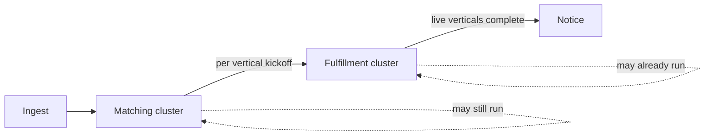
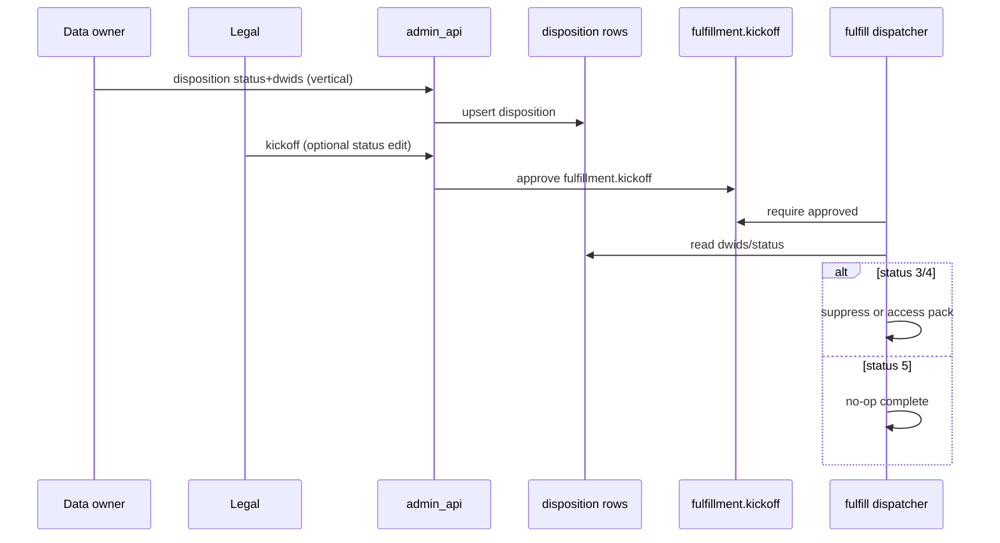
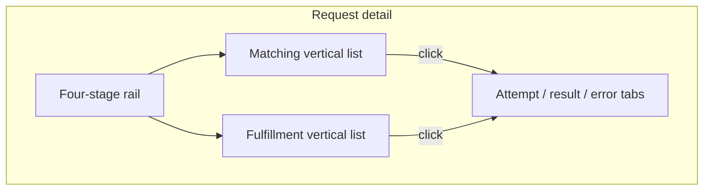

## Goal Capsule

Ship a **request journey workbench** on opened batch and individual request detail: a consistent four-stage high-level rail (**Ingest → Matching → Fulfillment → Notice**), with Matching and Fulfillment as **separate per-vertical clusters** that can run at the same time, plus the **full journey completion** path Legal needs (defaults, Legal kickoff with optional status change, Access identity-comment gate, suppression/access packs per vertical, templates, attachments, Notice rules).

**Authority:** this Product Contract (session 2026-07-29) > knowledge base `Request-Process-Requirements.md` where not superseded > plan `2026-07-27-001` (shared surfaces, role gates, Variation 1 detail) — **except** KD29’s six top-rail labels, which this contract revises to four high-level stages with DO review and Legal kickoff nested under Matching / Fulfillment clusters.

**Open blockers:** none. Exempt (`response_status` **2**) fulfillment rules deferred (see Scope Boundaries). **Stop when:** Definition of Done is met on a worktree/branch (no PR required). **Product Contract preservation:** unchanged — Planning Contract adds KTDs/units only.

---

## Product Contract

### Summary

Legal, admin, and data-owner operators work a request from **detail** (not Inbox list rows) with one high-level journey chrome and type/intake-specific substeps. Matching and Fulfillment are **per data vertical**, shown as clean vertical lists with status and progress; Legal may start Fulfillment for an approved vertical while Matching is still unfinished. Access Notice cannot start until every **live** vertical has finished disposition and (for status **3/4**) stored its access file in GCS. Non–CA DROP Notice is copy-paste from editable templates plus delivery confirm; attachments are general-purpose on the request. Platform SMTP stays deferred.

### Problem Frame

Today Legal sees weak stage orientation on detail (“Stage · N/M”), fulfillment can start after data-owner `matching.review` without a Legal kickoff, identity does not hard-block Access packs, email templates are list-only, and attachments have no usable web surface for the roles that need them. Prior plans settled a six-label coarse rail (KD29) that operators collapse into four high-level steps, and under-specified **per-vertical** matching → fulfillment. Legal cannot run the day-to-day loop end-to-end in-app without spreadsheet/Jira side paths for status, kickoff, notice drafts, and proof files.

### Key Decisions

- KD1. (session-settled: user-directed — chosen over thin-chrome-only or gates-only: Legal needs the full loop) **Ship the full program** — journey chrome and journey completion together (Approach A: detail workbench), not a thinned MVP.
- KD2. (session-settled: user-directed — chosen over KD29 six top-rail labels and dual-density Inbox/detail rails) **High-level rail is four stages on opened detail only:** Ingest → Matching → Fulfillment → Notice. Not on Inbox list rows. Same chrome for **selected batch detail** and **individual request detail** (batch shows aggregate vertical posture).
- KD3. (session-settled: user-directed — chosen over nested-expand or thin substep strip as production UI) **Matching and Fulfillment are separate clusters**, each with a **per-vertical list**: light indicator, compact progress, short status copy. Click opens request detail sections/tabs for that substep’s attempts, results, and errors (ops-log style). Coming-soon verticals are greyed; they orient, they do not run.
- KD4. (session-settled: user-directed — chosen over Matching-only or Fulfillment-only current) **Split rail posture:** when any vertical is still Matching and any vertical has started Fulfillment, **both** Matching and Fulfillment show in-progress on the top rail.
- KD5. (session-settled: user-directed — chosen over all-planned-verticals blocking) **Matching exits for a vertical** when that live vertical has disposition; **request-level Matching** is complete when all **live** verticals have disposition. Coming-soon verticals do not block. Legal may **early-advance only the verticals they approve/update**; other live verticals continue in the background (table-as-queue); results surface in the request UI.
- KD6. (session-settled: user-directed — chosen over mandatory second status confirm) **CA DROP Legal gate is kickoff** to start Fulfillment for approved vertical(s). No identity verification on CA DROP. Legal **may change** DROP `response_status` when needed at/before kickoff.
- KD7. (session-settled: user-directed — chosen over IDV for all non-DROP or optional IDV) **Access identity gate:** status update with **required comment** (Legal chooses verification method offline). Required before Access pack / Access notice template generation. Applies to Access and the **access leg of combined** only. **CA DROP cannot be Access** — enforce in product (ingest already forces DROP → delete; harden against `drop` + `access`).
- KD8. (session-settled: user-directed — chosen over shared identity blocking both legs) **Combined non–CA DROP:** delete/opt-out fulfillment may proceed without identity; Access pack/template waits on identity-comment. Legs independent after Matching.
- KD9. (session-settled: user-directed — chosen over 4/5-only or all statuses) **Disposition → artifacts:** status **3** and **4** require dwid selection (default = matching-result dwids) and per-vertical fulfillment (suppression and/or access pack as applicable). Status **5** = not found — no pack/suppression. Status **2** Exempted fulfillment rules deferred.
- KD10. (session-settled: user-directed — chosen over platform SMTP now) **Non–CA DROP Notice:** render template → Legal copy-paste send outside platform → confirm delivered/failed in-app. **SMTP deferred.** CA DROP Notice = Legal `notice.review` then weekly DROP batch (configurable; default Wed 00:00 America/Los_Angeles).
- KD11. (session-settled: user-directed — chosen over curated-only variables) **Template editor variables** = fields already visible on request detail for that role (including contact/PII Legal can see); exclude hashes, DWIDs, and ops-only ids unless later explicitly added. Admin create/edit; legal read-only on Settings (align KD1 settings mutate of plan 2026-07-27).
- KD12. (session-settled: user-directed — chosen over notice-proof-only or delivery-required attachment) **General request attachments** for data owner, legal, admin, and other authenticated app roles — upload/download on any request. Extends existing documents API (today legal/admin/super_admin only; no web UI) to those roles + UI. Notice proof is one use; Mark delivered does not require an attachment.
- KD13. (session-settled: user-directed — chosen over waiting on coming-soon) **Access Fulfillment complete / Notice start:** all **live** verticals finished disposition; for each live vertical with status **3/4**, access pack file stored in GCS. Coming-soon verticals do not block.
- KD14. (session-settled: user-approved — Approach A over gates-first or chrome-only) **Primary product shape is the detail workbench** — chrome and enforceable gates ship together so the rail stays honest.

### Actors

- A1. **Legal user / Legal admin** — Inbox and detail workbench; kickoff; optional status change; Access identity-comment; Notice approve (DROP) or copy-paste + delivery confirm (non-DROP); attachments; read Settings templates (admin mutates).
- A2. **Data owner** — per-vertical Matching disposition (status + dwid selection for 3/4); assign-to-legal; attachments; My work / Matching lane remains canonical for disposition unless Legal early-advances that vertical.
- A3. **Admin / super_admin** — same detail chrome as Legal where role allows; Settings template editor; attachments; ops surfaces unchanged by this contract.
- A4. **System** — ingest, auto-match per live vertical, fulfillment workers (suppression / access pack), DROP weekly upload after notice approval, background queue for in-flight verticals.

### Key Flows

- F1. **CA DROP happy path** — Ingest → auto-match (Data vertical live; others coming-soon) → data owner sets status (**3/4** with dwids, or **5**) → Legal kickoff (optional status edit) → per-vertical suppression fulfillment → Notice approve → weekly DROP batch.
- F2. **Access (non–CA DROP)** — Ingest/Matching per live vertical → disposition → Legal identity status + comment → Legal **kickoff** → Access packs to GCS per vertical with **3/4** → when all live verticals done, Notice template with URL(s) → copy-paste → confirm delivery; attachments optional for proof.
- F3. **Combined delete/opt-out + Access** — shared Matching; delete/opt-out fulfillment may run without identity; Access pack waits on identity-comment; Notice for Access waits on KD13; parent tracks both legs.
- F4. **Overlap** — Legal kickoff starts Fulfillment for vertical V while Matching still open for vertical W → top rail shows Matching and Fulfillment in-progress; each cluster lists its verticals.
- F5. **Legal early-advance vertical** — Legal updates/approves status for selected live vertical(s) only; remaining live verticals keep processing in background; UI reflects pending vs running vs complete.



### Requirements

**Journey chrome**

- R1. Opened **batch detail** and **individual request detail** MUST show the four-stage high-level rail: Ingest → Matching → Fulfillment → Notice. Inbox list rows MUST NOT show the journey strip.
- R2. Matching and Fulfillment MUST render as **separate clusters** with per-vertical rows (indicator, progress, status copy). Coming-soon verticals MUST appear greyed with non-actionable state.
- R3. When Matching and Fulfillment both have in-flight work, the top rail MUST show **split in-progress** posture (KD4).
- R4. Activating a vertical/substep MUST open detail sections/tabs with attempts, results, and errors for that substep (log-oriented).
- R5. Substeps under each high-level stage MUST vary by request type and intake source (CA DROP vs Access vs combined vs delete/opt-out).

**Matching**

- R6. Auto-match runs for each **live** vertical; non-live verticals are coming-soon only.
- R7. Recommended DROP status defaults remain: no match → **5**, 1:1 → **3**, multi → **4**. Prefill; persist on approve/early-advance.
- R8. For status **3** and **4**, Data Owner (or Legal when acting on that vertical) MUST select dwid(s); default = matching-result dwids.
- R9. Request-level Matching completes when all **live** verticals have disposition; coming-soon does not block (KD5).
- R10. Legal early-advance applies **only** to verticals Legal approves/updates; others continue in background and surface in UI (KD5).

**Legal gates and fulfillment**

- R11. Fulfillment for a vertical MUST NOT auto-start solely from data-owner `matching.review` approval. Legal **kickoff** (CA DROP / delete-opt-out path) or Access **identity-comment** then kickoff (Access path) MUST gate start for that vertical’s fulfillment work.
- R12. CA DROP: no identity verification required; Legal may change `response_status` at/before kickoff (KD6).
- R13. Access (and combined access leg): identity **status + required comment** MUST clear before Access pack generation and Access notice template generation (KD7).
- R14. Each vertical with status **3** or **4** MUST run applicable fulfillment (suppression and/or access pack). Status **5** MUST NOT require pack/suppression (KD9).
- R15. Access Notice MUST NOT start until KD13 is satisfied for live verticals.
- R16. Product MUST reject or prevent CA DROP intake/rows typed as Access (KD7).

**Notice, templates, attachments**

- R17. CA DROP Notice: Legal approves fulfillment notice → row eligible for configured weekly DROP upload batch.
- R18. Non–CA DROP Notice: render type-mapped template (variables per KD11) → copy-paste → confirm delivery status. No platform SMTP in this program (KD10).
- R19. Settings → Email templates: admin create/edit/preview with variables; request-type → default slug mapping for Access, delete, opt-out, combined, and general correspondence as needed.
- R20. Authenticated roles in KD12 MUST upload/download request attachments via UI; audit without unnecessary PII in logs.

### Acceptance Examples

- AE1. Covers F1 / R11. CA DROP Data vertical approved **3** with dwids; without Legal kickoff, suppression worker does not start; after kickoff, suppression runs and Notice becomes available after fulfillment.
- AE2. Covers F4 / R3. Vertical A in Fulfillment running while vertical B still “Pending Data Owner Review”; top rail shows Matching and Fulfillment in-progress; both clusters list their verticals.
- AE3. Covers F2 / R11 / R13 / R15. Access request: identity-comment missing → Access pack blocked; with comment but no kickoff → pack blocked; after identity + kickoff, packs write to GCS; Notice blocked until all live verticals with **3/4** have files; then template includes URL(s).
- AE4. Covers F3 / R11 / R13. Combined: delete leg uses kickoff without identity; Access pack waits on identity-comment then kickoff.
- AE5. Covers R1. Inbox row shows no journey strip; opening the request shows the four-stage rail.
- AE6. Covers R18 / R19. Admin edits Access template with `{{shareable_url}}` and requestor name; Legal renders draft, copies, marks delivered without SMTP.
- AE7. Covers R8 / R14. Multi-match defaults to **4**; DO adjusts dwid set; fulfillment uses selected dwids.

### Success Criteria

- S1. Legal can run CA DROP and Access (and combined) requests **end-to-end in-app** without a spreadsheet/Jira side path for status, kickoff, notice draft, or proof files.
- S2. Operators ask fewer “where is this request?” / “what’s next?” questions because detail rail + vertical lists make current/next owner and progress obvious.
- S3. Fulfillment never starts from Matching approval alone; Access Notice never starts before live-vertical Access completion (KD13).

### Scope Boundaries

**In scope**

- Four-stage detail chrome; Matching/Fulfillment vertical clusters; split rail posture; coming-soon stubs; Legal kickoff and status edit; Access identity-comment; per-vertical fulfillment; templates editor + type map; general attachments UI + role expansion; Notice paths; enforce CA DROP ≠ Access.

**Deferred for later**

- Platform SMTP / in-app send.
- Cassandra `restricted_person_id` cutover (interim GCS suppression remains acceptable).
- Live matching/fulfillment for non–Data verticals (UI coming-soon only).
- Exempt (`response_status` **2**) fulfillment and dwid rules.
- Prescriptive identity-verification methods beyond status + required comment.

**Outside this program**

- Replacing DROP ops fine journey for super_admin pipeline console.
- Building a second Legal-only surface separate from shared admin/legal chrome.

### Dependencies / Assumptions

- Existing documents API is the attachment persistence path; roles expand beyond today’s legal/admin/super_admin.
- Email template GET/PUT/render APIs exist; web must wire editor and type→slug usage.
- Recommended status helper `0→5 / 1→3 / N→4` remains authoritative for defaults.
- Plan `2026-07-27-001` Variation 1 detail (Fulfillment default tab, action bar, role-shared chrome) remains unless this contract overrides journey chrome labels and gates.
- Batch detail uses the **same** four-stage + vertical-cluster chrome with aggregate posture (KTD / U4 rollup).

### Outstanding Questions

**Resolve Before Planning**

- None.

**Deferred to Planning** (resolved in Planning Contract KTDs — kept as breadcrumbs)

- OQ1. Vertical catalog labels/order — KTD3 catalog constant.
- OQ2. Multiple Access GCS URLs in one template — KTD8.
- OQ3. Fine ops ↔ four-stage map — KTD2 (legal detail authoritative).
- OQ4. Attachment limits — KTD9 (reuse documents API limits; extend if missing).

### Sources / Research

- Session grounding: `/tmp/compound-engineering/ce-brainstorm/pipeline-journey-20260729/` (grounding, gap-matrix, journey-model, fulfillment-notice, email-templates, matching-status, type-source-matrix, kb-journey-extract).
- Prior plan: `docs/plans/2026-07-27-001-feat-legal-admin-ia-visual-plan.md` (KD29–KD40 — rail labels revised here; shared surfaces retained).
- Prior plan: `docs/plans/2026-07-24-001-feat-legal-fulfillment-journeys-plan.md` (fulfillment / notice / delivery).
- Verified gaps (2026-07-29): no Legal kickoff in `data_fulfillment_dispatcher` fulfill gate; templates Settings list-only; IDV not hard-blocking; documents API role-narrow + no web UI; coming-soon only on `/dev/journey-chrome*`.
- Dev probes (temporary): `clients/web/src/routes/dev/journey-chrome.tsx`, `clients/web/src/components/dev/JourneyChromeProbes.tsx` — dispose after production chrome lands.

---

## Planning Contract

### Summary

Implement the Product Contract by (1) persisting per-vertical disposition + kickoff state, (2) hard-gating the fulfillment dispatcher on Legal `fulfillment.kickoff` and Access identity+comment, (3) exposing a journey API for the four-stage rail and vertical clusters, (4) shipping detail UI + Settings templates + attachments, (5) enforcing CA DROP ≠ Access. Delivery is on **worktrees/branches only** (no PR requirement). Execution separates **implementer**, **reviewer**, and **QC/QA** subagents (≥5 on substantive passes).

### Key Technical Decisions

- KTD1. (session-settled: user-directed — chosen over PR-based landing: branch/worktree handoff) **Landing strategy:** ship on git worktrees/branches; Definition of Done does **not** require opening a pull request. Review and QC run against the branch tip.
- KTD2. **Four-stage rail mapping (legal/admin detail):** Ingest ← fine `received`/`triage` (+ DROP download/land/promote when present); Matching ← fine `match` + per-vertical disposition incomplete; Fulfillment ← kickoff through fulfill attempts; Notice ← DROP `notice.review` or Access delivery readiness. Ops fine `JourneyProgressBar` on Inbox list rows stays ops-only; Legal Inbox list rows show **no** journey strip (R1). Home funnel may keep KD29 six keys until a follow-up; this plan’s authority is detail chrome.
- KTD3. **Per-vertical state now:** add `request_vertical_dispositions` (name may vary) keyed by `(request_id, vertical)` holding disposition status (3/4/5), selected dwids, actor, timestamps, and kickoff linkage. Live vertical today = `data` (DROP hash). Coming-soon catalog (fixed for this plan): Mailchimp, Lever, Paylocity, Auth0, Cassandra — greyed, no disposition rows. Do **not** store durable status as JSON on `requests`. For DROP, keep `drop_raw_requests.response_status` in sync with the live Data vertical disposition on write (disposition is SoR for gates; `response_status` remains DROP upload field). Extend attempt ledgers with `vertical` when a second vertical enqueues work; until then project Data vertical from existing request-scoped tables into the disposition row.
- KTD4. **Legal kickoff seam:** new approval kind `fulfillment.kickoff` on `approval_requests` (+ `approval_rules` seed). Store `vertical` in `context_jsonb`. Worker readiness requires approved kickoff for that vertical **after** disposition. Do not overload `matching.review` or `workflow.assignment`. Kickoff is idempotent: re-approve does not duplicate fulfill attempts if one is already open/succeeded for that vertical+artifact kind.
- KTD5. **Legal early-advance vs DO disposition:** Early-advance writes/updates the same `request_vertical_dispositions` row for that vertical (status + dwids) and records actor=`legal` (or admin). If DO later changes disposition on a vertical **not yet kicked off**, DO wins with audit. After kickoff or fulfill attempt in-flight/success, reject silent 3↔4/dwid overwrite; **reopen/remediate** is a minimal API+UI affordance owned by **U2** (clear kickoff / mark fulfill attempt superseded, then allow new disposition + kickoff) — not a separate product program. Status **5** may receive kickoff as a no-op fulfill completion so Notice can proceed. DO `matching.review` remains the Inbox/My-work queue signal; disposition upsert is the durable per-vertical SoR that kickoff and the dispatcher read.
- KTD6. **Access identity seam:** reuse `request_identity_verifications`; require `status=verified` and **non-empty `notes`**. Latest row wins; a later `failed`/`pending` re-blocks pack generation and Access notice render. Web UI must collect the comment. Enforce in `data_fulfillment_dispatcher` before Access pack and in Access notice/template render for request-bound sends.
- KTD7. **Dispatcher readiness (Data vertical first):** replace “approved `matching.review` alone” with: disposition present on live vertical + approved `fulfillment.kickoff` for that vertical + (Access/combined access leg: identity gate **before** kickoff is actionable for packs) + status **3/4** implies artifact work, **5** marks fulfill-complete without pack. Access and DROP both require kickoff; Access adds identity+comment as a prior gate. Fix the path where setting `response_status` skips suppression write yet opens Notice — suppression (or explicit no-op for **5**) must complete before DROP notice eligibility.
- KTD8. **Access Notice start:** “Start” means request-bound template render that includes pack URLs **and** delivery confirm actions. Settings template preview without a request context remains allowed. For combined requests, Access Notice is independent of delete-leg completion; still requires KD13 for **live** verticals. Multiple pack URLs: template variable `shareable_urls` (list) plus primary `shareable_url` (first/latest) for backward compatibility.
- KTD9. **Attachments:** expand documents API to data_owner + authenticated app roles that can open the request; add download endpoint; UI on request detail. Optional `purpose` (`general` | `notice_proof` | …). Delete = uploader or admin/super_admin. Reuse existing size/type limits; document in API if missing. No PII in audit payloads beyond existing document id/filename rules.
- KTD10. **CA DROP ≠ Access:** DB CHECK and promote/manual create reject `intake_source=drop` with `request_type=access` (and combined-with-access on DROP).
- KTD11. (session-settled: user-directed — chosen over single mixed agent roles) **Agent orchestration for execution:** on each substantive unit or slice, use **≥5 subagents**, with **implementer** and **reviewer** as separate agents (disjoint file ownership where possible), plus a dedicated **QC/QA** pass after review before calling a slice done.

### High-Level Technical Design





### Assumptions

- Batch detail uses the same chrome with aggregate vertical posture (Product Contract assumption retained).
- Home Mixpanel funnel six-key labels may lag this plan; detail rail is the operator authority.
- Interim GCS suppression remains the DROP suppress artifact until Cassandra cutover (out of scope).
- `combined` request_type gains dual-leg fulfillment routing in the dispatcher as part of this program (Product Contract F3).

### Alternative Approaches Considered

- **Derive-only vertical UI without disposition table** — rejected (session): insufficient for honest kickoff/overlap; user required per-vertical state now.
- **Kickoff as boolean column on requests** — rejected: weaker audit; poor per-vertical fit.
- **PR-required landing** — rejected (session): worktrees/branches only.

### Risks & Dependencies

- **Risk:** Existing promote-sets-`response_status` path skips suppression — Notice opens without artifact. **Mitigation:** KTD7 rewrite readiness + journey notice eligibility.
- **Risk:** Dual stage models (ops fine vs four-stage) confuse implementers. **Mitigation:** KTD2; legal detail never uses ops Inbox progress bar.
- **Dependency:** dbmate migrations in `db/migrations/`; UV packages `admin-api`, `data-fulfillment-dispatcher`, web Bun app.
- **Dependency:** IAP/role lists already gate legal/admin; expand documents principals carefully.

### System-Wide Impact

- Legal/admin/data_owner web detail and Settings; admin-api journey + correspondence + approvals; fulfillment dispatcher; DROP promote constraints; optional Home funnel lag.
- Agents executing this plan must not open PRs unless a human later asks; use worktrees/branches.

---

## Implementation Units

### U1. Per-vertical disposition schema and API

**Goal:** Persist per-vertical disposition (status, dwids, actor) and expose read/write for Data vertical + catalog stubs.

**Requirements:** R6–R10, R8, KD3/KD5/KD9, KTD3, KTD5

**Dependencies:** none

**Files:**
- `db/migrations/` (new migration for `request_vertical_dispositions` or equivalent)
- `libs/habeas-privacy-core/` (models/helpers as needed)
- `app/admin_api/src/admin_api/` (disposition endpoints; wire promote/early-advance)
- `app/admin_api/tests/` (new or extend matching/disposition tests)

**Approach:** Create disposition table keyed by `(request_id, vertical)`. On DO promote / Legal early-advance, upsert Data vertical row with status + dwids (default from matching results) and sync DROP `response_status` when applicable. Coming-soon verticals are not inserted. Optional one-time backfill of open DROP rows from `response_status` is allowed but not required for DoD.

**Patterns to follow:** thin spine; approval + ledger patterns in `approvals.py` / workflow approval module.

**Test scenarios:**
- Happy path: DO sets status 3 with default dwids → disposition row for `data`; R7 defaults 0→5 / 1→3 / N→4 prefill.
- Covers AE7: multi-match defaults to 4; DO adjusts dwid set; persisted selection is what fulfillment reads.
- Edge: status 5 → no dwids required; row stored. Status 4 without dwids rejected.
- Error: status 3 without dwids rejected.
- Integration: Legal early-advance on `data` while other verticals absent → only one live row; catalog still returns coming-soon in journey DTO (U4).

**Verification:** migration applies; API upsert/get covered by pytest; no JSON-on-requests SoR.

---

### U2. Legal kickoff approval + dispatcher hard gate

**Goal:** Fulfillment cannot start from `matching.review` alone; require `fulfillment.kickoff` per vertical; status 5 no-op; fix notice-without-suppress leak.

**Requirements:** R11–R14, R17, KD6, KD9, KTD4, KTD5, KTD7, AE1

**Dependencies:** U1

**Files:**
- `db/migrations/` (approval_rules seed for `fulfillment.kickoff` if needed)
- `libs/habeas-privacy-core/src/habeas_privacy_core/workflow/approval.py` (or equivalent)
- `app/admin_api/src/admin_api/approvals.py` / workflow routes (kickoff action)
- `app/data_fulfillment_dispatcher/src/data_fulfillment_dispatcher/fulfill.py`
- `app/data_fulfillment_dispatcher/tests/` / `app/admin_api/tests/test_request_journey.py` / matching review tests

**Approach:** Seed `fulfillment.kickoff`. Legal/admin kickoff API approves gate with vertical context; optional status/dwid edit via U1 rules. Dispatcher `find_requests_ready_to_fulfill` / `_route_fulfill` checks kickoff + disposition. Idempotent enqueue. Status 5 completes without pack. DROP notice eligibility requires suppress success or status-5 no-op completion — not merely `response_status` set. Minimal **reopen/remediate**: API to supersede kickoff / in-flight attempt so a new disposition+kickoff can proceed (KTD5).

**Execution note:** Start with failing dispatcher tests that prove matching.review alone does not fulfill.

**Test scenarios:**
- Happy: disposition 3 + kickoff → suppress attempt created; after success, DROP notice eligible.
- Edge: kickoff twice → single open/success attempt; status 5 + kickoff → no-op complete, notice eligible.
- Error: matching.review approved, no kickoff → not ready; post-kickoff silent 3↔4 rejected without reopen.
- Integration: promote sets status without kickoff → no notice.review until kickoff+fulfill path completes.

**Verification:** pytest green for dispatcher + admin-api kickoff; AE1 satisfied.

---

### U3. Access identity enforcement + Access Notice readiness + DROP≠Access

**Goal:** Hard-block Access packs and Access notice start on identity+comment; enforce KD13 live-vertical pack bar; reject drop+access.

**Requirements:** R13, R15, R16, KD7, KD8, KD13, KTD6, KTD8, KTD10, AE3, AE4

**Dependencies:** U1, U2. Overlay identity-comment control coordinates with U5 (U5 owns `RequestDetailOverlay.tsx` shell after U3 lands the API contract).

**Files:**
- `app/admin_api/src/admin_api/request_correspondence.py` (identity notes required; render/delivery gates)
- `clients/web/src/components/requests/RequestDetailOverlay.tsx` (comment required on verify — serialize with U5)
- `app/data_fulfillment_dispatcher/.../fulfill.py` (identity check; combined access leg)
- `app/drop_ingestor/.../promote.py` + DB CHECK migration
- Tests: correspondence, fulfill, promote

**Approach:** Require notes on verified identity. Dispatcher refuses Access pack without latest verified+notes **and** without kickoff (R11). Request-bound Access template render / delivery actions check KD13 helper (all live verticals disposed; 3/4 have GCS artifacts). Combined: delete leg uses kickoff without identity; access leg needs identity then kickoff. DB CHECK + API reject drop+access. CA DROP path must not require identity (R12).

**Test scenarios:**
- Happy: verified+notes + kickoff → pack → notice render allowed when packs ready.
- Covers AE3 negatives: missing notes → pack blocked; notes without kickoff → pack blocked; 3/4 without GCS → notice render blocked.
- Edge: later failed identity re-blocks render; CA DROP suppress/kickoff succeeds with no identity row (R12).
- Error: drop+access create/promote rejected.
- Integration: combined delete fulfills with kickoff without identity; access pack blocked until identity then kickoff (AE4).

**Verification:** pytest covers gates; web requires comment field.

---

### U4. Journey workbench API (four-stage + vertical clusters)

**Goal:** API DTO for detail chrome: four-stage postures, Matching/Fulfillment vertical lists, progress/status strings, attempt summaries for drill-in.

**Requirements:** R1–R5, R3, KD2–KD4, KTD2, KTD3, AE2

**Dependencies:** U1, U2

**Files:**
- `app/admin_api/src/admin_api/request_journey.py` / new journey workbench module
- `app/admin_api/src/admin_api/main.py` (route registration)
- `clients/web/src/lib/api.ts` + types
- `app/admin_api/tests/test_request_journey.py`
- `clients/web/src/lib/legalJourneyLabels.ts` (four-stage labels; keep coarse helpers if needed)

**Approach:** Add response shape consumed by detail UI (individual request and **batch aggregate**). Split rail posture when any matching vertical incomplete and any fulfillment vertical in progress/complete-started. Batch aggregate: stage current if any member request is current; vertical row shows worst/in-progress posture across the batch (document exact rollup in API docstring). Include coming-soon catalog rows. Expose attempt/error summaries for drill-in tabs.

**Test scenarios:**
- Happy: DROP mid-matching → Matching current; after partial kickoff → split posture (AE2).
- Edge: all coming-soon except data → only data actionable; batch of two requests → aggregate posture reflects in-progress member.
- Integration: journey DTO matches disposition + kickoff + attempt ledgers.

**Verification:** API tests for posture matrix; OpenAPI/types updated for web.

---

### U5. Detail UI — four-stage rail, vertical clusters, drill-in tabs

**Goal:** Replace overlay “Stage · N/M” with four-stage rail + Matching/Fulfillment clusters; batch and individual detail; no journey on Inbox list rows; dispose probe routes when production chrome lands.

**Requirements:** R1–R5, KD2–KD4, AE2, AE5

**Dependencies:** U4, U3 (identity comment control already on Fulfillment tab)

**Files:**
- `clients/web/src/components/requests/RequestDetailOverlay.tsx` (**U5 owns this file** for rail/clusters/actions; U7 attachments land after U5 or via U5-owned PR-less commits on the same branch)
- `clients/web/src/components/ops/RunTimeline.tsx` (reuse or thin wrapper)
- New component(s) under `clients/web/src/components/requests/` for rail/clusters (prefer extend overlay over many new files)
- `clients/web/src/routes/requests/needs-attention.tsx` (ensure list rows have no strip; detail pane hosts rail)
- `clients/web/src/routes/requests/$requestId.tsx`
- `clients/web/src/components/dev/JourneyChromeProbes.tsx` + `routes/dev/journey-chrome*` (remove or redirect when done)
- `clients/web/src/lib/legalJourneyLabels.test.ts`

**Approach:** Port probe `FourRail` lessons into production tokens. Clusters under Matching/Fulfillment. Click opens tabs with attempts/errors (pattern from `AttemptRow` / MatchingReviewPanel). Kickoff + identity-comment actions on action bar / Fulfillment tab.

**Execution note:** Prefer smoke against local Vite once API is up; unit-test label/posture mappers.

**Test scenarios:**
- Happy: detail shows four stages; vertical list status copy updates with API.
- Edge: split posture visible with two verticals in different clusters (fixture/mock).
- Integration: Inbox list row has no journey strip; opening request shows rail (AE5).

**Verification:** label tests; manual/smoke on `/requests/needs-attention` detail + `/requests/$requestId`.

---

### U6. Email templates Settings editor + type map + Access draft wiring

**Goal:** Admin create/edit/preview templates with detail-visible variables; type→slug map; retire hardcoded Access draft where render exists.

**Requirements:** R18, R19, KD10, KD11, AE6

**Dependencies:** U3 (render gates)

**Files:**
- `clients/web/src/components/LegalSettingsSheet.tsx`
- `clients/web/src/lib/api.ts` (PUT/render clients)
- `app/admin_api/src/admin_api/request_correspondence.py` (variable allowlist; type map if server-owned)
- `clients/web/src/components/fulfillment/AccessDeliveryEmail.tsx`
- Seeds/migration if new slugs needed
- Tests: correspondence + web if present

**Approach:** Editor for subject/body with placeholder insertion from allowlist (KD11). Legal read-only. Map access/delete/opt_out/combined/general. Access delivery uses render API only.

**Test scenarios:**
- Happy: admin PUT template; render with shareable_url.
- Edge: unknown variable rejected or left unreplaced consistently (pick one; document).
- Error: legal cannot PUT.
- Integration: AccessDeliveryEmail shows rendered body (AE6).

**Verification:** API tests; Settings UI smoke.

---

### U7. Request attachments UI + role expansion + download

**Goal:** General attachments on request detail for authenticated roles; download; optional purpose.

**Requirements:** R20, KD12, KTD9

**Dependencies:** U5 (overlay shell owner) — attachments panel commits after rail/clusters on the same branch; API role expansion may start in parallel.

**Files:**
- `app/admin_api/src/admin_api/request_correspondence.py` (roles, download)
- `clients/web/src/lib/api.ts`
- `clients/web/src/components/requests/RequestDetailOverlay.tsx` (Details panel attachments — after U5)
- `app/admin_api/tests/` correspondence document tests

**Approach:** Expand principal checks; GET download; UI list/upload/download. Purpose optional. Audit ids/filenames only.

**Test scenarios:**
- Happy: data_owner uploads; legal downloads.
- Edge: delete by non-uploader non-admin rejected.
- Error: unauthenticated/forbidden roles.
- Integration: notice_proof purpose visible on request; Mark delivered still works without attachment.

**Verification:** pytest role matrix; UI smoke on detail.

---

### U8. Cross-slice QC/QA and probe cleanup

**Goal:** End-to-end QC against AE1–AE7; remove temporary `/dev/journey-chrome` probes; confirm branch tip ready for human merge (no PR required).

**Requirements:** S1–S3, all AEs, KTD1, KTD11

**Dependencies:** U1–U7

**Files:**
- Tests touched across packages; delete or gate `clients/web/src/routes/dev/journey-chrome*` and CommandPalette lab entry
- Plan verification notes only (no new product files unless fixing gaps)

**Approach:** Dedicated QC/QA subagent pass (≥5 agents total with implementers/reviewers across slices). Run Verification Contract commands. File gaps as branch commits, not PRs.

**Test scenarios:** Covers AE1–AE7 as a checklist; regression on kickoff/identity/notice.

**Verification:** Checklist signed off in branch notes / agent handoff; probes gone from production nav.

---

## Verification Contract

**Commands (repo-relative cwd):**

```bash
uv sync --all-packages
uv run --package admin-api pytest app/admin_api/tests/test_request_journey.py app/admin_api/tests/test_request_correspondence.py -q
uv run --package data-fulfillment-dispatcher pytest app/data_fulfillment_dispatcher/tests -q
cd clients/web && bun install && bunx tsc -b --pretty false
cd clients/web && bun test src/lib/legalJourneyLabels.test.ts
```

**Gates:**
- Dispatcher refuses fulfill without kickoff; Access refuses pack without identity+notes **and** without kickoff; CA DROP does not require identity.
- Journey DTO split posture + batch aggregate covered by API tests; disposition defaults/AE7 covered in admin-api tests.
- Web typecheck clean for touched files.
- AE1–AE7 manually or automatically exercised on the worktree branch.
- No `/dev/journey-chrome` in primary nav after U8.
- `RequestDetailOverlay.tsx` changes serialized (U5 owner) per KTD11.

---

## Definition of Done

**Global**
- Product Contract R1–R20 and AE1–AE7 satisfied on a git **worktree/branch** (KTD1 — no PR required).
- Implementer and reviewer were **separate** agents with **disjoint file ownership** (or serialized shared files per U5); a **QC/QA** round ran after review; substantive slices used **≥5 subagents** (KTD11). Handoff notes under `tmp/reviews/` (or equivalent) for the QC pass.
- Migrations in `db/migrations/` only; no secrets committed; no PII in logs/audit payloads.
- Temporary journey-chrome lab routes removed or clearly non-nav.

**Per unit:** each U1–U8 verification section passes; unit test scenarios implemented or explicitly waived with reason in the unit notes on the branch.

---

## Appendix

### Research breadcrumbs

- Gate seams: fulfillment kickoff approval kind; identity table harden; KD13 helper; DROP≠Access CHECK — see planning research under session scratch `plan-gate-research.md`.
- Vertical model: no vertical column today; disposition table + catalog stubs — `plan-vertical-model.md`.
- UI reuse: `RunTimeline`, `RequestDetailOverlay`, `LegalSettingsSheet`, `AccessDeliveryEmail`, `AttemptRow` — `plan-ui-research.md`.
- Prior plans: `docs/plans/2026-07-27-001-feat-legal-admin-ia-visual-plan.md`, `docs/plans/2026-07-24-001-feat-legal-fulfillment-journeys-plan.md`.
