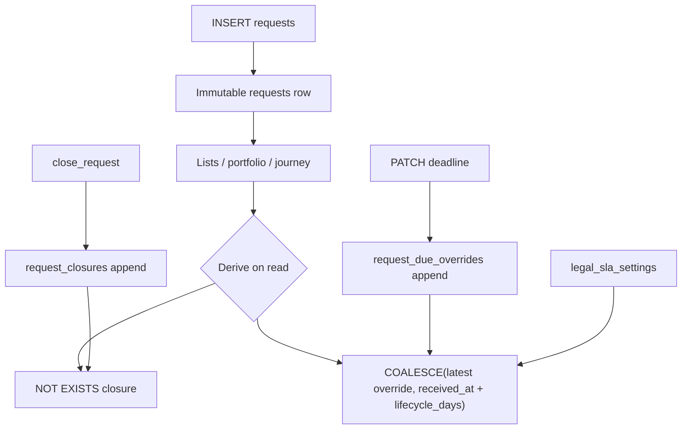

## Goal Capsule

Restore ADR-08 / ADR-33 intent: `requests` is an insert-only receipt dimension. Move close and SLA deadline override off the spine into append-only fact tables; derive open/closed and current due on read (queue-as-table / latest-row style). Drop mutable `due_at*`, `closed_at`, `closed_by` from `requests` and harden immutability at the database layer.

**Authority:** ADR-08 (current status is a derived view; `requests` never updated after intake) > ADR-33 (thin requests dimension) > session-settled 2026-07-29/30 (remove SLA + close columns; closures + due-overrides only; calculated due always derived) > this plan. Supersedes plan `2026-07-27-001` KTD3 storage of `requests.due_at*` (product SLA behavior KD35 remains; storage shape changes).

**Stop when:** spine columns match the immutable receipt set; close/open and deadline queries use fact tables + derivation; app no longer `UPDATE`s `requests`; migration + tests green.

---

## Product Contract

### Summary

Operators still close requests and override deadlines. Those facts must not mutate the spine. Close is an append-only row; open work = no closure. Calculated deadlines come from `received_at` + global `legal_sla_settings` (and optional stage-entry math in app code for detail contexts); only admin overrides persist as append-only rows; current due = `COALESCE(latest override, calculated)`.

### Problem Frame

Legal-admin work added `due_at`, override stamps, and `closed_at`/`closed_by` onto `requests`, turning the dimensional receipt into a mutable ops row. That conflicts with queue-as-table + derive-status (ADR-08) and the thin spine (ADR-33). Portfolio, lists, journey, and close APIs already treat those columns as operational status.

### Key Decisions

- KD1. (session-settled: user-directed) Remove `due_at`, `due_at_override_at`, `due_at_override_by`, `closed_at`, and `closed_by` from `requests`.
- KD2. (session-settled: user-directed) Append-only `request_closures` for close; open = `NOT EXISTS` closure row for that `request_id`.
- KD3. (session-settled: user-directed) Append-only `request_due_overrides` for admin overrides only; no ledger of every recalculation.
- KD4. (session-settled: user-directed) Calculated due is always derived on read — default portfolio/list formula: `received_at + legal_sla_settings.lifecycle_days`. Stage-specific clocks (`calculate_due_at_for_stage`) remain as pure functions for callers that know stage entry; they must not write the spine.
- KD5. (session-settled: user-directed) Harden `requests` immutability: `REVOKE UPDATE, DELETE` for `app_user` plus a trigger that rejects any `UPDATE`/`DELETE` on `requests`.
- KD6. (session-settled: user-directed) Scope principle: future operational stamps do not land on `requests`; they follow append-only fact + derive-on-read.

### Requirements

- R1. `requests` retains insert-time receipt/routing columns only (`id`, `received_at`, `intake_source`, `raw_record_id`, `requestor_state`, `request_type` — current repo spine per U20/U21 / ADR-32 restore). No SLA or close columns.
- R2. Closing a request inserts into `request_closures` (idempotent if already closed: return existing). Still clears pending approvals and may set DROP `response_status` on raw as today.
- R3. Admin deadline override inserts into `request_due_overrides`; does not update `requests`.
- R4. Open-request filters (`closed_at IS NULL`) become `NOT EXISTS (SELECT 1 FROM request_closures …)`.
- R5. Deadline risk / overdue queries use `COALESCE(latest override.due_at, received_at + lifecycle_days)`.
- R6. API response fields `closed_at`, `closed_by`, `due_at` remain available where product already exposes them — sourced from fact tables / derivation, not spine columns.
- R7. No personally identifying information in override/closure payloads beyond actor email already used elsewhere; audit metadata only for override command.
- R8. Existing global SLA settings table and settings API stay; behavior of KD35 (settings + override + risk displays) preserved with new storage.

### Scope

**In scope:** migration (new tables, data backfill from spine columns if present, drop spine columns, immutability trigger); core close/override/due helpers; admin-api + workflow call-site rewrites; unit/integration tests.

**Out of scope:** removing `requestor_state` / `request_type` from spine (separate ADR-33 purity conversation); materialized `v_request_status`; sla_monitor rewrite beyond compile/query breakage; frontend UX changes beyond typing that already mirrors API fields.

### Acceptance Examples

- AE1. Close then list open — Given an open request, When Legal closes it, Then a `request_closures` row exists, `requests` row is unchanged, and open lists exclude it.
- AE2. Override then risk — Given lifecycle due in 10 days, When admin overrides due to yesterday, Then portfolio overdue counts use the override and history shows the override row.
- AE3. Spine forbid — Given any app role, When `UPDATE requests SET …` runs, Then the database rejects it.

---

## Planning Contract

### Key Technical Decisions

| ID | Decision |
|----|----------|
| KTD1 | New migration `core_request_closures_and_due_overrides` (timestamp after existing SLA/close migrations): create tables → backfill from `requests` columns when present → drop columns/indexes → create `core_forbid_requests_mutation` trigger + re-assert `REVOKE UPDATE, DELETE`. |
| KTD2 | `request_closures (id, request_id UNIQUE, closed_by, closed_at, created_at)` — at most one close row per request (UNIQUE on `request_id`). Reopen out of scope; no delete. |
| KTD3 | `request_due_overrides (id, request_id, due_at, overridden_by, overridden_at)` — many rows; current = `ORDER BY overridden_at DESC LIMIT 1` / `DISTINCT ON`. |
| KTD4 | Shared SQL fragments / helpers in `habeas_privacy_core` (workflow or db): `is_request_open`, `effective_due_at` expression, `close_request` rewrite, `insert_due_override`. |
| KTD5 | `apply_request_due_at_for_stage` becomes calculate-and-return (no `UPDATE requests`); skip return/`None` when an override exists. Call sites keep calling for future detail use but persistence is gone. |
| KTD6 | Portfolio / list / journey / reconcile SQL: replace `r.closed_at` / `r.due_at` with EXISTS/COALESCE patterns; prefer one shared CTE snippet to avoid drift. |
| KTD7 | Expand-then-contract in one migration is acceptable for dev/early schema (columns just landed Jul 28); backfill closures/overrides before drop. |

### Assumptions

- PA1. No production dependency yet on reading `requests.due_at` / `closed_at` outside this repo’s admin-api/core paths listed in unit file lists.
- PA2. Lifecycle-derived due for list/portfolio is acceptable vs previously persisted stage-shortened due (KD4).
- PA3. `app_user` is the application role that must lose UPDATE on `requests` (matches original create migration).

### System-Wide Impact

- **Migration:** additive tables + column drop on `requests`; forbid trigger.
- **API:** close and deadline override response shapes unchanged; internal SQL changes.
- **Compatibility:** plan `2026-07-27-001` KTD3 storage superseded; product KD35 behavior retained.

### Technical Design



### Risks

| Risk | Mitigation |
|------|------------|
| Missed `closed_at` / `due_at` SQL site | Grep gate in verification; shared helpers |
| Backfill missed if columns already dropped in some envs | `IF EXISTS` column checks / defensive migration SQL |
| Stage-due behavior change on Home | Documented KD4; stage calc remains available for detail later |

### Open Questions

- None blocking. Deferred: optional SQL view `v_request_deadline` if portfolio SQL grows unwieldy (not required for v1).

---

## Implementation Units

### U1. Migration — closures, overrides, drop spine ops columns, forbid mutation

**Goal:** Schema matches Product Contract R1–R5, R8; KD5 enforcement.

**Requirements:** R1, R2, R3, R5, R7, R8

**Files:**
- Create: `db/migrations/20260730140001_core_request_closures_and_due_overrides.sql`
- Modify: `libs/habeas-privacy-core/tests/test_migrations.py`
- Test: `libs/habeas-privacy-core/tests/test_migrations.py`

**Approach:** Create `request_closures` and `request_due_overrides` with `REVOKE UPDATE, DELETE`. Backfill from `requests` when columns exist. Drop `due_at*`, `closed_*` and related indexes. Add `core_forbid_requests_mutation()` trigger on `UPDATE OR DELETE`. Keep `legal_sla_settings` / team tables untouched.

**Patterns:** `db/migrations/20260724120001_intake_legal_correspondence.sql` (append-only + revoke); `db/migrations/20260528000001_core_queue_primitives.sql` (forbid function shape).

**Test scenarios:**
- Migration file exists with both new tables, DROP COLUMN for ops fields, forbid function.
- Integration T4.1 still asserts spine column set without due/closed columns.
- Integration: INSERT into requests succeeds; UPDATE requests raises; close backfill creates closure when source columns had data (if test DB had prior columns — optional).

**Verification:** `uv run --group dev pytest libs/habeas-privacy-core/tests/test_migrations.py -q`

---

### U2. Core helpers — close, override, effective due, open predicate

**Goal:** Single write/read API so call sites do not invent SQL.

**Requirements:** R2, R3, R4, R5, R6

**Files:**
- Modify: `libs/habeas-privacy-core/src/habeas_privacy_core/workflow/approval.py` (`close_request`)
- Create or modify: `libs/habeas-privacy-core/src/habeas_privacy_core/db/request_lifecycle.py` (or extend `workflow/` SLA helpers) for override insert + effective-due SQL helpers
- Modify: `app/admin_api/src/admin_api/legal_sla.py`
- Test: `app/admin_api/tests/test_request_close.py`, `app/admin_api/tests/test_legal_sla.py`
- Optional: `libs/habeas-privacy-core/tests/test_request_lifecycle.py`

**Approach:** `close_request` inserts closure instead of updating spine; already-closed via existing closure row. Override path inserts override row. `apply_request_due_at_for_stage` stops updating `requests`. Export reusable SQL snippets or async helpers for open filter and effective due.

**Patterns:** `request_identity_verifications` insert + latest select; existing `close_request` DROP status side effects.

**Test scenarios:**
- Close inserts closure; second close returns `already_closed` without second row (UNIQUE).
- Override inserts row; effective due prefers override over lifecycle calc.
- `apply_request_due_at_*` does not issue `UPDATE requests`.
- Override present → stage apply returns `None` / skips (preserve prior skip-on-override behavior).

**Verification:** targeted pytest for close + legal_sla modules.

---

### U3. Call-site SQL — portfolio, lists, journey, reconcile

**Goal:** No remaining references to `requests.closed_at` / `requests.due_at` / override columns on spine.

**Requirements:** R4, R5, R6

**Files:**
- Modify: `app/admin_api/src/admin_api/legal_portfolio.py`
- Modify: `app/admin_api/src/admin_api/requests_list.py`
- Modify: `app/admin_api/src/admin_api/request_journey.py`
- Modify: `libs/habeas-privacy-core/src/habeas_privacy_core/workflow/approval.py` (reconcile open filter)
- Modify: `app/admin_api/src/admin_api/drop_pipeline.py` / `main.py` only if still calling apply-due for persistence expectations
- Modify: `clients/web/src/lib/api.ts` only if types need adjustment (likely unchanged field names)
- Test: existing portfolio / journey / close tests updated for new SQL mocks or integration expectations

**Approach:** Replace every `r.closed_at IS NULL` with `NOT EXISTS (… request_closures …)`. Replace `r.due_at` filters with COALESCE expression against overrides + lifecycle settings. Grep-clean.

**Test scenarios:**
- Unit tests that stub close still pass with closure-shaped return.
- Grep: zero matches for `r.closed_at`, `r.due_at`, `due_at_override` on `requests` in `*.py` outside migration down paths.

**Verification:** `rg` gate + `uv run --group dev pytest app/admin_api/tests/test_request_close.py app/admin_api/tests/test_legal_sla.py -q`

---

## Verification Contract

```bash
# Static gate — no spine ops column usage in app/libs (except migrations)
rg -n 'r\.(closed_at|due_at)|due_at_override|UPDATE requests' app libs --glob '*.py'

# Migration + unit tests
uv run --group dev pytest \
  libs/habeas-privacy-core/tests/test_migrations.py \
  app/admin_api/tests/test_request_close.py \
  app/admin_api/tests/test_legal_sla.py \
  app/admin_api/tests/test_workflow_assignment.py \
  -q
```

Integration tests that need `DATABASE_URL` should pass T4.1 spine column assert.

---

## Definition of Done

- [x] U1–U3 complete; Product Contract R1–R8 satisfied (landed `8beb05b` / `7f20674` on `master`; migration `20260730140001` applied on `dpra-dev-temp`)
- [x] `requests` has no SLA/close columns; forbid trigger active
- [x] Close and deadline override only append fact tables
- [x] Verification commands above pass (or documented skip only for missing `DATABASE_URL` integration)
- [x] Plan `2026-07-27-001` KTD3 storage called out as superseded in this Goal Capsule **and** annotated on that plan's KTD3 (doc pass 2026-07-30)

**Follow-ups (non-blocking):** broader unit coverage for second-close / override insert / forbid-trigger UPDATE; prefer importing `REQUEST_IS_OPEN_SQL` at call sites that still inline the same predicate; redeploy `admin-web-dev` if UI from the co-landed pagination commit must match the live API.
