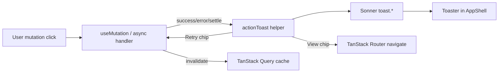

## Goal Capsule

Make **action toast** (Sonner via shadcn: title + one supporting line + one primary action chip) the universal post-action feedback for every user-triggered mutation in `clients/web`. Land a shared helper, wire **all** mutation and mutating async sites, convert clipboard success to the same pattern, and **delete** the `/dev/feedback` lab route and doc pointers.

**Authority:** session-settled product choice (action toast over simple / described / snackbar / inline / page banner; full coverage; remove lab) > `.agent/modules/frontend-stack.md` / `.agent/modules/design-taste.md` / `clients/web/AGENTS.md` / `clients/web/README.md` > this plan.

**Stop when:** shared helper exists and is the only production call path for mutation toasts; every inventoried mutation/async write/clipboard success uses it (or documents an explicit `skipToast` exception); `/dev/feedback` and router entry are gone; docs no longer mention the lab; `bun run lint` + `bun run build` pass; privacy-safe toast copy verified on fixtures.

---

## Product Contract

### Summary

Operators and owners get consistent feedback after saves, queues, assigns, declines, connects, and copies: a top-right action toast with a Retry / View / Undo / Open run / Copy again chip. Field validation stays inline. Destructive confirms stay in dialogs. The feedback lab page is removed.

### Key Decisions

- KD1. (session-settled: user-directed — chosen over simple / described / snackbar / inline / page banner) Action toast is the universal product pattern.
- KD2. (session-settled: user-directed) Wire **all** mutation sites in this plan (not a high-traffic subset).
- KD3. (session-settled: user-directed) **Remove** `/dev/feedback` entirely (route, file, doc pointers).

### Requirements

- R1. Shared helper wraps Sonner for success / error / warning / info / promise with a required action chip on product-default paths (fallback chip: **Dismiss** via `toast.dismiss` when no View/Retry/Undo/Copy again applies).
- R2. Global `Toaster` remains single-mounted in `AppShell` (already present).
- R3. Every `useMutation` and mutating async handler settles with an action toast (or documented `skipToast` + alternate UI).
- R4. Toast copy never includes PII, hashes, or DWIDs — request/run/attempt ids and counts only; call sites must pass errors through `actionToast.safeErrorMessage` (or fixed copy) — never raw `.message` / API bodies.
- R5. Field validation and “are you sure?” confirms stay inline / dialog — not toasts.
- R6. Failed mutations never emit success toasts (same posture as AE2 / prior legal AE18).
- R7. Delete `clients/web/src/routes/dev/feedback.tsx`, unregister route, scrub lab references from agent and human docs; replace “call `toast` from sonner” guidance with `actionToast` helper imports.
- R8. Clipboard “copied” feedback uses the same helper (success + Copy again); title uses fixed labels only — never interpolate copied values/URLs/JSON/body text.

### Actors

- A1. Legal / admin operators — Inbox, request journey, settings, upload.
- A2. Super_admin — DROP console, workers/health config, connections.
- A3. Connection owner — `/connect/$token` redeem (still under `AppShell` / Toaster).

### Key Flows

- F1. Mutation success → action toast → optional View/Open navigates.
- F2. Mutation failure → error toast → Retry re-invokes same args when the originating handler is still valid; after navigate-away, prefer View/Open back to origin instead of Retry.
- F3. Queued / multi-step work → `actionToast.promise` (stable id, loading non-dismissible until settle) → Open run / Retry; reject replaces the same toast (no second toast).
- F4. Bulk partial failure → warning toast with counts + Retry-failed when applicable; Details chip only if safe (counts/ids); otherwise omit Details.
- F5. Create-then-navigate → toast fires before navigate and remains visible on the next route (success path; errors stay on the create page with Retry).

### Acceptance Examples

- AE1. Save worker schedule → success toast with View (or Open settings) chip; no silent invalidate-only.
- AE2. Inbox fulfill/decline fails → error toast with Retry; no success toast; no false status advance.
- AE3. Run Pipeline → single loading→result toast; Retry on failure.
- AE4. Bulk triage partial fail → warning toast with ok/fail counts only (no email/sample PII).
- AE5. Manual create request → toast visible after redirect to `/requests`.
- AE6. `/dev/feedback` returns SPA not-found / no route; docs do not mention the lab.
- AE7. Toast fixtures and call-site copy contain no email, name, hash, or DWID.

### Scope Boundaries

**In:** `clients/web` helper, Toaster tuning if needed, all inventoried mutation/async/clipboard sites, lab removal, doc scrub of lab pointers.

**Out:** Backend API changes; new toast libraries; redesign of empty states; SSE/refetch noise toasts; inventing Undo for irreversible server effects.

### Deferred to Follow-Up Work

- Soft-delete Undo with compensate APIs where none exist today.
- Optional global `MutationCache` error safety-net (this plan uses call-site helper only to avoid double toasts).

---

## Planning Contract

### Product Contract preservation

Product Contract authored in this bootstrap (no upstream brainstorm). Session-settled KD1–KD3 and KTD1–KTD2 unchanged.

### Key Technical Decisions

- KTD1. (session-settled: user-directed — chosen over dual chrome) Shared helper at `clients/web/src/lib/action-toast.ts` is the only production API for mutation feedback; call sites do not import `toast` from `sonner` directly except inside the helper.
- KTD2. (session-settled: user-approved — research default over MutationCache-first) Prefer helper calls from `useMutation` `onSuccess` / `onError` / `onSettled` and `mutateAsync` + `actionToast.promise` for long-running work. Do **not** add a global MutationCache toaster in this plan (avoids double-firing). R6 is inherited by every mutation unit.
- KTD3. Toast replaces **API outcome** inline banners (`setError` / `setMessage` / `bulkError` as primary outcome UX). Keep **client field validation** inline. DROP console may retain `ActionResultFrame` for JSON debug **in addition to** toast; toast action “View result” focuses/scrolls to the panel (`tabindex=-1` + focus) when present. Dual chrome: toast stays brief; panel/card holds detail.
- KTD4. Action chip defaults: error → Retry when safe; success → View/Open when a route/id exists else **Dismiss**; warning → Keep/Undo if reversible else Details (safe payload only) or Dismiss; copy → Copy again; irreversible deletes → Dismiss (no Undo).
- KTD5. Autosave SLA toggles: one toast per discrete user gesture with stable `id` (replace, don’t stack); do not toast on programmatic hydration.
- KTD6. `/connect/$token` is in scope. Keep full-page Connected card **and** always emit redeem success + error action toasts (toast + card). Remove inline API `submitError` once toast covers outcomes.
- KTD7. Remove lab page and scrub docs that point at it; update frontend-stack to mandate `actionToast` imports.
- KTD8. Verification: `bun run lint`, `bun run build`, plus `bun:test` unit tests for the helper (mirror `legalJourneyLabels.test.ts`). No Vitest harness — do not invent one in this plan.
- KTD9. `safeErrorMessage`: parse `Admin API <status>: {json}` envelopes; accept allowlisted detail strings (migrate connect redeem maps into helper); unknown/array/object detail → generic message. Call sites never interpolate `.message` into toast title/description.
- KTD10. Timing: error/warning with Retry/Keep use long/`Infinity` duration until dismiss or action; success/info default ~6s; post-navigate and promise-settled success ≥10s when an action chip is present. Loading promise toasts are non-dismissible until settle.
- KTD11. A11y (U1): action chip is a real button with focus ring; close button available; do not steal page focus on appear; keyboard smoke for error+Retry and one promise flow.

### Assumptions

- `AppShell` wraps all routes that need toasts, including `/connect/$token`.
- Sonner `^2.0.7` already installed; no new dependencies required.
- Parallel executors land after U1; U2–U10 file ownership is disjoint (U10 does **not** reopen U2/U3 files).

### High-Level Technical Design

Executor fan-out (after U1): ten disjoint ownership packs matching Implementation Units U1–U10.

### Risks & Dependencies

| Risk | Mitigation |
|------|------------|
| Toast spam on SLA autosave | Stable toast `id`; toast only on user-driven mutate |
| Double feedback (inline + toast) | Remove outcome `setError`/`setMessage` when toast covers it; keep validation |
| PII in `Error.message` | Sanitize in helper; bulk uses counts only |
| Navigate-away loses toast | Fire toast before navigate; Sonner persists across route |
| `needs-attention.tsx` size/conflicts | Single executor owns the file |
| DROP JSON panel loss | KTD3: keep panel + toast View |

---

## Implementation Units

### U1. Helper, Toaster, lab removal, doc scrub

**Goal:** Canonical `actionToast` API; remove `/dev/feedback`; docs match KD3.

**Requirements:** R1, R2, R7, AE6, AE7, KTD1, KTD2, KTD4, KTD7, KTD8, KTD9, KTD10, KTD11

**Dependencies:** none

**Files:**
- create: `clients/web/src/lib/action-toast.ts`
- create: `clients/web/src/lib/action-toast.test.ts`
- modify: `clients/web/src/components/ui/sonner.tsx` (visibleToasts ≤ 3 if missing)
- modify: `clients/web/src/router.tsx` (drop feedback route)
- delete: `clients/web/src/routes/dev/feedback.tsx`
- modify: `.agent/modules/frontend-stack.md`, `.agent/modules/design-taste.md` (if needed), `clients/web/AGENTS.md`, `clients/web/README.md` (remove lab; mandate `actionToast`)

**Approach:** Export typed helpers requiring `{ title, description, action: { label, onClick } }` with Dismiss fallback; `promise` variant; `safeErrorMessage` with Admin API envelope + allowlisted details (migrate connect redeem maps). Encode KTD4 chip defaults as documented helpers/`copied()` convenience. Timing per KTD10.

**Execution note:** Land and prove helper tests before parallel fan-out.

**Test scenarios:**
- Happy: `actionToast.success` returns id; action onClick invoked.
- Error: unknown Error → generic safe message; Admin API allowlisted detail → friendly string; validation-array detail → generic.
- Promise: resolve → success with action; reject → same-id error path.
- Covers AE6. Route unregistered; docs lack `/dev/feedback`.
- Covers AE7. Fixture table of unsafe errors never leaks email/hash/DWID.

**Verification:** helper tests pass via `bun test`; build/lint green; `/dev/feedback` unregistered; docs scrubbed.

---

### U2. Needs attention (Inbox) mutations

**Goal:** All ~16 `useMutation` hooks in Inbox emit action toasts; bulk partial → warning with counts.

**Requirements:** R3, R4, R6, R8, F2, F4, AE2, AE4

**Dependencies:** U1

**Files:**
- modify: `clients/web/src/routes/requests/needs-attention.tsx`

**Approach:** Wire each mutation’s settle handlers; include Inbox clipboard copy sites (R8); Retry closes over last variables; strip primary outcome inline errors once toast is live; keep confirm dialogs; toast descriptions only via `safeErrorMessage` or fixed copy.

**Test scenarios:**
- Covers AE2. Decline fail → error + Retry.
- Covers AE4. Bulk partial → warning counts-only.
- Happy: assign success → toast + invalidate.
- Edge: dialog cancel → no toast.

**Verification:** lint/build; manual Inbox smoke for triage / fulfill / bulk.

---

### U3. Request detail overlay mutations

**Goal:** Overlay stage actions, comments, delivery, matching disposition toast on settle.

**Requirements:** R3, R6, R8, F1, F2

**Dependencies:** U1

**Files:**
- modify: `clients/web/src/components/requests/RequestDetailOverlay.tsx`

**Approach:** Align copy with Inbox where actions overlap; include overlay clipboard; View opens/focuses request when useful; sanitize via helper.

**Test scenarios:**
- Comment fail → error + Retry.
- Matching disposition success → success toast.
- Delivery status fail → error toast (not silent).

**Verification:** lint/build; overlay smoke.

---

### U4. Request triage dialog clipboard

**Goal:** Triage “copy” notes become action toasts.

**Requirements:** R8

**Dependencies:** U1

**Files:**
- modify: `clients/web/src/components/requests/RequestTriageDialog.tsx`

**Approach:** Replace `setDraftNote('Copied…')` with helper success + Copy again.

**Test scenarios:**
- Copy subject/body/url → success toast with fixed titles only (“Copied subject”, “Copied body”, “Copied URL”); never interpolate copied values.

**Verification:** lint/build.

---

### U5. DROP pipeline / console mutations

**Goal:** Run Pipeline, console actions, hash refresh use promise/settle toasts; keep ActionResultFrame per KTD3.

**Requirements:** R3, R6, F3, AE3, KTD3

**Dependencies:** U1

**Files:**
- modify: `clients/web/src/routes/ops/drop-pipeline.tsx`

**Approach:** `actionToast.promise` for multi-step run (KTD10 loading rules); console/hash settle toasts; View result focuses panel.

**Test scenarios:**
- Covers AE3. Pipeline queue fail → error + Retry.
- Hash refresh success → success + Open/View when id exists.
- ActionResultFrame still populates on console actions.

**Verification:** lint/build; console smoke if admin-api available.

---

### U6. Legal settings, SLAs, conditions

**Goal:** Settings sheet, SLA page, conditions editor toast on save/team/schedule mutations.

**Requirements:** R3, R6, KTD5

**Dependencies:** U1

**Files:**
- modify: `clients/web/src/components/LegalSettingsSheet.tsx`
- modify: `clients/web/src/routes/requests/slas.tsx`
- modify: `clients/web/src/components/legal/ConditionsEditor.tsx`

**Approach:** Replace silent success and inline save status with action toasts; stable ids for toggle spam control.

**Test scenarios:**
- SLA toggle success → one toast (id stable on rapid re-toggle).
- Conditions save fail → error + Retry.
- Team add fail → error toast without email in copy.

**Verification:** lint/build.

---

### U7. Health configuration + worker schedules

**Goal:** Retry config and schedule saves toast on settle.

**Requirements:** R3, R6, AE1

**Dependencies:** U1

**Files:**
- modify: `clients/web/src/routes/ops/health/configuration.tsx`
- modify: `clients/web/src/routes/ops/workers/ScheduleConfigPanel.tsx`

**Approach:** Replace `setMessage` outcome strips with helper; keep validation inline if any.

**Test scenarios:**
- Covers AE1. Schedule save → success toast.
- Config save fail → error + Retry.

**Verification:** lint/build.

---

### U8. Manual request create/upload + matching review

**Goal:** Create/upload and matching-review approve toast; create survives navigate (F5).

**Requirements:** R3, R6, F5, AE5

**Dependencies:** U1

**Files:**
- modify: `clients/web/src/routes/requests/new.tsx`
- modify: `clients/web/src/routes/approvals/matching-review.tsx`

**Approach:** Toast before navigate on create success; upload settle toast; approve was silent → success toast; create errors stay on page with Retry (no navigate).

**Test scenarios:**
- Covers AE5. Create → toast visible on `/requests`.
- Upload fail → error + Retry.
- Approve success → toast.

**Verification:** lint/build.

---

### U9. Connections + connect redeem

**Goal:** Create/invite/revoke/redeem/async connection flows toast; privacy-safe copy.

**Requirements:** R3, R4, R6, R8, KTD6, KTD9

**Dependencies:** U1

**Files:**
- modify: `clients/web/src/routes/connect.$token.tsx`
- modify: `clients/web/src/components/ops/ConnectionCreateDialog.tsx`
- modify: `clients/web/src/components/ops/ConnectionInvitePanel.tsx`

**Approach:** Partial create+invite failure → error toast for invite leg; redeem always toasts success and error (toast + Connected card); remove inline API outcome alerts; migrate SAFE_API allowlists into helper usage; invite-link copy → title-only “Copied invite link” (never URL/token in description).

**Test scenarios:**
- Invite mint fail after connection create → error toast (not full success).
- Redeem fail → error + Retry; Connected card not shown; no dual inline+toast for API errors.
- Redeem success → success toast + Connected card.
- Invite link copy → fixed title only; no URL/token in toast.
- Toast copy has no secret or owner email.

**Verification:** lint/build.

---

### U10. Remaining clipboard sites

**Goal:** Access delivery email + run-detail clipboard use helper (no reopen of U2/U3 files).

**Requirements:** R8

**Dependencies:** U1

**Files:**
- modify: `clients/web/src/components/fulfillment/AccessDeliveryEmail.tsx`
- modify: `clients/web/src/routes/ops/run-detail.tsx`

**Approach:** Title-only success toasts; never put JSON, subject, or body into description.

**Test scenarios:**
- Run-detail copy JSON → “Copied run JSON” title only.
- Access delivery copy → “Copied delivery email” title only; never interpolate rendered subject/body.

**Verification:** lint/build; grep shows no production `from 'sonner'` outside helper; no `dev/feedback` route.

---

## Verification Contract

1. `cd clients/web && bun test src/lib/action-toast.test.ts`
2. `cd clients/web && bun run lint`
3. `cd clients/web && bun run build`
4. Grep gates: no `routes/dev/feedback`; no `from 'sonner'` outside `lib/action-toast.ts` and `components/ui/sonner.tsx`; no `.message` interpolation into toast title/description in changed call sites
5. Manual smoke: Inbox mutation, DROP Run Pipeline (if API up), settings save, connect redeem error path, clipboard copy; keyboard smoke error+Retry + one promise toast
6. Privacy: U1 fixture tests + skim toast strings in changed files for email/hash/DWID patterns

---

## Definition of Done

- [ ] U1–U10 complete per file ownership
- [ ] KD1–KD3 honored (action toast only; all sites; lab gone)
- [ ] KTD1–KTD2 honored (helper-only call path; no global MutationCache toaster)
- [ ] Verification Contract green
- [ ] Reviewer + QCQA batches leave no open P0/P1 privacy or double-toast issues
- [ ] Docs scrubbed of `/dev/feedback` and mandate `actionToast`

---

## Sources & Research

- Repo inventory: 35 `useMutation` hooks across **11** files + 2 async mutation surfaces (`ConnectionCreateDialog`, `ConnectionInvitePanel`) + clipboard sites across fulfillment/ops/inbox/overlay/triage/connections
- Sonner 2 + TanStack Query v5 docs (action object, promise settle, mutate callback pitfalls)
- Best-practice constraints: helper-required action, stable ids, no MutationCache dual path in v1
- Spec-flow gaps closed via KTD3–KTD11
- Institutional: no `docs/solutions/`; failed-kickoff posture from `docs/plans/2026-07-27-001-feat-legal-admin-ia-visual-plan.md` (AE18) mapped to AE2/R6 here
- Doc review 2026-07-30: coherence/feasibility/design/security/scope — safe autos + gated judgments applied (Dismiss fallback, duration, a11y, redeem toast+card, disjoint U10, connection R8)
