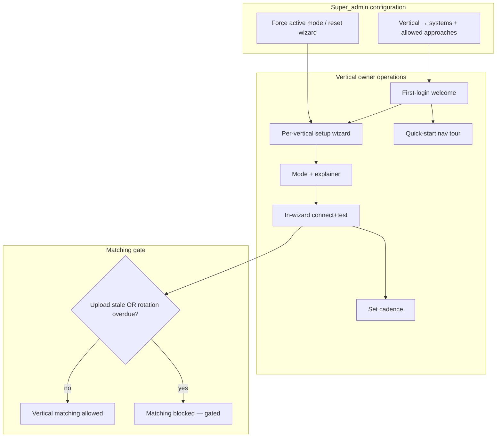
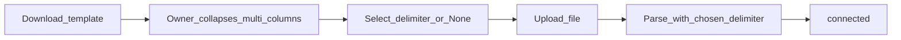
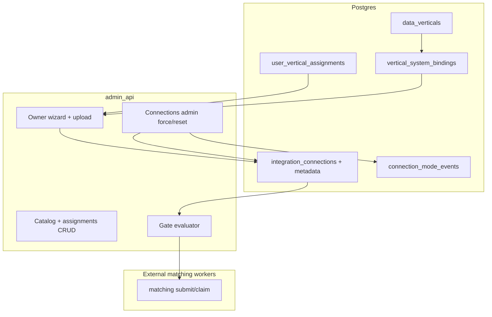

> **SUPERSEDED (Mailchimp):** Communications walkthrough/system is Axios HQ (`axios_hq`); do not deploy or extend Mailchimp — historical plan text left intact.

# Vertical-scoped connectors - Plan

## Goal Capsule

Extend the shipped per-system Connections onboarding and external vertical hash workers so **data owners operate inside assigned verticals** — choosing Live vs Upload per system, **connecting (credentials or upload) inside the vertical wizard**, setting refresh cadence, and keeping credentials fresh — while **super_admin** configures vertical→system mappings and can override or reset owner setup.

**Objective:** First ship covers the v1 **vertical catalog** (KD20): SaaS owner verticals get vertical-scoped roles, a per-vertical setup wizard (mode explainer → in-wizard connect+test → cadence → confirm), **first-login welcome** routing into the assigned vertical, soft reminders, a **skippable quick-start nav tour** (re-offered **on every login** until completed or skipped), and a **hard gate on matching** when Upload data is stale or Live credential rotation is overdue (~6 months). **Data** appears in the catalog as **already connected** (view-only; no Upload or owner credential wizard). **Owner access = vertical assignment + IAP login** — no one-off invite links as the routine owner path (KD22). **2026-08-17 slice:** data-owner **My work / Inbox / detail** inherit legal/admin workbench density (not Legal Home Variation B); **post-match selector** uses owner language mapped to DROP 3/4/5; after **Legal kickoff**, owners **manually complete SaaS fulfillment** via comment + named status (Data stays automatic). If Live is not working, not set up, or not permissioned, owners **re-upload** (or switch to Upload) from Connectors and from Inbox freshness callouts. Google Sheets direct/live connection is deferred; Paylocity **Upload** is template file ingest; Paylocity **Live** is SFTP. Shell/welcome chrome and **login animation (PostAuthSplash)** rename to **Habeas Platform** (`habeas-cli` slug) across **all user-visible chrome** — not welcome-only (KD28; Jose confirmed OQ14).

**Product authority:** Session brainstorm 2026-08-11 + 2026-08-13 onboarding deltas + **2026-08-13 Mailchimp walkthrough (Jose)** + **2026-08-13 presentation / request-attempt chat (`c02a7e4a`)** — **single walkthrough authority** for connector setup through Notice > SirvenOS External-Integrations + Data-Verticals KB > shipped connections-onboarding plan > external-vertical-hash-workers plan > journey workbench (`2026-07-29-001`) + fulfillment (`2026-07-21-001`) for adjacent stages only.

**Supersedes:** Cursor plan `upload_verticals_lever_fix_b1d70869` (`~/.cursor/plans/upload_verticals_lever_fix_b1d70869.plan.md`) — durable upload-vertical and Lever-triage requirements are folded into this Product Contract; the Cursor plan is retired.

**Open blockers:** **Must-fix (walkthrough):** Connect-step Continue fires `wizard_incomplete` reminder before inline save+test — see KD27, R31. None other for core connector scope — OQ1–OQ4 resolved (KD17–KD20). Planning HOW for OQ5–OQ9 resolved (KTD1–KTD14). OQ12, OQ15–OQ18 remain open (OQ14 rename scope and OQ17 IAP first name **resolved by Jose 2026-08-13**). ~~OQ13 emergency ops invite~~ — **Resolved (KD22, KD30, Jose 2026-08-13):** invite URLs killed entirely; no break-glass `/connect/{token}`.

**Stop when:** Vertical catalog + assignments persist; SaaS owners land on first login → welcome → wizard; complete wizard (mode + **in-wizard** connect+test + cadence); gated status surfaces Needs refresh / Action required; matching claim helpers refuse Upload-stale or Live-rotation-overdue systems; eligible owners see skippable nav tour on **each login** until tour completed/skipped; Data remains view-only; **invite URLs and `/connect/{token}` removed entirely** (KD22, KD30); owner matching selector uses confirm / not a match / multi-person (KD34); owner Inbox has Fulfillment after Legal kickoff for SaaS (KD36); incomplete DO forks fixed (KD38); tests green; no secrets/PII in logs.

**Product Contract preservation:** KD1–KD20 and R/A/F/AE IDs stable; KD21+ and R23+ extend scope without rewriting settled decisions. Planning resolved deferred OQs without rewriting core product scope.

**Execution direction:** Characterization-first around shipped connections testers/redeem before extending; upload parse and matching gate are new behavior → add focused unit tests with each unit.

---

## Product Contract

### Summary

Move from per-system Connections (super_admin-only, global `data_owner` role, Ops-minted invite links) to **vertical-scoped connectors**: each SaaS vertical owns its systems, picks one active mode (Live or Upload) per system, **connects inside the vertical wizard** (Live: credential fields + **how-to + test overlay**; Upload: validate — **no** `/connect/{token}` invite page), and maintains data freshness on a cadence they set. **Owner access = assigned vertical + IAP login only** — **no invite URLs** (KD22, KD30). First login with incomplete connectors shows a **Habeas Platform welcome** (first name from Google IAP) and routes into the **super_admin-assigned vertical** wizard — the **only** owner path (KD23–KD24). Once wizard is complete with a passing Connect test, owners get a **skippable quick-start popover tour** of primary nav — **re-offered on every login** until they finish the tour or skip (Jose-confirmed). Super_admin maps verticals to systems and approaches, forces mode transitions, and resets wizard state. Matching for a vertical stays blocked until freshness and rotation rules pass; login and welcome reminders stay **soft** — incomplete wizard does not block IAP login (KD4, KD29). **End-to-end demo (F10):** connector wizard → request journey workbench matching disposition (1:1 / 1:many / no-match) → legal review → fulfillment (**Data vertical auto only today**; other SaaS verticals week of 2026-08-18) → **Notice** (Wednesday-night append + upload per existing `drop_notice_dispatcher` cadence) — see **Adjacent journey** and R33–R58.

### Problem Frame

Connections onboarding shipped a secure credential path per system, but mutations remain super_admin-only and `data_owner` is a global allowlist with no vertical binding. External hash workers and attempt tables are per-system; journey IA lists SaaS verticals as coming soon while only Data is live. Owners cannot self-serve mode choice, cadence, or credential rotation within their vertical. Ops cannot see which verticals are connected yet gated for matching. **2026-08-13 Mailchimp walkthrough:** assigned owner chose Live on Communications, reached Connect, pressed Continue before pasting/testing credentials — wizard advanced intent surfaced red `wizard_incomplete` reminder instead of walking them through inline connect+test (must-fix KD27, R31). Without vertical scope, in-wizard connect, and freshness gates, Habeas risks matching on stale Upload extracts or overdue Live credentials while owners lack a clear operating surface.

### Key Decisions

- KD1. (session-settled: user-directed — chosen over owner-only or admin-only control: owners need day-to-day autonomy within bounded verticals) **Hybrid control model** — super_admin/engineers configure vertical→system mappings and allowed approaches; owners operate inside assigned vertical(s).
- KD2. (session-settled: user-directed — chosen over simultaneous Live+Upload or owner-toggle without override: predictable worker behavior and ops clarity) **Single active mode per vertical-system** — exactly one of Live or Upload is active; super_admin can force a mode change; transitions between modes must be straightforward.
- KD3. (session-settled: user-directed — chosen over single owner per vertical or informal shared accounts) **Multiple owners per vertical** with **vertical-scoped roles on user accounts** — not a single global `data_owner` allowlist.
- KD4. (session-settled: user-directed — chosen over gate-on-login-only or no gate: protect matching integrity without blocking routine access) **Hard gate on matching** when Upload data is stale **or** Live credential rotation is overdue (~6 months); **soft** login prompts and reminders only.
- KD5. (session-settled: user-directed — chosen over fixed platform cadence or no cadence) **Per-vertical setup wizard includes cadence** — owner sets refresh cadence; super_admin can override cadence and **reset** wizard (forces redo).
- KD6. (session-settled: user-directed — chosen over request-wide owner powers) **Owner access is vertical-scoped** — read/write/delete on their vertical(s) and disposition for **their systems only**; not request-wide legal close, cross-vertical disposition, or platform-wide admin.
- KD7. (session-settled: user-directed — chosen over greenfield connector platform) **Extend existing artifacts** — `integration_connections`, connection testers, external hash workers, and per-system attempt tables; not a new integration stack. Owner connect uses in-wizard APIs only — **no** token redeem / `/connect/{token}` (KD22, KD30).
- KD8. (session-settled: user-directed — refined by Jose OQ2) **Data vertical is catalog-visible, not owner-onboarded** — Data / Cassandra appears in the vertical catalog as **already connected** (view-only for owners/engineers); no Upload approach, no owner invite, and no credential/upload wizard (Cassandra remains INF handoff per External-Integrations KB). Owner connector flows ship for SaaS verticals only.
- KD9. (session-settled: user-approved — chosen over API-first Paylocity live path) **Paylocity automated/live path is SFTP** — v1 Upload for flat-file ingest; SFTP is the Live successor (not a separate Paylocity API live mode in this model). **QCQA (settled_conflict, do not invert):** v1 keeps the existing Paylocity API connection tester; SFTP is the Live successor (KTD12 upload-first) — do not rip out the API tester.
- KD10. (session-settled: user-approved — chosen over Sheets API live in v1) **Google Sheets direct/live connection deferred** — no v1 live Sheets API path; BizDev Contact Use vs HR alumni list are distinct usage shapes (see R12, R13).
- KD11. (session-settled: user-directed — chosen over Upload-only SaaS) **Live + Upload approaches for SaaS generally** — both modes exist in the model; which is active follows KD2 per vertical-system.
- KD12. (session-settled: absorbed from upload-verticals plan — chosen over native-export column auto-mapping) **Template-mandated Upload ingest** — data owners reshape exports to frozen per-system CSV templates; v1 does not accept native-export column mapping or parallel PII columns (e.g. `Work Email` + `Personal Email` must be collapsed into the template `email` column before upload).
- KD13. (session-settled: absorbed from upload-verticals plan — chosen over fixed delimiter or numbered columns like `email_2`) **Multi-PII in single template columns** — multiple values per list-capable field (`email`, `phone`, `address`, …) live in one cell, split by an owner-selected delimiter (`None`, `;`, `|`, `,`) stored on connection metadata; parser uses only the selected delimiter.
- KD14. (session-settled: absorbed from upload-verticals plan — chosen over reusing `google_sheets` or SFTP credential fields for Upload) **Distinct upload systems** — `bizdev_contacts` (BizDev) and `hr_alumni` (HR) are separate connection systems; owner `google_sheets` invite is retired; Paylocity **Upload mode** uses template file upload (not SFTP credential fields). Paylocity **Live mode** remains SFTP per KD9.
- KD15. (session-settled: absorbed from upload-verticals plan — chosen over new CLI by default) **Lever triage in-repo first** — Ops surfaces `last_test_detail` / `last_test_triage` from stored connection tests; help and owner failure copy distinguish Postings-only API key from missing **Users read/list** permission; add CLI `connections list/test` only if Ops/Cloud SQL triage path is insufficient.
- KD16. (supersedes old Cursor plan blanket “no SFTP”) **Paylocity SFTP is Live-only** — the retired upload-verticals plan deferred all SFTP; brainstorm KD9 keeps SFTP as the Paylocity Live successor. GCP inbound SFTP / vendor push host remains deferred; Upload mode is template file ingest only.
- KD17. (session-settled: Jose OQ1 = A — chosen over designated primary-owner-only gate clear) **Any assigned vertical owner** may clear the hard gate — successful Upload refresh or Live/SFTP credential rotation by **any** owner assigned to that vertical clears matching block and stops reminders for that vertical-system; matching resumes when **all** owned systems in the vertical pass freshness/rotation.
- KD18. (session-settled: Jose OQ4 = C — chosen over showing “Connected” while matching is blocked) **Gated freshness/rotation UX** — when credentials authenticate or upload validates but matching is blocked for staleness or rotation, surfaces show **Needs refresh** / **Action required** (not “Connected”); strong signal that matching will not run until the gate clears.
- KD19. (session-settled: KB naming — chosen over “Website” or other informal labels) **Canonical vertical names from SirvenOS KB** — v1 catalog uses department-style verticals closest to today’s owner map; **Tech** (not “Website”) owns Auth0; KB department row **Marketing / Communications** maps to catalog vertical **Communications**; KB **HR / People** maps to **People/HR**.
- KD20. (session-settled: Jose OQ2 = catalog shape A — chosen over system-centric or journey-IA-only groupings) **v1 vertical catalog** — super_admin-maintained list of data verticals (named departments/domains) and, for each, which **systems + allowed approaches** (Live / Upload / SFTP) are configured. First-ship catalog:

| Vertical | KB name | Typical owner (KB) | System | Allowed approaches | Notes |
|----------|---------|-------------------|--------|-------------------|-------|
| **Communications** | Marketing / Communications | Heather (`hrodgers@`) | `mailchimp` | Live, Upload | Per External-Integrations §Department→system |
| **People/HR** | HR / People | Melody (`mfassino@`) | `paylocity` | Upload (v1); Live = SFTP (later) | Upload = template file ingest; Live successor is SFTP per KD9 |
| **People/HR** | HR / People | Melody (`mfassino@`) | `lever` | Live | Recruiting candidates |
| **People/HR** | HR / People | Melody (`mfassino@`) | `hr_alumni` | Upload only | Static alumni list; not live Sheets |
| **Tech** | Tech | Chris Koelbl (`ckoelbl@`) | `auth0` | Live, Upload | Identity; not “Website” |
| **BizDev** | BizDev | Brad (`blippmann@`) | `bizdev_contacts` | Upload only | Contact Us shape; no Mailchimp in BizDev vertical |
| **Data** | Data | Russ / DSE (INF) | Cassandra / CEPI pipeline | **None** (view-only) | Already connected via infra; no Upload; no owner invite or credential wizard (KD8) |

**Vertical catalog** (definition): the v1 list of **data verticals** above and, for each, which **systems + allowed approaches** are configured — not a separate product surface name.

- KD21. (session-settled: user-directed — chosen over separate invite/redeem; **refined Jose 2026-08-13**) **In-wizard connect** — after Mode selection, **Live credentials or Upload file** are submitted and tested **inside** the vertical setup wizard Connect step on `/owner/connectors`. **Live:** reuse existing per-system **how-to + test overlay** (credential fields, help copy, inline test result) from shipped connect UI — embedded in wizard, not a separate invite page. **Upload:** template + delimiter + validate inline. No invite/redeem process for assigned owners.
- KD22. (session-settled: user-directed — **confirmed Jose 2026-08-13:** kill invite URLs entirely) **No invite URLs** — owner onboarding is **vertical assignment + IAP login only**; super_admin assigns owners to verticals. **Remove** Ops invite mint, mailto invite URLs, `connection_invites` creation, and owner `/connect/{token}` redeem route — **no primary path, no fallback, no break-glass**.
- KD23. (session-settled: user-directed — chosen over landing on generic home with wizard_incomplete reminder) **First-login routing** — when an assigned owner logs in with incomplete connector setup, show welcome then route into the **super_admin-assigned vertical** wizard — the **only** owner onboarding path (KD22, KD30); primary vertical is the assigned catalog vertical named in welcome copy (OQ12 if multiple).
- KD24. (session-settled: Jose confirmed 2026-08-13) **Welcome copy** — first-login welcome headline: “Hello {first_name from Google IAP}, welcome to **Habeas Platform**”; body: “Let's set up your {Vertical} data vertical” (e.g. Communications from super_admin assignment); generic fallback when vertical not yet resolved: “Let's set up your data vertical”; primary CTA launches assigned vertical wizard (KD23).
- KD25. (session-settled: user-directed — chosen over mode toggle without context; **refined 2026-08-13 Mailchimp walkthrough**) **Mode step explainer** — Mode step always shows **Upload vs Live** definition cards in **plain language for non-engineers** (data owners are not expected to know API vs file ingest): **Upload** = you send Habeas Platform a file on a schedule you set; **Live** = Habeas Platform connects directly to the service to pull data. Per-system one-line hint; disallowed mode greyed with reason; shared “Connecting ≠ matching” footnote.
- KD26. (session-settled: user-directed — chosen over silent post-wizard landing; **Jose-confirmed 2026-08-13**) **Quick-start nav tour** — skippable popover/coach-mark tour of role-appropriate primary nav tabs (F9 table); **re-offered on every login** until user completes all steps or taps **Skip tour**; persist `completed` \| `skipped` in `localStorage`. In-app only — no SMTP (KTD13).
- KD27. (session-settled: user-directed — fixes shipped split-brain bug; **must-fix observed 2026-08-13 Mailchimp walkthrough**) **Connect Continue gated on inline connect+test** — Connect step **Continue** stays **disabled** until inline save+test succeeds on the **same vertical-scoped connection row**; must not advance to Cadence/Confirm and must **not** surface the red `wizard_incomplete` reminder (“connector setup incomplete… Finish the connector wizard so matching can run… This reminder does not block login”) when owner presses Continue before credentials are pasted and tested in-wizard. *Observed:* super_admin assigned Communications → Live → Connect → Continue at top fired reminder without inline connect.
- KD28. (session-settled: Jose confirmed 2026-08-13 — product rename, not regulatory relabel) **Habeas Platform** — user-facing display name **Habeas Platform** (slug `habeas-cli`); applies to **all user-visible chrome** — AppShell header/footer, document title, connect chrome, welcome sheet, **and PostAuthSplash login animation** — not welcome-only; keep **CA DROP** / **DROP** / company-as-vendor / support **Habeas** copy unchanged (OQ14 resolved).
- KD29. (session-settled: user-directed 2026-08-13 — chosen over hard login block for incomplete wizard) **Soft login, hard matching** — incomplete connector wizard does **not** block IAP login or routine navigation after welcome dismiss; login and connector reminders stay **soft** only (KD4, R10); **matching remains hard-gated** until wizard complete and freshness/rotation pass (KD4, KD18).
- KD30. (session-settled: user-directed — **supersedes invite-primary**; **confirmed Jose 2026-08-13**) **Vertical assignment is the only access grant** — super_admin assigning an owner to a vertical **is** the onboarding authorization; first login routes into the **same data vertical wizard** for mode select, credential paste, how-to overlay, connection test, and cadence. **Kill** separate Connections invite process and **all** owner `/connect/{token}` paths — not primary, not fallback (KD22).
- KD32. (session-settled: user-directed 2026-08-13 — chosen over tour before connect+test) **Tour eligibility follows connection test** — tour is **not offered** until **Connect-step test passes** (Live `ok` or Upload `upload_ok` on the vertical-scoped row) **and** wizard Confirm succeeds; mode/cadence-only progress does not make tour eligible.
- KD33. (session-settled: **Jose-confirmed 2026-08-13** — chosen over one-shot post-wizard-only tour) **Tour every login until complete** — once KD32-eligible, client offers tour **on each login** (after PostAuthSplash/welcome deferrals) while persistence is neither `completed` nor `skipped`; mid-chain exit without skip → re-offer next login. **super_admin `connections.wizard_reset`** clears tour state for affected vertical owners (align KTD8 `connections.wizard_reset`).
- KD34. (session-settled: user-directed 2026-08-17 — chosen over exposing DROP codes as the primary owner control) **Post-match selector is owner language** — primary choices **Confirm match**, **Not a match**, **Multi-person**, plus **Assign to legal**. Map to CA DROP `response_status` 3 / 5 / 4 (multi-person → 4 Opted out for selected persons per KB KD29). Numeric codes and “Promote-to-raw” copy stay secondary or hidden for `data_owner`. DWID multi-select on Confirm / Multi-person unchanged (R39–R41).
- KD35. (session-settled: user-directed 2026-08-17 — chosen over copying Legal Home Variation B onto My work; **Home follow-up same day**) **Port legal/admin workbench patterns, not the Legal command center** — data owner keeps **Home · Requests · Inbox · Connectors**. Port: dual-pane Inbox, four-stage detail overlay, grouping/due chrome, command palette **Requests + Actions** (no People). Owner **Home** is a simpler vertical-scoped cousin of Legal Home (pulse + queue + connector reminders). Do **not** port Legal funnel/heatmap, Settings sheet, People, or Legal Inbox chips (Unassigned · Notice · Delivery · Pre-matching holds).
- KD36. (session-settled: user-directed 2026-08-17 — chosen over owner-starts-fulfillment and over waiting for SaaS API automation) **Legal kickoff, then owner manual fulfillment for SaaS** — Legal still starts fulfillment (`fulfillment.kickoff`). **Data** vertical stays **automatic** (Cassandra/CEPI). **Communications, People/HR, Tech, BizDev** owners mark each owned vertical complete in Inbox via **comment + named status** (KD37). Does **not** invent new fulfillment workers this slice.
- KD37. (session-settled: user-directed 2026-08-17 — chosen over comment-only and over reusing DROP 3/4/5 for fulfillment) **SaaS fulfillment status updater** — required named status plus optional comment. v1 statuses: **In progress**, **Done in source**, **Blocked**, **Assign to legal**. Writes the vertical’s fulfillment attempt + correspondence body (audit metadata only). **Done in source** closes that vertical’s fulfillment leg. DROP 3/4/5 stay matching-disposition-only.
- KD38. (session-settled: user-directed 2026-08-17 — chosen over discarding the incomplete persona forks) **Merge incomplete data-owner forks into this slice** — (1) nav Inbox badge uses matching + fulfillment counts, not ops `kind=all`; (2) Tasks tab fetch matches the Tasks filter (not matching-only); (3) mount command palette for `data_owner` with Requests + Actions, **no People** (legal/admin KD18 preserved).

### Actors

- A1. **Super_admin** — maps verticals to systems and approaches; assigns owners to verticals; forces active mode; overrides cadence; resets owner wizard; retains global Connections admin (retest, force mode — **no** invite mint).
- A2. **Vertical data owner** — assigned to one or more verticals; first login → welcome → wizard; Live or Upload connect; matching disposition (KD34); after Legal kickoff, **manual SaaS fulfillment** in Inbox (KD36–KD37); re-upload when Live is down or unpermissioned.
- A3. **Platform engineer** — configures vertical/system catalog bindings with super_admin; extends testers and workers within existing patterns.
- A4. **Legal / admin** — request-wide journey and legal disposition; **not** vertical connector operators in v1 (see KD6).
- A5. **Matching worker** — consumes freshness/rotation gate state before running vertical external matching attempts.

### Requirements

**Vertical scope and roles**

- R1. User accounts carry **vertical-scoped roles** — assignment to one or more verticals with owner permissions bounded to those verticals (replaces implicit global `data_owner` for connector operations).
- R2. Super_admin maintains the **vertical catalog** (KD20) — which systems belong to each vertical and which approaches (Live, Upload) each system supports; **Data** is included for visibility with **no Upload** and no owner onboarding paths.
- R3. Owners see and mutate connector state **only for verticals and systems they are assigned to** — no cross-vertical connector admin.

**Modes and approaches**

- R4. Each vertical-system pair has **exactly one active mode** — Live or Upload — at a time; history of mode changes is auditable.
- R5. Super_admin can **force active mode** for any vertical-system and **reset** the owner setup wizard for that vertical (owner must complete wizard again).
- R6. **Upload mode** — owner or super_admin triggers **template-mandated file upload** refresh per cadence; staleness is evaluated against owner-set cadence (with super_admin override). Upload-mode systems: `bizdev_contacts`, `hr_alumni`, and Paylocity when Upload is the active mode.
- R7. **Live mode** — automated extract per system pattern: API pull where live exists today (e.g. Mailchimp, Lever, Auth0), **SFTP for Paylocity Live**; rotation overdue when credentials exceed ~6 months without refresh.
- R8. Mode transition UX must be **low friction** — switching Upload↔Live does not require re-architecting the vertical-system binding.

**Freshness, gates, and reminders**

- R9. **Hard gate matching** for a vertical when **any** owned system in that vertical is Upload-stale **or** Live-rotation-overdue; **any** assigned owner for that vertical may clear the gate via successful Upload refresh or rotation (KD17); matching resumes only when **all** owned systems in the vertical pass; suppression and other steps follow existing per-system rules unless separately gated.
- R10. **Soft reminders** on owner login and in connector surfaces when approaching or past cadence/rotation thresholds — reminders do not block login.
- R11. Gate evaluation is visible to **ops and owners** — when freshness or rotation fails, status shows **Needs refresh** / **Action required**, not “Connected”, even if credentials still authenticate or the last upload file is on record (KD18).

**Per-vertical owner wizard**

- R12. Each **SaaS owner vertical** has an **owner setup wizard** covering: active mode per system (with Upload vs Live explainer when both allowed), **in-wizard connect+test** (Live credentials or Upload file), and **refresh cadence**; completion is required before matching is eligible (subject to R9). Data owners complete **all** connection steps through this wizard — not via Ops Connections invite mint or `/connect/{token}` redeem (KD22, KD30). **Data** vertical has no wizard — already connected, view-only (KD8).
- R13. **Upload vertical system split** — BizDev **Contact Use** maps to connection system `bizdev_contacts`; HR **alumni list** maps to `hr_alumni` (not `google_sheets`); v1 does not ship Sheets API live or owner sheet-share path for either.
- R14. **BizDev and HR alumni in v1** — both provisioned as **upload-only** via `bizdev_contacts` and `hr_alumni` template file upload; BizDev templates derive from Contact Us match fields (no canonical sheet URL in KB).

**First login, welcome, and onboarding**

- R23. **In-wizard connect (Live and Upload)** — Connect step is the **single place** to finish the connection: **Live** = credential paste + per-system **how-to + test overlay** (reuse shipped connect UI) inline after mode select; **Upload** = template + delimiter + validate inline (KD21, KD30); **Continue** disabled until test passes on the **vertical-scoped** `integration_connections` row (KD27).
- R24. **Mode step explainer** — Mode step renders always-visible Upload and Live definition cards in **plain language for non-engineers** (Upload = scheduled file you send; Live = direct service connection); per-system one-line hint; shared “Connecting ≠ matching” footnote (KD25).
- R25. **First-login welcome and routing** — assigned owner with any incomplete wizard for their vertical(s) sees welcome (KD24) naming the **super_admin-assigned vertical** in CTA copy, then enters that vertical wizard; no dependency on Ops invite URL (KD22, KD23); welcome does not block subsequent logins (KD29).
- R26. **Invite URL removal** — **remove** Ops invite mint/mailto/revoke UI, stop creating `connection_invites`, **remove** owner `/connect/{token}` route and redeem API — **no fallback** (KD22, KD30). Vertical assignment is the only owner access grant.
- R27. **Quick-start nav tour** — once eligible (Connect test pass + wizard Confirm), offer role-appropriate popover tour **on every login** until user completes all steps or **Skip tour**; persist `completed` \| `skipped` per user per variant — no re-offer after either terminal state (KD26, KD32, KD33).
- R28. **Habeas Platform rename (all chrome)** — display name **Habeas Platform** (`habeas-cli` slug) on **all user-visible chrome** including header, footer, document title, connect chrome, welcome sheet, **and PostAuthSplash login animation**; DROP/regulatory strings unchanged (KD28).
- R29. **First-run vertical CTA** — welcome primary CTA copy names the assigned vertical display label (e.g. “Let's set up your Communications data vertical”); CTA navigates directly to `/owner/connectors?vertical={id}` and starts the wizard (KD23, KD24).
- R30. **Soft login vs hard matching** — incomplete wizard surfaces soft reminders on login and connector pages only; matching claim helpers refuse incomplete wizard, Upload-stale, or Live-rotation-overdue systems (KD4, KD18, KD29).
- R31. **Must-fix: Connect Continue before connect+test** — on Connect step, Continue control **disabled** until Live inline test passes or Upload validates (KD27); pressing Continue **must not** trigger `wizard_incomplete` reminder or advance wizard while connection is untested. Regression target: Communications + Mailchimp + Live walkthrough path (KD30, AE21).
- R32. **Tour reset on wizard reset** — `connections.wizard_reset` (KTD8) returns `clear_onboarding_tour: true` for assigned owners of that vertical; client clears tour persistence so tour is re-offered on subsequent logins once KD32-eligible again (KD33). In-app only — no SMTP invent (KTD13).

**Data-owner workbench (2026-08-17)**

- R59. **Post-match selector copy** — owner primary labels Confirm match / Not a match / Multi-person (KD34); map to DROP 3 / 5 / 4; hide “Promote-to-raw” and code-first chrome for `data_owner`.
- R60. **Live down → Upload** — when Live test fails, is not set up, or is not permissioned, owner can switch to Upload or re-upload from Connectors **and** from an Inbox/detail **Needs refresh** callout (R8, KD18).
- R61. **Owner Inbox tabs** — Matching · Fulfillment · Tasks (KD35). Default Matching. Fulfillment lists kicked-off SaaS legs for assigned verticals only.
- R62. **Owner Home** — vertical-scoped pulse (Matching · Assigned · Fulfillment waiting · Connectors), recent queue (title first), and assigned-vertical connector reminders. Same three Inbox queries as My work counts; never `getLegalPortfolio`. Not Legal Home Variation B.
- R63. **SaaS fulfillment after kickoff** — Legal `fulfillment.kickoff` required first (KD36). Owner then sets KD37 status + optional comment for owned SaaS verticals. **Data** cluster is read-only automatic.
- R64. **Fulfillment comment** — body in correspondence / queue-as-table; audit metadata only (actor, timestamp, action, request id, vertical id). No PII in logs.
- R65. **Command palette for owners** — mount ⌘K for `data_owner` with Requests + Actions; omit People (KD38).
- R66. **Nav Inbox badge** — data-owner badge counts matching + fulfillment work, not ops `kind=all` (KD38).
- R67. **Tasks fetch** — Tasks tab requests `pending_tasks` (or `assignee=me` across matching + fulfillment), not matching-only (KD38).
- R68. **No Legal queues on owner Inbox** — do not show Unassigned, Notice, Delivery, or Pre-matching holds chips to `data_owner`.

**First-run IA sketch** (owner, incomplete connectors — user-directed 2026-08-13)

| Step | Surface | Copy / action |
|------|---------|---------------|
| 1 | IAP sign-in | Google IAP authenticates owner |
| 2 | PostAuthSplash | Login animation shows **Habeas Platform** branding; animation completes |
| 3 | Welcome sheet/modal | Headline: “Hello {first_name}, welcome to **Habeas Platform**” |
| 4 | Welcome body | “Let's set up your **{Vertical}** data vertical” (Vertical = super_admin-assigned catalog label, e.g. Communications) |
| 5 | Welcome CTA | Primary: “Get started” → `/owner/connectors?vertical={id}` (starts wizard F2) |
| 6 | Wizard F2 | Mode explainer → Connect (+ test pass) → Cadence → Confirm (unchanged) |
| 7 | Subsequent logins (when tour-eligible) | Skippable nav popover tour re-offered until completed/skipped (KD26, KD33) |
| 8 | Later logins | No welcome intercept; soft reminder banners only (R10); matching hard-gated until wizard + freshness pass (KD4, KD29) |

First name from Google IAP `given_name` (Jose confirmed OQ17). Generic body fallback when vertical unresolved: “Let's set up your data vertical”.

**Owner disposition scope**

- R15. Owners can read, write, and delete connector configuration and disposition **matching results for their vertical systems only** — not legal disposition, request close, or other verticals' results.

### Adjacent journey (matching / fulfillment / notice)

**Walkthrough authority:** Demo flow **F10** and requirements **R33–R58** make this plan the **single end-to-end walkthrough** for vertical connectors plus request journey. Request-detail chrome, attempt drill-down, and journey rail are implemented per **`docs/plans/2026-07-29-001`** (request journey workbench — four-stage rail: **Ingest → Matching → Fulfillment → Notice**). Fulfillment automation follows **`docs/plans/2026-07-21-001`** — **do not invent new fulfillment stacks.** Notice append + scheduled upload uses existing **`drop_notice_dispatcher`** — Wednesday **00:00 America/Los_Angeles** upload, **04:00 PT** amend window (DROP Specs v1.2.0).

**KD6 preserved:** Matching disposition is **vertical-system-scoped** — owners disposition **their systems only**; `super_admin` ops override on request-detail Matching is an explicit exception with banner, not a substitute for vertical assignment.

| Stage | Product term | Notes |
|-------|--------------|-------|
| **Matching disposition** | CA DROP `response_status` 3 Deleted / 4 Opted out / 5 Not found + optional DWIDs | Approves matching review; **does not** auto-start Legal kickoff or Fulfillment (`Fulfill` button ≠ start fulfillment workflow) |
| **Legal review** | Assignment-to-legal; legal read-only on matching disposition unless escalated | KTD11 / legal admin plans (`2026-07-23-001`–`027`) |
| **Fulfillment** | `fulfillment.kickoff` on Fulfillment tab after legal review | **Data** stays automatic (Cassandra/CEPI). **SaaS** (Communications, People/HR, Tech, BizDev): owner marks **Done in source** (or Blocked / In progress) after kickoff — no new SaaS workers this slice (KD36–KD37) |
| **Notice** | CA DROP response rows appended + uploaded | **Wednesday nights** — demo mentions Notice stage even if upload is scheduled/off-screen |

**Demo beats** (Jose 2026-08-13 presentation + request-attempt chat [`c02a7e4a`](file:///Users/jsirven/.cursor/projects/Users-jsirven-Habeas-data-privacy/agent-transcripts/c02a7e4a-dd5a-4b22-9f73-0d3bff2063e8/c02a7e4a-dd5a-4b22-9f73-0d3bff2063e8.jsonl)):

| Beat | What to show |
|------|----------------|
| Match shapes | **1:1** (`match_count === 1`), **1:many** (`match_count > 1`), **no-match** (`match_count === 0` / `hash_missing`) — read attempt audit; update status per shape |
| DWID assign | **Dropdown / multi-select** to assign which matched person(s) apply for status **3** or **4** |
| Auto-assign DWID | Data owners: **pre-select all matched DWIDs** on 3/4 for 1:1 and multi (may deselect in multi) |
| Bulk status | **Bulk status update** on inbox exact-1:1 threads |
| Legal → fulfillment | Legal kickoff first; **Data auto**; SaaS owner Inbox Fulfillment (KD36) |
| Notice | Responses **appended and uploaded Wednesday nights** |

**Request journey — matching disposition & audit** (merged from request-attempt chat)

- R33. **Copyable attempt id** — each matching attempt row exposes bigint `matching_attempts.id` (not UUID) for operator/agent diagnosis.
- R34. **Response summary** — expanded attempts show brief summary from audit fields (`matched`, `match_count`, `matched_via`, `lookup_state`, `error_code`, `error_detail`, `retry_scheduled`, `duration_ms`, `error_class`, timestamps).
- R35. **Full audit payload** — expanded rows show redacted `audit_payload` JSON + `error_message` when present (closest substitute for traceback; raw stdout **not** stored — out of scope).
- R36. **Success badge semantics** — distinguish `success · matched`, `success · not found` / `success · {matched_via}` (e.g. `hash_missing`), `success · multi (N)` — plain green "success" must not imply identity found.
- R37. **Rematch clarity** — operator copy: matching `success` means worker finished cleanly (includes unmatched); CA DROP rematch re-enqueues when `match_count ≠ 1`; changing rematch loop is a separate decision.
- R38. **Disposition roles** — `data_owner`, `super_admin`, and `legal` (only when **assignment-to-legal**) may set CA DROP disposition 3/4/5 from matching results UI.
- R39. **Multi-DWID select** — status 3/4: multi-select DWIDs from matched contacts (pre-select all; operator may deselect); status 5: no DWIDs.
- R40. **Explicit DWID confirm** — status 3/4 blocked until ≥1 DWID explicitly selected — no silent client default to all matched.
- R41. **Contact labels** — `{first_initial} {last_name} {state} {MM/DD/YY}`; multi summary: first label + `+N more`; checklist shows DWID for disambiguation.
- R42. **Promote API** — disposition passes selected `dwids` for 3/4; labels enable legal/admin search on multi-match requests.
- R43. **KTD11 preserved** — `data_owner` canonical; `legal`/`admin` read-only unless assignment-to-legal; disposition ≠ Legal kickoff / Fulfillment start (copy must say so).
- R44. **Super_admin ops override** — same Fulfill/Decline + status + DWID affordances as `data_owner` when review pending, with explicit **"Ops override"** banner.
- R45. **Incomplete disposition warning** — if promote returns `disposition.recorded === false`, surface warning (not silent success) before fulfillment kickoff.
- R46. **Matched contacts errors — UI** — emphasized fail-tone alert (not muted one-liner) with title, reason, next steps when contacts cannot load.
- R47. **Matched contacts errors — API** — structured `matched_contacts_error` distinguishing at least: no lookup state, invalid state, no DWIDs, BQ lookup failure, BQ not configured / not connected.
- R48. **Error copy** — no PII in toasts; `actionToast` error + Retry for mutations.
- R49. **Page layout** — full request detail (`variant="page"`): pipeline journey rail + substeps **left**; activity/attempt detail **under pipeline**; Details · Fulfillment · Matching tabs **right**.
- R50. **Activity → stage expand** — clicking timeline entry tied to a pipeline stage expands that stage on the rail and shows stage-specific detail under pipeline (matching: attempt rows with audit payload).
- R51. **Tab relocation** — Details · Fulfillment · Matching remain content tabs on the **right column**; overlay/drawer may keep Activity as tab (narrow width).
- R52. **Connector freshness on matching** — when KD4/KD18 gates block matching, request-detail matching surfaces **Needs refresh** / **Action required** — not "Connected" while attempts fail or contacts cannot resolve.
- R53. **Vertical scope (KD6)** — owner connector ops remain vertical-scoped; matching disposition is system/vertical-scoped in effect; `super_admin` is explicit ops override only.
- R54. **Legal searchability** — disposition label format (`first_initial last_name state DOB +N more`) preserved when extending owner connector flows.
- R55. **Demo exemplars** — demo vertical includes requests for all three match shapes: 1:1, 1:many, no-match — walk attempt audit then disposition per shape (R-DEMO-1).
- R56. **Demo DWID picker** — multi-select checklist on status 3/4 is a first-class demo beat.
- R57. **Demo bulk status** — inbox/thread bulk fulfill or bulk disposition on exact-1:1 threads.
- R58. **Demo legal → fulfillment → notice** — narrative: matching disposition (owner language, KD34) → legal review/kickoff → **Data auto** + **SaaS owner status updater** (KD36) → **Wednesday-night Notice** append + upload.

**Explicit non-goals (request-attempt session):** persisting raw traceback/stdout; changing CA DROP rematch/retry loop; auto-starting Legal kickoff or Fulfillment from matching approve; unrestricted legal promote without assignment.

**Platform extension (not greenfield)**

- R16. Vertical connector state extends **existing** `integration_connections`, connection testers, external hash workers, and per-system attempt tables — no parallel connection registry. **No** owner token redeem / `/connect/{token}` (KD22, KD30).
- R17. **Connecting ≠ enabling matching** remains true — a passing connection test means credentials authenticate or upload validates; vertical matching additionally requires wizard completion, active mode, and freshness gates.
- R18. **Frozen per-system upload templates** — each upload system publishes required and optional CSV headers; connection test rejects unknown or missing required headers. Canonical headers:
  - `bizdev_contacts`: required `first_name`, `last_name`, `email`; optional `phone`, `company`, `source`, `submitted_at`, `notes`
  - `hr_alumni`: required `first_name`, `last_name`, `email`; optional `phone`, `address`, `city`, `state`, `nickname`, `left_at`, `employee_id`
  - Paylocity (Upload): required `first_name`, `last_name`, `email`; optional `employee_id`, `dob`, `phone`, `city`, `state` (no SSN)
- R19. **Multi-PII delimiter control** — owner selects delimiter at upload (`None (one value per cell)`, `;`, `|`, `,`) in connect wizard and ops re-upload; choice stored on connection metadata with the upload (`gcs_uri`, `multi_pii_delimiter`).
- R20. **Upload connection test** — download template → select delimiter → upload file → test validates headers match template, splits list-capable columns with selected delimiter only, and finds ≥1 row with required fields.
- R21. **Post-parse cleaning** — expand list cells to N identifiers; apply DROP `standardize_email` / `standardize_phone`; skip bad values with warn; fail if zero usable required identifiers; persist hashes only (multi-identifier expansion beyond single-hash `HashedVendorRecord` is a follow-on if matching requires it).
- R22. **Lever connection test and triage** — probe uses `GET /v1/users?limit=1` with Basic `(api_key, "")`; help must state API key is not Postings-only and requires **Users read/list**; owner failure copy distinguishes 401 vs 403; Ops triages via stored `last_test_detail` / `last_test_triage`.



### Key Flows

- F1. **Super_admin maps vertical to systems**
  - **Trigger:** New SaaS vertical ready for owner onboarding.
  - **Actors:** A1, A3
  - **Steps:** Define vertical catalog entry; attach systems (mailchimp, lever, auth0, paylocity, `bizdev_contacts`, `hr_alumni`, etc.); mark allowed approaches per system; assign vertical-scoped owner roles.
  - **Outcome:** Owners see only their verticals; systems without mapping are not owner-operable.
  - **Covered by:** R1, R2, R3

- F2. **Owner completes vertical setup wizard**
  - **Trigger:** Owner first assigned, first login with incomplete setup, or super_admin reset.
  - **Actors:** A2
  - **Steps:** Mode (with Upload vs Live explainer) → **Connect** (Live: inline credentials + test **or** Upload: template + delimiter + validate) → Cadence → Confirm; all on `/owner/connectors` against the vertical-scoped connection row.
  - **Outcome:** Vertical wizard complete; tour becomes eligible (KD32, F9); matching still blocked if R9 fires.
  - **Covered by:** R4, R6, R7, R12, R23–R24, KD21, KD25, KD27

- F8. **First login welcome → vertical wizard**
  - **Trigger:** Assigned owner signs in via IAP; any assigned vertical has incomplete wizard (`wizard_completed_at` null).
  - **Actors:** A2
  - **Steps:** After PostAuthSplash — show welcome: “Hello {first name}, welcome to **Habeas Platform**”; body: “Let's set up your {Vertical} data vertical” (Vertical = super_admin-assigned catalog label); CTA “Get started” → `/owner/connectors?vertical={id}` for primary assigned vertical (OQ12 if multiple). Login not blocked on dismiss; matching still hard-gated (KD29).
  - **Outcome:** Owner enters F2 without Ops invite link.
  - **Covered by:** R25, R29, R30, KD23, KD24, KD29

- F9. **Quick-start nav tour (login until complete)**
  - **Eligibility:** Connect-step test pass + wizard Confirm on vertical-scoped row (KD32) — not offered before healthy connect.
  - **Trigger:** **Each login** while eligible and tour persistence is neither `completed` nor `skipped` (KD33, Jose-confirmed) — after PostAuthSplash/welcome deferrals. Not a one-shot at wizard Confirm only.
  - **Actors:** A2 (v1); A1 ops variant deferred (OQ15, OQ18).
  - **Steps:** Sequential popovers anchor visible nav items; each step explains what that tab is for daily work. **Skip tour** ends chain and persists `skipped`. Finish all steps → persist `completed`. Steps only include nav items the principal can see (`NavMenu` role gates).
  - **Outcome:** Owner oriented to Connectors + request surfaces; stops re-offering after complete/skip; super_admin wizard reset clears persistence so tour re-offers on later logins once re-eligible.
  - **Covered by:** R27, R32, KD26, KD32, KD33

  **Tab annotation (v1 draft — OQ18 for super_admin exact set):**

  | Step | Anchor | Route | Visible to | Popover explains (draft) |
  |------|--------|-------|------------|--------------------------|
  | 1 | **Connectors** | `/owner/connectors` | `data_owner`, `admin`, `super_admin` | Manage your vertical systems — mode, upload refresh, credential rotation, cadence. |
  | 2 | **Home** | `/` | `data_owner` only (non-ops nav) | Home for your assigned vertical — matching, fulfillment after Legal kickoff, and connectors. |
  | 2′ | **Pipeline** (ops) | `/ops/drop-pipeline` | `super_admin` / ops roles only | DROP pipeline health — deferred ops tour variant (OQ15); **not** in v1 owner chain. |
  | 3 | **Requests** | `/requests` | all authenticated | Open privacy requests; request detail holds the **journey workbench** (per-vertical matching/fulfillment) when that vertical is live. |
  | 4 | **Inbox** | `/requests/needs-attention` | all authenticated | Items needing attention — triage queue. |
  | 5 | **Docs** | `/docs` | all authenticated | Help, runbooks, and training material. |
  | — | **Connections** (ops) | `/ops/connections` | `super_admin` via Pipeline menu | Catalog, assignments, gated status, wizard reset — **OQ18:** include in super_admin tour or defer to ops variant? |

  **v1 owner chain (default):** steps 1 → 2 → 3 → 4 → 5 (skip any anchor not rendered for role). **super_admin** who completes owner wizard gets owner chain unless OQ18 specifies Pipeline/ops anchors instead.

- F3. **Upload cadence lapse hard-gates matching**
  - **Trigger:** Upload data age exceeds owner cadence (or super_admin override).
  - **Actors:** A2, A5
  - **Steps:** Soft reminders escalate; owner uploads fresh extract or super_admin adjusts cadence; gate clears on successful ingest.
  - **Outcome:** Matching resumes for that vertical when all owned systems pass freshness; any assigned owner’s successful upload counts (KD17).
  - **Covered by:** R6, R9, R10

- F4. **Live rotation overdue hard-gates matching**
  - **Trigger:** Live/SFTP credentials past ~6 months without rotation.
  - **Actors:** A2, A5
  - **Steps:** Soft reminders; owner re-opens wizard Connect step and rotates credentials in-wizard (no new invite); Paylocity path uses SFTP credentials; test passes; gate clears.
  - **Outcome:** Matching resumes when rotation fresh.
  - **Covered by:** R7, R9, R10, KD21

- F5. **Super_admin forces mode change**
  - **Trigger:** Ops strategy shift (e.g., Upload → Paylocity SFTP).
  - **Actors:** A1, A2
  - **Steps:** Super_admin sets new active mode; may reset wizard; owner completes new path; old mode inactive but auditable.
  - **Outcome:** Single active mode per vertical-system with traceable transition.
  - **Covered by:** R4, R5, R8

- F6. **Owner uploads template-mandated extract**
  - **Trigger:** Upload-mode system due for refresh or initial wizard step.
  - **Actors:** A2
  - **Steps:** Download per-system template; collapse multi-column PII into template columns; select multi-PII delimiter; upload CSV; connection test validates headers, delimiter parsing, and ≥1 usable row.
  - **Outcome:** Upload connected; file stored in GCS with metadata; hashes persisted per R21; matching still subject to R9.
  - **Covered by:** R6, R18, R19, R20, R21



- F7. **Ops triages Lever connection failure**
  - **Trigger:** Lever connection test fails (401/403).
  - **Actors:** A1, A3
  - **Steps:** Read `last_test_detail` / `last_test_triage` from Ops or Cloud SQL; verify key is not Postings-only; coach owner to enable Users read/list and regenerate key; retest; escalate to CLI `connections list/test` only if Ops path blocked.
  - **Outcome:** Owner receives actionable 401 vs 403 guidance; connection test passes after key fix.
  - **Covered by:** R22, KD15

- F10. **End-to-end demo walkthrough** (Jose 2026-08-13 presentation + request-attempt chat)
  - **Trigger:** Demo or stakeholder review of vertical connectors + request journey.
  - **Actors:** A2 (data owner), A4 (legal — read-only unless assignment), A1 (`super_admin` ops override optional)
  - **Steps:** (1) Owner completes connector wizard (F2) for assigned SaaS vertical. (2) Open exemplar requests on request journey workbench — **1:1**, **1:many**, **no-match** — drill attempt audit (R33–R37). (3) Set matching disposition with **owner-language** selector + DWID multi-select (R38–R45, KD34); show bulk status on exact-1:1 inbox thread (R57). (4) Legal review → Fulfillment kickoff — **Data auto**; **SaaS owner Inbox Fulfillment** status updater (R58, KD36). (5) Mention **Notice** stage — responses appended + uploaded **Wednesday nights** via existing `drop_notice_dispatcher`.
  - **Outcome:** Single scripted path from connector setup through Notice; SaaS fulfillment is owner-manual after kickoff, not a new worker stack; KD6 vertical scope visible throughout.
  - **Covered by:** R33–R68, Adjacent journey table; UI per `2026-07-29-001`; Data fulfillment per `2026-07-21-001`

- F11. **Owner matching disposition (plain language)**
  - **Trigger:** Matching review pending on owner Inbox.
  - **Actors:** A2
  - **Steps:** Open dual-pane Inbox; choose Confirm match / Not a match / Multi-person; select DWIDs when Confirm or Multi-person; optional Assign to legal.
  - **Outcome:** DROP 3/5/4 recorded; Legal kickoff still required before fulfillment.
  - **Covered by:** R59, KD34

- F12. **Owner SaaS fulfillment after Legal kickoff**
  - **Trigger:** Legal has kicked off fulfillment; SaaS vertical still open.
  - **Actors:** A2, A4 (kickoff already done)
  - **Steps:** Owner Inbox · Fulfillment → named status (In progress / Done in source / Blocked / Assign to legal) + optional comment. If Live failed, follow Needs refresh to Connectors and re-upload (F6).
  - **Outcome:** Done in source closes that vertical’s fulfillment leg; Data remains automatic.
  - **Covered by:** R60–R64, KD36, KD37

### Acceptance Examples

- AE1. **Covers R1, R3.** People/HR owner assigned only to People/HR vertical cannot mutate Mailchimp connector state (403 or hidden).
- AE2. **Covers R4, R5.** Super_admin forces Paylocity from Upload to SFTP Live; only SFTP is active; Upload refresh no longer satisfies freshness for Paylocity.
- AE3. **Covers R9, R10, KD17.** Mailchimp Upload past cadence — owner can log in and sees reminders; matching attempt for Communications vertical is blocked; after **any** assigned owner’s upload ingest succeeds, matching proceeds when all systems pass.
- AE4. **Covers R7, R9.** Paylocity SFTP credentials at 6+ months — matching blocked until owner rotates; connection test pass alone does not clear gate if rotation still overdue.
- AE5. **Covers R12, R13, R14.** HR alumni configured via `hr_alumni` upload-only — no live Sheets wizard step; BizDev Contact Use uses `bizdev_contacts` upload-only — no Sheets API live or sheet-share path in v1.
- AE6. **Covers R15, KD6.** People/HR owner can dispose People/HR matching results but cannot legal-close request or dispose Tech vertical results.
- AE7. **Covers R5, R12.** Super_admin reset on People/HR vertical — owner must redo wizard before matching eligible again even if credentials still authenticate.
- AE8. **Covers R11, KD18.** Connection test green + wizard incomplete or freshness failed — ops and owners see **Action required** / **Needs refresh**, not “Connected”; matching gated.
- AE9. **Covers R18, R20.** BizDev owner uploads CSV missing required `email` header — connection test fails with template guidance; no ingest.
- AE10. **Covers R19, R20.** HR owner selects `;` delimiter and uploads two emails in one cell — both identifiers parsed and hashed; wrong delimiter choice yields zero usable identifiers and test failure.
- AE11. **Covers R22, KD15.** Lever test returns 403 with Postings-only key — owner sees Users read/list guidance; Ops reads triage fields without new CLI.
- AE12. **Covers R23, KD21, KD27.** Mailchimp Live owner enters API key in wizard Connect step, test passes, Continue enables — no `/connect/{token}` invite; wizard completes without `wizard_incomplete` reminder.
- AE13. **Covers R23, KD27.** Live Connect Continue disabled until test success; owner cannot reach Confirm with failing or untested credentials.
- AE14. **Covers R24, KD25.** Mode step shows Upload and Live explainer cards; disallowed mode greyed; per-system hint visible.
- AE15. **Covers R25, R29, KD23, KD24.** First login for assigned Communications owner with incomplete wizard shows “Hello {first name}, welcome to Habeas Platform”, body “Let's set up your Communications data vertical”, and routes to Communications wizard.
- AE16. **Covers R27, KD26, KD33.** Eligible owner sees tour on login until **Skip tour** or full completion; after `skipped`/`completed`, no re-offer on next login.
- AE20. **Covers R32, KD33.** Super_admin wizard reset clears tour persistence; eligible owner sees tour again on subsequent login.
- AE22. **Covers KD33.** Owner exits tour mid-chain without skip — next login re-offers tour (restart or resume — implementer choice; must re-offer).
- AE17. **Covers R26, KD22, KD30.** Ops Connections panel has **no** invite mint/mailto/revoke; owner `/connect/{token}` route removed — assignment-only onboarding.
- AE18. **Covers R28, KD28.** App shell, document title, connect chrome, **and PostAuthSplash login animation** read **Habeas Platform**; DROP pipeline labels unchanged.
- AE19. **Covers R30, KD29.** Owner with incomplete wizard can log in and navigate after welcome dismiss; matching claim for that vertical is refused until wizard complete.
- AE21. **Covers R31, KD27 (must-fix).** Communications owner selects Live, reaches Connect step without pasting/testing credentials — Continue disabled; no red `wizard_incomplete` reminder; inline credential fields + Test connection affordance visible in wizard.
- AE23. **Covers R33–R36, R55.** Request detail Matching tab shows copyable attempt id, response summary, full audit JSON; badges distinguish matched / hash_missing / multi (N).
- AE24. **Covers R38–R41, R56.** Status 3/4 confirm shows DWID multi-select with human labels; empty selection blocked; status 5 sends no DWIDs.
- AE25. **Covers R43, R44, KD6.** Legal user without assignment sees read-only matching disposition; `super_admin` sees ops override banner with same affordances as data owner.
- AE26. **Covers R46–R48.** Matched contacts BQ-not-configured returns structured error; UI shows emphasized callout with retry — no PII in toast.
- AE27. **Covers R57, F10.** Exact-1:1 inbox thread supports bulk status update across grouped requests.
- AE28. **Covers R58, F10.** Demo narrative: Data auto after Legal kickoff; SaaS owner Inbox Fulfillment status updater; Notice cites Wednesday-night `drop_notice_dispatcher`.
- AE29. **Covers R59, KD34.** Data owner matching confirm dialog shows Confirm match / Not a match / Multi-person — not “CA DROP status result” as the legend.
- AE30. **Covers R61, R63, KD36.** After Legal kickoff, Communications owner sees the request on Inbox · Fulfillment; Data cluster is read-only automatic.
- AE31. **Covers R63, R64, KD37.** Owner sets Done in source + comment → fulfillment attempt closes; comment body not in audit payload.
- AE32. **Covers R60.** Live Mailchimp test fails — Inbox callout + Connectors allow Upload re-upload without Ops invite.
- AE33. **Covers R65–R67, KD38.** Owner ⌘K opens palette without People; Inbox badge ≠ ops-all; Tasks tab is not matching-only.

### Success Criteria

- SC1. All first-ship SaaS owner verticals in the KD20 catalog operable end-to-end: assign → first-login welcome → wizard (mode explainer → in-wizard connect+test → cadence) → gate → matching; **Data** visible in catalog as already connected (no owner wizard).
- SC6. Eligible owners see skippable nav tour on each login until completed/skipped; Habeas Platform rename visible in shell/welcome.
- SC2. Zero matching runs against Upload-stale or rotation-overdue vertical-system pairs when gate is enforced.
- SC3. Owners self-serve cadence and credential rotation within assigned verticals without super_admin for routine operations.
- SC4. Super_admin can force mode, override cadence, and reset wizard with auditable history.
- SC5. No new parallel connection registry — vertical scope layers on shipped Connections and hash workers.

- SC7. End-to-end demo walkthrough (F10) scriptable from connector wizard through Notice using exemplar 1:1 / 1:many / no-match requests; Data auto + SaaS owner status after Legal kickoff; Notice cites `drop_notice_dispatcher`.
- SC8. Data-owner Inbox Fulfillment + owner-language matching selector + merged forks (KD34–KD38).

### Scope Boundaries

**In v1**

- Vertical-scoped roles and v1 vertical catalog (KD20), including Data as view-only.
- Single active mode per vertical-system with super_admin force and reset.
- Per-vertical owner wizard with mode explainer, **in-wizard** Live connect (**how-to + test overlay**) and Upload validate, and cadence.
- First-login welcome (Habeas Platform + first name + vertical-named CTA) routing into assigned vertical wizard.
- Login-gated owner quick-start nav tour (popover/coach marks; re-offered until complete/skipped).
- Habeas Platform platform rename in shell, splash, title, connect chrome (`habeas-cli` slug).
- Upload + Live/SFTP/API approaches for SaaS systems in scope.
- Template-mandated upload for `bizdev_contacts`, `hr_alumni`, and Paylocity Upload mode with multi-PII delimiter.
- Lever connection-test help and Ops triage improvements.
- Hard gate on matching; soft login reminders.
- Extension of existing connections, testers, workers, attempt tables.
- **Request journey demo authority** — matching disposition, attempt audit, bulk status, legal→fulfillment→notice demo beats (R33–R58, F10); UI implementation per `2026-07-29-001`, fulfillment per `2026-07-21-001`.
- **Data-owner workbench (2026-08-17)** — owner-language post-match selector (KD34); port workbench density not Legal Home (KD35); SaaS manual fulfillment after Legal kickoff (KD36–KD37); merge incomplete DO forks (KD38).
- **Remove invite URLs entirely** — Ops invite mint/mailto/revoke, `connection_invites` creation, owner `/connect/{token}` route + redeem API (KD22, KD30, R26).

**Deferred for later**

- Super_admin **ops-variant** onboarding tour trigger (first Pipeline visit vs owner wizard) — owner variant ships first (OQ15).
- Super_admin **Runs** visibility for vertical SaaS worker attempts (mailchimp, lever, paylocity, auth0, `bizdev_contacts`, `hr_alumni`) — v1 Runs is DROP-spine-centric (`drop_connector` / ingest / matching / hash-index only); extend when vertical external-hash workers are ops-triageable (absorbed from `docs/plans/2026-07-17-001-feat-drop-ops-ia-plan.md` follow-up).
- Google Sheets **direct/live API** connection and owner sheet-share / domain-wide delegation (BizDev Contact Use live path).
- GCP inbound SFTP / Paylocity vendor push host.
- Native export column-mapping UI and numbered parallel headers (e.g. `email_2`).
- Full external-hash workers and dispositions for `bizdev_contacts` / `hr_alumni` (connecting ≠ enabling matching in this slice).
- Data vertical owner connector flows — credential invite, Upload, and setup wizard (Cassandra stays INF; catalog entry is view-only per KD8).
- Cross-vertical owner roles and request-wide owner powers.
- CLI `connections list/test` unless Ops/Cloud SQL triage path proves insufficient (KD15).

**Outside this product's identity**

- Owners performing legal disposition or closing requests.
- Greenfield integration platform replacing Secret Manager + per-system workers.
- Paylocity vendor API as a separate live mode alongside SFTP.

### Dependencies / Assumptions

- **Dependency:** Shipped connections onboarding (`docs/plans/2026-07-30-003-feat-connections-onboarding-plan.md`) — per-system registry, invite/redeem, testers.
- **Dependency:** External vertical hash workers (`docs/plans/2026-07-30-002-feat-external-vertical-hash-workers-plan.md`) — per-system attempt tables and extract/hash pipeline.
- **Assumption (confirmed):** `data_owner` today is a global env allowlist (`libs/habeas-privacy-core/src/habeas_privacy_core/auth/README.md`); vertical-scoped roles are new behavior.
- **Assumption (confirmed):** Paylocity tester and system copy already describe SFTP (`libs/habeas-privacy-core/src/habeas_privacy_core/connections/systems.py`).
- **Assumption (confirmed):** Journey IA currently live only for Data vertical; SaaS verticals listed coming soon (`app/admin_api/src/admin_api/vertical_dispositions.py`).
- **Assumption (confirmed):** v1 vertical catalog and owner→vertical mapping per KD20, sourced from SirvenOS KB External-Integrations §Department→system and Data-Verticals.

### Outstanding Questions

**Resolved (product)**

- OQ1. ~~**Primary vs any owner for gates and reminders**~~ — **Resolved (KD17):** any assigned vertical owner clearing Upload refresh or rotation clears the hard gate and stops reminders for that vertical-system.
- OQ2. ~~**Exact vertical catalog and owner mapping for first ship**~~ — **Resolved (KD19, KD20):** catalog shape A (department-style verticals); see KD20 table; Data included view-only.
- OQ3. ~~**BizDev Sheets provisioning in v1**~~ — **Resolved (KD14, R14):** `bizdev_contacts` upload-only; sheet-share path retired; templates based on Contact Us match fields.
- OQ4. ~~**Connected-but-gated visibility**~~ — **Resolved (KD18):** **Needs refresh** / **Action required** when matching paused; not “Connected”.
- OQ14. ~~**Rename scope**~~ — **Resolved (KD28, Jose 2026-08-13):** **Habeas Platform** on all user-visible chrome + PostAuthSplash login animation; slug `habeas-cli`; Habeas kept for support/infra/DROP copy.
- OQ17. ~~**IAP first-name source**~~ — **Resolved (KD24, Jose 2026-08-13):** first name from Google IAP (`given_name`).

**Resolved in Planning (HOW — see KTD1–KTD12)**

- OQ5. ~~Vertical-scoped role storage~~ — **KTD1:** keep `ADMIN_API_DATA_OWNERS` as coarse role; persist assignments in `user_vertical_assignments` (legal_team_members hybrid).
- OQ6. ~~Cadence defaults / override~~ — **KTD4:** integer `cadence_days`; Upload default 30; Live rotation gate fixed at 180 days; super_admin override writes `cadence_days_override` on connection metadata.
- OQ7. ~~Audit event shapes~~ — **KTD8:** allowlisted `admin_audit_log` action codes + ids/status only (no emails beyond actor identity already used elsewhere, no file contents).
- OQ8. ~~Multi-identifier hash expansion~~ — **KTD9:** v1 connection-test parse expands list cells for validation/count; persist hashes only when wiring upload ingest metadata; full matching expansion deferred with upload matching workers.
- OQ9. ~~Owner cadence vs spine schedules~~ — **KTD5:** Upload freshness uses owner cadence clock; Live matching gate uses rotation clock only; no per-vertical Cloud Scheduler in v1 (Live extracts stay on existing hash-refresh / worker schedules).

**Deferred (non-blocking)**

- OQ10. Exact GCS bucket/prefix for connection uploads in prod — default `gs://example-gcp-project-dpra-uploads/connections/{system}/{connection_id}/` (or env `CONNECTIONS_UPLOAD_BUCKET`); confirm with INF before prod apply.
- OQ11. Whether `google_sheets` system id is removed from invite UI in same PR or left retired-but-present until ops cleanup — default: stop offering new owner invites; keep enum for existing rows.
- OQ12. **Multi-vertical first-login order** — when owner is assigned to multiple verticals with incomplete wizards, which vertical wizard opens first? Default: first incomplete by catalog sort (`communications` → `people_hr` → `tech` → `bizdev`) until Jose confirms priority.
- OQ13. ~~**Emergency ops invite**~~ — **Resolved (KD22, KD30, Jose 2026-08-13):** invite URLs killed entirely; no break-glass `/connect/{token}`; assignment + first login is the only owner path.
- OQ15. **Tour audience** — `super_admin` ops-variant tour trigger: first visit to Pipeline (`/`) vs first successful ops connection test? Default: defer ops variant; ship owner variant only (KD26).
- OQ16. **Legal persona tour** — legal users have no Connectors nav; separate legal onboarding variant deferred.
- OQ18. **Tour tab set by role** — which exact nav anchors for **`data_owner`** vs **`super_admin`**? Default owner chain: Connectors → My work → Requests (+ journey callout in Requests copy) → Inbox → Docs. **Open:** does `super_admin` use the same owner chain after completing owner wizard, or add Pipeline / `/ops/connections` steps? Does `data_owner` skip Inbox if empty? Confirm with Jose before U14.

### Sources / Research

- `docs/plans/2026-07-30-003-feat-connections-onboarding-plan.md` — per-system Connections, super_admin mutations, connecting ≠ matching.
- `docs/plans/2026-07-30-002-feat-external-vertical-hash-workers-plan.md` — workers, attempt tables, per-system extract/hash.
- Retired Cursor plan `upload_verticals_lever_fix_b1d70869` — upload system ids, template headers, multi-PII delimiter, Lever triage (requirements absorbed here).
- `libs/habeas-privacy-core/src/habeas_privacy_core/connections/systems.py` — Paylocity SFTP guidance.
- `app/admin_api/src/admin_api/vertical_dispositions.py` — LIVE vs COMING_SOON verticals.
- `app/admin_api/src/admin_api/legal_team.py` — env+DB hybrid membership pattern to mirror for vertical assignments.
- SirvenOS KB `01-ARCHITECTURE/External-Integrations.md` — department→system table (Heather/Communications→Mailchimp, Chris/Tech→Auth0, Melody/HR→Paylocity+Lever, Brad/BizDev→Sheets; v1 BizDev uses `bizdev_contacts` upload per KD14).
- `docs/plans/2026-07-29-001` — request journey workbench (four-stage rail, Matching/Fulfillment tabs, attempt drill-down UI).
- `docs/plans/2026-07-21-001` — fulfillment automation (Data vertical access export; per-vertical kickoff gates).
- `tmp/lfg-vertical-connectors/from-request-attempt-chat.md` — merged into Product Contract R33–R58 (source transcript `c02a7e4a`).
- SirvenOS KB `01-ARCHITECTURE/Data-Verticals.md` — vertical purposes and data sources (Tech Match, People Match, BizDev/Const).

---

## Out of scope / related

**Legal admin IA** (`docs/plans/2026-07-23-001` through `2026-07-27-001`) — Legal/admin Home Variation B, Settings sheet, and Legal Inbox chips stay those plans. This plan now **ports workbench density to data owners** (KD35) and **owner SaaS fulfillment after kickoff** (KD36) — it does **not** rebuild Legal Home or give owners legal close / Notice / Delivery queues.

**Request journey workbench** (`docs/plans/2026-07-29-001`) — still owns four-stage rail, per-vertical clusters, `fulfillment.kickoff`, Access identity-comment. This plan **extends** owner matching selector copy and owner Fulfillment-tab actions after kickoff. Do not conflate connector wizard state with journey disposition rows.

### Journey IA ↔ catalog vertical mapping (absorbed 2026-08-11 triage)

Journey workbench today (`vertical_dispositions.py`) uses **system slugs** for coming-soon stubs; KD20 uses **department catalog verticals**. Until SaaS verticals ship, journey shows greyed stubs only — no disposition rows, no owner wizard.

| Journey stub (`COMING_SOON_VERTICALS`) | KD20 catalog vertical | Connection system(s) | First-ship notes |
|----------------------------------------|----------------------|----------------------|------------------|
| `data` (live) | **Data** | DROP hash / CEPI (INF) | View-only in catalog; disposition + kickoff today |
| `cassandra` | **Data** | Cassandra / CEPI pipeline | Journey stub orients to Data vertical INF path — not owner onboarding (KD8) |
| `axios_hq` | **Communications** | `axios_hq` | Axios HQ |
| `lever` | **People/HR** | `lever` | Live when vertical ships |
| `paylocity` | **People/HR** | `paylocity` | Upload v1; Live = SFTP (KD9) |
| `auth0` | **Tech** | `auth0` | Live + Upload when vertical ships |
| — (not in journey stubs yet) | **BizDev** | `bizdev_contacts` | Upload-only; add journey stub when BizDev matching ships |
| — (not in journey stubs yet) | **People/HR** | `hr_alumni` | Upload-only; add journey stub when alumni matching ships |

**Intake spine** (`docs/plans/2026-07-16-001`): connector/ingestor split (DROP: `drop_connector` + `drop_ingestor`) is the pattern for intake lanes; SaaS verticals use Connections + external hash workers instead of new intake pollers.

**Fulfillment automation** (`docs/plans/2026-07-21-001`): Data-vertical access export and DROP suppression/notice remain authoritative for **Data** (automatic after kickoff). SaaS v1 is **manual owner status** after Legal kickoff (KD36) — do not invent Mailchimp/Paylocity/Lever/Auth0 fulfillment workers in this slice.

---

## Planning Contract

### Product Contract preservation

KD1–KD20 and settled KTD1–KTD14 preserved — KD21+ and KTD15+ extend scope. Deferred OQ5–OQ9 resolved as KTDs below.

### Key Technical Decisions

| ID | Decision |
|----|----------|
| KTD1 | (session-settled: user-directed — chosen over owner-only/admin-only and over pure env allowlists) **Hybrid RBAC:** keep `ADMIN_API_DATA_OWNERS` as coarse “may be a vertical owner”; persist `user_vertical_assignments (email, vertical_id, active, added_by, added_at)` mirroring `legal_team_members`. Super_admin/admin bypass vertical checks. |
| KTD2 | (session-settled: user-directed catalog) **Catalog tables:** `data_verticals` + `vertical_system_bindings (vertical_id, system, allowed_approaches TEXT[], active)` seeded to KD20. Vertical ids: `communications`, `people_hr`, `tech`, `bizdev`, `data`. Display labels per KD19/KD20. |
| KTD3 | (session-settled: user-directed single mode) **Active mode on connection:** store `active_mode` (`live` \| `upload`) + `wizard_completed_at` + cadence fields on `integration_connections.metadata` (and typed helpers), not a parallel registry. Mode history: append-only rows in `connection_mode_events` (connection_id, from_mode, to_mode, actor, reason, at). |
| KTD4 | **Cadence:** `cadence_days` (int, owner-set) with default **30** for Upload; optional `cadence_days_override` (super_admin). Freshness: Upload stale when `now - last_successful_upload_at > effective_cadence`. Live rotation overdue when `now - credentials_rotated_at > 180` days (constant `LIVE_ROTATION_DAYS=180`). |
| KTD5 | (resolves OQ9) **Schedulers:** v1 does **not** add per-vertical Cloud Scheduler jobs. Upload freshness is gate-only (owner-driven upload). Live API/SFTP extracts continue on existing `vertical_hash_refresh` / worker schedules; owner cadence for Live is soft-reminder only. Matching hard-gate still applies rotation clock for Live. |
| KTD6 | **Systems enum expand:** add `bizdev_contacts`, `hr_alumni` to CHECK/enum; Paylocity supports both approaches (Upload template vs Live SFTP). Retire owner invite for `google_sheets` (KD14); keep system for legacy rows. Cassandra stays infra / Data view-only. |
| KTD7 | **Upload storage:** connection test accepts multipart CSV; on success write object to GCS (injectable writer; tests use in-memory/local stub) and set metadata `gcs_uri`, `multi_pii_delimiter`, `last_successful_upload_at`, `upload_row_count` (counts only). Never store CSV plaintext in Postgres. |
| KTD8 | **Audit:** allowlisted actions e.g. `connections.mode_force`, `connections.wizard_reset`, `connections.cadence_override`, `connections.upload_ok`, `connections.gate_block`, `connections.gate_clear` — payloads: connection_id, system, vertical_id, mode, status codes — no PII columns from CSV. |
| KTD9 | (resolves OQ8) **Hash expansion:** upload tester expands delimited list cells, standardizes, counts usable identifiers; may compute hashes in memory for test assertion. Persisting multi-hash vendor rows for matching is **out of v1 matching** (deferred with upload matching workers per Product Contract deferred scope). |
| KTD10 | **Matching gate API:** shared pure function `evaluate_connection_gate(connection, now) -> GateStatus` in core; workers call before claiming/processing matching steps. Vertical matching allowed iff **all** owned systems for that vertical pass (wizard complete + not stale/overdue). Any assigned owner’s successful upload/rotation clears that system’s gate (KD17). |
| KTD11 | **Gated UX status:** derived display status enum: `needs_setup` \| `action_required` \| `needs_refresh` \| `connected` \| `view_only` \| existing ConnectionStatus. When credentials ok but gate fails → `needs_refresh` / `action_required`, never “Connected” (KD18). |
| KTD12 | **Paylocity Live SFTP slice:** v1 allows `live` in bindings + force-mode + existing SFTP credential schema/tester; full inbound SFTP host / vendor push and automated Live extract remain deferred. Upload mode is the operable Paylocity path for freshness clears in v1. **KD9 waiver:** Paylocity Live remains the shipped API tester in v1; SFTP is successor — do not remove `connection_tests/paylocity.py`. |
| KTD13 | **Reminders:** soft only — `GET /me` (or `/owner/connector-reminders`) returns allowlisted reminder codes when approaching/past thresholds; no SMTP. Reuse copy/mailto patterns from invites. |
| KTD14 | **Owner disposition:** v1 enforces connector R/W/D + upload/test within assigned verticals; do **not** unlock request-wide legal close. Vertical disposition write scoping for SaaS systems stays journey-gated (coming soon) — only extend when a SaaS vertical is flipped live in journey IA (out of connector DoD). |
| KTD15 | **In-wizard Live credentials API:** owner-authenticated `POST /owner/verticals/{v}/systems/{s}/credentials` (or `…/live/test`) writes Secret Manager on the **vertical-scoped** row, runs `test_connection`, sets `credentials_rotated_at` / `last_test_*` on success; failed test retryable without consuming wizard progress (KD21, KD27). |
| KTD16 | **Invite URL removal (Jose 2026-08-13):** remove Ops UI mint/mailto/revoke; stop creating `connection_invites`; remove owner `/connect/{token}` web route and redeem API; redirect or 410 legacy bookmarks (KD22, KD30, R26). Extract reusable Live credential + how-to + test components from shipped connect UI into wizard — do not maintain separate invite page. |
| KTD17 | **First-login routing:** when `/me` shows assigned verticals with incomplete wizard, client shows welcome modal/sheet after PostAuthSplash — headline “Hello {first_name}, welcome to Habeas Platform”; body “Let's set up your {Vertical} data vertical”; CTA → `/owner/connectors?vertical={id}` (KD23, KD24, R29). `{first_name}` from IAP `given_name` (OQ17 resolved). |
| KTD18 | **Onboarding tour:** `localStorage` key `habeas-cli.tour.v1.owner.{userId}` (`completed` \| `skipped`); **login hook** in AppShell after PostAuthSplash/welcome — offer when KD32-eligible and persistence unset; re-offer every login until terminal state (KD33); popover chain per F9 tab table; no SMTP (KD26, KTD13). |
| KTD19 | **Brand constant:** `PLATFORM_NAME = 'Habeas Platform'`, `PLATFORM_SLUG = 'habeas-cli'` in `clients/web/src/lib/brand.ts`; all user-visible chrome + PostAuthSplash — not DROP/regulatory strings (KD28). |
| KTD20 | **Tour reset:** `connections.wizard_reset` response includes `clear_onboarding_tour: true` for assigned owners of that vertical; client removes matching `habeas-cli.tour.v1.owner.{userId}` key; tour re-offers on later logins once KD32-eligible again (KD33, R32). v1 localStorage-only — no server-side tour ledger. |
| KTD21 | **Owner matching selector:** keep `DropResponseStatusPicker` mapping 3/4/5; add owner-facing labels via a `persona="data_owner"` (or `plainLanguage`) prop. Confirm → 3, Multi-person → 4, Not a match → 5. Suggested chip stays. Files: `RequestTriageDialog.tsx`, inbox fulfill dialog, overlay matching pane. |
| KTD22 | **SaaS fulfillment status API:** `PATCH /ops/requests/{id}/workflow/fulfillment/{attempt_id}/owner-status` (name flexible) — body `{ status, comment? }` where status ∈ `in_progress` \| `completed_in_source` \| `blocked` \| `assign_to_legal`. Gate: Legal kickoff already recorded; caller assigned to that vertical; system ≠ Data. Comment → correspondence row; audit metadata only. `completed_in_source` marks attempt succeeded without calling a SaaS worker. |
| KTD23 | **Owner Inbox fetch:** `getNeedsAttention` for `data_owner` accepts `kind=matching\|fulfillment\|pending_tasks`. Nav badge: `kind` matching+fulfillment (or a small totals field). Do not call `getLegalNeedsAttention` for owners. |
| KTD24 | **Owner palette:** `canAccessOwnerPalette(role)` = `canAccessLegalSurfaces(role) \|\| role === 'data_owner'`; `showPeople` remains `canAccessLegalSurfaces` only. |

### High-Level Technical Design



### Assumptions

- Infra will provide a connections upload bucket (or reuse an existing uploads bucket) before prod Upload; local/tests use stub writer.
- Seed assignments for KB owners are applied via migration seed **or** super_admin UI in same ship — prefer seed inactive until emails confirmed; document seed SQL in migration comments.
- External matching workers remain stubbed for vendor HTTP; gate must still refuse claim when stale so SC2 holds in unit tests.
- `REQUIRE_IAP_IDENTITY` and AuditMiddleware patterns unchanged.

### Risks and dependencies

| Risk | Mitigation |
|------|------------|
| Expanding `integration_connections.system` CHECK breaks existing rows | Expand-only migration; keep `google_sheets` in CHECK |
| Global `data_owner` still sees DROP surfaces | Intentional for DROP; connector routes use vertical assignment — document dual gate |
| Upload CSV PII transit | Multipart → memory parse → hash/count → GCS write; never log rows; redact errors |
| Matching gate races with upload | Gate reads `last_successful_upload_at` / `credentials_rotated_at` committed after successful test; idempotent uploads |
| Dependency on unfinished hash workers | Gate + connect ship without enabling journey LIVE for SaaS; connecting ≠ matching remains |

### Sequencing

1. U1 migrations → U2 core → then parallel U3–U7 (shipped)
2. U8/U9 after API contracts from U3–U6 stabilize (types in `api.ts`) — **extend** for in-wizard Live, mode explainer, invite retirement (U11–U13)
3. U10 reminders + Lever polish + AGENTS last / parallel with UI (shipped)
4. U11 (Live credentials API) before U13 owner Connect step UI
5. U12 first-login welcome parallel with U13 once `/me` verticals stable
6. U14 tour login hook after U12 welcome + U9 eligibility signals; U15 rename can land anytime (low coupling)
7. **2026-08-17:** U16 selector + fork fixes (web-only) parallel with U17 API; U18 Inbox/My work after U17; U19 freshness callout after U9 + U18

### Parallel ownership (ce-work)

Disjoint file ownership for up to 10 implementers — see Unit Index `files touched`.

---

## Implementation Units

### Unit Index

| U-ID | Title | Files touched (primary) | Depends-on |
|------|-------|-------------------------|------------|
| U1 | Schema: verticals, assignments, mode events, system CHECKs | `db/migrations/*`, `libs/.../tests/test_migrations.py` | — |
| U2 | Core catalog, systems, freshness/gate helpers | `libs/.../connections/*`, `libs/.../db/connections.py`, core tests | U1 |
| U3 | Vertical RBAC + assignment + catalog admin APIs | `app/admin_api/.../vertical_assignments.py`, `roles.py`, `/me`, tests | U1, U2 |
| U4 | Connections admin: force mode, cadence override, wizard reset, gated list | `connections_admin.py`, tests | U2, U3 |
| U5 | Upload templates + CSV parse/tester | `connection_tests/upload_*.py`, `upload_templates.py`, tester dispatch | U2 |
| U6 | Owner wizard + in-wizard connect APIs | `owner_connectors.py`, tests; **remove** `connections_redeem.py` owner paths | U2, U3, U5 |
| U7 | Matching gate worker glue | core gate export + `app/{mailchimp,paylocity,lever,auth0}/` matching submit hooks + tests | U2 |
| U8 | Ops web: catalog, assignments, gated connections UI | `clients/web` ops connections + catalog components, `api.ts` ops types | U3, U4 |
| U9 | Owner web: wizard mode explainer + in-wizard Connect + gated status | `owner/connectors.tsx`, `owner-connector-ui.ts`, `api.ts` owner types | U5, U6, U11 |
| U10 | Soft reminders, Lever triage polish, AGENTS | reminders endpoint/UI chips, Lever help copy, AGENTS.md touch-ups | U3, U6, U8 |
| U11 | In-wizard Live credentials API | `owner_connectors.py` Live submit+test route, tests | U2, U3, U6 |
| U12 | First-login welcome + routing | `PostAuthSplash` / welcome sheet, `AppShell` redirect, `/me` incomplete check | U3, U9 |
| U13 | Mode explainer + Connect step gating (Live/Upload) | extend `owner/connectors.tsx`, `owner-connector-ui.ts`, reuse `ConnectForm` fields | U9, U11 |
| U14 | Post-login onboarding tour | `OnboardingTour` component, `AppShell` login hook | U4, U9, U12 |
| U15 | Habeas Platform rename (all chrome) | `brand.ts`, `AppShell.tsx`, `PostAuthSplash.tsx`, `index.html`, splash variants; **remove** `connect.$token.tsx` route | — |
| U16 | Owner matching selector + incomplete-fork fixes | `RequestTriageDialog.tsx`, `needs-attention.tsx`, `NavMenu.tsx`, `AppShell.tsx`, `CommandPalette.tsx` | U9 |
| U17 | SaaS owner-status fulfillment API | fulfillment workflow route + tests; correspondence write | U3, journey kickoff |
| U18 | Owner Inbox Fulfillment + My work counts | `needs-attention.tsx`, `index.tsx` DataOwnerHome | U16, U17 |
| U19 | Live-down Inbox callout → Connectors upload | Inbox/detail freshness chip → `/owner/connectors` | U9, U18 |

### U1. Schema: verticals, assignments, mode events, system CHECKs

- **Goal:** Persist KD20 catalog, owner assignments, mode history; expand connection system allowlist.
- **Requirements:** R1, R2, R4, R16; KD2, KD3, KD7, KD14, KD20
- **Files:** Create `db/migrations/YYYYMMDDHHMMSS_core_vertical_scoped_connectors.sql`; Modify `libs/habeas-privacy-core/tests/test_migrations.py`
- **Approach:** Tables `data_verticals`, `vertical_system_bindings`, `user_vertical_assignments`, `connection_mode_events`. Seed KD20 rows (Data: cassandra binding with `allowed_approaches='{}'` or `view_only` flag). Alter `integration_connections.system` CHECK to add `bizdev_contacts`, `hr_alumni`. Expand `vertical_hash_refresh_attempts.system` CHECK similarly (hash workers may no-op until later). No plaintext upload tables.
- **Patterns:** `db/migrations/20260730170001_core_integration_connections.sql`, `20260728120001_legal_sla_due_at.sql` (`legal_team_members`)
- **Test scenarios:**
  - Happy: migration SQL declares new tables + expanded CHECKs (static `test_migrations.py`).
  - Edge: Data vertical seed exists; upload-only bindings for `bizdev_contacts` / `hr_alumni`.
  - Error: down migration drops new tables without touching unrelated schemas.
- **Verification:** `uv run --group dev pytest libs/habeas-privacy-core/tests/test_migrations.py -q`
- **Dependencies:** None

### U2. Core catalog, systems, freshness/gate helpers

- **Goal:** Typed catalog + system definitions + pure gate/freshness evaluation.
- **Requirements:** R4, R6–R11, R16–R21; KD9–KD14, KD17–KD18
- **Files:** Modify `libs/habeas-privacy-core/src/habeas_privacy_core/connections/systems.py`, `models.py`, `db/connections.py`; Create `libs/habeas-privacy-core/src/habeas_privacy_core/connections/catalog.py`, `freshness.py` (names flexible); Modify `libs/habeas-privacy-core/tests/test_connection_systems.py`, `test_connections_core.py`; Create `libs/habeas-privacy-core/tests/test_connection_freshness.py`
- **Approach:** Add system ids + Upload credential/field schemas (delimiter enum, template headers). Helpers: `effective_cadence_days`, `evaluate_connection_gate`, `display_connection_status`. Metadata keys documented in module docstring. Paylocity: Upload path separate from SFTP Live fields.
- **Patterns:** existing `systems.py` / `sanitize_test_detail`
- **Test scenarios:**
  - Happy: Upload within cadence → gate clear; Live rotated within 180d → clear.
  - Edge: override cadence shorter than owner cadence → uses override; wizard incomplete → action_required.
  - Edge: credentials authenticate but rotation overdue → needs_refresh (not connected).
  - Error: unknown delimiter rejected by validator.
- **Verification:** `uv run --package habeas-privacy-core pytest libs/habeas-privacy-core/tests/test_connection_*.py libs/habeas-privacy-core/tests/test_connection_freshness.py -q`
- **Dependencies:** U1

### U3. Vertical RBAC + assignment + catalog admin APIs

- **Goal:** Super_admin manages catalog/assignments; owners resolve vertical membership; `/me` exposes verticals.
- **Requirements:** R1–R3, R5; KD1, KD3, KD6, KD20
- **Files:** Create `app/admin_api/src/admin_api/vertical_assignments.py` (or `vertical_catalog.py`); Modify `app/admin_api/src/admin_api/roles.py`, `main.py` (`/me`); Create `app/admin_api/tests/test_vertical_assignments.py`; Modify auth README if needed under `libs/.../auth/README.md`
- **Approach:** Mirror `legal_team.py` CRUD for assignments. `require_vertical_access(vertical_id)` dependency. Catalog GET for super_admin; optional read for owners of their verticals only. Seed-safe: no owner mutations on Data wizard.
- **Patterns:** `legal_team.py`, `require_roles`
- **Test scenarios:**
  - Happy: super_admin assigns owner to `people_hr`; owner principal includes that vertical.
  - AE1: Communications-only owner cannot mutate People/HR binding (403).
  - Edge: super_admin bypasses assignment check.
  - Error: assign unknown vertical_id → 422.
- **Verification:** `uv run --group dev pytest app/admin_api/tests/test_vertical_assignments.py -q`
- **Dependencies:** U1, U2

### U4. Connections admin: force mode, cadence override, wizard reset, gated list

- **Goal:** Super_admin force mode / reset wizard / override cadence; list returns gated display status.
- **Requirements:** R4, R5, R8, R11, R17; KD2, KD5, KD18
- **Files:** Modify `app/admin_api/src/admin_api/connections_admin.py`; Modify `app/admin_api/tests/test_connections_admin.py`
- **Approach:** New routes under `/ops/connections/{id}/mode`, `/cadence`, `/wizard/reset` (exact paths flexible). Write `connection_mode_events`. List/detail include derived `display_status`, `gate` summary (codes only). Retain super_admin for global catalog mutations; do not grant owners these routes.
- **Patterns:** existing connections_admin audit + allowlists
- **Test scenarios:**
  - AE2: force Paylocity Upload→Live; active_mode live; Upload refresh does not clear Live rotation gate.
  - AE7: wizard reset clears `wizard_completed_at`; matching gate fails until redo.
  - Happy: cadence override shortens freshness window.
  - Error: non–super_admin 403.
- **Verification:** `uv run --group dev pytest app/admin_api/tests/test_connections_admin.py -q`
- **Dependencies:** U2, U3

### U5. Upload templates + CSV parse/tester

- **Goal:** Frozen templates + delimiter-aware parse + connection test for upload systems.
- **Requirements:** R18–R21, R6, R12–R14; KD12–KD14
- **Files:** Create `app/admin_api/src/admin_api/upload_templates.py` (headers + CSV bytes); Create `app/admin_api/src/admin_api/connection_tests/upload_csv.py` (or per-system thin wrappers); Modify `connection_testers.py` dispatch; Create `app/admin_api/tests/test_connection_test_upload.py`; optional static template files under `app/admin_api/src/admin_api/static/connection_templates/` **only if needed** (prefer generated CSV from header lists to avoid extra top-level files — ask before new dirs)
- **Approach:** Template download endpoint returns CSV header row. Tester: require headers, split list fields by delimiter, standardize email/phone, fail if zero usable required identifiers. Detail codes allowlisted (`upload_ok`, `upload_missing_headers`, `upload_no_usable_rows`, …).
- **Patterns:** existing `connection_tests/*`, `sanitize_triage`
- **Test scenarios:**
  - AE9: missing `email` header → fail with template guidance code.
  - AE10: `;` delimiter two emails → both counted; wrong delimiter → failure.
  - Happy: Paylocity Upload required headers pass.
  - Privacy: tester logs/triage never include raw email values.
- **Verification:** `uv run --group dev pytest app/admin_api/tests/test_connection_test_upload.py -q`
- **Dependencies:** U2

### U6. Owner wizard + in-wizard connect APIs

- **Goal:** Assigned owners complete per-vertical wizard (mode, **in-wizard** Live credentials+test or Upload, cadence); vertical-scoped row is single source of truth (KD21, KD27).
- **Requirements:** R3, R6–R8, R12, R17, R19–R20, R23; KD5, KD8, KD17, KD21–KD22
- **Files:** Modify `app/admin_api/src/admin_api/owner_connectors.py`; **Remove** owner token redeem from `connections_redeem.py` (or delete module if ops-only remnants none); Create `app/admin_api/tests/test_owner_connectors.py`
- **Approach:** Authenticated owner routes for wizard steps scoped by assignment + binding. **Live:** credentials submit+test on vertical-scoped row → GSM write → `test_connection` (KTD15). **Upload:** multipart → U5 tester → GCS → metadata. Data vertical endpoints return view-only 404/422. **No** token redeem path (KD22, KD30).
- **Patterns:** redeem token flow; `legal_team` scoping
- **Test scenarios:**
  - Happy: People/HR owner sets Paylocity Upload + cadence + upload → wizard complete.
  - AE12: Mailchimp Live credentials submitted in-wizard → test pass → `credentials_rotated_at` on same vertical row.
  - AE5: `hr_alumni` / `bizdev_contacts` upload-only — no Live Sheets step.
  - AE3: stale upload blocks gate clear until refresh.
  - Error: cross-vertical owner upload 403; Live test fail allows retry without wizard complete.
- **Verification:** `uv run --group dev pytest app/admin_api/tests/test_owner_connectors.py -q`
- **Dependencies:** U2, U3, U5

### U7. Matching gate worker glue

- **Goal:** External matching claim/process refuses gated systems; shared helper used by workers.
- **Requirements:** R9, R17; KD4, KD17; SC2
- **Files:** Modify matching submit paths under `app/mailchimp/`, `app/paylocity/`, `app/lever/`, `app/auth0/` (minimal shared import of core gate); Create or Modify tests in each touched package; optionally thin helper `libs/.../connections/matching_gate.py` if not fully in U2
- **Approach:** Before processing `step=matching`, load active connection for system (or accept connection_id from attempt metadata later); if gate blocked, complete/skip with allowlisted audit code `gate_blocked` — do not match. `bizdev_contacts` / `hr_alumni` workers may be deferred stubs that still document the gate call site. Do not flip journey `LIVE_VERTICALS`.
- **Patterns:** existing worker claim/complete; privacy-safe audit_payload
- **Test scenarios:**
  - Happy: gate clear → existing stub matching proceeds.
  - AE3/AE4: stale Upload or overdue rotation → no successful match terminal with matches; gate_blocked recorded.
  - Edge: wizard incomplete → blocked.
- **Verification:** package pytest for each modified worker + core freshness tests
- **Dependencies:** U2

### U8. Ops web: catalog, assignments, gated connections UI (+ invite removal)

- **Goal:** Super_admin configures catalog/assignments; Ops connections show gated status (KD18); **remove all invite mint/mailto/revoke** (KD22, KTD16).
- **Requirements:** R2, R5, R11, R15, R26 (ops visibility); KD18, KD20, KD22
- **Files:** Modify `clients/web/src/lib/api.ts`, `routes/ops/connections.tsx`, `components/ops/ConnectionInvitePanel.tsx`, `ConnectionCreateDialog.tsx`; Create ops components for vertical catalog/assignments as needed under `clients/web/src/components/ops/`; Modify router/nav if new ops subroute
- **Approach:** Status chips: Needs refresh / Action required / Connected / View-only. Force mode / reset / cadence override controls for super_admin. Remove “Create invite link”, mailto, and invite-success phase from create dialog for SaaS systems. Keep retest, triage, force mode, reset. Assign owners via `VerticalCatalogPanel` — not invite URLs.
- **Patterns:** shipped Connections UI; action toasts
- **Test scenarios:**
  - AE8: gated connection shows Action required / Needs refresh, not Connected.
  - AE17: SaaS Live connection detail has no invite mint controls.
  - Happy: assign vertical owner from catalog UI; create `bizdev_contacts` connection without invite step.
  - Edge: Data/Cassandra card view-only — invite disabled.
- **Verification:** `cd clients/web && bun test` (affected tests); typecheck if configured
- **Dependencies:** U3, U4

### U9. Owner web: mode explainer + in-wizard Connect + gated status

- **Goal:** Owner surfaces for assigned verticals — wizard with **mode explainer**, **in-wizard** Live credentials+test and Upload validate, cadence, confirm; no “ask Ops for invite” copy (KD21, KD25, KD27).
- **Requirements:** R3, R6, R10–R14, R18–R20, R23–R24; KD5, KD8, KD12–KD14, KD18, KD21, KD25–KD27
- **Files:** Modify `clients/web/src/routes/owner/connectors.tsx`, `clients/web/src/lib/owner-connector-ui.ts`; **extract** Live credential + how-to + test components from shipped connect UI into shared module (source `connect.$token.tsx` fields — **delete** invite route); Modify `api.ts` owner client methods
- **Approach:** Wizard steps: **Mode** (explainer cards) → **Connect** (Live inline fields + test **or** Upload template/delimiter/validate) → **Cadence** → **Confirm**. `liveConnectReady()` requires test pass on vertical-scoped row. Continue disabled until connect+test succeeds. Soft reminder banners (non-blocking). No Upload/wizard for Data. Retire `/connect/{token}` as owner default path.
- **Patterns:** connect token wizard; design-taste-ops-ia for ops-adjacent owner chrome
- **Test scenarios:**
  - AE12–AE14: Live in-wizard test gates Continue; mode explainer visible.
  - Happy: upload flow selects delimiter and submits.
  - AE10 UI: delimiter control present with None/`;`/`|`/`,`.
  - Edge: reminder visible when approaching cadence without blocking navigation.
  - Anti-pattern: no “ask Ops for invite link” copy on Live Connect step.
- **Verification:** bun test for changed files; browser pipeline later
- **Dependencies:** U5, U6

### U10. Soft reminders, Lever triage polish, AGENTS

- **Goal:** Soft reminder codes on login surfaces; Lever Users-read help/triage copy; docs/agents alignment.
- **Requirements:** R10, R22; KD15
- **Files:** Modify Lever tester help strings in `systems.py` / `connection_tests/lever.py` if not already sufficient; Modify `ConnectionInvitePanel.tsx` triage display; Extend `/me` or small reminders endpoint from U3; Modify `app/admin_api/AGENTS.md`, `libs/habeas-privacy-core/AGENTS.md`, `clients/web/AGENTS.md` as needed (no new top-level docs without need)
- **Approach:** Reminder payload: `{ code, system, vertical_id, severity: approaching|overdue }` — no PII. Lever: ensure 401 vs 403 owner copy + Ops triage fields. Document connecting ≠ matching + vertical gate in AGENTS.
- **Test scenarios:**
  - AE11: Lever 403 → Users read/list guidance in detail/triage.
  - Happy: overdue reminder code returned for assigned owner.
  - Edge: unassigned vertical → no reminder for that vertical.
- **Verification:** targeted pytest + bun test for triage/reminder helpers
- **Dependencies:** U3, U6, U8

### U11. In-wizard Live credentials API

- **Goal:** Owner-authenticated Live credential submit + connection test on vertical-scoped row (KTD15).
- **Requirements:** R23, R7, R17; KD21, KD27
- **Files:** Modify `app/admin_api/src/admin_api/owner_connectors.py`; Extend `app/admin_api/tests/test_owner_connectors.py`
- **Approach:** `POST /owner/verticals/{v}/systems/{s}/credentials` — validate fields per `systems.py`, GSM write via `secret_resource_name_for`, `test_connection`, on success set `credentials_rotated_at`, `status`, `last_test_*` on **same** row `_resolve_connection` uses. Failed test: allowlisted detail, no wizard complete, retry allowed.
- **Test scenarios:**
  - AE12: Mailchimp API key → test pass → vertical row updated.
  - AE13: failed test does not set `wizard_completed_at`.
  - Privacy: no secrets in response/logs.
- **Verification:** `uv run --group dev pytest app/admin_api/tests/test_owner_connectors.py -q`
- **Dependencies:** U2, U3, U6

### U12. First-login welcome + routing

- **Goal:** Welcome screen with IAP first name + Habeas Platform branding; route to super_admin-assigned vertical wizard when setup incomplete (KD23, KD24, KD29, KTD17).
- **Requirements:** R25, R29, R30; KD23, KD24, KD28, KD29
- **Files:** Modify `clients/web/src/components/PostAuthSplash.tsx` or new welcome sheet; `AppShell.tsx` redirect logic; `/me` incomplete-wizard signal from U3
- **Approach:** After PostAuthSplash `onDone`, if assigned verticals have incomplete wizard → show “Hello {first_name}, welcome to Habeas Platform” + “Let's set up your {Vertical} data vertical” + CTA → `/owner/connectors?vertical={id}`. `{first_name}` from IAP `given_name`. Multi-vertical order per OQ12 default. Dismiss does not block login; matching gate unchanged (KD29).
- **Test scenarios:**
  - AE15: first login routes to wizard with welcome copy.
  - Edge: wizard complete → no welcome intercept.
  - Edge: does not overlap PostAuthSplash animation.
- **Verification:** bun test for redirect helpers; browser QA
- **Dependencies:** U3, U9

### U13. Mode explainer + Connect step gating

- **Goal:** Mode explainer UI + Connect step Continue gating for Live and Upload (delta 03).
- **Requirements:** R23, R24; KD25, KD27
- **Files:** `clients/web/src/routes/owner/connectors.tsx`, `clients/web/src/lib/owner-connector-ui.ts`
- **Approach:** Always-visible Upload/Live cards on Mode step; inline test result panel; Continue disabled until `liveConnectReady` / `uploadOk`; remove invite-deferral copy.
- **Test scenarios:** AE13, AE14, AE-CONNECT-1 through AE-CONNECT-4 from delta 03.
- **Verification:** bun test; browser Live happy path
- **Dependencies:** U9, U11

### U14. Post-login onboarding tour

- **Goal:** Skippable quick-start nav popover tour — **re-offered each login** until completed/skipped once KD32-eligible (KD26, KD32, KD33, KTD18, KTD20).
- **Requirements:** R27, R32; KD26, KD32, KD33
- **Files:** Create `clients/web/src/components/OnboardingTour.tsx` (or similar); **login hook** in `AppShell.tsx` after PostAuthSplash/welcome; listen for `clear_onboarding_tour` from wizard_reset path (U4)
- **Approach:** On each session start, if KD32-eligible and `localStorage` neither `completed` nor `skipped` → start tour. Build step list from F9 tab table filtered by `NavMenu` visibility. **Skip tour** → `skipped`; finish chain → `completed`. Defer if PostAuthSplash/welcome active; no tour on `/connect/$token`. **Do not invent SMTP** (KTD13).
- **Test scenarios:** AE16, AE20, AE22; unit tests for login gate + storage keys + role-filtered step list; browser skip + wizard-reset replay QA.
- **Verification:** bun test for tour helpers; browser login re-offer + dismiss
- **Dependencies:** U4, U9, U12

### U15. Habeas Platform rename (all chrome)

- **Goal:** **All user-visible chrome** + **PostAuthSplash login animation** read **Habeas Platform** (`habeas-cli` slug) (KD28, KTD19).
- **Requirements:** R28; KD28
- **Files:** `clients/web/src/lib/brand.ts`, `AppShell.tsx`, `PostAuthSplash.tsx`, `index.html`, splash variants; **remove** `connect.$token.tsx` route
- **Approach:** Central `PLATFORM_NAME` / `PLATFORM_SLUG`; grep audit — keep DROP/regulatory and support-contact “Habeas” strings.
- **Test scenarios:** AE18; A-N1 through A-N6 from delta 04.
- **Verification:** bun test; grep audit
- **Dependencies:** None (parallel)

### U16. Owner matching selector + incomplete-fork fixes

- **Goal:** Owner-language post-match selector (KD34) and merge the three incomplete data-owner forks (KD38).
- **Requirements:** R59, R65–R67; KD34, KD35, KD38
- **Files:** Modify `clients/web/src/components/requests/RequestTriageDialog.tsx`, `clients/web/src/routes/requests/needs-attention.tsx`, `clients/web/src/components/NavMenu.tsx`, `clients/web/src/components/AppShell.tsx`, `clients/web/src/components/CommandPalette.tsx`; tests beside those modules
- **Approach:** `DropResponseStatusPicker` owner labels Confirm match / Not a match / Multi-person mapping 3/5/4. Nav badge: matching+fulfillment for `data_owner`. Tasks tab fetch `pending_tasks`. Palette: mount for `data_owner`, `showPeople` still legal/admin only.
- **Test scenarios:**
  - AE29: owner dialog legend is not “CA DROP status result”.
  - AE33: badge/Tasks/palette forks.
  - Edge: legal/admin picker copy unchanged.
- **Verification:** `cd clients/web && bun test`
- **Dependencies:** U9

### U17. SaaS owner-status fulfillment API

- **Goal:** After Legal kickoff, assigned owners set KD37 status + optional comment on a SaaS fulfillment attempt (KTD22).
- **Requirements:** R63, R64; KD36, KD37
- **Files:** Modify fulfillment workflow module under `app/admin_api/src/admin_api/` (existing kickoff/status routes); add tests; correspondence write path already used by inbox comments
- **Approach:** Gate on kickoff recorded + vertical assignment + system not Data. `completed_in_source` succeeds the attempt without a SaaS worker. `assign_to_legal` reuses existing assignment. Comment bodies not in audit JSONB.
- **Test scenarios:**
  - AE31: Done in source closes attempt; comment not in audit.
  - Error: no kickoff → 409; Data vertical → 422; other vertical’s owner → 403.
  - Privacy: no PII in logs.
- **Verification:** targeted pytest on the new tests
- **Dependencies:** U3; existing `fulfillment.kickoff`

### U18. Owner Inbox Fulfillment + Home counts

- **Goal:** Data-owner Inbox adds Fulfillment tab; Home shows matching, assigned, fulfillment-waiting, connector action-required (KD35 / R62).
- **Requirements:** R61, R62, R68; KD35, KD36
- **Files:** Modify `clients/web/src/routes/requests/needs-attention.tsx`, `clients/web/src/routes/index.tsx`; `DATA_OWNER_INBOX_KIND_TABS`
- **Approach:** Tabs Matching · Fulfillment · Tasks. Fulfillment pane: KD37 status updater + comment composer (required status, optional comment). Data cluster read-only “Automatic”. Do not render Legal chips.
- **Test scenarios:**
  - AE30: kicked-off Communications row on Fulfillment; Data not owner-actionable.
  - Edge: no kickoff → not in Fulfillment tab.
- **Verification:** bun test for tab/fetch helpers
- **Dependencies:** U16, U17

### U19. Live-down Inbox callout → Connectors upload

- **Goal:** When Live is failing, unset, or unpermissioned, owner can re-upload from Inbox/detail without an invite (R60).
- **Requirements:** R60, R8, R11; KD18
- **Files:** Inbox detail + overlay matching/fulfillment panes; link to `/owner/connectors?vertical={id}`
- **Approach:** Reuse gated display status. Callout **Needs refresh** / **Action required** with CTA to wizard Connect/Upload. No Ops invite copy.
- **Test scenarios:** AE32; edge: Data view-only has no upload CTA.
- **Verification:** bun test for callout visibility helpers
- **Dependencies:** U9, U18

---

## Verification Contract

```bash
uv sync --all-packages
uv run --group dev pytest \
  libs/habeas-privacy-core/tests/test_migrations.py \
  libs/habeas-privacy-core/tests/test_connection_systems.py \
  libs/habeas-privacy-core/tests/test_connections_core.py \
  libs/habeas-privacy-core/tests/test_connection_freshness.py \
  app/admin_api/tests/test_vertical_assignments.py \
  app/admin_api/tests/test_connections_admin.py \
  app/admin_api/tests/test_owner_connectors.py \
  app/admin_api/tests/test_connection_test_upload.py \
  app/admin_api/tests/test_connection_test_lever.py \
  app/mailchimp/tests app/paylocity/tests app/lever/tests app/auth0/tests \
  -q
cd clients/web && bun test
```

Privacy / security greps before ship:
- No raw CSV row contents in logs or audit payloads.
- Secrets still absent from API responses after write.
- Gate block paths use allowlisted codes only.

Browser (LFG step 7): Ops connections gated chips + owner wizard Live in-wizard happy path + first-login welcome + tour dismiss + Habeas Platform shell + **F10 demo** (1:1/1:many/no-match disposition → Data-only fulfillment → Wednesday Notice).

Release validate: not required for this control-plane feature unless infra bucket wiring is included in the same PR (then note OQ10).

---

## Definition of Done

### Global

- [ ] `artifact_readiness: implementation-ready` executed via U1–U19 (U1–U10 shipped; U11–U15 onboarding; U16–U19 data-owner workbench)
- [ ] AE1–AE22 evidenced by automated tests and/or browser proof
- [ ] SC1–SC6 met or explicitly deferred with Product Contract deferred list
- [ ] No parallel connection registry; extends shipped Connections + hash workers (KD7)
- [ ] No secrets in git; no PII in logs/audit; mutations via admin_api only
- [ ] Settled KTDs (session-settled KD/KTD labels) preserved — report conflicts, do not silently overturn
- [ ] Abandoned experiment code removed from diff
- [ ] Review + QCQA personas complete before merge

### Per-unit

- [ ] U1: migration + test_migrations green
- [ ] U2: freshness/gate unit tests green
- [ ] U3: assignment RBAC tests green; `/me` verticals
- [ ] U4: force/reset/override + gated list tests green
- [ ] U5: upload template/tester tests green (AE9, AE10)
- [ ] U6: owner wizard/upload API tests green
- [ ] U7: matching gate refusal tests green (SC2)
- [ ] U8: Ops UI gated status (AE8)
- [ ] U9: Owner wizard mode explainer + in-wizard Connect UX (AE12–AE14)
- [ ] U10: reminders soft; Lever triage (AE11); AGENTS updated
- [ ] U11: in-wizard Live credentials API (AE12–AE13)
- [ ] U12: first-login welcome + routing (AE15)
- [ ] U13: Connect step gating polish
- [ ] U14: post-login onboarding tour (AE16, AE20, AE22)
- [ ] U15: Habeas Platform rename (AE18)
- [ ] U8: Ops invite mint retired for SaaS (AE17)
- [ ] U16: owner matching selector + fork fixes (AE29, AE33)
- [ ] U17: SaaS owner-status API (AE31)
- [ ] U18: owner Inbox Fulfillment + My work (AE30)
- [ ] U19: Live-down → Connectors upload (AE32)

### Slice boundaries (explicit non-goals in this ship)

- Paylocity GCP inbound SFTP host / automated Live extract beyond credential mode + tester
- Google Sheets live API / owner sheet-share
- Full `bizdev_contacts` / `hr_alumni` matching workers + multi-hash mart expansion
- Journey `LIVE_VERTICALS` flip for SaaS **matching workers** (owner manual fulfillment after kickoff still ships — KD36)
- SMTP reminder delivery
- CLI `connections list/test` unless Ops path insufficient
- Ops-variant super_admin onboarding tour (OQ15)

---

## System-Wide Impact

- **Auth:** adds DB vertical dimension beside env roles — DROP `data_owner` surfaces unchanged unless explicitly scoped later.
- **Privacy:** new PII transit path (CSV upload) — highest scrutiny; hashes/counts/GCS only.
- **Workers:** matching claim semantics change (may no-op when gated) — coordinate with external-hash-workers plan ownership.
- **Journey IA:** catalog vertical ids ≠ journey stubs; do not conflate in UI copy.

## Documentation / Operational Notes

- Update `app/admin_api/AGENTS.md` Connections bullet with vertical scope + gate.
- Ops runbook: seed/assign vertical owners; force mode; interpret Needs refresh.
- Reminder delivery remains copy/mailto — no SMTP invent.
- Confirm `CONNECTIONS_UPLOAD_BUCKET` with INF before prod Upload (OQ10).
