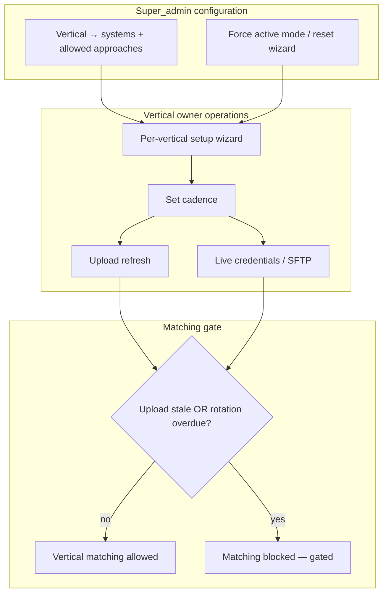
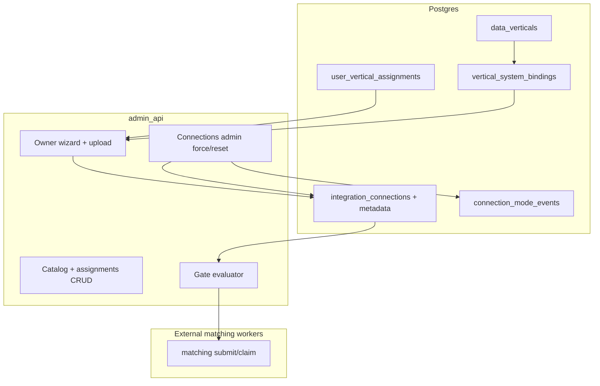

# Vertical-scoped connectors - Plan

## Goal Capsule

Extend the shipped per-system Connections onboarding and external vertical hash workers so **data owners operate inside assigned verticals** — choosing Live vs Upload per system, setting refresh cadence, and keeping credentials fresh — while **super_admin** configures vertical→system mappings and can override or reset owner setup.

**Objective:** First ship covers the v1 **vertical catalog** (KD20): SaaS owner verticals get vertical-scoped roles, a per-vertical setup wizard, soft reminders, and a **hard gate on matching** when Upload data is stale or Live credential rotation is overdue (~6 months). **Data** appears in the catalog as **already connected** (view-only; no Upload or owner credential wizard). Google Sheets direct/live connection is deferred; Paylocity **Upload** is template file ingest; Paylocity **Live** is SFTP.

**Product authority:** Session brainstorm 2026-08-11 > SirvenOS External-Integrations + Data-Verticals KB > shipped connections-onboarding plan > external-vertical-hash-workers plan.

**Supersedes:** Cursor plan `upload_verticals_lever_fix_b1d70869` (`~/.cursor/plans/upload_verticals_lever_fix_b1d70869.plan.md`) — durable upload-vertical and Lever-triage requirements are folded into this Product Contract; the Cursor plan is retired.

**Open blockers:** None — OQ1, OQ2, and OQ4 resolved (see Key Decisions KD17–KD20). Planning HOW for OQ5–OQ9 resolved in Planning Contract (KTD1–KTD12).

**Stop when:** Vertical catalog + assignments persist; SaaS owners complete wizard (mode + cadence + Live redeem or Upload template); gated status surfaces Needs refresh / Action required; matching claim helpers refuse Upload-stale or Live-rotation-overdue systems; Data remains view-only; tests green; no secrets/PII in logs.

**Product Contract preservation:** Product Contract unchanged (R/A/F/AE/KD IDs stable). Planning resolved deferred OQs without rewriting product scope.

**Execution direction:** Characterization-first around shipped connections testers/redeem before extending; upload parse and matching gate are new behavior → add focused unit tests with each unit.

---

## Product Contract

### Summary

Move from per-system Connections (super_admin-only, global `data_owner` role) to **vertical-scoped connectors**: each SaaS vertical owns its systems, picks one active mode (Live or Upload) per system, and maintains data freshness on a cadence they set. Super_admin maps verticals to systems and approaches, forces mode transitions, and resets wizard state. Matching for a vertical stays blocked until freshness and rotation rules pass; login reminders stay soft.

### Problem Frame

Connections onboarding shipped a secure credential path per system, but mutations remain super_admin-only and `data_owner` is a global allowlist with no vertical binding. External hash workers and attempt tables are per-system; journey IA lists SaaS verticals as coming soon while only Data is live. Owners cannot self-serve mode choice, cadence, or credential rotation within their vertical. Ops cannot see which verticals are connected yet gated for matching. Without vertical scope and freshness gates, Habeas risks matching on stale Upload extracts or overdue Live credentials while owners lack a clear operating surface.

### Key Decisions

- KD1. (session-settled: user-directed — chosen over owner-only or admin-only control: owners need day-to-day autonomy within bounded verticals) **Hybrid control model** — super_admin/engineers configure vertical→system mappings and allowed approaches; owners operate inside assigned vertical(s).
- KD2. (session-settled: user-directed — chosen over simultaneous Live+Upload or owner-toggle without override: predictable worker behavior and ops clarity) **Single active mode per vertical-system** — exactly one of Live or Upload is active; super_admin can force a mode change; transitions between modes must be straightforward.
- KD3. (session-settled: user-directed — chosen over single owner per vertical or informal shared accounts) **Multiple owners per vertical** with **vertical-scoped roles on user accounts** — not a single global `data_owner` allowlist.
- KD4. (session-settled: user-directed — chosen over gate-on-login-only or no gate: protect matching integrity without blocking routine access) **Hard gate on matching** when Upload data is stale **or** Live credential rotation is overdue (~6 months); **soft** login prompts and reminders only.
- KD5. (session-settled: user-directed — chosen over fixed platform cadence or no cadence) **Per-vertical setup wizard includes cadence** — owner sets refresh cadence; super_admin can override cadence and **reset** wizard (forces redo).
- KD6. (session-settled: user-directed — chosen over request-wide owner powers) **Owner access is vertical-scoped** — read/write/delete on their vertical(s) and disposition for **their systems only**; not request-wide legal close, cross-vertical disposition, or platform-wide admin.
- KD7. (session-settled: user-directed — chosen over greenfield connector platform) **Extend existing artifacts** — `integration_connections`, connection testers, owner invite/redeem, external hash workers, and per-system attempt tables; not a new integration stack.
- KD8. (session-settled: user-directed — refined by Jose OQ2) **Data vertical is catalog-visible, not owner-onboarded** — Data / Cassandra appears in the vertical catalog as **already connected** (view-only for owners/engineers); no Upload approach, no owner invite, and no credential/upload wizard (Cassandra remains INF handoff per External-Integrations KB). Owner connector flows ship for SaaS verticals only.
- KD9. (session-settled: user-approved — chosen over API-first Paylocity live path) **Paylocity automated/live path is SFTP** — v1 Upload for flat-file ingest; SFTP is the Live successor (not a separate Paylocity API live mode in this model). **QCQA (settled_conflict, do not invert):** v1 keeps the existing Paylocity API connection tester; SFTP is the Live successor (KTD12 upload-first) — do not rip out the API tester.
- KD10. (session-settled: user-approved — chosen over Sheets API live in v1) **Google Sheets direct/live connection deferred** — no v1 live Sheets API path; BizDev Contact Use vs HR alumni list are distinct usage shapes (see R12, R13).
- KD11. (session-settled: user-directed — chosen over Upload-only SaaS) **Live + Upload approaches for SaaS generally** — both modes exist in the model; which is active follows KD2 per vertical-system.
- KD12. (session-settled: absorbed from upload-verticals plan — chosen over native-export column auto-mapping) **Template-mandated Upload ingest** — data owners reshape exports to frozen per-system CSV templates; v1 does not accept native-export column mapping or parallel PII columns (e.g. `Work Email` + `Personal Email` must be collapsed into the template `email` column before upload).
- KD13. (session-settled: absorbed from upload-verticals plan — chosen over fixed delimiter or numbered columns like `email_2`) **Multi-PII in single template columns** — multiple values per list-capable field (`email`, `phone`, `address`, …) live in one cell, split by an owner-selected delimiter (`None`, `;`, `|`, `,`) stored on connection metadata; parser uses only the selected delimiter.
- KD14. (session-settled: absorbed from upload-verticals plan — chosen over reusing `google_sheets` or SFTP credential fields for Upload) **Distinct upload systems** — `bizdev_contacts` (BizDev) and `hr_alumni` (HR) are separate connection systems; owner `google_sheets` invite is retired; Paylocity **Upload mode** uses template file upload (not SFTP credential fields). Paylocity **Live mode** remains SFTP per KD9.
- KD15. (session-settled: absorbed from upload-verticals plan — chosen over new CLI by default) **Lever triage in-repo first** — Ops surfaces `last_test_detail` / `last_test_triage` from stored connection tests; help and owner failure copy distinguish Postings-only API key from missing **Users read/list** permission; add CLI `connections list/test` only if Ops/Cloud SQL triage path is insufficient.
- KD16. (supersedes old Cursor plan blanket “no SFTP”) **Paylocity SFTP is Live-only** — the retired upload-verticals plan deferred all SFTP; brainstorm KD9 keeps SFTP as the Paylocity Live successor. GCP inbound SFTP / vendor push host remains deferred; Upload mode is template file ingest only.
- KD17. (session-settled: Jose OQ1 = A — chosen over designated primary-owner-only gate clear) **Any assigned vertical owner** may clear the hard gate — successful Upload refresh or Live/SFTP credential rotation by **any** owner assigned to that vertical clears matching block and stops reminders for that vertical-system; matching resumes when **all** owned systems in the vertical pass freshness/rotation.
- KD18. (session-settled: Jose OQ4 = C — chosen over showing “Connected” while matching is blocked) **Gated freshness/rotation UX** — when credentials authenticate or upload validates but matching is blocked for staleness or rotation, surfaces show **Needs refresh** / **Action required** (not “Connected”); strong signal that matching will not run until the gate clears.
- KD19. (session-settled: KB naming — chosen over “Website” or other informal labels) **Canonical vertical names from SirvenOS KB** — v1 catalog uses department-style verticals closest to today’s owner map; **Tech** (not “Website”) owns Auth0; KB department row **Marketing / Communications** maps to catalog vertical **Communications**; KB **HR / People** maps to **People/HR**.
- KD20. (session-settled: Jose OQ2 = catalog shape A — chosen over system-centric or journey-IA-only groupings) **v1 vertical catalog** — super_admin-maintained list of data verticals (named departments/domains) and, for each, which **systems + allowed approaches** (Live / Upload / SFTP) are configured. First-ship catalog:

| Vertical | KB name | Typical owner (KB) | System | Allowed approaches | Notes |
|----------|---------|-------------------|--------|-------------------|-------|
| **Communications** | Marketing / Communications | Heather (`hrodgers@`) | `mailchimp` | Live, Upload | Per External-Integrations §Department→system |
| **People/HR** | HR / People | Melody (`mfassino@`) | `paylocity` | Upload (v1); Live = SFTP (later) | Upload = template file ingest; Live successor is SFTP per KD9 |
| **People/HR** | HR / People | Melody (`mfassino@`) | `lever` | Live | Recruiting candidates |
| **People/HR** | HR / People | Melody (`mfassino@`) | `hr_alumni` | Upload only | Static alumni list; not live Sheets |
| **Tech** | Tech | Chris Koelbl (`ckoelbl@`) | `auth0` | Live, Upload | Identity; not “Website” |
| **BizDev** | BizDev | Brad (`blippmann@`) | `bizdev_contacts` | Upload only | Contact Us shape; no Mailchimp in BizDev vertical |
| **Data** | Data | Russ / DSE (INF) | Cassandra / CEPI pipeline | **None** (view-only) | Already connected via infra; no Upload; no owner invite or credential wizard (KD8) |

**Vertical catalog** (definition): the v1 list of **data verticals** above and, for each, which **systems + allowed approaches** are configured — not a separate product surface name.

### Actors

- A1. **Super_admin** — maps verticals to systems and approaches; forces active mode; overrides cadence; resets owner wizard; retains global Connections admin.
- A2. **Vertical data owner** — assigned to one or more verticals via vertical-scoped role; runs setup wizard, sets cadence, submits Upload refreshes or Live/SFTP credentials, disposes matching for owned systems.
- A3. **Platform engineer** — configures vertical/system catalog bindings with super_admin; extends testers and workers within existing patterns.
- A4. **Legal / admin** — request-wide journey and legal disposition; **not** vertical connector operators in v1 (see KD6).
- A5. **Matching worker** — consumes freshness/rotation gate state before running vertical external matching attempts.

### Requirements

**Vertical scope and roles**

- R1. User accounts carry **vertical-scoped roles** — assignment to one or more verticals with owner permissions bounded to those verticals (replaces implicit global `data_owner` for connector operations).
- R2. Super_admin maintains the **vertical catalog** (KD20) — which systems belong to each vertical and which approaches (Live, Upload) each system supports; **Data** is included for visibility with **no Upload** and no owner onboarding paths.
- R3. Owners see and mutate connector state **only for verticals and systems they are assigned to** — no cross-vertical connector admin.

**Modes and approaches**

- R4. Each vertical-system pair has **exactly one active mode** — Live or Upload — at a time; history of mode changes is auditable.
- R5. Super_admin can **force active mode** for any vertical-system and **reset** the owner setup wizard for that vertical (owner must complete wizard again).
- R6. **Upload mode** — owner or super_admin triggers **template-mandated file upload** refresh per cadence; staleness is evaluated against owner-set cadence (with super_admin override). Upload-mode systems: `bizdev_contacts`, `hr_alumni`, and Paylocity when Upload is the active mode.
- R7. **Live mode** — automated extract per system pattern: API pull where live exists today (e.g. Mailchimp, Lever, Auth0), **SFTP for Paylocity Live**; rotation overdue when credentials exceed ~6 months without refresh.
- R8. Mode transition UX must be **low friction** — switching Upload↔Live does not require re-architecting the vertical-system binding.

**Freshness, gates, and reminders**

- R9. **Hard gate matching** for a vertical when **any** owned system in that vertical is Upload-stale **or** Live-rotation-overdue; **any** assigned owner for that vertical may clear the gate via successful Upload refresh or rotation (KD17); matching resumes only when **all** owned systems in the vertical pass; suppression and other steps follow existing per-system rules unless separately gated.
- R10. **Soft reminders** on owner login and in connector surfaces when approaching or past cadence/rotation thresholds — reminders do not block login.
- R11. Gate evaluation is visible to **ops and owners** — when freshness or rotation fails, status shows **Needs refresh** / **Action required**, not “Connected”, even if credentials still authenticate or the last upload file is on record (KD18).

**Per-vertical owner wizard**

- R12. Each **SaaS owner vertical** has an **owner setup wizard** covering: active mode per system, credential or upload path, and **refresh cadence**; completion is required before matching is eligible (subject to R9). **Data** vertical has no wizard — already connected, view-only (KD8).
- R13. **Upload vertical system split** — BizDev **Contact Use** maps to connection system `bizdev_contacts`; HR **alumni list** maps to `hr_alumni` (not `google_sheets`); v1 does not ship Sheets API live or owner sheet-share path for either.
- R14. **BizDev and HR alumni in v1** — both provisioned as **upload-only** via `bizdev_contacts` and `hr_alumni` template file upload; BizDev templates derive from Contact Us match fields (no canonical sheet URL in KB).

**Owner disposition scope**

- R15. Owners can read, write, and delete connector configuration and disposition **matching results for their vertical systems only** — not legal disposition, request close, or other verticals' results.

**Platform extension (not greenfield)**

- R16. Vertical connector state extends **existing** `integration_connections`, connection invite/redeem, connection testers, external hash workers, and per-system attempt tables — no parallel connection registry.
- R17. **Connecting ≠ enabling matching** remains true — a passing connection test means credentials authenticate or upload validates; vertical matching additionally requires wizard completion, active mode, and freshness gates.
- R18. **Frozen per-system upload templates** — each upload system publishes required and optional CSV headers; connection test rejects unknown or missing required headers. Canonical headers:
  - `bizdev_contacts`: required `first_name`, `last_name`, `email`; optional `phone`, `company`, `source`, `submitted_at`, `notes`
  - `hr_alumni`: required `first_name`, `last_name`, `email`; optional `phone`, `address`, `city`, `state`, `nickname`, `left_at`, `employee_id`
  - Paylocity (Upload): required `first_name`, `last_name`, `email`; optional `employee_id`, `dob`, `phone`, `city`, `state` (no SSN)
- R19. **Multi-PII delimiter control** — owner selects delimiter at upload (`None (one value per cell)`, `;`, `|`, `,`) in connect wizard and ops re-upload; choice stored on connection metadata with the upload (`gcs_uri`, `multi_pii_delimiter`).
- R20. **Upload connection test** — download template → select delimiter → upload file → test validates headers match template, splits list-capable columns with selected delimiter only, and finds ≥1 row with required fields.
- R21. **Post-parse cleaning** — expand list cells to N identifiers; apply DROP `standardize_email` / `standardize_phone`; skip bad values with warn; fail if zero usable required identifiers; persist hashes only (multi-identifier expansion beyond single-hash `HashedVendorRecord` is a follow-on if matching requires it).
- R22. **Lever connection test and triage** — probe uses `GET /v1/users?limit=1` with Basic `(api_key, "")`; help must state API key is not Postings-only and requires **Users read/list**; owner failure copy distinguishes 401 vs 403; Ops triages via stored `last_test_detail` / `last_test_triage`.



### Key Flows

- F1. **Super_admin maps vertical to systems**
  - **Trigger:** New SaaS vertical ready for owner onboarding.
  - **Actors:** A1, A3
  - **Steps:** Define vertical catalog entry; attach systems (mailchimp, lever, auth0, paylocity, `bizdev_contacts`, `hr_alumni`, etc.); mark allowed approaches per system; assign vertical-scoped owner roles.
  - **Outcome:** Owners see only their verticals; systems without mapping are not owner-operable.
  - **Covered by:** R1, R2, R3

- F2. **Owner completes vertical setup wizard**
  - **Trigger:** Owner first assigned or super_admin reset.
  - **Actors:** A2
  - **Steps:** Choose active mode per system; complete template Upload path or Live/SFTP/API credentials via existing invite/redeem patterns; set cadence; pass connection test where applicable.
  - **Outcome:** Vertical wizard complete; matching still blocked if R9 fires.
  - **Covered by:** R4, R6, R7, R12

- F3. **Upload cadence lapse hard-gates matching**
  - **Trigger:** Upload data age exceeds owner cadence (or super_admin override).
  - **Actors:** A2, A5
  - **Steps:** Soft reminders escalate; owner uploads fresh extract or super_admin adjusts cadence; gate clears on successful ingest.
  - **Outcome:** Matching resumes for that vertical when all owned systems pass freshness; any assigned owner’s successful upload counts (KD17).
  - **Covered by:** R6, R9, R10

- F4. **Live rotation overdue hard-gates matching**
  - **Trigger:** Live/SFTP credentials past ~6 months without rotation.
  - **Actors:** A2, A5
  - **Steps:** Soft reminders; owner rotates via redeem flow; Paylocity path uses SFTP credentials; test passes; gate clears.
  - **Outcome:** Matching resumes when rotation fresh.
  - **Covered by:** R7, R9, R10

- F5. **Super_admin forces mode change**
  - **Trigger:** Ops strategy shift (e.g., Upload → Paylocity SFTP).
  - **Actors:** A1, A2
  - **Steps:** Super_admin sets new active mode; may reset wizard; owner completes new path; old mode inactive but auditable.
  - **Outcome:** Single active mode per vertical-system with traceable transition.
  - **Covered by:** R4, R5, R8

- F6. **Owner uploads template-mandated extract**
  - **Trigger:** Upload-mode system due for refresh or initial wizard step.
  - **Actors:** A2
  - **Steps:** Download per-system template; collapse multi-column PII into template columns; select multi-PII delimiter; upload CSV; connection test validates headers, delimiter parsing, and ≥1 usable row.
  - **Outcome:** Upload connected; file stored in GCS with metadata; hashes persisted per R21; matching still subject to R9.
  - **Covered by:** R6, R18, R19, R20, R21


- F7. **Ops triages Lever connection failure**
  - **Trigger:** Lever connection test fails (401/403).
  - **Actors:** A1, A3
  - **Steps:** Read `last_test_detail` / `last_test_triage` from Ops or Cloud SQL; verify key is not Postings-only; coach owner to enable Users read/list and regenerate key; retest; escalate to CLI `connections list/test` only if Ops path blocked.
  - **Outcome:** Owner receives actionable 401 vs 403 guidance; connection test passes after key fix.
  - **Covered by:** R22, KD15

### Acceptance Examples

- AE1. **Covers R1, R3.** People/HR owner assigned only to People/HR vertical cannot mutate Mailchimp connector state (403 or hidden).
- AE2. **Covers R4, R5.** Super_admin forces Paylocity from Upload to SFTP Live; only SFTP is active; Upload refresh no longer satisfies freshness for Paylocity.
- AE3. **Covers R9, R10, KD17.** Mailchimp Upload past cadence — owner can log in and sees reminders; matching attempt for Communications vertical is blocked; after **any** assigned owner’s upload ingest succeeds, matching proceeds when all systems pass.
- AE4. **Covers R7, R9.** Paylocity SFTP credentials at 6+ months — matching blocked until owner rotates; connection test pass alone does not clear gate if rotation still overdue.
- AE5. **Covers R12, R13, R14.** HR alumni configured via `hr_alumni` upload-only — no live Sheets wizard step; BizDev Contact Use uses `bizdev_contacts` upload-only — no Sheets API live or sheet-share path in v1.
- AE6. **Covers R15, KD6.** People/HR owner can dispose People/HR matching results but cannot legal-close request or dispose Tech vertical results.
- AE7. **Covers R5, R12.** Super_admin reset on People/HR vertical — owner must redo wizard before matching eligible again even if credentials still authenticate.
- AE8. **Covers R11, KD18.** Connection test green + wizard incomplete or freshness failed — ops and owners see **Action required** / **Needs refresh**, not “Connected”; matching gated.
- AE9. **Covers R18, R20.** BizDev owner uploads CSV missing required `email` header — connection test fails with template guidance; no ingest.
- AE10. **Covers R19, R20.** HR owner selects `;` delimiter and uploads two emails in one cell — both identifiers parsed and hashed; wrong delimiter choice yields zero usable identifiers and test failure.
- AE11. **Covers R22, KD15.** Lever test returns 403 with Postings-only key — owner sees Users read/list guidance; Ops reads triage fields without new CLI.

### Success Criteria

- SC1. All first-ship SaaS owner verticals in the KD20 catalog operable end-to-end: map → wizard → Upload or Live/SFTP → gate → matching; **Data** visible in catalog as already connected (no owner wizard).
- SC2. Zero matching runs against Upload-stale or rotation-overdue vertical-system pairs when gate is enforced.
- SC3. Owners self-serve cadence and credential rotation within assigned verticals without super_admin for routine operations.
- SC4. Super_admin can force mode, override cadence, and reset wizard with auditable history.
- SC5. No new parallel connection registry — vertical scope layers on shipped Connections and hash workers.

### Scope Boundaries

**In v1**

- Vertical-scoped roles and v1 vertical catalog (KD20), including Data as view-only.
- Single active mode per vertical-system with super_admin force and reset.
- Per-vertical owner wizard with cadence.
- Upload + Live/SFTP/API approaches for SaaS systems in scope.
- Template-mandated upload for `bizdev_contacts`, `hr_alumni`, and Paylocity Upload mode with multi-PII delimiter.
- Lever connection-test help and Ops triage improvements.
- Hard gate on matching; soft login reminders.
- Extension of existing connections, testers, workers, attempt tables.

**Deferred for later**

- Super_admin **Runs** visibility for vertical SaaS worker attempts (mailchimp, lever, paylocity, auth0, `bizdev_contacts`, `hr_alumni`) — v1 Runs is DROP-spine-centric (`drop_connector` / ingest / matching / hash-index only); extend when vertical external-hash workers are ops-triageable (absorbed from `docs/plans/2026-07-17-001-feat-drop-ops-ia-plan.md` follow-up).
- Google Sheets **direct/live API** connection and owner sheet-share / domain-wide delegation (BizDev Contact Use live path).
- GCP inbound SFTP / Paylocity vendor push host.
- Native export column-mapping UI and numbered parallel headers (e.g. `email_2`).
- Full external-hash workers and dispositions for `bizdev_contacts` / `hr_alumni` (connecting ≠ enabling matching in this slice).
- Data vertical owner connector flows — credential invite, Upload, and setup wizard (Cassandra stays INF; catalog entry is view-only per KD8).
- Cross-vertical owner roles and request-wide owner powers.
- CLI `connections list/test` unless Ops/Cloud SQL triage path proves insufficient (KD15).

**Outside this product's identity**

- Owners performing legal disposition or closing requests.
- Greenfield integration platform replacing Secret Manager + per-system workers.
- Paylocity vendor API as a separate live mode alongside SFTP.

### Dependencies / Assumptions

- **Dependency:** Shipped connections onboarding (`docs/plans/2026-07-30-003-feat-connections-onboarding-plan.md`) — per-system registry, invite/redeem, testers.
- **Dependency:** External vertical hash workers (`docs/plans/2026-07-30-002-feat-external-vertical-hash-workers-plan.md`) — per-system attempt tables and extract/hash pipeline.
- **Assumption (confirmed):** `data_owner` today is a global env allowlist (`libs/habeas-privacy-core/src/habeas_privacy_core/auth/README.md`); vertical-scoped roles are new behavior.
- **Assumption (confirmed):** Paylocity tester and system copy already describe SFTP (`libs/habeas-privacy-core/src/habeas_privacy_core/connections/systems.py`).
- **Assumption (confirmed):** Journey IA currently live only for Data vertical; SaaS verticals listed coming soon (`app/admin_api/src/admin_api/vertical_dispositions.py`).
- **Assumption (confirmed):** v1 vertical catalog and owner→vertical mapping per KD20, sourced from SirvenOS KB External-Integrations §Department→system and Data-Verticals.

### Outstanding Questions

**Resolved (product)**

- OQ1. ~~**Primary vs any owner for gates and reminders**~~ — **Resolved (KD17):** any assigned vertical owner clearing Upload refresh or rotation clears the hard gate and stops reminders for that vertical-system.
- OQ2. ~~**Exact vertical catalog and owner mapping for first ship**~~ — **Resolved (KD19, KD20):** catalog shape A (department-style verticals); see KD20 table; Data included view-only.
- OQ3. ~~**BizDev Sheets provisioning in v1**~~ — **Resolved (KD14, R14):** `bizdev_contacts` upload-only; sheet-share path retired; templates based on Contact Us match fields.
- OQ4. ~~**Connected-but-gated visibility**~~ — **Resolved (KD18):** **Needs refresh** / **Action required** when matching paused; not “Connected”.

**Resolved in Planning (HOW — see KTD1–KTD12)**

- OQ5. ~~Vertical-scoped role storage~~ — **KTD1:** keep `ADMIN_API_DATA_OWNERS` as coarse role; persist assignments in `user_vertical_assignments` (legal_team_members hybrid).
- OQ6. ~~Cadence defaults / override~~ — **KTD4:** integer `cadence_days`; Upload default 30; Live rotation gate fixed at 180 days; super_admin override writes `cadence_days_override` on connection metadata.
- OQ7. ~~Audit event shapes~~ — **KTD8:** allowlisted `admin_audit_log` action codes + ids/status only (no emails beyond actor identity already used elsewhere, no file contents).
- OQ8. ~~Multi-identifier hash expansion~~ — **KTD9:** v1 connection-test parse expands list cells for validation/count; persist hashes only when wiring upload ingest metadata; full matching expansion deferred with upload matching workers.
- OQ9. ~~Owner cadence vs spine schedules~~ — **KTD5:** Upload freshness uses owner cadence clock; Live matching gate uses rotation clock only; no per-vertical Cloud Scheduler in v1 (Live extracts stay on existing hash-refresh / worker schedules).

**Deferred (non-blocking)**

- OQ10. Exact GCS bucket/prefix for connection uploads in prod — default `gs://example-gcp-project-dpra-uploads/connections/{system}/{connection_id}/` (or env `CONNECTIONS_UPLOAD_BUCKET`); confirm with INF before prod apply.
- OQ11. Whether `google_sheets` system id is removed from invite UI in same PR or left retired-but-present until ops cleanup — default: stop offering new owner invites; keep enum for existing rows.

### Sources / Research

- `docs/plans/2026-07-30-003-feat-connections-onboarding-plan.md` — per-system Connections, super_admin mutations, connecting ≠ matching.
- `docs/plans/2026-07-30-002-feat-external-vertical-hash-workers-plan.md` — workers, attempt tables, per-system extract/hash.
- Retired Cursor plan `upload_verticals_lever_fix_b1d70869` — upload system ids, template headers, multi-PII delimiter, Lever triage (requirements absorbed here).
- `libs/habeas-privacy-core/src/habeas_privacy_core/connections/systems.py` — Paylocity SFTP guidance.
- `app/admin_api/src/admin_api/vertical_dispositions.py` — LIVE vs COMING_SOON verticals.
- `app/admin_api/src/admin_api/legal_team.py` — env+DB hybrid membership pattern to mirror for vertical assignments.
- SirvenOS KB `01-ARCHITECTURE/External-Integrations.md` — department→system table (Heather/Communications→Mailchimp, Chris/Tech→Auth0, Melody/HR→Paylocity+Lever, Brad/BizDev→Sheets; v1 BizDev uses `bizdev_contacts` upload per KD14).
- SirvenOS KB `01-ARCHITECTURE/Data-Verticals.md` — vertical purposes and data sources (Tech Match, People Match, BizDev/Const).

---

## Out of scope / related

**Legal admin IA and fulfillment** (`docs/plans/2026-07-23-001` through `2026-07-27-001`) — separate program: Legal/admin Home, Inbox, request detail, correspondence, and fulfillment journeys. This plan owns **data-owner vertical connector setup and matching freshness gates** only; do not fold Legal persona nav, assignment-to-legal, or fulfillment Slice A/B into connector units.

**Request journey workbench** (`docs/plans/2026-07-29-001`) — separate program for Legal/admin **detail chrome** (four-stage rail, per-vertical Matching/Fulfillment clusters, `fulfillment.kickoff`, Access identity-comment). This plan owns **connector onboarding + matching freshness gates** for data owners. When a SaaS vertical goes live, extend journey `LIVE_VERTICALS` and fulfillment attempt ledgers with a `vertical` column per journey KTD3 — do not conflate journey disposition rows with connector wizard state.

### Journey IA ↔ catalog vertical mapping (absorbed 2026-08-11 triage)

Journey workbench today (`vertical_dispositions.py`) uses **system slugs** for coming-soon stubs; KD20 uses **department catalog verticals**. Until SaaS verticals ship, journey shows greyed stubs only — no disposition rows, no owner wizard.

| Journey stub (`COMING_SOON_VERTICALS`) | KD20 catalog vertical | Connection system(s) | First-ship notes |
|----------------------------------------|----------------------|----------------------|------------------|
| `data` (live) | **Data** | DROP hash / CEPI (INF) | View-only in catalog; disposition + kickoff today |
| `cassandra` | **Data** | Cassandra / CEPI pipeline | Journey stub orients to Data vertical INF path — not owner onboarding (KD8) |
| `mailchimp` | **Communications** | `mailchimp` | Live + Upload when vertical ships |
| `lever` | **People/HR** | `lever` | Live when vertical ships |
| `paylocity` | **People/HR** | `paylocity` | Upload v1; Live = SFTP (KD9) |
| `auth0` | **Tech** | `auth0` | Live + Upload when vertical ships |
| — (not in journey stubs yet) | **BizDev** | `bizdev_contacts` | Upload-only; add journey stub when BizDev matching ships |
| — (not in journey stubs yet) | **People/HR** | `hr_alumni` | Upload-only; add journey stub when alumni matching ships |

**Intake spine** (`docs/plans/2026-07-16-001`): connector/ingestor split (DROP: `drop_connector` + `drop_ingestor`) is the pattern for intake lanes; SaaS verticals use Connections + external hash workers instead of new intake pollers.

**Fulfillment automation** (`docs/plans/2026-07-21-001`): Data-vertical access export (`transform/access_export/`) and DROP suppression/notice remain authoritative for the **Data** vertical; per-system SaaS fulfillment dispatchers follow external-hash-workers + journey kickoff gates — not new Tier-C connectors in the intake-spine stub sense.

---

## Planning Contract

### Product Contract preservation

Product Contract unchanged — no R/A/F/AE/KD ID rewrites. Deferred OQ5–OQ9 resolved as KTDs below.

### Key Technical Decisions

| ID | Decision |
|----|----------|
| KTD1 | (session-settled: user-directed — chosen over owner-only/admin-only and over pure env allowlists) **Hybrid RBAC:** keep `ADMIN_API_DATA_OWNERS` as coarse “may be a vertical owner”; persist `user_vertical_assignments (email, vertical_id, active, added_by, added_at)` mirroring `legal_team_members`. Super_admin/admin bypass vertical checks. |
| KTD2 | (session-settled: user-directed catalog) **Catalog tables:** `data_verticals` + `vertical_system_bindings (vertical_id, system, allowed_approaches TEXT[], active)` seeded to KD20. Vertical ids: `communications`, `people_hr`, `tech`, `bizdev`, `data`. Display labels per KD19/KD20. |
| KTD3 | (session-settled: user-directed single mode) **Active mode on connection:** store `active_mode` (`live` \| `upload`) + `wizard_completed_at` + cadence fields on `integration_connections.metadata` (and typed helpers), not a parallel registry. Mode history: append-only rows in `connection_mode_events` (connection_id, from_mode, to_mode, actor, reason, at). |
| KTD4 | **Cadence:** `cadence_days` (int, owner-set) with default **30** for Upload; optional `cadence_days_override` (super_admin). Freshness: Upload stale when `now - last_successful_upload_at > effective_cadence`. Live rotation overdue when `now - credentials_rotated_at > 180` days (constant `LIVE_ROTATION_DAYS=180`). |
| KTD5 | (resolves OQ9) **Schedulers:** v1 does **not** add per-vertical Cloud Scheduler jobs. Upload freshness is gate-only (owner-driven upload). Live API/SFTP extracts continue on existing `vertical_hash_refresh` / worker schedules; owner cadence for Live is soft-reminder only. Matching hard-gate still applies rotation clock for Live. |
| KTD6 | **Systems enum expand:** add `bizdev_contacts`, `hr_alumni` to CHECK/enum; Paylocity supports both approaches (Upload template vs Live SFTP). Retire owner invite for `google_sheets` (KD14); keep system for legacy rows. Cassandra stays infra / Data view-only. |
| KTD7 | **Upload storage:** connection test accepts multipart CSV; on success write object to GCS (injectable writer; tests use in-memory/local stub) and set metadata `gcs_uri`, `multi_pii_delimiter`, `last_successful_upload_at`, `upload_row_count` (counts only). Never store CSV plaintext in Postgres. |
| KTD8 | **Audit:** allowlisted actions e.g. `connections.mode_force`, `connections.wizard_reset`, `connections.cadence_override`, `connections.upload_ok`, `connections.gate_block`, `connections.gate_clear` — payloads: connection_id, system, vertical_id, mode, status codes — no PII columns from CSV. |
| KTD9 | (resolves OQ8) **Hash expansion:** upload tester expands delimited list cells, standardizes, counts usable identifiers; may compute hashes in memory for test assertion. Persisting multi-hash vendor rows for matching is **out of v1 matching** (deferred with upload matching workers per Product Contract deferred scope). |
| KTD10 | **Matching gate API:** shared pure function `evaluate_connection_gate(connection, now) -> GateStatus` in core; workers call before claiming/processing matching steps. Vertical matching allowed iff **all** owned systems for that vertical pass (wizard complete + not stale/overdue). Any assigned owner’s successful upload/rotation clears that system’s gate (KD17). |
| KTD11 | **Gated UX status:** derived display status enum: `needs_setup` \| `action_required` \| `needs_refresh` \| `connected` \| `view_only` \| existing ConnectionStatus. When credentials ok but gate fails → `needs_refresh` / `action_required`, never “Connected” (KD18). |
| KTD12 | **Paylocity Live SFTP slice:** v1 allows `live` in bindings + force-mode + existing SFTP credential schema/tester; full inbound SFTP host / vendor push and automated Live extract remain deferred. Upload mode is the operable Paylocity path for freshness clears in v1. **KD9 waiver:** Paylocity Live remains the shipped API tester in v1; SFTP is successor — do not remove `connection_tests/paylocity.py`. |
| KTD13 | **Reminders:** soft only — `GET /me` (or `/owner/connector-reminders`) returns allowlisted reminder codes when approaching/past thresholds; no SMTP. Reuse copy/mailto patterns from invites. |
| KTD14 | **Owner disposition:** v1 enforces connector R/W/D + upload/test within assigned verticals; do **not** unlock request-wide legal close. Vertical disposition write scoping for SaaS systems stays journey-gated (coming soon) — only extend when a SaaS vertical is flipped live in journey IA (out of connector DoD). |

### High-Level Technical Design



### Assumptions

- Infra will provide a connections upload bucket (or reuse an existing uploads bucket) before prod Upload; local/tests use stub writer.
- Seed assignments for KB owners are applied via migration seed **or** super_admin UI in same ship — prefer seed inactive until emails confirmed; document seed SQL in migration comments.
- External matching workers remain stubbed for vendor HTTP; gate must still refuse claim when stale so SC2 holds in unit tests.
- `REQUIRE_IAP_IDENTITY` and AuditMiddleware patterns unchanged.

### Risks and dependencies

| Risk | Mitigation |
|------|------------|
| Expanding `integration_connections.system` CHECK breaks existing rows | Expand-only migration; keep `google_sheets` in CHECK |
| Global `data_owner` still sees DROP surfaces | Intentional for DROP; connector routes use vertical assignment — document dual gate |
| Upload CSV PII transit | Multipart → memory parse → hash/count → GCS write; never log rows; redact errors |
| Matching gate races with upload | Gate reads `last_successful_upload_at` / `credentials_rotated_at` committed after successful test; idempotent uploads |
| Dependency on unfinished hash workers | Gate + connect ship without enabling journey LIVE for SaaS; connecting ≠ matching remains |

### Sequencing

1. U1 migrations → U2 core → then parallel U3–U7
2. U8/U9 after API contracts from U3–U6 stabilize (types in `api.ts`)
3. U10 reminders + Lever polish + AGENTS last / parallel with UI

### Parallel ownership (ce-work)

Disjoint file ownership for up to 10 implementers — see Unit Index `files touched`.

---

## Implementation Units

### Unit Index

| U-ID | Title | Files touched (primary) | Depends-on |
|------|-------|-------------------------|------------|
| U1 | Schema: verticals, assignments, mode events, system CHECKs | `db/migrations/*`, `libs/.../tests/test_migrations.py` | — |
| U2 | Core catalog, systems, freshness/gate helpers | `libs/.../connections/*`, `libs/.../db/connections.py`, core tests | U1 |
| U3 | Vertical RBAC + assignment + catalog admin APIs | `app/admin_api/.../vertical_assignments.py`, `roles.py`, `/me`, tests | U1, U2 |
| U4 | Connections admin: force mode, cadence override, wizard reset, gated list | `connections_admin.py`, tests | U2, U3 |
| U5 | Upload templates + CSV parse/tester | `connection_tests/upload_*.py`, `upload_templates.py`, tester dispatch | U2 |
| U6 | Owner wizard + redeem/upload APIs | `connections_redeem.py`, `owner_connectors.py`, tests | U2, U3, U5 |
| U7 | Matching gate worker glue | core gate export + `app/{mailchimp,paylocity,lever,auth0}/` matching submit hooks + tests | U2 |
| U8 | Ops web: catalog, assignments, gated connections UI | `clients/web` ops connections + catalog components, `api.ts` ops types | U3, U4 |
| U9 | Owner web: wizard Upload/Live + gated status | `connect.$token.tsx`, owner vertical route(s), `api.ts` owner types | U5, U6 |
| U10 | Soft reminders, Lever triage polish, AGENTS | reminders endpoint/UI chips, Lever help copy, AGENTS.md touch-ups | U3, U6, U8 |

### U1. Schema: verticals, assignments, mode events, system CHECKs

- **Goal:** Persist KD20 catalog, owner assignments, mode history; expand connection system allowlist.
- **Requirements:** R1, R2, R4, R16; KD2, KD3, KD7, KD14, KD20
- **Files:** Create `db/migrations/YYYYMMDDHHMMSS_core_vertical_scoped_connectors.sql`; Modify `libs/habeas-privacy-core/tests/test_migrations.py`
- **Approach:** Tables `data_verticals`, `vertical_system_bindings`, `user_vertical_assignments`, `connection_mode_events`. Seed KD20 rows (Data: cassandra binding with `allowed_approaches='{}'` or `view_only` flag). Alter `integration_connections.system` CHECK to add `bizdev_contacts`, `hr_alumni`. Expand `vertical_hash_refresh_attempts.system` CHECK similarly (hash workers may no-op until later). No plaintext upload tables.
- **Patterns:** `db/migrations/20260730170001_core_integration_connections.sql`, `20260728120001_legal_sla_due_at.sql` (`legal_team_members`)
- **Test scenarios:**
  - Happy: migration SQL declares new tables + expanded CHECKs (static `test_migrations.py`).
  - Edge: Data vertical seed exists; upload-only bindings for `bizdev_contacts` / `hr_alumni`.
  - Error: down migration drops new tables without touching unrelated schemas.
- **Verification:** `uv run --group dev pytest libs/habeas-privacy-core/tests/test_migrations.py -q`
- **Dependencies:** None

### U2. Core catalog, systems, freshness/gate helpers

- **Goal:** Typed catalog + system definitions + pure gate/freshness evaluation.
- **Requirements:** R4, R6–R11, R16–R21; KD9–KD14, KD17–KD18
- **Files:** Modify `libs/habeas-privacy-core/src/habeas_privacy_core/connections/systems.py`, `models.py`, `db/connections.py`; Create `libs/habeas-privacy-core/src/habeas_privacy_core/connections/catalog.py`, `freshness.py` (names flexible); Modify `libs/habeas-privacy-core/tests/test_connection_systems.py`, `test_connections_core.py`; Create `libs/habeas-privacy-core/tests/test_connection_freshness.py`
- **Approach:** Add system ids + Upload credential/field schemas (delimiter enum, template headers). Helpers: `effective_cadence_days`, `evaluate_connection_gate`, `display_connection_status`. Metadata keys documented in module docstring. Paylocity: Upload path separate from SFTP Live fields.
- **Patterns:** existing `systems.py` / `sanitize_test_detail`
- **Test scenarios:**
  - Happy: Upload within cadence → gate clear; Live rotated within 180d → clear.
  - Edge: override cadence shorter than owner cadence → uses override; wizard incomplete → action_required.
  - Edge: credentials authenticate but rotation overdue → needs_refresh (not connected).
  - Error: unknown delimiter rejected by validator.
- **Verification:** `uv run --package habeas-privacy-core pytest libs/habeas-privacy-core/tests/test_connection_*.py libs/habeas-privacy-core/tests/test_connection_freshness.py -q`
- **Dependencies:** U1

### U3. Vertical RBAC + assignment + catalog admin APIs

- **Goal:** Super_admin manages catalog/assignments; owners resolve vertical membership; `/me` exposes verticals.
- **Requirements:** R1–R3, R5; KD1, KD3, KD6, KD20
- **Files:** Create `app/admin_api/src/admin_api/vertical_assignments.py` (or `vertical_catalog.py`); Modify `app/admin_api/src/admin_api/roles.py`, `main.py` (`/me`); Create `app/admin_api/tests/test_vertical_assignments.py`; Modify auth README if needed under `libs/.../auth/README.md`
- **Approach:** Mirror `legal_team.py` CRUD for assignments. `require_vertical_access(vertical_id)` dependency. Catalog GET for super_admin; optional read for owners of their verticals only. Seed-safe: no owner mutations on Data wizard.
- **Patterns:** `legal_team.py`, `require_roles`
- **Test scenarios:**
  - Happy: super_admin assigns owner to `people_hr`; owner principal includes that vertical.
  - AE1: Communications-only owner cannot mutate People/HR binding (403).
  - Edge: super_admin bypasses assignment check.
  - Error: assign unknown vertical_id → 422.
- **Verification:** `uv run --group dev pytest app/admin_api/tests/test_vertical_assignments.py -q`
- **Dependencies:** U1, U2

### U4. Connections admin: force mode, cadence override, wizard reset, gated list

- **Goal:** Super_admin force mode / reset wizard / override cadence; list returns gated display status.
- **Requirements:** R4, R5, R8, R11, R17; KD2, KD5, KD18
- **Files:** Modify `app/admin_api/src/admin_api/connections_admin.py`; Modify `app/admin_api/tests/test_connections_admin.py`
- **Approach:** New routes under `/ops/connections/{id}/mode`, `/cadence`, `/wizard/reset` (exact paths flexible). Write `connection_mode_events`. List/detail include derived `display_status`, `gate` summary (codes only). Retain super_admin for global catalog mutations; do not grant owners these routes.
- **Patterns:** existing connections_admin audit + allowlists
- **Test scenarios:**
  - AE2: force Paylocity Upload→Live; active_mode live; Upload refresh does not clear Live rotation gate.
  - AE7: wizard reset clears `wizard_completed_at`; matching gate fails until redo.
  - Happy: cadence override shortens freshness window.
  - Error: non–super_admin 403.
- **Verification:** `uv run --group dev pytest app/admin_api/tests/test_connections_admin.py -q`
- **Dependencies:** U2, U3

### U5. Upload templates + CSV parse/tester

- **Goal:** Frozen templates + delimiter-aware parse + connection test for upload systems.
- **Requirements:** R18–R21, R6, R12–R14; KD12–KD14
- **Files:** Create `app/admin_api/src/admin_api/upload_templates.py` (headers + CSV bytes); Create `app/admin_api/src/admin_api/connection_tests/upload_csv.py` (or per-system thin wrappers); Modify `connection_testers.py` dispatch; Create `app/admin_api/tests/test_connection_test_upload.py`; optional static template files under `app/admin_api/src/admin_api/static/connection_templates/` **only if needed** (prefer generated CSV from header lists to avoid extra top-level files — ask before new dirs)
- **Approach:** Template download endpoint returns CSV header row. Tester: require headers, split list fields by delimiter, standardize email/phone, fail if zero usable required identifiers. Detail codes allowlisted (`upload_ok`, `upload_missing_headers`, `upload_no_usable_rows`, …).
- **Patterns:** existing `connection_tests/*`, `sanitize_triage`
- **Test scenarios:**
  - AE9: missing `email` header → fail with template guidance code.
  - AE10: `;` delimiter two emails → both counted; wrong delimiter → failure.
  - Happy: Paylocity Upload required headers pass.
  - Privacy: tester logs/triage never include raw email values.
- **Verification:** `uv run --group dev pytest app/admin_api/tests/test_connection_test_upload.py -q`
- **Dependencies:** U2

### U6. Owner wizard + redeem/upload APIs

- **Goal:** Assigned owners complete per-vertical wizard (mode, cadence, Live redeem or Upload); token redeem remains for Live secrets.
- **Requirements:** R3, R6–R8, R12, R17, R19–R20; KD5, KD8, KD17
- **Files:** Modify `app/admin_api/src/admin_api/connections_redeem.py`; Create `app/admin_api/src/admin_api/owner_connectors.py`; Create `app/admin_api/tests/test_owner_connectors.py`; Modify `app/admin_api/tests/test_connections_redeem.py` as needed
- **Approach:** Authenticated owner routes for wizard steps scoped by assignment + binding. Upload multipart → U5 tester → stub/GCS writer → metadata timestamps. Live path keeps invite/redeem. Data vertical endpoints return view-only 404/422 for wizard. Successful upload/rotation by any assignee clears that system’s gate fields.
- **Patterns:** redeem token flow; `legal_team` scoping
- **Test scenarios:**
  - Happy: People/HR owner sets Paylocity Upload + cadence + upload → wizard complete.
  - AE5: `hr_alumni` / `bizdev_contacts` upload-only — no Live Sheets step.
  - AE3: stale upload blocks gate clear until refresh.
  - Error: cross-vertical owner upload 403.
- **Verification:** `uv run --group dev pytest app/admin_api/tests/test_owner_connectors.py app/admin_api/tests/test_connections_redeem.py -q`
- **Dependencies:** U2, U3, U5

### U7. Matching gate worker glue

- **Goal:** External matching claim/process refuses gated systems; shared helper used by workers.
- **Requirements:** R9, R17; KD4, KD17; SC2
- **Files:** Modify matching submit paths under `app/mailchimp/`, `app/paylocity/`, `app/lever/`, `app/auth0/` (minimal shared import of core gate); Create or Modify tests in each touched package; optionally thin helper `libs/.../connections/matching_gate.py` if not fully in U2
- **Approach:** Before processing `step=matching`, load active connection for system (or accept connection_id from attempt metadata later); if gate blocked, complete/skip with allowlisted audit code `gate_blocked` — do not match. `bizdev_contacts` / `hr_alumni` workers may be deferred stubs that still document the gate call site. Do not flip journey `LIVE_VERTICALS`.
- **Patterns:** existing worker claim/complete; privacy-safe audit_payload
- **Test scenarios:**
  - Happy: gate clear → existing stub matching proceeds.
  - AE3/AE4: stale Upload or overdue rotation → no successful match terminal with matches; gate_blocked recorded.
  - Edge: wizard incomplete → blocked.
- **Verification:** package pytest for each modified worker + core freshness tests
- **Dependencies:** U2

### U8. Ops web: catalog, assignments, gated connections UI

- **Goal:** Super_admin configures catalog/assignments; Ops connections show gated status (KD18).
- **Requirements:** R2, R5, R11, R15 (ops visibility); KD18, KD20
- **Files:** Modify `clients/web/src/lib/api.ts`, `routes/ops/connections.tsx`, `components/ops/ConnectionInvitePanel.tsx`, `ConnectionCreateDialog.tsx`; Create ops components for vertical catalog/assignments as needed under `clients/web/src/components/ops/`; Modify router/nav if new ops subroute
- **Approach:** Status chips: Needs refresh / Action required / Connected / View-only. Force mode / reset / cadence override controls for super_admin. Systems list includes new upload systems; hide/retire google_sheets invite. Follow existing Ops IA taste modules.
- **Patterns:** shipped Connections UI; action toasts
- **Test scenarios:**
  - AE8: gated connection shows Action required / Needs refresh, not Connected.
  - Happy: create `bizdev_contacts` connection + assign vertical owner from UI.
  - Edge: Data/Cassandra card view-only — invite disabled.
- **Verification:** `cd clients/web && bun test` (affected tests); typecheck if configured
- **Dependencies:** U3, U4

### U9. Owner web: wizard Upload/Live + gated status

- **Goal:** Owner surfaces for assigned verticals — wizard with cadence, template download, delimiter, upload; Live redeem unchanged path.
- **Requirements:** R3, R6, R10–R14, R18–R20; KD5, KD8, KD12–KD14, KD18
- **Files:** Modify `clients/web/src/routes/connect.$token.tsx`; Create owner route e.g. `clients/web/src/routes/owner/connectors.tsx` (or extend existing owner home if present — prefer extend); Modify `api.ts` owner client methods; tests under `clients/web/src/**/*.test.ts` as present
- **Approach:** Wizard steps: systems in vertical → mode → credentials or upload → cadence → confirm. Soft reminder banners (non-blocking). No Upload/wizard for Data.
- **Patterns:** connect token wizard; design-taste-ops-ia for ops-adjacent owner chrome
- **Test scenarios:**
  - Happy: upload flow selects delimiter and submits.
  - AE10 UI: delimiter control present with None/`;`/`|`/`,`.
  - Edge: reminder visible when approaching cadence without blocking navigation.
- **Verification:** bun test for changed files; browser pipeline later
- **Dependencies:** U5, U6

### U10. Soft reminders, Lever triage polish, AGENTS

- **Goal:** Soft reminder codes on login surfaces; Lever Users-read help/triage copy; docs/agents alignment.
- **Requirements:** R10, R22; KD15
- **Files:** Modify Lever tester help strings in `systems.py` / `connection_tests/lever.py` if not already sufficient; Modify `ConnectionInvitePanel.tsx` triage display; Extend `/me` or small reminders endpoint from U3; Modify `app/admin_api/AGENTS.md`, `libs/habeas-privacy-core/AGENTS.md`, `clients/web/AGENTS.md` as needed (no new top-level docs without need)
- **Approach:** Reminder payload: `{ code, system, vertical_id, severity: approaching|overdue }` — no PII. Lever: ensure 401 vs 403 owner copy + Ops triage fields. Document connecting ≠ matching + vertical gate in AGENTS.
- **Test scenarios:**
  - AE11: Lever 403 → Users read/list guidance in detail/triage.
  - Happy: overdue reminder code returned for assigned owner.
  - Edge: unassigned vertical → no reminder for that vertical.
- **Verification:** targeted pytest + bun test for triage/reminder helpers
- **Dependencies:** U3, U6, U8

---

## Verification Contract

```bash
uv sync --all-packages
uv run --group dev pytest \
  libs/habeas-privacy-core/tests/test_migrations.py \
  libs/habeas-privacy-core/tests/test_connection_systems.py \
  libs/habeas-privacy-core/tests/test_connections_core.py \
  libs/habeas-privacy-core/tests/test_connection_freshness.py \
  app/admin_api/tests/test_vertical_assignments.py \
  app/admin_api/tests/test_connections_admin.py \
  app/admin_api/tests/test_connections_redeem.py \
  app/admin_api/tests/test_owner_connectors.py \
  app/admin_api/tests/test_connection_test_upload.py \
  app/admin_api/tests/test_connection_test_lever.py \
  app/mailchimp/tests app/paylocity/tests app/lever/tests app/auth0/tests \
  -q
cd clients/web && bun test
```

Privacy / security greps before ship:
- No raw CSV row contents in logs or audit payloads.
- Secrets still absent from API responses after write.
- Gate block paths use allowlisted codes only.

Browser (LFG step 7): Ops connections gated chips + owner wizard Upload happy path when UI lands.

Release validate: not required for this control-plane feature unless infra bucket wiring is included in the same PR (then note OQ10).

---

## Definition of Done

### Global

- [ ] `artifact_readiness: implementation-ready` executed via U1–U10
- [ ] AE1–AE11 evidenced by automated tests and/or browser proof
- [ ] SC1–SC5 met or explicitly deferred with Product Contract deferred list
- [ ] No parallel connection registry; extends shipped Connections + hash workers (KD7)
- [ ] No secrets in git; no PII in logs/audit; mutations via admin_api only
- [ ] Settled KTDs (session-settled KD/KTD labels) preserved — report conflicts, do not silently overturn
- [ ] Abandoned experiment code removed from diff
- [ ] Review + QCQA personas complete before merge

### Per-unit

- [ ] U1: migration + test_migrations green
- [ ] U2: freshness/gate unit tests green
- [ ] U3: assignment RBAC tests green; `/me` verticals
- [ ] U4: force/reset/override + gated list tests green
- [ ] U5: upload template/tester tests green (AE9, AE10)
- [ ] U6: owner wizard/upload API tests green
- [ ] U7: matching gate refusal tests green (SC2)
- [ ] U8: Ops UI gated status (AE8)
- [ ] U9: Owner wizard Upload/Live UX
- [ ] U10: reminders soft; Lever triage (AE11); AGENTS updated

### Slice boundaries (explicit non-goals in this ship)

- Paylocity GCP inbound SFTP host / automated Live extract beyond credential mode + tester
- Google Sheets live API / owner sheet-share
- Full `bizdev_contacts` / `hr_alumni` matching workers + multi-hash mart expansion
- Journey `LIVE_VERTICALS` flip for SaaS
- SMTP reminder delivery
- CLI `connections list/test` unless Ops path insufficient

---

## System-Wide Impact

- **Auth:** adds DB vertical dimension beside env roles — DROP `data_owner` surfaces unchanged unless explicitly scoped later.
- **Privacy:** new PII transit path (CSV upload) — highest scrutiny; hashes/counts/GCS only.
- **Workers:** matching claim semantics change (may no-op when gated) — coordinate with external-hash-workers plan ownership.
- **Journey IA:** catalog vertical ids ≠ journey stubs; do not conflate in UI copy.

## Documentation / Operational Notes

- Update `app/admin_api/AGENTS.md` Connections bullet with vertical scope + gate.
- Ops runbook: seed/assign vertical owners; force mode; interpret Needs refresh.
- Reminder delivery remains copy/mailto — no SMTP invent.
- Confirm `CONNECTIONS_UPLOAD_BUCKET` with INF before prod Upload (OQ10).
